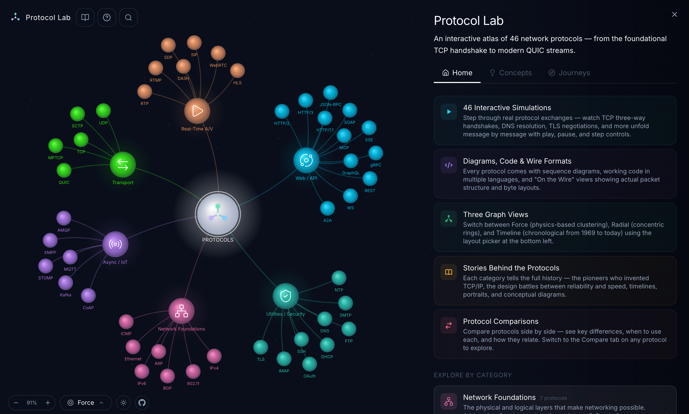

<p align="center">
  
</p>

<h1 align="center">Protocol Lab</h1>

<p align="center">
  An interactive atlas of 46 network protocols — from the foundational TCP handshake to modern QUIC streams.
</p>

<p align="center">
  <a href="https://neovand.github.io/coms/"><strong>Live Demo</strong></a>
</p>

<p align="center">
  
  
  
  
  
  
  
  
</p>

---

## Features

- **46 Interactive Simulations** — step through real protocol exchanges (TCP three-way handshake, DNS resolution, TLS negotiation, and more) message by message with play, pause, and step controls
- **Three Graph Views** — Force-directed (physics-based clustering), Radial (concentric rings), and Timeline (chronological from 1969 to today)
- **Diagrams, Code & Wire Formats** — every protocol comes with sequence diagrams, working code in multiple languages, and "On the Wire" views showing actual packet structure and byte layouts
- **Stories Behind the Protocols** — each category tells the full history, the pioneers who invented TCP/IP, the design battles between reliability and speed, timelines, portraits, and conceptual diagrams
- **Protocol Comparisons** — compare protocols side by side with key differences, when to use each, and how they relate
- **Guided Journeys** — follow curated learning paths through related protocols
- **Dark & Light Themes** — full theme support with smooth transitions
- **Bloom Animation** — nodes expand from the center like a flower opening on initial load

## Getting Started

```sh
# clone the repo
git clone https://github.com/NeoVand/coms.git
cd coms

# install dependencies
npm install

# start the dev server
npm run dev
```

Open [http://localhost:5173](http://localhost:5173) in your browser.

## Build

```sh
npm run build
npm run preview   # preview the production build
```

## Project Structure

```
src/
├── lib/
│   ├── components/     # Svelte components (desktop + mobile)
│   ├── data/           # Protocol definitions, simulations, categories
│   ├── engine/         # Canvas renderer, force simulation, layouts
│   ├── state/          # App state management (Svelte 5 runes)
│   └── utils/          # Colors, themes, helpers
├── routes/             # SvelteKit pages
└── app.html            # HTML shell
```

## License

MIT
