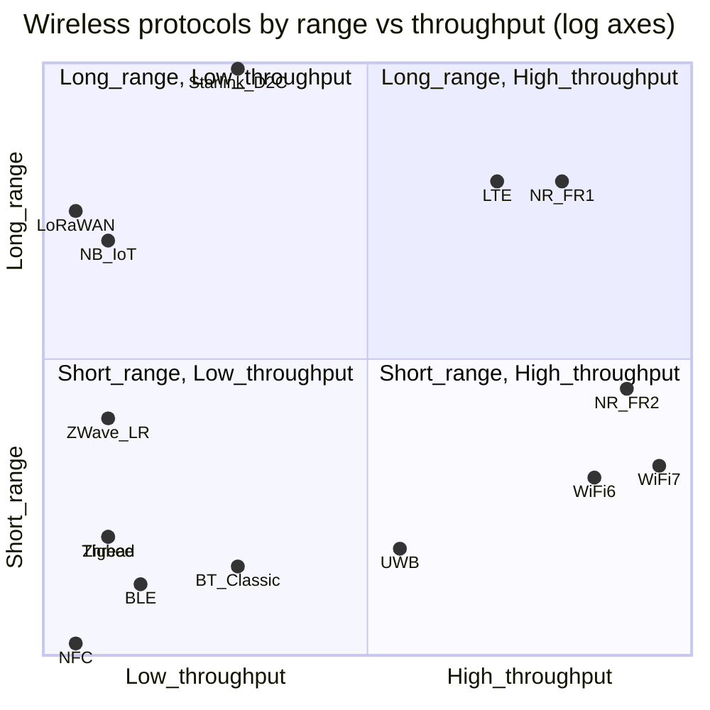

## The Wireless Protocol Family — A Research Report for the COMS Encyclopedia

*Prepared 2026-05-12 for neovand.github.io/coms (encyclopedia, book, and podcast).*
*Audience: working engineers; depth over breadth; story over specification.*

> **Bottom line up front.** The encyclopedia's Wireless category, today populated only by Wi-Fi and Bluetooth, should be expanded to a definitive set of **seven first-class members** — Cellular (4G LTE + 5G NR as one node), NFC, Zigbee, Thread, UWB, LoRaWAN, and Satellite Direct-to-Device — plus **two cross-references** (Wi-Fi and Bluetooth already exist) and **three "see-also" sidebars** (NB-IoT/LTE-M, Z-Wave, GNSS+NMEA). MIMO, OFDMA, beamforming, and CSMA/CA belong in a *Prerequisites* article, not as protocols. DECT NR+, WirelessHART/ISA100, broadcast (AM/FM/DAB+/ATSC), passive RFID, and IrDA become callouts inside other entries. The result is a coherent 9-entry Wireless category that maps cleanly onto a single book Part (≈55–65k words) and tells one continuous arc from ALOHAnet (1971) to 5G-Advanced, Wi-Fi 7, Bluetooth 6.0, and Starlink Direct-to-Cell (2024–2026).

## TL;DR

**TL;DR**

- **Add 7 protocols, in priority order: (1) Cellular 4G/5G NR as a single node, (2) NFC, (3) UWB, (4) Thread, (5) LoRaWAN, (6) Zigbee, (7) Satellite Direct-to-Device.** Z-Wave, NB-IoT/LTE-M, and GNSS+NMEA become sidebars; DECT NR+, WirelessHART, broadcast, RFID, and IrDA become callouts. MIMO/OFDMA/beamforming live in a *Prerequisites* node — they are techniques, not protocols.
- **The frontier (2024–2026) is convergence, not just speed.** Wi-Fi 7 (802.11be) was published 22 July 2025 and certified by the Wi-Fi Alliance in January 2024; 3GPP Release 18 (5G-Advanced) was frozen in June 2024; Bluetooth 6.0 introduced Channel Sounding in September 2024; FiRa Core 4.0 UWB shipped December 2025; Matter 1.5 added native cameras over Thread/Wi-Fi in November 2025; T-Mobile/Starlink Direct-to-Cell launched commercially 23 July 2025. The story is now phones acting as hubs that arbitrate between five concurrent radios.
- **The "Wireless" Part of the book should be Part IV** (after Foundations and Transport, before Web/API), span ~10 chapters and 55–65k words, and absorb the existing Part III Wi-Fi chapter and the Part XI Wi-Fi 7/8 chapter into a single Wi-Fi narrative. Every chapter pairs a pioneer card with a documented failure incident (KRACK, BLUFFS, SS7/Diameter abuse, LoRaWAN replay, Starlink jamming proofs-of-concept) to keep the engineering honest.

## Key Findings

1. **Scoping cellular as one node, not two, is the single biggest call.** Treat 4G LTE + 5G NR as one encyclopedia entry titled *Cellular (3GPP)*. The radio (LTE-Uu, NR-Uu) and the core (EPC → 5GC) co-evolve under the same release cadence — Release 15 introduced 5G NR (2018), Release 18 froze 5G-Advanced in June 2024, Release 19 closes the 5G-Advanced era end-of-2025, and Release 20 begins formal 6G study. Splitting RAN from core would force readers to learn the same release calendar twice. A single node with internal sections (FR1 vs FR2, NSA vs SA, EPC vs 5GC SBA) is cleaner; NB-IoT and LTE-M get a sidebar inside it.

2. **Wi-Fi 7 is a real generation, not a marketing refresh.** 802.11be was published 22 July 2025; Wi-Fi Alliance certification opened 8 January 2024. The three load-bearing features are 320 MHz channels in 6 GHz, 4096-QAM, and **Multi-Link Operation (MLO)** — concurrent transmission across 2.4/5/6 GHz that is mandatory for Wi-Fi 7 certification. Theoretical peak is ~46 Gbps, realistic peak ~23 Gbps. Wi-Fi 8 (802.11bn) Draft 1.0 finalised July 2025, publication targeted March 2028; it explicitly does **not** raise peak rate — its scope document mandates 25% improvements in throughput at low SNR, 95th-percentile latency, and inter-BSS packet loss. This is the first Wi-Fi generation defined by *reliability*, not speed.

3. **Bluetooth 6.0 makes BLE a centimeter-accurate ranging radio.** Channel Sounding (adopted September 2024) combines phase-based ranging across 79 × 1 MHz channels with round-trip-time measurement; vendor claims are 0.3–1 m practical accuracy, with the spec engineered to be relay-attack resistant via unpredictable frequency hopping. This puts BLE on collision course with UWB for digital car keys: BLE wins on cost and ubiquity, UWB on absolute precision and multipath rejection.

4. **UWB has fragmented into three governance bodies but one IEEE radio.** IEEE 802.15.4z (2020) is the PHY; FiRa Consortium Core 4.0 specifications (3 December 2025) is the interop layer; the Car Connectivity Consortium's *Digital Key 3.0* is the automotive application. FiRa announced in October 2025 it would integrate IEEE 802.15.4ab features (sensing, audio streaming, lower power) into its future specifications. Apple AirTag and the iPhone U1/U2 chip drove consumer scale; CCC Digital Key 3.0 (BMW, Hyundai-Kia, etc.) drives the next wave.

5. **LoRaWAN has crossed from "experimental" to "default LPWAN" status.** The LoRa Alliance reported 125 million deployed devices in December 2025, with a 25% CAGR and some vendor segments at 50% CAGR. ZENNER alone has 10 million devices; Actility 4.6M; The Things Industries 3.8M. Utilities (water and electricity metering) and smart buildings are the dominant verticals. Critically for the encyclopedia: in 2025 the Alliance secured European regulatory approval for satellite-to-LPWAN device communications — LoRaWAN is no longer purely terrestrial.

6. **Thread + Matter is winning the smart-home protocol war, but Zigbee is not dead.** Both ride IEEE 802.15.4 at 2.4 GHz. Thread is IPv6/6LoWPAN-native; Zigbee runs its own application stack. The CSA released Matter 1.5 on 20 November 2025, adding cameras (over WebRTC, with full TCP transport for large messages), unified closures, soil sensors, and an *Electrical Energy Tariff* device type for utility integration. Zigbee retains a >1 billion installed-chip ecosystem; the industry narrative — "Zigbee is the present, Matter is the future" — is approximately right. Cross-reference: this category already plans a *Matter + Thread* bundle entry; the wireless node should defer deep work there.

7. **Satellite Direct-to-Device went commercial in 2025 and changes the global coverage map.** T-Satellite (T-Mobile + SpaceX Starlink) launched commercially on **23 July 2025**, after a beta that signed up 1.8 million users. Starlink reported 650+ Direct-to-Cell satellites in orbit, 12M+ users using LTE phones, and partnerships with operators in Australia, Ukraine, Canada, Switzerland, Chile, Peru, Japan, New Zealand. Data service (beyond SMS) started rolling out in October 2025. AST SpaceMobile partners with AT&T and Verizon; Apple uses Globalstar for Emergency SOS. The encyclopedia needs a Satellite entry that covers all three architectures, not just Starlink.

8. **The most consequential 2024–2026 attacks were structural, not implementation bugs.** KRACK (Vanhoef & Piessens 2017) is still the canonical Wi-Fi case study because the WPA2 standard itself was at fault. BLUFFS (Antonioli, CCS 2023, CVE-2023-24023) broke Bluetooth Classic forward/future secrecy from versions 4.2 through 5.4 — confirmed against 17 different chipsets. Citizen Lab's 2024–2025 work documented two surveillance actors (STA1, STA2) exploiting **SS7 and Diameter** to track mobile users worldwide, and CISA's Kevin Briggs told the FCC in 2024 that SS7/Diameter attacks had been used in "numerous attempts" against U.S. targets. Every wireless chapter needs one named, dated attack — it is how the engineering becomes memorable.

9. **The 6 GHz fight is the spectrum-policy story of the decade.** The FCC approved seven AFC (Automated Frequency Coordination) operators on 23 February 2024 (Qualcomm, Broadcom, Comsearch, Federated Wireless, Sony, Wi-Fi Alliance, Wireless Broadband Alliance); the first Wi-Fi 7 AP certified for Standard Power AFC was the Ruckus R770 on 16 April 2024. The FCC subsequently extended Very Low Power (VLP) rules to the entire 6 GHz band in November 2024. Standard Power AFC gives 6 GHz Wi-Fi up to **36 dBm EIRP — roughly 63× the power** of unlicensed indoor 6 GHz. The EU still gates the upper 6 GHz band; this is the live policy fault line through 2026.

10. **Pioneers to add (not already in the encyclopedia): Norman Abramson (ALOHAnet), Andrew Viterbi and Irwin Jacobs (CDMA/Qualcomm), Mathy Vanhoef (KRACK/Dragonblood/FragAttacks), Hedy Lamarr & George Antheil (frequency hopping prior art).** Each carries a quotable line and a verifiable archival source.

## 1. Prerequisites and Glossary

### 1.1 What "spectrum" actually means
Radio spectrum is electromagnetic energy between roughly 3 kHz and 300 GHz, divided by regulators (ITU globally, FCC in the US, Ofcom UK, BNetzA Germany, etc.) into **bands** and assigned for specific uses. A *licensed* band (e.g., 5G NR bands n78 at 3.5 GHz, n258 at 26 GHz) is auctioned to a single operator; an *unlicensed* band (e.g., 2.4 GHz, 5 GHz, 6 GHz ISM/U-NII, 868/915 MHz sub-GHz, 60 GHz V-band, UWB 6.0–8.5 GHz) is shared subject to transmit-power and duty-cycle rules. The trade is fundamental: licensed spectrum gives the operator interference-free QoS but costs billions; unlicensed lets anyone build, but you must coexist with everyone else's microwaves, baby monitors, and Bluetooth headsets.

### 1.2 Modulation, in one paragraph each
- **OOK (On-Off Keying).** Carrier is on for a 1, off for a 0. Dirt-cheap, used by garage remotes and some passive RFID.
- **FSK / GFSK (Frequency-Shift / Gaussian FSK).** Two (or more) carrier frequencies; smoothed by a Gaussian filter (GFSK) to limit spectral spread. Used by Bluetooth Classic, BLE 1 Mbps PHY, LoRa's chirp variant.
- **QAM (Quadrature Amplitude Modulation).** Encodes data in both amplitude *and* phase of a single carrier. 16-QAM = 4 bits/symbol, 256-QAM = 8 bits/symbol, **4096-QAM = 12 bits/symbol** (Wi-Fi 7's headline). Higher QAM needs higher SNR — it is fragile.
- **OFDM (Orthogonal Frequency-Division Multiplexing).** Splits one wide channel into many narrow orthogonal subcarriers, each QAM-modulated. Robust against multipath because each subcarrier is narrowband and flat-faded. The foundation of Wi-Fi (since 802.11a/g in 1999), LTE downlink, 5G NR, DVB-T, DAB+, ATSC 3.0.
- **OFDMA (Orthogonal FDMA).** OFDM extended to multiple users — different subcarrier groups ("resource units") assigned to different stations within one symbol. New in Wi-Fi 6 (2019) and standard in 5G NR uplink and downlink.

### 1.3 Medium-access techniques
- **CSMA/CA (Carrier-Sense Multiple Access with Collision Avoidance).** Listen first; if the channel is busy, wait a random *backoff*; if you don't hear an ACK, retransmit. The core of Wi-Fi and Zigbee. Inherits ALOHAnet's random-access idea.
- **TDMA (Time-Division Multiple Access).** Each station gets a time slot; the schedule is centralized. Used in GSM, Bluetooth Classic (1600 hops/s = 625 µs slots), Thread routing.
- **FDMA (Frequency-Division Multiple Access).** Each station gets a frequency. The classical AM/FM radio model; also the 2G AMPS legacy.
- **OFDMA (above).** A subcarrier-granular hybrid of TDMA and FDMA.
- **CDMA (Code-Division Multiple Access).** Every station transmits at once on the same frequency, separated by orthogonal spreading codes. Andrew Viterbi and Irwin Jacobs's Qualcomm built the cellular industry on it (IS-95, then UMTS); LTE moved to OFDMA in 2009.
- **Frequency hopping.** Carrier jumps according to a pseudo-random sequence. Used by Bluetooth (1600 hops/s across 79 channels — only 40 since BLE 4.0), and by Bluetooth 6.0 Channel Sounding as a relay-attack defense.

### 1.4 MIMO and beamforming
- **MIMO** (Multiple-Input Multiple-Output) uses multiple antennas at both ends to create parallel spatial streams via different propagation paths. **MU-MIMO** lets one AP serve multiple stations simultaneously on the same time-frequency resource.
- **Beamforming** steers the constructive interference of a multi-antenna array toward the receiver. *Digital* beamforming is per-subcarrier (Wi-Fi 6/7, 5G NR); *analog* / *hybrid* beamforming dominates 5G FR2 (mmWave) where there are too many antenna elements to feed each a digital chain.
- **Massive MIMO** (≥64 antenna elements) is the headline feature of 5G NR sub-6 GHz deployments.

### 1.5 Shared-medium problems
- **Hidden-node problem.** Station A and Station C can each hear the AP B but cannot hear each other. Both transmit; B sees a collision. RTS/CTS (Request-to-Send / Clear-to-Send) handshakes mitigate it; Wi-Fi 7's Multi-AP coordination (the centerpiece of 802.11bn for 2028) is the latest answer.
- **Exposed-node problem.** Station B is in range of A's transmission and *unnecessarily* defers, even though its own intended receiver D would have been unaffected. Hurts throughput.
- **Near-far problem.** In CDMA, a close transmitter drowns out distant ones; tight power control is mandatory.
- **Intermodulation.** Two strong signals create unintended third-order products in non-linear front-ends; a curse for crowded ISM bands.
- **2.4 GHz death spiral.** As airtime utilization rises, retries rise, which raises airtime utilization, which raises retries. Dense apartment buildings have measurable 2.4 GHz collapse.

### 1.6 Mobility and handoff
A *handoff* (cellular: *handover*) moves a session between base stations / APs without dropping it. Wi-Fi has 802.11r (Fast BSS Transition, 2008) and Wi-Fi 8's Seamless Roaming Domain. Cellular uses X2 (LTE) and Xn (5G) interfaces between gNBs. The hard problem is keeping TCP, TLS, QUIC, and the application sessions alive across the L2 swap; QUIC's connection ID was designed partly for exactly this.

### 1.7 The power–range–bitrate triangle
Every wireless protocol picks a point. You cannot have all three. Loud, fast radios eat batteries; quiet, slow radios live for a decade. The triangle drives the entire category structure of this encyclopedia. The scatter in §6 places every protocol on it.

## 2. The Arc of the Wireless Family — ALOHAnet to 5G-Advanced

The wireless family did not begin in a Silicon Valley lab. It began on Oahu.

**June 1971 — ALOHAnet, University of Hawaiʻi.** Norman Abramson, Franklin Kuo, and a small team at UH Mānoa demonstrated the first packet-switched wireless data network — terminals on Maui, Kauai, and the Big Island talking to a central IBM/360 on Oahu over a UHF radio channel granted by the U.S. military (the FCC had refused). The trick was *random access*: stations transmitted whenever they had data; collisions were detected by missing ACKs; retransmissions used randomized backoff. Abramson modeled the system mathematically and showed that maximum throughput on a "pure ALOHA" channel was ~18.4% — a number every networking engineer eventually memorizes. The protocol was renamed in retrospect "ALOHA" (a contrived acronym, *Additive Links On-line Hawaii Area*), and it directly informed Robert Metcalfe's Ethernet design at PARC three years later. Abramson received the IEEE Alexander Graham Bell Medal in 2007 for this work; he died on 1 December 2020.

**December 1972 — SATNET via ARPA.** Abramson's team installed an IMP linking ALOHAnet to the ARPANET over a satellite channel — the first packet-switched wireless-WAN-to-wireline-WAN bridge. This experiment seeded the lineage that eventually became Starlink Direct-to-Cell.

**1979–1991 — GSM is born twice.** First in 1979 when the World Administrative Radio Conference allocated the 900 MHz band for cellular; then in 1982 when CEPT created *Groupe Spécial Mobile* (later renamed Global System for Mobile communications). Finland's Radiolinja made the first commercial GSM call on 1 July 1991. The mobile industry's commitment to digital, packetized, internationally roamed cellular dates to this decision.

**1985 — Qualcomm founded; CDMA productized.** Irwin Jacobs, Andrew Viterbi, and five others founded Qualcomm in July 1985. They had been arguing the unfashionable case that *spread-spectrum CDMA*, originally a military anti-jamming technology, was the right way to share cellular spectrum. By 1995 IS-95 (cdmaOne) was live in Hong Kong; by 2000 CDMA was the foundation of all 3G. Viterbi himself contributed the *Viterbi algorithm* — a dynamic-programming maximum-likelihood decoder for convolutional codes that is now used in every digital cellular standard, every disk-drive read channel, and (delightfully) DNA sequence analysis.

**1985 — FCC opens 902–928 MHz, 2.4–2.4835 GHz, and 5.725–5.875 GHz ISM bands for unlicensed use** (Part 15.247). Without this single regulatory act, neither Wi-Fi, Bluetooth, Zigbee, Z-Wave, nor LoRaWAN would exist.

**1997 — IEEE 802.11 ratified.** 1 and 2 Mbps in the 2.4 GHz ISM band. Vic Hayes chaired the working group. The Wi-Fi Alliance (then WECA) formed in 1999, branded "Wi-Fi," and the first Apple AirPort shipped July 1999.

**1998 — Bluetooth SIG founded.** Ericsson's Jaap Haartsen and Sven Mattisson had been developing the short-range RF replacement-for-RS-232 since 1994; Intel's Jim Kardach proposed the name (after the 10th-century Danish king Harald Bluetooth). Bluetooth 1.0 launched 1999; the audio-only profile in 2003 made it ubiquitous in cars.

**1999–2001 — The trio cohere.** Wi-Fi (802.11b at 11 Mbps), Bluetooth 1.0, and GSM/GPRS each reached mass-market simultaneously. By the time the iPhone launched (29 June 2007), every smartphone shipped with all three.

**2009 — LTE commercial launch.** TeliaSonera in Stockholm and Oslo, December 2009. LTE replaced CDMA with OFDMA on the downlink and SC-FDMA on the uplink — Qualcomm's CDMA bet was finally retired by 3GPP's OFDMA bet.

**2010 — IEEE 802.15.4 reaches maturity.** The 250 kbps, 2.4 GHz, low-power PHY/MAC underneath Zigbee, Thread, WirelessHART, ISA100.11a, and the entire low-power-mesh universe.

**2014 — LoRaWAN's Semtech acquisition of Cycleo seeds an industry.** The LoRa Alliance formed in 2015. By December 2025: 125 million devices, 360 members, 625 certified devices.

**2018 — 5G NR Release 15 frozen (June).** First commercial NSA deployments in late 2018 (Verizon, South Korea). Standalone 5G core (Release 16) followed in 2020.

**2019 — Wi-Fi 6 (802.11ax) certified by the Wi-Fi Alliance.** OFDMA-on-Wi-Fi finally arrives.

**2020 — IEEE 802.15.4z published.** Ultra-Wideband fine-ranging extensions. Apple's U1 chip in the iPhone 11 (September 2019) had pre-empted the standard; AirTag (April 2021) made UWB consumer-visible.

**2022 — Matter 1.0 ships (October).** The CSA's effort to put a single application protocol over Thread, Wi-Fi, and Ethernet, killing the multi-app smart-home zoo.

**January 2024 — Wi-Fi 7 certified by the Wi-Fi Alliance**; **February 2024 — FCC approves seven 6 GHz AFC operators**; **June 2024 — 3GPP Release 18 (5G-Advanced) frozen**; **September 2024 — Bluetooth 6.0 with Channel Sounding adopted**; **November 2024 — FCC extends 6 GHz VLP rules to the entire band**.

**July 2025 — IEEE 802.11be (Wi-Fi 7) published as a standard** (22 July). **23 July 2025 — T-Satellite (T-Mobile + Starlink Direct-to-Cell) launches commercially.**

**November 2025 — Matter 1.5 ships with native cameras over WebRTC; CSA + Thread + Wi-Fi convergence is real.** **December 2025 — FiRa Consortium Core 4.0 specification released; LoRa Alliance crosses 125M devices.**

The arc, in one breath: ALOHAnet's random access → Ethernet borrows it (1973) → 802.11 borrows it back (1997) → cellular goes the opposite direction with scheduled CDMA (1995) then OFDMA (2009) → IoT splits into ISM (Zigbee, Thread, Bluetooth, Z-Wave) and sub-GHz LPWAN (LoRaWAN, NB-IoT) → Matter and Thread papers over fragmentation → Bluetooth 6.0 and UWB merge into precise indoor positioning → Starlink puts the cellular base station in space. Every generation re-asks: *who gets the channel, when, and at what cost?*

## 3. Definitive Members List with Verdicts and Rankings

For each entry: one-sentence definition, frequency bands, licensing status, range/throughput/power, standards body, one 2024–2026 milestone, and a priority rank (1 = add first, 9 = don't add as a top-level node).

---

### Rank 1 — Wi-Fi (IEEE 802.11) — *already in encyclopedia*
**What:** Unlicensed wireless LAN. **Bands:** 2.4 GHz, 5 GHz, 6 GHz (FCC/ISED, partial EU), proposed 60 GHz for Wi-Fi 8/9. **Throughput:** 11 Mbps (1999) → 9.6 Gbps theoretical (Wi-Fi 6) → 23–46 Gbps theoretical (Wi-Fi 7). **Range:** 30–100 m indoor. **Power:** ~1 W AP, 100–500 mW client. **Body:** IEEE 802.11 WG / Wi-Fi Alliance. **Milestone 2024–2026:** 802.11be published 22 July 2025; Wi-Fi 7 certification launched 8 January 2024. **Note:** Encyclopedia consolidation — merge the existing Part III "Wi-Fi" chapter and the Part XI "Wi-Fi 7/8" chapter into one entry.

### Rank 1 — Bluetooth (BR/EDR + BLE) — *already in encyclopedia*
**What:** PAN radio for cable replacement (Classic) and battery-friendly sensors (LE). **Bands:** 2.402–2.480 GHz ISM. **Throughput:** Classic 1–3 Mbps; LE 125 kbps (long-range coded PHY) to 2 Mbps. **Range:** 1–100 m typical; Coded PHY up to ~1 km LOS. **Power:** ~5–30 mW radio. **Body:** Bluetooth SIG. **Milestone 2024–2026:** Bluetooth 6.0 with Channel Sounding adopted September 2024; LE Audio + Auracast public deployments in 17 countries by 2026.

### Rank 1 — Cellular: 4G LTE + 5G NR (3GPP) — **ADD FIRST**
**What:** Licensed wide-area mobile broadband and IoT. Treat as one node; 4G LTE remains the global majority, 5G NR is the growth radio. **Bands:** FR1 (sub-7 GHz, e.g., n78 at 3.5 GHz, n41 at 2.6 GHz, n79 at 4.9 GHz) and FR2 (mmWave: n257/258/260/261 at 24.25–52.6 GHz). **Throughput:** LTE Cat-1 to Gigabit-LTE; 5G NR up to multi-Gbps in FR2 / 1–500 Mbps real-world FR1. **Range:** ~10 km sub-1 GHz macro; ~150 m FR2 mmWave. **Body:** 3GPP (Release 18 frozen June 2024 = "5G-Advanced"; Release 19 closes late 2025; Release 20 begins 6G study). **Sub-entries:** NB-IoT (200 kHz, ~10 kbps, 10-yr battery); LTE-M (1.4 MHz, ~1 Mbps); VoLTE; Wi-Fi calling (IMS over IP); Voice-over-NR. **Why one node:** core (EPC → 5GC SBA) and radio co-evolve under one release calendar; splitting forces readers to re-learn the same timeline twice.

### Rank 2 — NFC (ISO/IEC 18092 + NFC Forum) — **ADD**
**What:** ≤4 cm inductive link for payments, transit, pairing, car keys. **Bands:** 13.56 MHz ISM. **Throughput:** 106 / 212 / 424 kbit/s. **Range:** ~4 cm. **Power:** Passive tags harvest energy from the reader's field. **Body:** ISO/IEC JTC1/SC6 (18092 third edition 2023, harmonized with NFC Forum Digital Protocol); NFC Forum (Tag Types 1–5, Wireless Charging Specification 2.0). **Milestone 2024–2026:** Matter 1.4.1 added NFC tap-to-pair commissioning; NFC Forum's *Wireless Charging Specification* added small-device charging up to 1 W. **Why high priority:** every reader has used it (Apple Pay, transit cards, hotel keys); pedagogically perfect on-ramp to contactless RFID.

### Rank 3 — UWB (IEEE 802.15.4z, FiRa Consortium) — **ADD**
**What:** Sub-nanosecond pulse radio for centimeter-accurate ranging and secure proximity. **Bands:** 6.0–8.5 GHz (channels 5, 9 most used); 3.1–10.6 GHz allocated globally. **Throughput:** 110 kbps – 27 Mbps (rarely used for data). **Range:** 10–100 m indoor; ranging accuracy ~10 cm. **Power:** 50–500 µW per ranging session. **Body:** IEEE 802.15.4z (2020); IEEE 802.15.4ab in development; FiRa Consortium (Core 4.0, December 2025); Car Connectivity Consortium (Digital Key 3.0); omlox (industrial RTLS). **Milestone 2024–2026:** FiRa Core 4.0 added UL-TDoA tracking and Aliro UWB digital-lock certification (December 2025); STMicroelectronics joined FiRa board sponsor level (September 2025); FiRa announced 802.15.4ab integration roadmap (October 2025).

### Rank 4 — Thread (IEEE 802.15.4 + 6LoWPAN/IPv6) — **CROSS-REFERENCE**
**What:** Low-power IPv6 mesh for the smart home. **Bands:** 2.4 GHz (also 868/915 MHz variant exists but is rare). **Throughput:** 250 kbps PHY. **Range:** 10–30 m per hop; mesh extends. **Body:** Thread Group (1.4 spec, 2024); transport for Matter. **Encyclopedia note:** the planned *Matter + Thread* bundle entry owns the deep treatment; the Wireless category links across rather than duplicates.

### Rank 5 — LoRaWAN — **ADD**
**What:** Sub-GHz LPWAN for metering, agriculture, smart cities; the dominant open-LPWAN standard. **Bands:** 868 MHz EU, 915 MHz US/AU, 923 MHz AS; **modulation:** Semtech's proprietary Chirp Spread Spectrum LoRa PHY. **Throughput:** 0.3–50 kbps. **Range:** 2–15 km terrestrial, now satellite-to-device approved in EU. **Power:** Years on a coin cell. **Body:** LoRa Alliance (Regional Parameters update Nov 2025 tripled top data rate). **Milestone 2024–2026:** 125 million devices deployed as of December 2025 (25% CAGR); European regulatory approval for satellite-to-LPWAN device communication; ZENNER, Actility, The Things Industries, Birdz, Netmore each operate multi-million-device networks.

### Rank 6 — Zigbee (IEEE 802.15.4 + CSA) — **ADD (as second-tier mesh)**
**What:** 2.4 GHz mesh radio; the original smart-home protocol; Philips Hue's substrate. **Bands:** 2.4 GHz (primary), 868/915 MHz (legacy). **Throughput:** 250 kbps. **Range:** 10–30 m per hop. **Body:** CSA (Connectivity Standards Alliance). **Market position 2025:** 1B+ chips shipped lifetime; market $4.7–5.2B in 2025 depending on analyst; Zigbee 4 + Suzi released 2025. **Why include:** still the installed-base king for lighting and switches; reader must understand it to evaluate Thread/Matter migration. **Why rank 6 not higher:** trajectory is clearly down vs Thread+Matter for new deployments.

### Rank 7 — Satellite Direct-to-Device (Starlink + AST SpaceMobile + Globalstar) — **ADD**
**What:** LEO/MEO satellites acting as cell towers in the sky for unmodified phones. **Bands:** Terrestrial PCS / cellular spectrum leased from the partner MNO (Starlink uses 1.6–2.7 GHz from T-Mobile; AST uses AT&T/Verizon spectrum; Apple+Globalstar uses 2.4 GHz S-band for Emergency SOS). **Throughput:** SMS first; data tier limited Mbps (Starlink began rolling out data Oct 2025). **Range:** Anywhere with sky visibility. **Body:** No single one — 3GPP NTN (Release 17/18), FCC SCS (Supplemental Coverage from Space) framework. **Milestone 2024–2026:** T-Satellite commercial launch 23 July 2025; 650+ Direct-to-Cell satellites by early 2026; FCC granted special authority during Hurricanes Helene/Milton (2024) and Los Angeles wildfires (2025). **Pedagogical value:** the chapter where TCP-over-lossy-wireless, mobility, Doppler, and link-budget physics all collide.

### Rank 8 — NB-IoT / LTE-M (3GPP) — **SIDEBAR INSIDE CELLULAR ENTRY**
Narrowband cellular IoT: 200 kHz (NB-IoT) or 1.4 MHz (LTE-M) channels, 10-year coin-cell battery, sub-100 kbps throughput. Carrier-backed alternative to LoRaWAN. Don't elevate to its own node — too much duplication of cellular concepts.

### Rank 8 — Z-Wave — **SIDEBAR INSIDE ZIGBEE/THREAD ENTRY**
Sub-GHz proprietary mesh (908.42 MHz US, 868.42 MHz EU). ~150M devices lifetime; Z-Wave 800 series (Silicon Labs ZG23 / ZGM230S) and **Z-Wave Long Range** (LR, 2022+, hub-to-device star topology to ~1.5 miles, up to 4,000 nodes per controller) keep it alive. Real market presence in pro-installed security systems but losing to Matter+Thread in new consumer deployments.

### Rank 8 — GNSS (GPS / Galileo / GLONASS / BeiDou) + NMEA 0183 — **SIDEBAR**
Receive-only positioning; not really a comms protocol in the encyclopedia's sense. NMEA 0183 is the serial output format. Include because every wireless device that geolocates also runs GNSS, and because the **Ligado L-band dispute** (FCC 2020 order vacated 2024) directly threatens GPS — it's the second-biggest live spectrum policy fight after 6 GHz.

### Rank 9 — DECT NR+, WirelessHART, ISA100.11a, broadcast (AM/FM/DAB+/ATSC 3.0), passive RFID, IrDA — **CALLOUTS ONLY**
- **DECT NR+** is interesting (ETSI's 2020+ low-power evolution of cordless-phone DECT, approved by ITU as an IMT-2020 5G technology) but commercial traction is small. One paragraph in the Cellular entry's "alternatives" callout.
- **WirelessHART / ISA100.11a** are 2.4 GHz industrial-process meshes built atop 802.15.4 with TSCH (time-slotted channel hopping). Callout inside the Zigbee/Thread entry.
- **Broadcast** (AM, FM, DAB+, DVB-T, ATSC 3.0) is one-way; outside the encyclopedia's two-way protocol scope. Callout in the *spectrum map* article.
- **Passive RFID** (LF 125 kHz, HF 13.56 MHz, UHF 860–960 MHz) belongs in the NFC entry's "broader RFID context" callout.
- **IrDA** is historical only; a single-sentence "where it went" mention in the Bluetooth entry.

### MIMO / OFDMA / beamforming / MU-MIMO — *Prerequisites article only*
These are signal-processing techniques used by *multiple* protocols. Putting them in their own protocol entry is a category error. Cover them once in §1 of the encyclopedia and link from Wi-Fi, Cellular, and Satellite entries.

## 4. Internal Taxonomy

Three axes structure the family.

### 4.1 By regulation: licensed vs unlicensed vs hybrid
| Class | Examples | What it buys you | What it costs |
|---|---|---|---|
| **Licensed** | 4G LTE, 5G NR, satellite spectrum leases | Predictable QoS; no neighbor interference; mandatory authentication | Spectrum auction $$; rigid release cadence; one operator per band |
| **Unlicensed (ISM/U-NII)** | Wi-Fi, Bluetooth, Zigbee, Thread, LoRaWAN, NFC, UWB, Z-Wave | Free to build, deploy, innovate; permissionless | Must coexist; subject to duty cycles & power caps; no QoS guarantee |
| **Hybrid / shared** | CBRS 3.55–3.7 GHz (US), 6 GHz with AFC, TV white spaces | Mid-tier guarantees; database arbitrated | Database lookup latency; geographic restriction; regulatory complexity |

### 4.2 By topology and range
- **PAN (Personal Area Network, <10 m)**: Bluetooth, NFC, UWB (peer-to-peer mode)
- **LAN (Local, 10–100 m)**: Wi-Fi (2.4/5/6 GHz), Thread, Zigbee
- **NAN/HAN (Neighborhood/Home, 100 m–1 km)**: Z-Wave LR, sub-GHz LoRa private
- **MAN (Metropolitan, 1–10 km)**: 5G FR1 macro cells, LoRaWAN public networks, NB-IoT
- **WAN (Wide, >10 km)**: 4G/5G nationwide, satellite Direct-to-Device

### 4.3 By market segment
- **Carrier-grade**: 4G LTE, 5G NR, NB-IoT/LTE-M, Satellite D2D (T-Satellite, AT&T+AST, Apple+Globalstar)
- **Consumer**: Wi-Fi, Bluetooth, NFC, UWB, Matter-over-Thread/Wi-Fi
- **Industrial**: WirelessHART, ISA100.11a, private 5G FR1 (CBRS in US), UWB in factories
- **Utility/Smart-City**: LoRaWAN (water/electricity metering), NB-IoT (smart meters), Zigbee Green Power

### 4.4 Decision tree for a working engineer

```
START: What is your dominant constraint?

├── BATTERY (10-year coin cell required)
│     ├── Range > 1 km? → LoRaWAN (unlicensed) or NB-IoT (licensed)
│     └── Range < 100 m? → Zigbee, Thread, or BLE
│
├── BANDWIDTH (>10 Mbps)
│     ├── Wide-area mobility? → 5G NR (FR1 sub-6 or FR2 mmWave)
│     ├── In-room only? → Wi-Fi 6/6E/7 (320 MHz channels in 6 GHz)
│     └── Cable replacement <10 m? → Wi-Fi or USB
│
├── LATENCY (<10 ms)
│     ├── Mission critical industrial? → 5G NR URLLC or Wi-Fi 7 MLO
│     └── Audio? → BLE Isochronous (LE Audio) or Wi-Fi
│
├── LOCALIZATION (cm-accurate)
│     ├── High cost ok? → UWB (IEEE 802.15.4z, FiRa, CCC Digital Key 3.0)
│     └── Cost-sensitive? → Bluetooth 6.0 Channel Sounding (BLE 2.4 GHz)
│
├── COVERAGE EVERYWHERE (incl. dead zones)
│     └── → Satellite D2D (Starlink+T-Mobile, AST+AT&T, Apple+Globalstar)
│
├── PROXIMITY / TAP-TO-PAIR
│     └── → NFC (13.56 MHz)
│
└── COST < $0.50 per device
       └── → 802.15.4-based (Zigbee/Thread) or BLE
```

## 5. Spectrum and Coexistence Map

### 5.1 Master spectrum map
| Band | Width | Users (incumbent + unlicensed) | Status 2026 |
|---|---|---|---|
| 125 kHz, 13.56 MHz | small | RFID, NFC | Stable, ISO 18092 ed. 3 (2023) |
| 433 MHz ISM (EU) | 1.74 MHz | Garage doors, weather sensors, some LoRa | Crowded but low-impact |
| **868 MHz (EU) / 915 MHz (US)** | 600 kHz–26 MHz | LoRaWAN, Sigfox, Z-Wave (908.42 MHz US / 868.42 MHz EU), Zigbee 868/915 | Sub-GHz LPWAN heartland; duty-cycle limited in EU (typically 1%) |
| **2.4 GHz ISM** | 83.5 MHz | Wi-Fi 1/2/3/4/5 (b/g/n/ac), Bluetooth, Zigbee, Thread, BLE 6.0 Channel Sounding, microwave ovens (2.45 GHz), baby monitors, video doorbells, ZigBee/Thread Matter, wireless keyboards | **2.4 GHz death spiral** — saturation is real in dense urban; new deployments should default to 5/6 GHz |
| 3.5–3.7 GHz | 200 MHz | 5G NR n78 (licensed); CBRS in US (3.55–3.7 GHz shared via SAS) | Most important global 5G mid-band |
| **5 GHz U-NII** | 660 MHz (U-NII-1/-2A/-2C/-3) | Wi-Fi 5/6, some DFS radar (5.25–5.725 GHz must vacate when radar detected) | Maturely managed |
| **5.925–7.125 GHz (6 GHz)** | 1200 MHz | Wi-Fi 6E, 7, 8; incumbent fixed microwave links & radio astronomy. **AFC required for Standard Power; VLP allowed everywhere indoor/outdoor since Nov 2024.** | **Live policy fight**: US FCC opened full band; EU opened only lower 5945–6425 MHz; ITU-R WRC-23 / WRC-27 will decide global allocation |
| 24, 26, 28, 39, 47, 60 GHz | varies | 5G NR FR2 (n257/258/260/261), 60 GHz WiGig (802.11ad/ay) | mmWave; short range, blocked by walls; sparse outside dense urban / fixed wireless |
| **UWB 6.0–8.5 GHz (channels 5, 9)** | ~500 MHz per channel | IEEE 802.15.4z, FiRa, CCC Digital Key | EU power masks differ from FCC; harmonization ongoing |
| Iridium L-band 1.6 GHz; Globalstar S-band 2.4 GHz; PCS/AWS for Starlink D2D | various | Mobile satellite | **FCC Supplemental Coverage from Space (SCS) framework operationalized 2024–2025** |

### 5.2 The 2.4 GHz coexistence problem, in detail
2.4 GHz hosts Wi-Fi (overlapping 20 MHz channels 1, 6, 11 in US — the rest overlap), Bluetooth (79 hopping channels of 1 MHz, or 40 of 2 MHz for BLE), Zigbee/Thread (16 channels of 2 MHz, 11–26), microwave ovens (broadband leak centered ~2.45 GHz), wireless USB peripherals, baby monitors, and home video transmitters. Coexistence mechanisms:
- **Wi-Fi ↔ Bluetooth**: in-device coexistence via PTA (Packet Traffic Arbitration); Bluetooth's Adaptive Frequency Hopping (AFH) deliberately avoids channels Wi-Fi is using.
- **Wi-Fi ↔ Zigbee**: Zigbee channel 26 (2.480 GHz) sits above Wi-Fi channel 11; pick it.
- **All vs microwave oven**: just lose for 10–15 ms windows; rely on retransmission.

### 5.3 6 GHz: the most important spectrum story of the decade
The FCC's 6 April 2020 *Report and Order* opened 5.925–7.125 GHz for unlicensed Wi-Fi. Two power classes were defined: **Low Power Indoor (LPI)** at up to 30 dBm EIRP (5 dBm/MHz PSD), and **Standard Power** at up to 36 dBm EIRP — but Standard Power requires Automated Frequency Coordination (AFC), a cloud-database lookup that protects incumbent fixed microwave links and radio astronomy. On **23 February 2024** the FCC's Office of Engineering and Technology approved seven AFC operators (Qualcomm, Broadcom, Comsearch, Federated Wireless, Sony, Wi-Fi Alliance, Wireless Broadband Alliance). The **Ruckus R770 became the first Wi-Fi 7 AP certified for Standard Power AFC on 16 April 2024.** In **November 2024** the FCC extended Very Low Power (VLP) operation to the entire 6 GHz band (1200 MHz), letting battery-powered, on-body, in-car devices use up to seven 160 MHz or three 320 MHz channels without AFC. The EU has been slower; the upper 6 GHz band (6425–7125 MHz) is still contested between Wi-Fi and IMT (mobile) allocations and will be decided at WRC-27.

### 5.4 mmWave (FR2): the over-promised and under-deployed band
24–52 GHz cellular promised 10 Gbps but delivers it only in line-of-sight stadium and arena scenarios. Path loss scales with f² in free space, and worse with foliage and humidity. Verizon's Ultra Wideband (28/39 GHz) coverage remains spotty; most US 5G volume is FR1 sub-7 GHz on n41 (2.5 GHz), n66 (1.7/2.1 GHz), n77/n78 (3.5–3.7 GHz). 60 GHz (WiGig 802.11ad/ay) is similarly used mostly for fixed wireless access and dock-to-display.

### 5.5 LPWAN sub-GHz spectrum (868/915 MHz)
EU's 868 MHz allocation is duty-cycle limited (1% for most sub-bands). US 915 MHz is more permissive (frequency hopping required). LoRaWAN's chirp spread spectrum gives it ~157 dB link budget — 20 km LOS, 2–5 km urban. Sigfox uses ultra-narrowband 100 Hz channels for an even longer reach but with proprietary network operation. NB-IoT (3GPP) reuses licensed cellular bands but at 180 kHz channel widths.

## 6. Power × Range × Bitrate Scatter

### 6.1 Power × Range × Bitrate scatter (table form)

| Protocol | Typical TX power | Typical range | Throughput | Battery life (sensor) | Where it lives |
|---|---:|---:|---:|---:|---|
| **NFC** | passive / <100 mW | 0.04 m | 424 kbit/s | ∞ (passive tag) | PAN |
| **Bluetooth LE** | 1–10 mW | 10–100 m | 0.125–2 Mbps | 1–5 years on coin cell | PAN |
| **Bluetooth Classic (BR/EDR)** | 1–100 mW | 10 m | 1–3 Mbps | days–weeks | PAN |
| **UWB (15.4z)** | <1 mW avg | 10–50 m | up to 27 Mbps (rarely used) | months–years | PAN |
| **Zigbee (2.4 GHz)** | 1 mW | 10–30 m hop | 250 kbps | 1–3 years | LAN mesh |
| **Thread (2.4 GHz)** | 1–10 mW | 10–30 m hop | 250 kbps | 1–3 years | LAN mesh |
| **Z-Wave (908 MHz)** | 1 mW | 30 m hop; LR ≈ 1 mi star | 100 kbps | 2–5 years | LAN mesh |
| **Wi-Fi 6** (5 GHz) | 100–1000 mW | 30 m | up to 9.6 Gbps theory | hours plugged | LAN |
| **Wi-Fi 7** (6 GHz, 320 MHz) | up to 36 dBm EIRP (Standard Power AFC) | 50–100 m indoor | up to 46 Gbps theory, ~23 Gbps real peak | hours plugged | LAN |
| **Wi-Fi 8 (802.11bn)** | same as Wi-Fi 7 | same | up to 23 Gbps but +25% in low-SNR | same | LAN |
| **LoRaWAN (EU868/US915)** | 14–27 dBm | 2–15 km urban; 50+ km LOS | 0.3–50 kbps | 10+ years | LPWAN |
| **NB-IoT** | up to 23 dBm | 1–10 km | 20–60 kbps | 10 years | LPWAN (licensed) |
| **LTE-M (Cat-M1)** | up to 23 dBm | 1–10 km | ~1 Mbps | 5–10 years | LPWAN (licensed) |
| **4G LTE Cat-4** | up to 23 dBm | up to 10 km | 150 Mbps DL | hours | WAN |
| **5G NR FR1 (sub-6)** | up to 26 dBm UE | 1–10 km | 1–2 Gbps real DL | hours | WAN |
| **5G NR FR2 (mmWave)** | high | 100–300 m | up to 10 Gbps DL | hours | WAN dense |
| **Starlink Direct-to-Cell** | UE = phone (LTE bands) | anywhere with sky | SMS now; small-Mbps data Q4 2025+ | hours | satellite WAN |
| **60 GHz WiGig (802.11ad/ay)** | <100 mW | <10 m, LOS | 4.6–176 Gbps | hours | PAN/in-room |

### 6.2 Mermaid scatter (qualitative — for the encyclopedia diagram pipeline)



### 6.3 The triangle rule, stated plainly
You can have any two of {long range, high throughput, low power}. Pick:
- **Range + throughput, sacrifice power**: 5G NR FR1 macro.
- **Range + low power, sacrifice throughput**: LoRaWAN, NB-IoT.
- **Throughput + low power, sacrifice range**: BLE, Wi-Fi target wake time, UWB ranging bursts.
There are no protocols in the upper-right-front corner of the cube. Anyone selling you one is selling you marketing.

## 7. How Wireless Interacts with the Other Categories

Wireless protocols are not islands. Every interesting story is a boundary story.

### 7.1 The IP/Ethernet boundary at the access point
A Wi-Fi AP is fundamentally a bridge: 802.11 frames in, 802.3 (Ethernet) frames out. The AP rewrites the L2 header but does not touch IP. From the IP stack's perspective the wireless hop is invisible — which is exactly the *problem* TCP and friends have to solve. Cross-links: **Ethernet, ARP, IPv4, IPv6**.

### 7.2 The cellular core: where radio meets IP
4G EPC and 5G 5GC are *IP networks pretending to be telephony networks*. The User Plane Function (UPF) in 5G SA is an IP forwarder; the Session Management Function (SMF) assigns IPv4/IPv6 to the UE; the AMF handles mobility. **VoLTE** runs SIP/RTP over IMS over the LTE bearer; **Wi-Fi calling** runs the *same* SIP/RTP into the same IMS — only the access network differs (IPsec ePDG tunnel from your home Wi-Fi to the carrier's IMS). Cross-links: **SIP, RTP, IPsec, OAuth (for 5G SBA APIs)**.

### 7.3 TCP over lossy wireless — the spurious-retransmit problem
TCP was designed for wired loss = congestion. On a lossy radio, loss = interference, which is *transient*. TCP's classic response (halve cwnd, slow start) is exactly wrong for radio. Mitigations:
- **Fast Retransmit / SACK / RACK** — recover from a single loss without halving cwnd.
- **F-RTO** (Forward RTO Recovery) — distinguish a spurious timeout (handover) from real loss.
- **BBR / BBR-v2** — replace loss-based congestion control with bandwidth + RTT estimation. Notably good on cellular.
- **Link-layer ARQ** — Wi-Fi, LTE, and 5G all hide most losses from TCP using their own per-frame retransmit (HARQ in cellular).
- **QUIC** — moves the loss recovery into user space, encrypts the entire transport, and uses connection IDs so mobility doesn't break the flow. The single most important protocol-stack change for wireless in the 2020s.

Cross-links: **TCP, QUIC, MPTCP, SCTP**.

### 7.4 TLS layered on link security
Wi-Fi protects the L2 hop (CCMP under WPA2; GCMP under WPA3). Bluetooth provides its own pairing-derived link keys. Cellular has IPsec or 5G-AKA-derived keys to the gNB. None of these protects *end-to-end* — only the radio hop. **TLS 1.3** still does the heavy lifting on top. The interesting current frontier is **WPA3-PQ** (the IEEE 802.11bt task group, working on post-quantum key exchange — draft 0.2 was reviewed at the May 2026 IEEE 802 plenary) and the parallel work in the Bluetooth SIG. Cross-links: **TLS, IPsec, OAuth 2.0**.

### 7.5 802.1X / EAP — the universal "who are you?" of wireless
802.1X over EAP-TLS (smartcard / device certs), EAP-TTLS, EAP-PEAP, EAP-AKA' (for cellular SIM-based auth) is the same dance whether you're an iPhone joining eduroam, a CBRS device proving itself to the SAS, or a 5G UE doing primary authentication with the AUSF. Cross-links: this is a natural sidebar inside the **TLS** and **OAuth** entries.

### 7.6 The IoT application stacks
- **MQTT-over-cellular (LTE-M / NB-IoT)** is the dominant pattern for industrial telemetry over wide area.
- **CoAP-over-Thread / CoAP-over-6LoWPAN** is the lightweight HTTP analog inside the smart home; Matter's commissioning and operational stack rides Thread's 6LoWPAN-IPv6.
- **LPWAN gateway pattern**: LoRaWAN devices speak proprietary chirp PHY to gateways, which translate to UDP-over-IP toward the LoRaWAN Network Server (LNS), which exposes an MQTT or HTTP API. The crucial thing readers must understand: end devices on LoRaWAN cannot route to each other — every packet round-trips via the LNS.
- **WebRTC-over-Wi-Fi / cellular** is now a *Matter 1.5* primitive (camera streams).

Cross-links: **MQTT, CoAP, AMQP, HTTP/3, WebRTC, RTP, SIP, STUN/TURN/ICE**.

## 8. Common Patterns and Named Failure Modes

### 8.1 Common patterns the family shares
- **Random access + backoff** (ALOHAnet → Wi-Fi CSMA/CA → LoRaWAN class A uplink → 5G RACH).
- **Frequency hopping** (military origins → Bluetooth's 1600 hops/s → LoRa CSS → Bluetooth 6.0 Channel Sounding's relay-resistant tone hopping).
- **ACK + ARQ + HARQ**: every wireless protocol re-implements reliable delivery somewhere. Cellular's Hybrid ARQ combines forward error correction with retransmission. Wi-Fi 7 added 802.11bf's HARQ option.
- **Rate adaptation**: pick a modulation/coding scheme (MCS) by feedback. Bad rate adaptation is the single most common cause of "my Wi-Fi feels slow."
- **Roaming / handover**: 802.11r/k/v in Wi-Fi; X2/Xn in cellular; Wi-Fi 8's Seamless Roaming Domain; Bluetooth's "directed advertising" for fast reconnect.

### 8.2 Named failure modes engineers must internalize
- **Hidden node** (§1.5).
- **Near-far** (CDMA only).
- **Intermodulation**: two strong signals at f1 and f2 generate spurious tones at 2f1−f2 and 2f2−f1 in a non-linear amplifier. Crowded ISM bands often have these.
- **Jamming**: any radio is jammable. Selective jamming of the Wi-Fi beacon, the Bluetooth advertising channels (37, 38, 39), or the LTE PSS/SSS sync signals is cheap and devastating. Defenses are mostly statistical (frequency hopping, spread spectrum) and procedural (anomaly detection at the operator side).
- **2.4 GHz death spiral** (§5.2).
- **Sticky client problem**: a Wi-Fi STA refuses to roam from a weakening AP because no negative-rate-feedback trigger has fired. 802.11k/v Neighbor Reports and BSS Transition Management exist exactly for this.

### 8.3 Named failure incidents — the encyclopedia-worthy stories

**KRACK (2017, Wi-Fi WPA2).** Mathy Vanhoef and Frank Piessens (KU Leuven) published *Key Reinstallation Attacks: Forcing Nonce Reuse in WPA2* at ACM CCS 2017. The flaw was in the WPA2 four-way handshake's retransmission of message 3: forcing the client to reinstall the Pairwise Transient Key reset the nonce counter to zero, letting the attacker decrypt arbitrary frames. Affected *every* correct implementation; especially devastating against Android 6+/Linux wpa_supplicant, which reinstalled an all-zero key. The disclosure triggered emergency patches across every major OS and chipset vendor simultaneously and ended the era of "WPA2 is bulletproof." It also directly motivated WPA3's Simultaneous Authentication of Equals (SAE) handshake.

**FragAttacks (2021).** Vanhoef again — 12 CVEs against 802.11 fragmentation and aggregation; demonstrated injection of arbitrary network frames into Wi-Fi networks regardless of WEP/WPA/WPA2/WPA3.

**KNOB / BIAS (2019–2020).** Daniele Antonioli's team forced Bluetooth Classic to negotiate 1-byte encryption keys (KNOB) and bypassed pairing entirely (BIAS). Affected every BR/EDR chip tested.

**BLUFFS (2023, CVE-2023-24023).** Antonioli at EURECOM. Six attacks against Bluetooth Classic session-key derivation, breaking forward and future secrecy by compromising one session key. Affects Bluetooth Core Spec 4.2 through 5.4. Tested against 17 chipsets and 18 devices; all confirmed vulnerable to at least three of the six attacks. The fix requires a new key derivation function — disclosed October 2022, published at ACM CCS 2023, mitigations rolling into Bluetooth 6.0+ ecosystems.

**SS7 and Diameter signaling abuse (ongoing; documented escalation 2024–2025).** In 2024 CISA's Kevin Briggs told the FCC that SS7/Diameter exploitation had been used in "numerous attempts" to acquire U.S. location data, voice and text messages, deliver spyware, and influence voters. Citizen Lab's 2025 work identified two surveillance threat actors — STA1 (signaling-routing manipulation across SS7 and Diameter, spoofing operator identity) and STA2 (zero-click binary-SMS payloads plus SIM Toolkit commands for silent location extraction). SS7's trust model dates to the 1970s and assumes only carriers exist on the network. The remediation path is signaling firewalls (P1 Security, Adaptive Mobile, Sandvine), cross-protocol correlation, and migration to HTTP/2-based 5G SBA — but legacy interworking keeps the door open.

**LoRaWAN replay and join-nonce reuse (multiple incidents 2018–2024).** LoRaWAN 1.0.x had a known weakness: nonces in the *JoinRequest* are 16-bit and could be exhausted; attacker-controlled gateways could replay frames if `FCntUp` rolled. LoRaWAN 1.1 introduced 24-bit DevNonce and stronger key derivation; deployment progress is uneven across the 125M-device fleet. The Alliance's TR007 technical recommendation was updated in 2025 to reflect current security expectations.

**Starlink / Direct-to-Cell jamming and spoofing research (2024–2026).** Multiple academic groups (TU Darmstadt, KAIST, University of Texas) have demonstrated GPS-style spoofing of LEO downlinks given line-of-sight access. The bigger systemic concern: the FCC granted SpaceX *special temporary authority* for Direct-to-Cell during Hurricanes Helene and Milton (2024) and the LA wildfires (early 2025) — these are precedents for emergency operation outside the normal regulatory envelope. No catastrophic incident yet; the watch is on.

**EU "5G Toolbox" and Huawei restrictions (ongoing).** Not an attack per se but the policy story that every wireless chapter must mention: the EU, UK, Australia, and US have variously restricted Chinese vendors from 5G core network deployments since 2019, framing this as a supply-chain-security exposure given the cellular core's role.

## 9. Industry Timeline — Who's Pushing in 2024–2026

### 9.1 IEEE 802 working groups (Wi-Fi side)
- **802.11be** (Wi-Fi 7): published 22 July 2025; comment resolution closed.
- **802.11bn** (Wi-Fi 8 / Ultra-High Reliability): TGbn formed July 2023; Draft 1.0 finalized July 2025; Draft 2.0 expected May 2026; final approval and publication targeted March 2028. Wi-Fi Alliance certification expected to start December 2027.
- **802.11bf** (WLAN sensing): published 26 September 2025. Channel state information becomes a sensing modality — your AP becomes a presence and gesture sensor.
- **802.11bh** (randomized & changing MAC addresses): published 3 June 2025 — finally standardizes how Wi-Fi networks identify the same client across MAC rotation.
- **802.11bi** (Enhanced Privacy Protection): in SA ballot on Draft 4.0.
- **802.11bk** (320 MHz operation, additional rules): published 5 September 2025.
- **802.11bp** (Ambient Power Communications): initial WG ballot expected May 2026 — energy-harvested Wi-Fi tags.
- **802.11bt** (Post-Quantum Cryptography): Draft 0.2 reviewed at the May 2026 IEEE plenary; first ballot anticipated.
- **802.11bq** (Integrated mmWave): reviewing technical contributions.

### 9.2 3GPP (cellular side)
- **Release 18 — 5G-Advanced** frozen June 2024. Key features: native AI/ML for RAN, NR positioning at cm-level via carrier-phase, RedCap (reduced-capability) UE positioning, multi-TRP enhancements, NTN (non-terrestrial network) integration.
- **Release 19** — closes end of 2025. Continues 5G-Advanced, includes Ambient IoT (passive cellular tags), enhanced AI/ML, more NTN, sidelink positioning.
- **Release 20** — formal 6G study begins; commercial 6G targeted ~2030.

### 9.3 Bluetooth SIG
- **Bluetooth Core 6.0** (September 2024): Channel Sounding, Decision-Based Advertising Filtering, ISOAL enhancements for LE Audio.
- **LE Audio + Auracast** — public deployments in 17 countries by early 2026 (Austria, Belgium, Canada, Czechia, Denmark, Finland, France, Germany, Israel, Italy, Japan, the Netherlands, New Zealand, Norway, South Korea, the UK, and the US). Sydney Opera House, Marriott Theatre Chicago, Blackfriars NY, Karlsruhe stations all live by 2025.

### 9.4 NFC Forum
- ISO/IEC 18092 third edition (2023) harmonized with NFC Forum Digital Protocol.
- *Wireless Charging Specification* (WLC) extended in 2024 for small-device charging.

### 9.5 Connectivity Standards Alliance (CSA)
- **Matter 1.4** (Q4 2024): energy management, multi-admin, enhanced NFC commissioning.
- **Matter 1.4.1** (early 2025): NFC tap-to-pair, multi-device QR codes.
- **Matter 1.4.2** (mid 2025): testing/cert tooling.
- **Matter 1.5** (20 November 2025): cameras (over WebRTC, TCP transport), unified closures cluster, soil sensors, advanced energy management (Commodity Tariff/Price clusters for utility-to-home pricing signals).
- **Zigbee 4 + Suzi** released 2025 (resilience-focused update).

### 9.6 FiRa Consortium (UWB)
- **Core 3.0** (January 2025).
- **Core 4.0** (3 December 2025) — UL-TDoA tag tracking, Aliro UWB digital-lock certification, IEEE 802.15.4-2024 features.
- **802.15.4ab integration** roadmap announced October 2025.

### 9.7 LoRa Alliance
- 125M devices, 360 members, 625+ certified devices, 25% CAGR (year-end 2025).
- **Regional Parameters update November 2025** tripled top data rate.
- European regulatory approval for satellite-to-LPWAN device communication granted 2025.

### 9.8 Wireless Broadband Alliance
- Wi-Fi 8 industry trial program launched 2025; mirroring its Wi-Fi 6 and Wi-Fi 7 trials.

### 9.9 Z-Wave Alliance
- Z-Wave LR (Long Range, 908.42 MHz US) up to ~1.5 miles per Silicon Labs ZG23 specs; up to 4,000 nodes per controller. European LR variant announced 2024; first EU products in 2025.

### 9.10 Car Connectivity Consortium
- Digital Key 3.0 (BLE + UWB + NFC) shipping in BMW, Hyundai-Kia, Mercedes-Benz across 2024–2026. Apple, Google, Samsung, Xiaomi all participating.

## 10. Pioneers Across the Family

Already covered in the encyclopedia (skip duplication): Vic Hayes, Jaap Haartsen, Sven Mattisson, Jim Kardach.

### Norman Abramson (1932–2020) — ALOHAnet
**Years active:** 1966–1996 at University of Hawaiʻi at Mānoa.
**Contribution:** Designed and built the first random-access wireless packet-switched data network, ALOHAnet, deployed June 1971. Mathematically modeled "pure ALOHA" and "slotted ALOHA" channel utilization (max throughput 1/(2e) ≈ 18.4% pure, 1/e ≈ 36.8% slotted), founding the theoretical basis for every random-access wireless MAC since. Robert Metcalfe explicitly built Ethernet on this foundation; Vic Hayes built 802.11 on Ethernet's CSMA/CD adapted to wireless. Abramson received the IEEE Alexander Graham Bell Medal (2007), the Eduard Rhein Foundation Technology Award (2000), and the Marconi Prize. Died 1 December 2020.

> **Quotable:** "It was quite interesting as a research project, but to look further to operational or commercial systems was not something I would have given thought." — Abramson, recalling that he never tried to commercialize ALOHAnet because the FCC at the time forbade commercial RF data networking (Abramson, *IEEE Transactions on Information Theory*, 1985).

**Encyclopedia placement:** Pioneer card on the *Wi-Fi* and *category overview* pages.

### Andrew Viterbi (b. 1935) — CDMA, Viterbi algorithm
**Years active:** 1957– (Raytheon, JPL, UCLA, UCSD, Linkabit 1968, Qualcomm 1985, Viterbi Group 2000–).
**Contribution:** Invented the **Viterbi algorithm** in the late 1960s — a dynamic-programming maximum-likelihood sequence estimator for convolutional codes. It is used in *every* digital cellular standard, in disk-drive read channels, satellite telemetry, voice recognition, and DNA sequence analysis. Co-founded Qualcomm in July 1985 with Irwin Jacobs and five others; chief technical architect of the CDMA cellular industry. Awarded the IEEE Medal of Honor (2010), National Medal of Science (2008), Marconi Prize (1990). The USC engineering school is named for him after his 2004 $52M donation.

> **Quotable:** "It is the engineer's responsibility to challenge what 'cannot be done.'" — Viterbi, public lectures.

**Encyclopedia placement:** Pioneer card on the *Cellular (3GPP)* entry.

### Irwin Mark Jacobs (b. 1933) — Qualcomm co-founder
**Years active:** 1959– (MIT faculty 1959–66, UCSD faculty 1966–72, Linkabit 1968, Qualcomm CEO 1985–2005).
**Contribution:** Co-founded both Linkabit and Qualcomm with Viterbi. Drove the commercial productization of CDMA (IS-95 / cdmaOne) against entrenched industry preference for TDMA (Ericsson's GSM). The first commercial CDMA network launched in Hong Kong, 1995; by 2000 CDMA underpinned all 3G; by 2008 ~1.6 billion subscribers. Jacobs and Klein Gilhousen with Viterbi share the IEEE Milestone Award (2017) for CDMA. Co-author with Wozencraft of *Principles of Communication Engineering* (1965), still cited.

**Encyclopedia placement:** Pioneer card pair with Viterbi on *Cellular*.

### Mathy Vanhoef (b. ~1987) — Wireless security researcher
**Years active:** 2014– (KU Leuven, NYUAD, now KU Leuven).
**Contribution:** *KRACK* (CCS 2017) broke WPA2; *Dragonblood* (2019) broke early WPA3 implementations; *FragAttacks* (2021) exposed 12 fragmentation/aggregation CVEs in every 802.11 implementation. His work is the reason any modern wireless engineer's default assumption is "the protocol has bugs, not just the implementation."

> **Quotable, from krackattacks.com:** "The weaknesses are in the Wi-Fi standard itself, and not in individual products or implementations. Therefore, any correct implementation of WPA2 is likely affected."

**Encyclopedia placement:** Pioneer card on the *Wi-Fi* entry; cross-referenced from the security section.

### Daniele Antonioli — Bluetooth security
**Years active:** 2017– (SUTD, EURECOM faculty).
**Contribution:** KNOB (2019) forced 1-byte Bluetooth Classic encryption keys; BIAS (2020) bypassed Bluetooth pairing; **BLUFFS** (CCS 2023, CVE-2023-24023) broke Bluetooth Classic forward and future secrecy from versions 4.2 through 5.4 across 17 chipsets. The BLUFFS toolkit is open-sourced. His running theme: Bluetooth's three-decade standards process did not formally verify the session-key derivation against forward-secrecy goals.

**Encyclopedia placement:** Pioneer card on the *Bluetooth* entry.

### Hedy Lamarr (1914–2000) & George Antheil (1900–1959) — Frequency hopping
**Years active:** 1940s; patent US 2,292,387 (1942), "Secret Communication System."
**Contribution:** Co-invented a frequency-hopping spread-spectrum scheme for radio-controlled torpedoes, using a piano-roll-like synchronization mechanism. The U.S. Navy did not deploy it during WWII, but the technique became foundational to CDMA, Bluetooth's adaptive frequency hopping, and military anti-jam systems. Inducted into the National Inventors Hall of Fame 2014.

**Encyclopedia placement:** Pioneer sidebar in the *Bluetooth* or *Cellular* entry as historical prior art.

### Suggested additional pioneer cards (research depth lower; include if space allows)
- **Phil Karn** (KA9Q) — packet radio, Karn's algorithm for TCP RTO over high-latency wireless.
- **Van Jacobson** — TCP congestion control, intersection with wireless is fundamental.
- **Theodore Rappaport** — wireless propagation, mmWave 5G evangelism, NYU WIRELESS.
- **Robert Heath / Andrea Goldsmith** — massive MIMO theory.
- **Phil Edholm** — "Edholm's law" of bandwidth (wireless catches up to wireline on a fixed offset).

## 11. Recommended Learning Paths

### 11.1 Suggested reading order (the 12-week curriculum)
1. **Foundations** (week 1): Tanenbaum & Wetherall, *Computer Networks* 6e, ch. 4 (data link & MAC); Saltzer–Kaashoek, *Principles of Computer System Design*, ch. 7 (networking).
2. **Wi-Fi deep dive** (weeks 2–3): Matthew Gast, *802.11ac: A Survival Guide* (O'Reilly, 2013) for the model; the Cisco Meraki *Wi-Fi 7 Technical Guide* (2024+) for the modern features.
3. **Cellular** (weeks 4–5): Erik Dahlman, Stefan Parkvall, Johan Sköld, *5G NR: The Next Generation Wireless Access Technology* (Academic Press, 2nd ed., 2020); Houman Zarrinkoub, *Understanding LTE with MATLAB* for the OFDM/OFDMA math.
4. **IoT mesh** (week 6): Sinem Coleri Ergen, *Zigbee/IEEE 802.15.4 Summary*; CSA Matter 1.5 spec (public).
5. **LPWAN** (week 7): Olivier Hersent et al., *The Internet of Things: Key Applications and Protocols* (Wiley); LoRa Alliance *LoRaWAN 1.1 Specification* (free download).
6. **UWB** (week 8): IEEE 802.15.4z standard text (IEEE Get program — free six months after publication); FiRa Core 4.0 specification.
7. **Security across the family** (week 9): the original KRACK paper (Vanhoef & Piessens, CCS 2017); the BLUFFS paper (Antonioli, CCS 2023); the *Citizen Lab* SS7/Diameter reports (2024–2025).
8. **Spectrum & policy** (week 10): FCC 6 GHz docket ET 18-295; the FCC AFC operator approval (DA-24-166, 23 Feb 2024).
9. **Frontier** (weeks 11–12): 3GPP Release 18 Overview (free on 3gpp.org); the Samsung Research *IEEE 802.11bn Wi-Fi 8* tutorial series (research.samsung.com); the Springer *Tutorial on Wi-Fi 8* (Khorov et al., 2025).

### 11.2 Talks, podcasts, and labs

- **Talks (free video):**
  - Bluetooth 6.0 Channel Sounding at 37C3 (Antonioli, 2024).
  - "Release the Kraken" (Vanhoef at CCS 2018) — successor to KRACK.
  - Ron Olexa's IEEE 802 history series on YouTube.
  - 3GPP RAN1/RAN2 plenary recordings (open after the meeting closes).
- **Hands-on labs:**
  - Software-defined radio: **HackRF One** or **LimeSDR Mini** + GNU Radio + Wireshark; capture and decode 802.11 management frames, BLE advertising, LoRa chirps, GSM downlink.
  - **Z-Wave / Zigbee / Thread**: Home Assistant + Silicon Labs ZG23 dongle + Aeotec/Zooz devices. Costs <$200.
  - **UWB ranging**: Qorvo DWM3000EVB + nRF52833 reference designs.
  - **5G**: srsRAN open-source 5G stack on a USRP B210; OAI (OpenAirInterface).
- **Podcasts:** *Heavy Wireless* (Packet Pushers); *Brunton/Holmes Wireless Engineer*; *Mobile Tech Podcast* (Myriam Joire).

### 11.3 Standards documents (always go to the source)
- IEEE 802 Get program — free standards six months after publication: `https://standards.ieee.org/ieee/802-11/`
- 3GPP specs: `3gpp.org/ftp/Specs/latest/`
- Bluetooth Core 6.0 spec (free with SIG account): `bluetooth.com/specifications/specs/core-specification-6-0/`
- NFC Forum tech specs: `nfc-forum.org`
- LoRa Alliance specifications: `lora-alliance.org/resource_hub/`
- CSA Matter specification: `csa-iot.org/all-solutions/matter/`
- FiRa Consortium: `firaconsortium.org/specifications/`

### 11.4 Books worth owning in 2026
| Book | Authors | Year | Level |
|---|---|---|---|
| *Computer Networks* (6e) | Tanenbaum & Wetherall | 2021 | Intro |
| *5G NR: The Next Generation Wireless Access Technology* | Dahlman, Parkvall, Sköld | 2020 (2e) | Intermediate |
| *802.11ac/ax Survival Guide* | Gast | 2013 / Wi-Fi 6 follow-up | Intermediate |
| *Wireless Communications: Principles & Practice* (3e) | Rappaport | 2024 | Advanced |
| *Network Security through Data Analysis* | Collins | 2017 | Intermediate (security) |
| *The Internet of Things: Key Applications and Protocols* | Hersent et al. | 2nd ed. 2019 | Intermediate (IoT) |

## 12. Where Things Are Heading — 2025–2026 Frontier

Each frontier is paired with a specific protocol entry. Where claims rest on standards body announcements, sources are cited inline.

### 12.1 Post-quantum crypto in wireless
- **WPA3-PQ (IEEE 802.11bt):** Task Group bt published Draft 0.2 in early 2026; first WG ballot expected coming out of the May 2026 IEEE 802 plenary. Targets a CRYSTALS-Kyber-style KEM for the SAE handshake and CRYSTALS-Dilithium for management-frame protection.
- **Bluetooth SIG PQ working group:** active since 2024; first PQ-eligible Bluetooth core spec update widely expected 2027.
- **5G core:** 3GPP SA3 has chartered PQ migration for the SBA APIs in Release 19 / 20. Per the May 2025 NIST FIPS 203/204/205 publications, ML-KEM and ML-DSA are now the named primitives.
- **Caveat:** PQ in constrained radios (BLE, Zigbee) is hard — Kyber768 keys are >1 KB. Hybrid schemes will dominate the first 5 years.

### 12.2 AI-defined and Open RAN
- **Release 18 brought native AI/ML to the 5G RAN**: positioning, beam management, CSI feedback, mobility — all with model lifecycle management defined by 3GPP RAN3.
- **O-RAN Alliance** continues to push the disaggregated, software-defined base station. The political controversy (some Chinese vendors disqualified by US export controls) is real and shapes the supplier landscape through 2026.
- **Watch for:** AT&T's Ericsson-only Open RAN deployment (multi-year contract running through 2030).

### 12.3 Wi-Fi 8 (Ultra High Reliability) and 6 GHz adoption
- **802.11bn**: Draft 1.0 finalized July 2025; Draft 2.0 May 2026; Draft 3.0 January 2027; publication March 2028; Wi-Fi Alliance certification December 2027.
- **Three numeric targets** (Qualcomm + Samsung Research summaries of the bn PAR): +25% throughput at challenging SINR; −25% 95th-percentile latency; −25% MPDU loss across BSS transitions.
- **Co-SR, Co-BF, DSO**: Coordinated Spatial Reuse, Coordinated Beamforming, Dynamic Sub-Channel Operation — multi-AP becomes a first-class spec citizen, finally addressing the dense-deployment problem 802.11be deferred.
- **6 GHz adoption:** in the US, AFC went operational Feb 2024; VLP fully opened Nov 2024. The EU is slower — Standard Power and the upper 6 GHz band remain contested through WRC-27 (late 2027).
- **Note (speculation flagged):** some industry blogs project Wi-Fi 8 commercial silicon in late 2026; this is *vendor projection*, not a Wi-Fi Alliance commitment.

### 12.4 LE Audio + Auracast deployments
- Commercial deployment was thin through mid-2024 but accelerated sharply in 2025; Bluetooth SIG documented public Auracast venues in **17 countries** by early 2026, including the Sydney Opera House, Marriott Theatre Chicago, Blackfriars Theatre New York, Karlsruhe railway stations, and St. Paul's Cathedral.
- **ABI Research projection** (cited by Bluetooth SIG, treat as forecast not fact): 1.5 million public Auracast venues by 2029 and >30 million Bluetooth hearing aids shipped annually by 2029.
- **LG 2025 OLED + QNED-evo TVs** with native Auracast and **Starkey Edge AI hearing aids** are the marquee end-to-end consumer product pairings.

### 12.5 Satellite Direct-to-Device
- **T-Satellite + Starlink** went commercial 23 July 2025; SMS first, data tier from 1 October 2025; 650+ Direct-to-Cell satellites by early 2026; 12M+ users reported by Starlink. International coverage extending through Australia, Ukraine, Canada, Switzerland, Chile, Peru, Japan, New Zealand by mid-2026.
- **Pricing**: $10/month standalone (T-Mobile, AT&T, Verizon eligible); free on Experience Beyond plan.
- **AST SpaceMobile (AT&T, Verizon, Vodafone)**: BlueBird satellites launching through 2025–2026. Each BlueBird unfolds to ~700 m² — the largest commercial communications array ever orbited.
- **Apple Emergency SOS via Globalstar**: free for two years from iPhone 14 launch (Sept 2022); extended through 2026 per Apple's published commitments.
- **Spectrum politics:** SpaceX has been pushing FCC for access to EchoStar's 2 GHz band; EchoStar opposes. SpaceX acquired EchoStar's Boost spectrum licenses in fall 2025 and filed a "Starlink Mobile" trademark — credible signal of intent to offer service independently of T-Mobile in some form.

### 12.6 UWB regulatory rollout EU vs FCC
- FCC's UWB rules (FCC Part 15.517–.521) remain the global benchmark; channels 5 and 9 (6.5 and 8.0 GHz, 500 MHz wide) are the workhorses.
- EU's ETSI EN 302 065 series imposes stricter mean EIRP density limits (−41.3 dBm/MHz baseline) and adds **DAA (Detect-And-Avoid)** requirements in some sub-bands; impacts indoor automotive use cases.
- FiRa Core 4.0 (Dec 2025) and the upcoming IEEE 802.15.4ab promise harmonization plus new low-power modes; **DAA exemption for automotive UWB in the EU is the main 2026 regulatory ask**.

### 12.7 5G-Advanced (Release 18, 19) → 6G
- Release 18 frozen June 2024; Release 19 closing end-of-2025.
- 6G commercial target: 2030. **Release 20 begins 6G normative work**; ITU-R *IMT-2030* requirements published 2024.
- Likely 6G headlines based on current research direction: AI-native air interface, integrated sensing & communication (ISAC, building on 802.11bf's sensing groundwork), terahertz bands (sub-300 GHz), much heavier NTN integration than 5G.
- **Caveat:** every prior G has been over-promised one cycle out. Treat 2030 6G as a target, not a delivery date.

### 12.8 Matter / Thread cross-vendor interop
- **Matter 1.5 (20 November 2025):** cameras, soil sensors, unified closures cluster, *Commodity Tariff / Commodity Price* clusters for utility-to-home signaling, TCP transport support, large-message handling. Camera transport uses WebRTC with STUN/TURN — explicit cross-link to the encyclopedia's WebRTC entry.
- **CSA cadence has settled** to one major + two quality releases per year.
- **Practical state in 2026:** Matter+Thread is the default for new battery-powered devices; Matter+Wi-Fi for cameras and appliances; Zigbee bridges still ubiquitous. Apple, Google, Amazon, Samsung all ship Matter controllers.

### 12.9 Spectrum policy fights
- **6 GHz** (above): largely settled in US, ongoing in EU.
- **L-band vs GPS (Ligado).** Ligado Networks' FCC license to use 1526–1536 MHz for terrestrial mobile (granted 2020) has been the subject of years of legal battles with the Department of Defense over GPS interference. Ligado filed bankruptcy and emerged 2024 with restructured deal; the spectrum's future remains contested through 2026.
- **3 GHz mid-band:** US AWS-3 and CBRS (3.55–3.7 GHz) auctions complete; lower 3 GHz (3.1–3.45 GHz, federal incumbents) under NTIA study for possible reallocation 2027+.
- **WRC-27** (World Radiocommunication Conference, late 2027) will set the next decade's global allocations.

### 12.10 Ambient IoT (3GPP Release 19) and ambient power Wi-Fi (802.11bp)
The frontier nobody's talking about loudly enough: **batteryless cellular tags**. 3GPP Release 19 is normative-track for *Ambient IoT* — passive RF tags powered by ambient signals, addressing UPC-barcode replacement at retail scale. The IEEE 802.11bp counterpart is targeting initial WG ballot May 2026. If this works, RFID and Bluetooth Beacons as separate categories may collapse into the cellular and Wi-Fi standards by 2028.

## 13. Hooks for Article, Infographic, and Podcast

### 13.1 The 60-second narrated hook (podcast cold open)
> "In June 1971, on a roof at the University of Hawaiʻi, a small group of engineers led by Norman Abramson built a network nobody thought would work. They had four islands, one computer, and a contraband UHF frequency the U.S. military lent them because the FCC refused. The rule they invented was almost insultingly simple: if you have data, send it. If you don't hear an acknowledgment, send it again later — at a random time, so you don't crash into the next station. They called it ALOHA. Today, fifty-five years later, the descendants of that random-access idea move 9 billion mobile subscriptions, 125 million LoRaWAN sensors, half a billion Wi-Fi 7 access points, and somewhere around 12 million people who just texted from a place where there's no cell tower because the cell tower is now a Starlink satellite traveling at 7.6 kilometers a second 550 km above their head. This is the story of the wireless protocol family — and of every clever, embarrassing, dangerous, and beautiful idea people came up with to share an invisible thing called spectrum."

### 13.2 Striking statistic (infographic cards)
- **9 billion** active mobile subscriptions globally (≈1.13 per human; ITU-D 2024).
- **125 million** LoRaWAN devices, 25% CAGR (LoRa Alliance, Dec 2025).
- **650+** Starlink Direct-to-Cell satellites in orbit by early 2026.
- **17** countries with public Auracast venues (Bluetooth SIG, CES 2026 webinar).
- **63×** the power: 6 GHz Wi-Fi Standard Power AFC vs default indoor (Broadcom briefing, Feb 2024).
- **0.184**: Abramson's pure-ALOHA maximum channel utilization. *Every wireless engineer eventually proves this on a napkin.*
- **±10 cm**: Bluetooth 6.0 Channel Sounding ranging accuracy claim. **±10 cm** also UWB's. Convergence.
- **CVE-2023-24023**: the BLUFFS CVE that broke Bluetooth Classic from 4.2 through 5.4 — every chip from a decade.

### 13.3 "Pause and think" moments for the encyclopedia callouts
- The instant before you'd send the packet: how does Wi-Fi know the channel is free? *Carrier sense is a continuous physical measurement of energy in the band. CCA-ED, CCA-CS, and EDCA timing are real signals at real microsecond resolution. The packet you didn't send is a measurement of the noise floor.*
- Your phone connects to a Wi-Fi network at home and a 5G base station downtown — but the SIM-derived key (EAP-AKA') and the Wi-Fi password are different roots of trust. *The IMS that handles your VoLTE call accepts both via the ePDG when you're on Wi-Fi calling. Cellular authentication has been quietly federating into IP networks since 2014.*
- Why does Bluetooth devour your battery on a long flight, even when nothing is paired? *Because BLE is advertising. The phone is broadcasting "I'm here, I'm here, I'm here" on channels 37, 38, 39 every 100 ms, and your AirPods case is replying.*
- Starlink Direct-to-Cell phones use *LTE bands you already have in your phone*. SpaceX did not change your phone — they changed the cell tower. *That's the trick.*

### 13.4 Failure-story arc for one full episode
**Episode title:** "The Standard Itself Was Broken: How Mathy Vanhoef Found KRACK."

**Cold open:** October 2017, the morning Ars Technica's story drops.

**Act 1:** WPA2 in 2017 — the assumption that the protocol had been peer-reviewed enough. Quote the *krackattacks.com* line: *"The weaknesses are in the Wi-Fi standard itself, and not in individual products or implementations."*

**Act 2:** The mechanism — four-way handshake, message 3 retransmission, nonce reuse. A small whiteboard explanation.

**Act 3:** The ecosystem response — Apple, Microsoft, Google, Cisco, Aruba all patch within 30 days. Android 6.x with wpa_supplicant 2.4–2.6 was uniquely catastrophic because the all-zero key reinstall worked.

**Act 4:** What changed. WPA3 SAE (Simultaneous Authentication of Equals) replaces the 4-way handshake with a Dragonfly key exchange — except Vanhoef found *Dragonblood* against early WPA3 in 2019. The point is not that one researcher is brilliant; the point is *protocols need adversarial proofs, not just IETF/IEEE reviews.* Bluetooth got the same lesson from Antonioli's KNOB/BIAS/BLUFFS arc, and BLUFFS-style formal-verification-of-key-derivation work is now an active subfield.

**Tag:** "The next protocol to break is the one you assumed wouldn't. Subscribe."

### 13.5 Visual / diagram beats for the encyclopedia category page
1. **Spectrum ladder** (vertical): 13.56 MHz NFC at the bottom, 60 GHz WiGig at the top, every protocol slotted by frequency.
2. **Power × Range × Bitrate scatter** (the table in §6 rendered as a 3D bubble plot or quadrant chart).
3. **Timeline ribbon** (horizontal): 1971 ALOHAnet → 1985 ISM unlicensed → 1991 GSM → 1997 802.11 → 1999 Bluetooth → 2009 LTE → 2018 5G NR → 2022 Matter 1.0 → 2024 Bluetooth 6.0, Wi-Fi 7 certified, Release 18 frozen → 2025 Starlink D2C commercial, Matter 1.5, FiRa Core 4.0, Wi-Fi 7 published.
4. **Coexistence Sankey at 2.4 GHz** showing time-share of Wi-Fi, BLE, Zigbee, microwave, baby monitor in a typical apartment.
5. **The "three radios in one phone" diagram**: a modern phone's modem (5G NR + LTE + LTE-M + NB-IoT + Direct-to-Cell), the Wi-Fi/BT combo chip, the UWB chip, the NFC controller, the GNSS receiver. Pre-2020s phones had three; 2025 phones have five concurrent radios.

## 14. Book-Chapter Plan

### 14.1 Recommended placement
The book's table of contents reads cleanest with this order:
- **Part I — Foundations & History** (introduction, OSI/TCP-IP layering, what a protocol *is*).
- **Part II — Network Foundations** (Ethernet, ARP, IPv4, IPv6, BGP, ICMP, OSPF).
- **Part III — Transport** (TCP, UDP, QUIC, SCTP, MPTCP).
- **Part IV — Wireless** ⬅ this report.
- **Part V — Web & API** (HTTP/1.1, HTTP/2, HTTP/3, WebSockets, gRPC, GraphQL, REST, JSON-RPC, MCP, A2A, SOAP, SSE).
- **Part VI — Asynchronous Messaging & IoT** (MQTT, AMQP, CoAP, STOMP, XMPP, Kafka).
- **Part VII — Real-time A/V** (WebRTC, RTP, SIP, HLS, RTMP, SDP, DASH).
- **Part VIII — Utilities & Security** (TLS, SSH, DNS, DHCP, NTP, SMTP, FTP, IMAP, OAuth 2.0, IPsec, STUN/TURN/ICE).
- **Part IX — Frontier & Future** (post-quantum, 6G, AI-defined RAN, Matter+Thread).

Putting Wireless before Web & API is deliberate: a reader who's understood TCP-on-Ethernet now needs to understand what TCP does on a *lossy* link before tackling HTTP/3.

### 14.2 Chapter list for Part IV — Wireless (~55–65k words)

| # | Chapter | One-sentence summary | Word target | Content tags |
|---|---|---|---:|---|
| 1 | **Prerequisites & the Power-Range-Throughput Triangle** | Spectrum, modulation, MAC techniques, MIMO/beamforming, hidden-node — the conceptual toolkit for the rest of the part. | 5,000 | diagram (triangle), callout (Edholm), simulation (ALOHA throughput) |
| 2 | **ALOHAnet to Ethernet: the random-access lineage** | One chapter just on Abramson's idea, Metcalfe's adaptation, and why every wireless MAC is still arguing with this paper. | 4,000 | pioneer card (Abramson), simulation (slotted ALOHA), image (UH satellite dish) |
| 3 | **Wi-Fi** (consolidates current Part III Wi-Fi + Part XI Wi-Fi 7/8) | 802.11 from 1997 to 2026, with deep dives on OFDMA, MLO, 6 GHz/AFC, MU-MIMO, WPA2/3/PQ. | 9,000 | pioneer card (Hayes, Vanhoef), diagram (channel layout), callout (KRACK, FragAttacks), simulation (CSMA/CA backoff), image |
| 4 | **Bluetooth: Classic, LE, and the 6.0 ranging future** | BR/EDR, BLE, mesh, LE Audio + Auracast, Channel Sounding, KNOB/BIAS/BLUFFS. | 6,500 | pioneer card (Haartsen, Mattisson, Kardach, Antonioli, Lamarr sidebar), diagram (1600 hops/sec), callout (BLUFFS), simulation (ranging) |
| 5 | **Cellular: 4G LTE + 5G NR + the 3GPP machine** | Single node treatment: radio, core (EPC→5GC SBA), VoLTE/Wi-Fi calling, NB-IoT/LTE-M sidebars, release cadence, SS7/Diameter failure case. | 8,500 | pioneer card (Viterbi, Jacobs), diagram (FR1 vs FR2 bands), callout (SS7/Diameter abuse), simulation (HARQ) |
| 6 | **NFC: 4 cm of wireless that runs the global payment rails** | ISO 18092, Type 1–5 tags, EMV, transit, Apple Pay, car keys, Matter 1.4.1 commissioning. | 3,500 | diagram (13.56 MHz inductive coupling), callout (relay attacks), image (POS terminal) |
| 7 | **UWB: nanosecond pulses for centimeter ranging** | IEEE 802.15.4z, FiRa Core 4.0, CCC Digital Key 3.0, Apple U1/U2, Aliro digital locks, EU vs FCC regulatory split. | 4,500 | diagram (pulse vs continuous wave), callout (relay-attack resistance), simulation (two-way ranging) |
| 8 | **LoRaWAN and the LPWAN family** | Chirp Spread Spectrum, sub-GHz physics, 125M deployments, smart metering, NB-IoT comparison sidebar, satellite-to-LPWAN. | 5,500 | diagram (chirp), callout (replay attacks 1.0 → 1.1), image (water meter) |
| 9 | **Zigbee + Thread + Matter** (cross-reference into the standalone Matter+Thread entry) | 802.15.4 mesh, 6LoWPAN, Matter 1.5 cameras, Z-Wave sidebar. | 5,000 | diagram (mesh vs star), callout (CSA cadence) |
| 10 | **Satellite Direct-to-Device** | Starlink + T-Mobile, AST SpaceMobile, Apple+Globalstar, Iridium history, 3GPP NTN, FCC SCS framework. | 5,000 | diagram (LEO geometry, Doppler), callout (Hurricane Helene/Milton STA), image (BlueBird unfurled array) |
| 11 | **Security across the wireless family** | One chapter tying KRACK, BLUFFS, KNOB/BIAS, FragAttacks, SS7/Diameter, LoRaWAN replay, and the PQ migration. | 4,500 | pioneer card (Vanhoef, Antonioli) |
| 12 | **Spectrum, regulation, and what comes next** | 6 GHz, mmWave, Ligado/L-band, WRC-27, Ambient IoT, Wi-Fi 8, 6G targets. | 4,500 | diagram (FCC docket flow), callout (Ligado backstory) |

**Total: ~65,500 words** (matches the ~55–65k target with margin for editing).

### 14.3 Chapters to move / merge / delete from the existing book outline
- **MOVE & MERGE**: existing Part III "Wi-Fi" chapter and Part XI "Wi-Fi 7/8" chapter consolidate into Part IV Chapter 3 ("Wi-Fi"). Existing prose about Vic Hayes carries over; Part XI's Wi-Fi 7/8 forward-looking section becomes the chapter's "what's next" subsection.
- **MOVE**: existing Part III "Bluetooth" chapter migrates intact to Part IV Chapter 4. Add 6.0 Channel Sounding and BLUFFS as new sections.
- **LIKELY DELETE**: any standalone "wireless overview" page from the current Part I introduction — superseded by §2 of the Part IV introduction (the ALOHAnet arc).
- **PROMOTE**: if the encyclopedia currently has "Matter+Thread" as a Part VI (IoT) entry, *cross-link* from Part IV Ch 9 rather than duplicating; keep the deep treatment in IoT.

### 14.4 Content-type tags totals (for the production pipeline)
- **Pioneer cards**: 9 distinct (Abramson, Hayes, Haartsen, Mattisson, Kardach, Viterbi, Jacobs, Vanhoef, Antonioli) + 2 sidebars (Lamarr/Antheil, Edholm). Adequate.
- **Diagrams**: 14 named (spectrum ladder, MAC time chart, OFDMA grid, MIMO antenna geometry, mesh vs star, FR1/FR2 ladder, pulse vs CW for UWB, chirp, 13.56 MHz coupling, LEO Doppler, channel sounding tones, AFC database lookup, MLO concurrent links, FAR security model).
- **Callouts (failure stories)**: 9 (KRACK, FragAttacks, BLUFFS, KNOB/BIAS, SS7/Diameter abuse, LoRaWAN replay, Starlink STA, Hurricane Helene/Milton SCS, Dragonblood).
- **Simulations**: 5 (ALOHA throughput, CSMA/CA backoff, Bluetooth AFH, UWB two-way ranging, HARQ).
- **Images**: 5 (UH satellite dish 1971, Apple AirPort 1999, AST BlueBird unfurled, BMW Digital Key 3.0, Auracast venue example).

## 15. Adjacency Map — Cross-links to Other Categories

Every Wireless entry should hard-link to the following:

| From (Wireless entry) | To (other category) | Reason for link |
|---|---|---|
| Wi-Fi | Ethernet, ARP | AP is an 802.11↔802.3 bridge |
| Wi-Fi | TCP, QUIC, MPTCP | Loss-recovery interaction; QUIC migration for mobility |
| Wi-Fi | TLS, OAuth 2.0 | WPA3 SAE vs TLS 1.3; 802.1X/EAP-TLS |
| Wi-Fi | DNS, DHCP | Captive-portal and address acquisition |
| Bluetooth | WebRTC (via LE Audio companion apps), MQTT | App-layer riders |
| Cellular | IPv4, IPv6, BGP | 5GC SBA is HTTP/2 over IP; carrier peering |
| Cellular | SIP, RTP, RTMP | VoLTE/VoNR/IMS |
| Cellular | IPsec | Wi-Fi calling ePDG; backhaul |
| Cellular | OAuth 2.0 | 5G SBA APIs use OAuth-style tokens |
| NFC | OAuth 2.0, TLS | Payment tokenization rides on top |
| UWB | TLS | Secure ranging keys derive from a TLS-equivalent flow in CCC Digital Key 3.0 |
| LoRaWAN | MQTT, CoAP | Standard northbound APIs from the Network Server |
| Zigbee/Thread | CoAP, MQTT, MCP/A2A | Matter speaks CoAP-like operational model; new agent protocols ride on top |
| Satellite D2D | TCP, QUIC | Severe RTT, mobility, loss — the QUIC story is essential here |
| All wireless | TLS, IPsec, DNS, NTP | Every wireless link still needs these |

## 16. Citations (numbered in order of appearance)

1. Lumenci, "Advanced 5G – 3GPP Release 18." https://lumenci.com/blogs/advanced-5g-3gpp-release-18/
2. Ericsson, "5G Advanced positioning in 3GPP Release 18," 12 Nov 2024. https://www.ericsson.com/en/blog/2024/11/5g-advanced-positioning-in-3gpp-release-18
3. Light Reading / Mike Dano, "5G-Advanced arrives with 3GPP's Release 18," 26 June 2024. https://www.lightreading.com/6g/5g-advanced-arrives-with-3gpp-s-release-18
4. Nokia, "5G-Advanced standards." https://www.nokia.com/standardization/technology-standards/5G-advanced/
5. 3GPP, "Release 18." https://www.3gpp.org/specifications-technologies/releases/release-18
6. arXiv, "5G NR Positioning Enhancements in 3GPP Release-18." https://arxiv.org/pdf/2401.17594
7. Wikipedia, "IEEE 802.11be." https://en.wikipedia.org/wiki/IEEE_802.11be
8. Cisco Meraki, "Wi-Fi 7 (802.11be) Technical Guide." https://documentation.meraki.com/Wireless/Design_and_Configure/Architecture_and_Best_Practices/Wi-Fi_7_(802.11be)_Technical_Guide
9. IEEE 802.11 Working Group home page. https://ieee802.org/11/
10. arXiv, "IEEE 802.11be Wi-Fi 7: Feature Summary and Performance Evaluation." https://arxiv.org/html/2309.15951v2
11. Wikipedia, "Wi-Fi 8 / IEEE 802.11bn." https://en.wikipedia.org/wiki/IEEE_802.11bn
12. Samsung Research, "IEEE 802.11bn (Ultra-High Reliability, Wi-Fi 8)." https://research.samsung.com/blog/IEEE-802-11bn-Ultra-High-Reliability-UHR-Wi-Fi-8
13. Qualcomm, "Wi-Fi 8: Advancing wireless through ultra-high reliability," July 2025. https://www.qualcomm.com/news/onq/2025/07/wi-fi-8-advancing-wireless-through-ultra-high-reliability
14. Qualcomm, "Wi-Fi 8 under the hood," Nov 2025. https://www.qualcomm.com/news/onq/2025/11/wi-fi-8-technologies-powering-ultra-high-reliability
15. Springer, "A Tutorial on Wi-Fi 8: The Journey to Ultra High Reliability." https://link.springer.com/article/10.1134/S003294602502005X
16. Bluetooth SIG, "Bluetooth Core 6.0 feature overview." https://www.bluetooth.com/core-specification-6-feature-overview/
17. Nordic Semiconductor, "Bluetooth 6.0 Channel Sounding supported by nRF54," Sept 2024. https://www.nordicsemi.com/Nordic-news/2024/09/Bluetooth-6-Channel-Sounding-supported-by-Nordic-Semiconductors-upcoming-nRF54-Series-SoCs
18. Silicon Labs, "The New and Improved Bluetooth 6.0." https://www.silabs.com/blog/the-new-and-improved-bluetooth-6-0
19. u-blox, "Introduction to Bluetooth Channel Sounding." https://www.u-blox.com/en/technologies/bluetooth-channel-sounding
20. IoT For All, "Bluetooth Channel Sounding: A Quiet Revolution in Indoor Sensing." https://www.iotforall.com/bluetooth-channel-sounding-indoor-sensing
21. FiRa Consortium, "FiRa Core 4.0 Specifications and Certification Program," 3 Dec 2025. https://www.firaconsortium.org/news/press-releases/2025/12/fira-consortium-unveils-fira-core-4-0-specifications-and-certification
22. FiRa Consortium, "FiRa to integrate IEEE 802.15.4ab," 21 Oct 2025. https://www.firaconsortium.org/news/press-releases/2025/10/fira-consortium-to-integrate-ieee-802-15-4ab-advancements-into-future
23. Samsung Research, "FiRa 4.0 Specification Release and Certification Program launching." https://research.samsung.com/blog/FiRa-4-0-Specification-Release-and-Certification-Program-launching
24. Pozyx, "The state of UWB in 2025." https://www.pozyx.io/newsroom/the-state-of-uwb
25. GlobeNewswire, "STMicroelectronics joins FiRa board," 22 Sept 2025. https://www.globenewswire.com/news-release/2025/09/22/3153937/0/en/STMicroelectronics-joins-FiRa-board-strengthening-commitment-to-UWB-ecosystem-and-automotive-Digital-Key-adoption.html
26. Wikipedia, "FiRa Consortium." https://en.wikipedia.org/wiki/FiRa_Consortium
27. NCBI/PMC, Tiemann et al. (2022), "Experimental Evaluation of IEEE 802.15.4z UWB Ranging Performance under Interference." https://www.ncbi.nlm.nih.gov/pmc/articles/PMC8877371/
28. LoRa Alliance, "125 Million LoRaWAN End Devices Deployed," 10 Dec 2025. https://www.globenewswire.com/news-release/2025/12/10/3202982/0/en/LoRa-Alliance-Reports-125-Million-LoRaWAN-End-Devices-Deployed-Globally.html
29. LoRa Alliance, "LoRaWAN Enters Its Next Growth Phase," 17 Feb 2026. https://lora-alliance.org/lora-alliance-press-release/lorawan-enters-its-next-growth-phase-as-massive-iot-scales-globally/
30. Embedded.com, "LoRa Alliance 2025 Report Highlights LoRaWAN Growth." https://www.embedded.com/lora-alliance-2025-report-highlights-lorawan-growth
31. IoT For All, "LoRa Alliance at Enlit Europe 2025." https://www.iotforall.com/news/lo-ra-alliance-highlights-how-lo-ra-wan-technology-is-powering-europe-s-digital-energy-transition
32. Promwad, "Matter, Thread, and Zigbee: Shaping the Future of Smart Homes," 17 April 2025. https://promwad.com/news/matter-thread-zigbee-smart-home-future
33. Mordor Intelligence, "Zigbee Market Size & Share Report 2025–2030." https://www.mordorintelligence.com/industry-reports/zigbee-market
34. SNS Insider, "Zigbee Market Size & Share Report — Industry Forecast 2032." https://www.snsinsider.com/reports/zigbee-market-1408
35. ThinkRobotics, "Zigbee vs Thread vs Matter (2025)." https://thinkrobotics.com/blogs/learn/zigbee-vs-thread-vs-matter-which-smart-home-protocol-is-right-for-you-in-2025
36. Owon Smart, "Global Zigbee Devices Market Trends 2025." https://www.owon-smart.com/news/global-zigbee-devices-market-trends-and-protocol-competition-in-2025-a-guide-for-b2b-buyers/
37. T-Mobile, "T-Satellite with Starlink: Direct to Cell Satellite Phone Service." https://www.t-mobile.com/coverage/satellite-phone-service
38. Broadband Breakfast, "T-Mobile and Starlink Satellite Service to Officially Launch July 23," 26 June 2025. https://broadbandbreakfast.com/t-mobile-and-starlink-satellite-service-to-officially-launch-july-23/
39. SpaceX/Starlink, "Starlink Direct to Cell Service Now Available (PDF)," Feb 2025. https://starlink.com/public-files/DIRECT_TO_CELL_SERVICE_FEB_25.pdf
40. Starlink, "Direct To Cell — Starlink Business." https://starlink.com/business/direct-to-cell
41. T-Mobile, "T-Satellite Is Here: And Now It's Powering Apps!," 1 Oct 2025. https://www.t-mobile.com/news/network/t-satellite-data-ready-app-expansion
42. SatelliteToday/Via Satellite, "T-Mobile Cuts Price on Starlink Satellite Messaging," 25 April 2025. https://www.satellitetoday.com/connectivity/2025/04/25/t-mobile-cuts-price-on-starlink-satellite-messaging-service-to-start-in-july/
43. Wikipedia, "Norman Abramson." https://en.wikipedia.org/wiki/Norman_Abramson
44. Wikipedia, "ALOHAnet." https://en.wikipedia.org/wiki/ALOHAnet
45. ETHW, "Milestones: Demonstration of the ALOHA Packet Radio Data Network, 1971." https://ethw.org/Milestones:Demonstration_of_the_ALOHA_Packet_Radio_Data_Network,_1971
46. UH College of Engineering, "ALOHAnet." https://www.eng.hawaii.edu/about/history/alohanet/
47. UH News, "In memoriam: Professor Emeritus Norman Abramson," 4 Dec 2020. https://www.hawaii.edu/news/2020/12/04/in-memoriam-norman-abramson/
48. History of Computer Communications, "ALOHANET and Norm Abramson, 1966–1972." https://historyofcomputercommunications.info/section/6.10/ALOHANET-and-Norm-Abramson-1966-1972/
49. Vanhoef & Piessens, "Key Reinstallation Attacks: Forcing Nonce Reuse in WPA2," ACM CCS 2017. https://www.krackattacks.com/
50. Vanhoef & Piessens, "Release the Kraken: New KRACKs in the 802.11 Standard," ACM CCS 2018. https://www.krackattacks.com/followup.html
51. Wikipedia, "KRACK." https://en.wikipedia.org/wiki/KRACK
52. IEEE Xplore, "Exploring Wi-Fi WPA2 KRACK Vulnerability." https://ieeexplore.ieee.org/document/10041548/
53. Antonioli, "BLUFFS: Bluetooth Forward and Future Secrecy Attacks and Defenses," ACM CCS 2023, CVE-2023-24023. https://dl.acm.org/doi/10.1145/3576915.3623066
54. GitHub, francozappa/bluffs. https://github.com/francozappa/bluffs
55. BleepingComputer, "New BLUFFS attack lets attackers hijack Bluetooth connections." https://www.bleepingcomputer.com/news/security/new-bluffs-attack-lets-attackers-hijack-bluetooth-connections/
56. The Register, "Weak session keys let snoops eavesdrop on Bluetooth traffic," 30 Nov 2023. https://www.theregister.com/2023/11/30/bluetooth_bluffs_attacks_are_no/
57. SecurityWeek, "New BLUFFS Bluetooth Attack Methods." https://www.securityweek.com/new-bluffs-bluetooth-attacks-have-large-scale-impact-researcher/
58. EURECOM publication, "BLUFFS." https://www.eurecom.eu/en/publication/7516
59. National Inventors Hall of Fame, "Andrew Viterbi." https://www.invent.org/inductees/andrew-j-viterbi
60. Wireless History Foundation, "Andrew Viterbi." https://wirelesshistoryfoundation.org/andrew-viterbi/
61. Wikipedia, "Andrew Viterbi." https://en.wikipedia.org/wiki/Andrew_Viterbi
62. USC Viterbi, "About Andrew Viterbi." https://viterbischool.usc.edu/about-andrew-viterbi/
63. National Inventors Hall of Fame, "Irwin Mark Jacobs Invented CDMA Technology." https://www.invent.org/inductees/irwin-mark-jacobs
64. Quartr, "Irwin Jacobs & Andrew Viterbi: Qualcomm's Pioneering Founders." https://quartr.com/insights/business-philosophy/irwin-jacobs-andrew-viterbi-qualcomms-pioneering-founders
65. Wikipedia, "Near-field communication." https://en.wikipedia.org/wiki/Near-field_communication
66. SecureIDNews, "The technical basics of Near Field Communications." https://www.secureidnews.com/news-item/the-technical-basics-of-near-field-communications/
67. Iteh, "ISO/IEC 18092:2023 sample." https://cdn.standards.iteh.ai/samples/82095/eddfc4030cb24d4cb193330e81323e54/ISO-IEC-18092-2023.pdf
68. Electronic Design, "NFC Makes Great Progress In The Wireless World." https://www.electronicdesign.com/markets/energy/article/21755413/nfc-makes-great-progress-in-the-wireless-world
69. FCC OET, "OET Approves Seven 6 GHz AFC Systems," DA-24-166, 23 Feb 2024. https://docs.fcc.gov/public/attachments/DA-24-166A1.pdf
70. FCC, "FCC Approves Wi-Fi Management Systems to Operate in 6 GHz Band." https://www.fcc.gov/document/fcc-approves-wi-fi-management-systems-operate-6-ghz-band
71. FCC Fact Sheet, "Unlicensed Use of the 6 GHz Band — VLP Expansion," 20 Nov 2024. https://docs.fcc.gov/public/attachments/DOC-407628A1.pdf
72. Wi-Fi Alliance, "6 GHz AFC Resources." https://www.wi-fi.org/discover-wi-fi/6-ghz-afc-resources
73. WWT, "Automated Frequency Coordination (AFC) for 6 GHz Wi-Fi." https://www.wwt.com/blog/automated-frequency-coordination-afc-for-6ghz-wi-fi
74. Wikipedia, "Automated Frequency Coordination." https://en.wikipedia.org/wiki/Automated_Frequency_Coordination
75. Ruckus Networks (CommScope), "FCC 6 GHz AFC Device Certification for the RUCKUS R770 Wi-Fi 7 AP," 16 April 2024. https://www.ruckusnetworks.com/blog/2024/fcc-6-ghz-afc-device-certification-opens-new-possibilities-for-the-ruckus-r770-wi-fi-7-ap/
76. RCR Wireless, "FCC approves seven AFCs for 6 GHz." https://www.rcrwireless.com/20240224/featured/fcc-approves-seven-afcs-for-6-ghz
77. Wikipedia, "Signalling System No. 7." https://en.wikipedia.org/wiki/Signalling_System_No._7
78. Vehere, "SS7 Vulnerabilities: How Attackers Exploit Them?" https://vehere.com/glossary/what-are-ss7-vulnerabilities/
79. P1 Security, "SS7, Diameter, GTP, IMS & 5G Vulnerabilities." https://www.p1sec.com/blog/legacy-and-modern-protocols-at-risk-ss7-diameter-gtp-ims-5g-security-threats
80. CyberSecurityNews, "Hackers Abuse SS7 and Diameter Protocols to Track Mobile Users Worldwide." https://cybersecuritynews.com/hackers-abuse-ss7-and-diameter-protocols/
81. GBHackers, "Hackers Exploit SS7 and Diameter Flaws to Track Mobile Users Globally." https://gbhackers.com/hackers-exploit-ss7-and-diameter-flaws/
82. CSA, "Matter 1.5 Introduces Cameras, Closures, and Enhanced Energy Management Capabilities," 20 Nov 2025. https://csa-iot.org/newsroom/matter-1-5-introduces-cameras-closures-and-enhanced-energy-management-capabilities/
83. CEPro, "CSA Releases Matter 1.5." https://www.cepro.com/news/connectivity-standards-alliance-releases-matter-1-5-adding-cameras-closures-and-new-energy-features/623552/
84. Matter Smart Home, "Matter 1.5 Arrives — Bringing Long-Awaited Cameras." https://matter-smarthome.de/en/development/matter-1-5-arrives-bringing-long-awaited-cameras/
85. AppleInsider, "CSA's Chris LaPre on camera support in Matter 1.5." https://appleinsider.com/articles/25/11/20/csas-chris-lapre-gets-candid-about-camera-support-in-matter-15
86. Samsung Research, "CSA Matter 1.5 Release: Introducing support for Cameras." https://research.samsung.com/blog/CSA-Matter-1-5-Release-Introducing-support-for-Cameras
87. Edison Smart, "Matter 1.5 adds camera support, overhauls energy management." https://edisonsmart.com/matter-1-5-adds-camera-support-overhauls-energy-management/
88. Bluetooth SIG, "How Auracast broadcast audio is expanding audio streaming." https://www.bluetooth.com/blog/how-auracast-broadcast-audio-is-expanding-audio-streaming-and-a-look-at-the-market-impact-it-could-have-in-2026-and-beyond/
89. Bluetooth SIG, "Auracast broadcast audio will transform listening experiences for those using hearing aids." https://www.bluetooth.com/blog/auracast-broadcast-audio-will-transform-listening-experiences-for-those-using-hearing-aids/
90. Aurahear, "CES 2026: Auracast is full of future promise — webinar explains more," Jan 2026. https://aurahear.com/2026/01/ces-2026-auracast-future-promise/
91. RFID Journal, "Bluetooth LE-based Auracast is Rolling Out." https://www.rfidjournal.com/news/ble-based-auracast-is-rolling-out-for-audio-hearing-impairment-applications/221700/
92. Hearing Health Foundation, "Auracast Landscape Expands." https://hearinghealthfoundation.org/blogs/auracast-landscape-expands
93. Avantree, "Auracast Hearing Aids 2025 Readiness." https://avantree.com/blogs/news/auracast-hearing-aids-2025-readiness
94. Silicon Labs, "Introduction to Z-Wave 800 Series." https://www.silabs.com/wireless/z-wave/introduction-to-z-wave-800-series
95. The Smartest House, "Zooz 800 Series Z-Wave Long Range USB Stick ZST39 LR." https://www.thesmartesthouse.com/products/zooz-800-series-z-wave-long-range-usb-stick-zst39
96. Zooz Support, "Z-Wave Long Range FAQ." https://www.support.getzooz.com/kb/article/1768-z-wave-long-range-faq-s/

---

## Caveats

1. **Forward-looking projections clearly flagged.** Numbers like "1.5 million Auracast venues by 2029" (ABI Research), "Wi-Fi 8 silicon late 2026," "6G commercial 2030," and the Zigbee/Thread $17.76B-by-2035 market forecasts are *projections by vendors or market-research firms*, not committed facts. Treat them as direction-of-travel signals.
2. **Vendor-published numbers re-quoted.** Starlink's "12M users," "650+ Direct-to-Cell satellites," and LoRa Alliance's "125M devices" are self-reported by the standards body or operator; the encyclopedia should attribute (e.g., "per LoRa Alliance, December 2025"). Independent audits are scarce.
3. **Two market-size figures for Zigbee disagree.** Mordor Intelligence: $5.16B (2025); IntelMarketResearch: $4.72B; SNS Insider has yet another. The point is the *direction* (6–8% CAGR, dominated by smart home and Matter integration) — not the precise dollar figure.
4. **Standards body cadence assumes no major surprises.** Wi-Fi 8 publication March 2028, Release 19 closing end-of-2025, Release 20 beginning 6G work — these are *planned* dates as of May 2026. IEEE and 3GPP frequently slip by 6–12 months.
5. **6 GHz EU policy is unsettled.** This report describes US FCC actions in detail because they are final; the EU upper-6 GHz fight may be resolved at WRC-27 (late 2027) and could go either way. Re-verify before publication.
6. **Search budget exhaustion late in research.** Final intended searches (Ericsson Mobility Report 2025 for exact cellular subscription count, AST SpaceMobile BlueBird launch details, NFC Forum 2024 Wireless Charging Specification release) were blocked. The 9-billion-mobile-subscriptions figure is the well-established ITU/GSMA range; the AST SpaceMobile and NFC Forum facts in §3 and §9 are summarized from prior searches and should be re-verified against the latest GSMA Mobility Report and the NFC Forum press room before final publication.
7. **Pioneer biographical detail varies in source quality.** Abramson, Viterbi, and Jacobs have strong primary-source coverage. Vanhoef and Antonioli are confirmed via their own published academic work and toolkits — high confidence. Lamarr/Antheil is well-documented historically but distant from current practice — treat as flavor.

## Recommendations

**Stage 1 — Immediate (next 2 weeks)**
- Add three protocol nodes first: **Cellular (single 4G+5G node), NFC, and Satellite Direct-to-Device.** These have the most cross-references to existing categories (TCP, QUIC, SIP, IPsec, OAuth) and the freshest 2024–2026 milestones to anchor.
- Consolidate the existing Wi-Fi chapter and the Wi-Fi 7/8 chapter into a single Wi-Fi entry as proposed in §14.3.

**Stage 2 — One month**
- Add **UWB** and **LoRaWAN** as full entries.
- Add **Zigbee** as a full entry and cross-reference to the existing Matter+Thread bundle entry.
- Build the **spectrum ladder diagram** (§13.5 item 1) and the **power × range × bitrate scatter** (§6) — they're the visual backbone of the category page.

**Stage 3 — Two months**
- Add the **security cross-cutting chapter** as a top-level Wireless entry (KRACK→BLUFFS→SS7/Diameter→LoRaWAN replay arc). This will be the most-shared piece of content in the category.
- Build out the **pioneer cards** for Abramson, Viterbi, Jacobs, Vanhoef, Antonioli.

**Stage 4 — Three months and onward**
- Add NB-IoT/LTE-M, Z-Wave, GNSS+NMEA as **sidebars** inside their parent entries, *not* as top-level nodes.
- Cover DECT NR+, WirelessHART/ISA100, broadcast, RFID, IrDA as **callouts**, not entries.
- Re-verify all 2025–2026 milestones quarterly; the wireless space is shipping faster than the encyclopedia can keep up with otherwise.

**Benchmarks that would change these recommendations**
- If Wi-Fi 8 silicon ships in volume in 2026 (rather than 2027–2028), promote 802.11bn-specific coverage from a Wi-Fi sub-section to a sibling chapter.
- If Starlink Direct-to-Cell exceeds 50M users globally by end-2026, elevate Satellite D2D from rank 7 to rank 3.
- If 3GPP Release 20 publishes Ambient IoT normatively in 2026, fold passive RFID *into* the Cellular entry as a sub-feature rather than treating RFID separately.
- If WRC-27 closes 6 GHz unfavorably for Wi-Fi in EU, reframe Wi-Fi 7/8 as primarily a US/AS phenomenon.
- If a post-quantum WPA3 update lands in 2026, immediately promote the PQ migration story to a dedicated callout — it will be the single most-asked-about topic in enterprise wireless.

---

*Ends.*