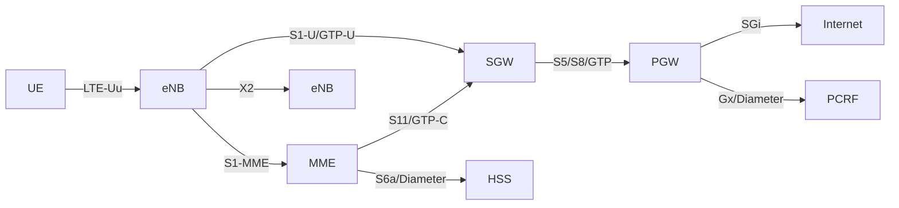
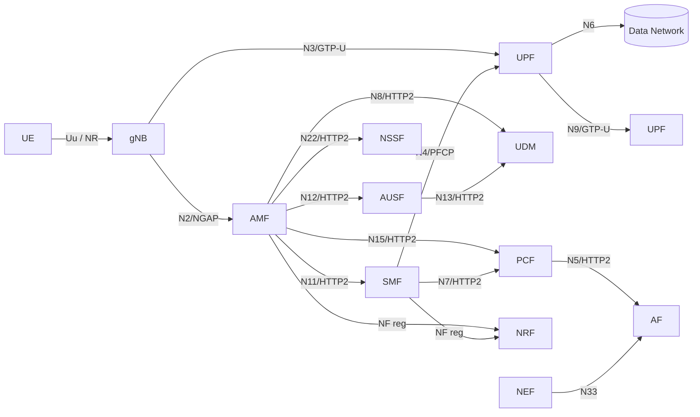

# Cellular Networking — 4G LTE + 5G NR as a Bundled Protocol

> A deep-dive encyclopedia entry for the COMS interactive protocol encyclopedia. Audience: engineers comfortable with packet protocols (TCP/IP, TLS, HTTP) who want to understand how a phone gets a usable IP address from a base station 50 km away — and what every term in that sentence really means. This entry covers 4G LTE (3GPP Release 8 → 14) and 5G NR (Release 15 → 19, with 6G as a future section) as one bundled node, following the same precedent as the Bluetooth Classic + BLE entry.

---

## 1. Prerequisites and Glossary

**Prerequisites:** read the IPv4/IPv6, TCP/UDP, IPsec, DNS, TLS, and SIP entries first. Helpful but optional: Wi-Fi (802.11) for an OFDMA primer, QUIC for header compression motivation, and WebRTC/RTP for the VoLTE/VoNR media plane.

Cellular networking has an extraordinary acronym density. Every term below is used in this article; the structured glossary is exhaustive on purpose.

### Identifiers
- **UE** — User Equipment. The phone, modem, IoT module, or CPE; everything on the user side of the air interface.
- **IMSI** — International Mobile Subscriber Identity, 15 digits. Format: MCC (3 digits, e.g. 234 = UK, 310 = US, 460 = China) + MNC (2–3) + MSIN (subscriber ID). Burned into the SIM.
- **SUPI** — Subscription Permanent Identifier (5G). Generalises IMSI; can also be a network-specific identifier (NAI).
- **SUCI** — Subscription Concealed Identifier (5G). The SUPI encrypted with the home-network's public key using the ECIES scheme; sent over the air in place of IMSI so passive eavesdroppers cannot catch identities. This is the single biggest privacy upgrade of 5G versus LTE.
- **GUTI / 5G-GUTI** — Globally Unique Temporary Identifier. After registration the network assigns a temporary identity so the long-term identifier is not repeatedly transmitted.
- **RNTI** — Radio Network Temporary Identifier, 16-bit. Identifies the UE on the air for scheduling (C-RNTI), random access (RA-RNTI), paging (P-RNTI), system info (SI-RNTI), and other purposes.

### Radio nodes
- **eNB / eNodeB** — Evolved NodeB, the LTE base station.
- **gNB** — Next-Generation NodeB, the 5G NR base station. May be split into **CU** (Central Unit), **DU** (Distributed Unit), and **RU** (Radio Unit), connected by the F1 and "fronthaul" interfaces.
- **ng-eNB** — an LTE eNB upgraded to talk to the 5G Core. The mirror of an "EN-DC gNB".
- **NG-RAN** — the radio access network containing gNBs and ng-eNBs.

### Core network functions (LTE EPC → 5G 5GC)
- **MME → AMF** (mobility & access). MME = Mobility Management Entity; AMF = Access and Mobility Management Function.
- **SGW + PGW → UPF + SMF** (user plane / session management). SGW = Serving Gateway, PGW = PDN Gateway, UPF = User Plane Function, SMF = Session Management Function. 5G's biggest architectural change: a clean CUPS (Control/User Plane Separation) split, where the SMF is pure control and the UPF is pure data forwarding.
- **HSS → UDM / UDR / AUSF** (subscriber data and authentication). HSS = Home Subscriber Server; UDM = Unified Data Management; UDR = Unified Data Repository; AUSF = Authentication Server Function.
- **PCRF → PCF** (policy and charging). Policy and Charging Rules Function → Policy Control Function.
- **NRF** — Network Repository Function. The service-registry / discovery for 5GC's micro-services (the "DNS for AMF/SMF/UDM" inside a 5G core).
- **NSSF** — Network Slice Selection Function.
- **NEF** — Network Exposure Function. The northbound API gateway.
- **AF** — Application Function. Where third-party apps plug in.
- **SEPP** — Security Edge Protection Proxy. Terminates inter-operator (roaming) HTTPS at the 5G core edge.

### Air-interface protocols (bottom to top)
- **PHY** — Physical Layer. OFDMA on downlink in both LTE and NR; SC-FDMA in LTE uplink; CP-OFDM (with optional DFT-s-OFDM) in NR uplink.
- **MAC** — Medium Access Control. Schedules grants, runs HARQ retransmissions, multiplexes logical channels.
- **RLC** — Radio Link Control. ARQ, segmentation/reassembly. Modes: TM (transparent), UM (unacknowledged), AM (acknowledged).
- **PDCP** — Packet Data Convergence Protocol. Ciphering, integrity, ROHC/EHC header compression, in-sequence delivery, duplicate detection.
- **SDAP** (NR only) — Service Data Adaptation Protocol. Maps QoS flows to DRBs.
- **RRC** — Radio Resource Control. Connection setup, mobility, measurement reports. States: IDLE, CONNECTED, plus NR's new INACTIVE state.
- **NAS** — Non-Access Stratum. End-to-end between UE and AMF/MME. Carries Registration, Authentication, Session Management. Transparent to the RAN.

### Frequency, numerology, channel
- **FR1** — Frequency Range 1, 410 MHz–7.125 GHz (the "sub-6") — covers low-band (700/800/900 MHz), mid-band (1.8/2.1/2.6 GHz), and C-band (3.3–4.2 GHz).
- **FR2** — Frequency Range 2, 24.25–52.6 GHz (mmWave). FR2-2 in Release 17 extends to 71 GHz.
- **Numerology (μ)** — In 5G NR, μ selects the subcarrier spacing: SCS = 2^μ × 15 kHz. μ=0→15 kHz, μ=1→30 kHz, μ=2→60 kHz, μ=3→120 kHz, μ=4→240 kHz (sync only). LTE is fixed at 15 kHz.
- **Resource Block (RB)** — 12 contiguous subcarriers in frequency. The fundamental scheduling unit.
- **Slot** — 14 OFDM symbols (normal CP). Slot duration = 1 ms / 2^μ. So 15 kHz → 1 ms slot, 30 kHz → 0.5 ms, 60 kHz → 0.25 ms, 120 kHz → 125 µs.
- **BWP** — Bandwidth Part. UE-specific carrier subset; saves power on wide carriers.
- **MIMO / mMIMO** — Multiple-Input Multiple-Output / massive MIMO. NR commonly uses 32T32R or 64T64R arrays at mid-band.

### Sessions, bearers, slices
- **APN (LTE) → DNN (5G)** — Access Point Name → Data Network Name. The string ("internet", "ims", "enterprise.acme") that picks which PDN/DN to attach to.
- **EPS bearer (LTE) → PDU session + QoS flow (5G)** — Logical pipes between UE and the gateway. NR introduces fine-grained QoS flows (5QI values) inside one PDU session.
- **TAU / Registration** — Tracking Area Update (LTE); Registration (5G). The procedure by which a UE tells the network where it is and refreshes mobility state.
- **Network slice (S-NSSAI)** — A logically isolated 5G network (its own AMF/SMF/UPF chain) selected by the Single-NSSAI 32-bit identifier.

### Architecture options
- **NSA / SA** — Non-Standalone / Standalone. NSA = Option 3 family: 5G NR radio anchored to a 4G LTE control plane and EPC. SA = Option 2: 5G NR connected directly to a native 5GC. Standalone unlocks slicing, URLLC, native VoNR, exposure APIs.
- **EN-DC / NR-DC** — E-UTRA-NR Dual Connectivity (NSA's underlying name); NR-NR Dual Connectivity.

### Air-interface flavors
- **VoLTE / VoNR** — Voice over LTE / Voice over NR. Both carry SIP signalling and RTP media over IMS (IP Multimedia Subsystem) over the data plane.
- **IMS** — IP Multimedia Subsystem. The 3GPP voice/messaging core that runs SIP, defined in TS 23.228.

---

## 2. History and Story

Cellular networking is the story of three forks that kept re-merging.

**The 1970s prototype.** On **April 3, 1973**, Motorola's Martin Cooper, standing on Sixth Avenue outside the Hilton in midtown Manhattan, placed the world's first handheld cellular call on a 2.5-pound DynaTAC prototype to Joel Engel at Bell Labs (its rival). The DynaTAC needed 10 hours to charge for 35 minutes of talk and took another decade to ship commercially as the $3,995 DynaTAC 8000X in 1983 (Smithsonian; CBS News).

**1G (analog).** Late 1970s–1980s. AMPS in North America (Bell Labs, 800 MHz FDMA). NMT in the Nordics (1981). TACS in the UK. All analog FM, all incompatible.

**2G (digital).** The first major fork. **GSM**, designed by the European CEPT/ETSI group, launched commercially on Radiolinja in Finland in **1991** — using TDMA with 200 kHz channels and the SIM card abstraction that made roaming a global product. In parallel **IS-95 (cdmaOne)**, designed by **Qualcomm** founders Irwin Jacobs and Andrew Viterbi, used Code Division Multiple Access (CDMA) — multiple users share the same frequency simultaneously, separated by orthogonal codes. Jacobs and Viterbi had co-founded Linkabit in 1968 and then Qualcomm on **July 1, 1985**; their bet that CDMA would beat TDMA on capacity and quality was vindicated when Sprint and others adopted IS-95 in the mid-1990s (Wireless History Foundation; ETHW oral history of Irwin Jacobs).

**3GPP founding, December 1998.** With the 2G "GSM world" diverging from the "CDMA world", standards bodies set up two parent partnerships:
- **3GPP**, established in December 1998, brought together ARIB (Japan), CWTS/CCSA (China — CWTS merged into CCSA in 2003), ETSI (Europe), Committee T1/ATIS (USA), TTA (Korea), and TTC (Japan). TSDSI (India) joined as a seventh organizational partner from 1 January 2015 (ATIS; 3GPP; Devopedia). The seven OPs remain authoritative today.
- **3GPP2** was set up in parallel for the CDMA2000 evolution lineage.

3GPP's original mission was UMTS — a 3G system based on WCDMA radio access — first deployed by NTT DOCOMO as FOMA in October 2001. 3GPP2's CDMA2000 1xRTT and EV-DO competed in North America and Korea. The fork was effectively closed with LTE: by Release 8 in 2008, 3GPP had defined a single global 4G path and 3GPP2's lineage was wound down.

**4G LTE: Release 8, December 2008.** LTE (Long-Term Evolution) chose OFDMA on the downlink and SC-FDMA on the uplink, with a flat all-IP core called the EPC (Evolved Packet Core). The radio interface was designed for low latency (≤ 10 ms one-way) and peak rates well into hundreds of Mbps. LTE-Advanced (Release 10) added carrier aggregation; Release 12 added LAA/LTE-U for unlicensed; Release 13–14 added narrowband IoT (NB-IoT) and Cat-M1.

**5G NR: Release 15, June 2018.** The first 5G NR specifications were frozen in three drops. The "early drop" — Non-Standalone (Option 3, EN-DC) — was frozen in December 2017 with ASN.1 in March 2018; the **"main drop" (Standalone, Option 2) was frozen in June 2018**, ratified at the 3GPP TSG plenary in La Jolla, California; the late drop (Option 4/7 + NR-DC) followed in 2019 (3GPP; AnandTech; TelecomTV). Initial commercial launches happened in late 2018 and through 2019.

**Release 16 (July 2020)** added URLLC, IIoT/TSN, NR-U (unlicensed), V2X sidelink. **Release 17 (mid-2022)** added NTN (Non-Terrestrial Networks — satellites), RedCap (Reduced Capability devices), and the 52.6–71 GHz extension.

**Release 18 — "5G-Advanced".** Officially frozen at the 3GPP SA#104 plenary in Shanghai on **18 June 2024**, with ASN.1/OpenAPI finalised in the same window (Nokia; C114). Headline features: AI/ML in the air interface, XR/PDU-Set QoS, IVAS spatial audio codec, enhanced NTN, RedCap evolution (eRedCap), and energy-efficiency normative work.

**Release 19 and beyond.** Work began in 2023; per Nokia's standardisation team, "Release 19 started recently and will be completed by the end of 2025" (Nokia 5G-Advanced standards page, 2024). At the time of writing (May 2026), 6G study items are being scoped for the Release 20 timeframe and ITU's IMT-2030 framework (Rec. ITU-R M.2160, published November 2023) provides the umbrella objectives.

---

## 3. How It Actually Works — Full Radio Stack with Bit Widths

The cellular stack reads bottom-up like every networking stack, but is uniquely layered because the radio is the bottleneck. Each layer has a job that exists *because of properties of the air interface*.

### 3.1 Physical Layer (PHY) — OFDMA

In LTE, the downlink is OFDMA at a single fixed subcarrier spacing of **15 kHz**. A resource block (RB) is 12 subcarriers × 7 OFDM symbols (normal CP) = 0.5 ms × 180 kHz. The smallest schedulable unit, the resource element (RE), is one subcarrier in one symbol.

In NR, OFDMA is generalised to a **family of numerologies**, indexed by μ ∈ {0, 1, 2, 3, 4}: SCS = 2^μ × 15 kHz (TS 38.211; LinkedIn/Award Solutions overview). Allowed pairings:

| μ | SCS | Slot length | Max BW | Typical use |
|---|---|---|---|---|
| 0 | 15 kHz | 1 ms | 50 MHz | FR1 low-band, mobility |
| 1 | 30 kHz | 500 µs | 100 MHz | FR1 mid-band / C-band, default 5G SA |
| 2 | 60 kHz | 250 µs | 100/200 MHz | FR1 or FR2, optional extended CP |
| 3 | 120 kHz | 125 µs | 400 MHz | FR2 mmWave, data channels |
| 4 | 240 kHz | 62.5 µs | (sync only) | FR2 SSB |

Release 17 added μ = 5, 6 (480 and 960 kHz) for the 52.6–71 GHz "FR2-2" band (ShareTechnote). A frame is always 10 ms with ten 1-ms subframes; the number of slots per subframe = 2^μ.

The cyclic prefix (CP) ≈ 4.7 / 2^μ µs absorbs delay spread. Higher SCS = shorter CP = less robust against multipath but lower latency — that is why mmWave deployments use 120 kHz: phase noise at 28/39 GHz makes subcarriers wider than 60 kHz necessary, and the short slots support URLLC budgets.

mmWave bands (n257 26.5–29.5 GHz, n258 24.25–27.5 GHz, n260 37–40 GHz, n261 27.5–28.35 GHz) use 400 MHz channels and rely on **beamforming**: the gNB sweeps up to 64 SSBs (Synchronization Signal Blocks) within a 5 ms half-frame, and the UE reports the best beam (RF Essentials).

**Massive MIMO** (32T32R, 64T64R) is standard at mid-band. The base station forms many simultaneous narrow beams using SRS (Sounding Reference Signal) channel feedback — this is where the bulk of "5G speeds" actually come from on FR1.

### 3.2 MAC Layer — HARQ and Scheduling

MAC's two main responsibilities:

1. **HARQ (Hybrid ARQ)** — Stop-and-wait per-process retransmission with chase combining or incremental redundancy. LTE downlink runs **8 HARQ processes per UE** (3-bit process ID, TS 36.321). NR extends this to up to **16 HARQ processes** by default (4-bit), and Release 17 added optional support for up to 32 processes for high-SCS scenarios; the increased process count is required so that the radio pipeline can stay busy when feedback round-trips don't shrink as fast as slot times.
2. **Scheduling** — The eNB/gNB grants resources via the PDCCH (Physical Downlink Control Channel) carrying a DCI (Downlink Control Information) message addressed by a 16-bit RNTI. Common RNTIs: **C-RNTI** (cell-specific UE), **RA-RNTI** (random access), **P-RNTI** (paging), **SI-RNTI** (system info), **TC-RNTI** (temporary C-RNTI during contention resolution).

MAC also multiplexes/demultiplexes logical channels (DCCH, DTCH, BCCH, PCCH) into transport blocks, handles Buffer Status Reports (BSR), Power Headroom Reports (PHR), and DRX (discontinuous reception) for battery life.

### 3.3 RLC Layer — Reliability

Three modes:
- **TM (Transparent Mode)** — no headers, used for control channels like BCCH/PCCH.
- **UM (Unacknowledged Mode)** — adds segmentation and reordering but no ARQ. Used for VoLTE/VoNR voice (RTP) where retransmission latency would be worse than packet loss.
- **AM (Acknowledged Mode)** — Selective-repeat ARQ with status reports.

Sequence number widths (3GPP TS 38.322 for NR, TS 36.322 for LTE):
- **LTE RLC AM**: 10-bit SN (legacy), extended to 16-bit in Release 11.
- **NR RLC UM**: 6-bit or 12-bit SN.
- **NR RLC AM**: 12-bit or 18-bit SN. The wider SN is needed because 5G windows are larger (NR can have many more outstanding PDUs at high data rates).

### 3.4 PDCP Layer — Crypto and Compression

PDCP (TS 36.323 / TS 38.323) is the layer where every byte of user IP traffic is encrypted and integrity-checked. Sequence numbers:
- **LTE PDCP** SN sizes: 5/7/12/15/18 bits (the 18-bit "Long PDCP SN" added in Rel-13 to support carrier aggregation throughput).
- **NR PDCP** SN sizes: 12 or 18 bits.

Cryptographic algorithms (TS 33.401 for LTE, TS 33.501 for NR):
- **128-EEA0 / 128-NEA0** — null cipher (test only; some emergency calls).
- **128-EEA1 / 128-NEA1** — SNOW 3G stream cipher.
- **128-EEA2 / 128-NEA2** — AES-128 in counter mode (AES-CTR). The default in nearly every commercial network.
- **128-EEA3 / 128-NEA3** — ZUC stream cipher, designed in China; mandatory to implement in many markets.

Integrity algorithms (EIA/NIA) use the same primitives in MAC modes. Note: in LTE, **user-plane integrity protection is optional and rarely enabled**, which has long been a known weakness; NR makes UP integrity mandatory to support and configurable per DRB. PDCP also runs **ROHC** (RFC 5795 / RFC 3095) for IP/UDP/RTP header compression — a 40-byte IPv4/UDP/RTP header can compress to 1–3 bytes, which is what makes VoLTE/VoNR practical inside one RLC slot.

NR adds **SDAP** above PDCP only for the user plane: it stamps a QoS Flow Identifier (QFI) on each packet so the gNB can map QoS flows to DRBs.

### 3.5 RRC — Control Plane on the Air

RRC (TS 38.331 for NR, TS 36.331 for LTE) is the protocol the UE and gNB speak to set up, reconfigure, and tear down radio bearers. RRC is ASN.1-encoded — a fact responsible for several memorable CVEs (see §6).

States:
- **RRC_IDLE** — Camped on a cell; receiving paging. Lowest power. Mobility is UE-controlled (cell reselection).
- **RRC_CONNECTED** — Active radio link; network-controlled handover; can send/receive data.
- **RRC_INACTIVE** (NR only) — UE keeps its AS (Access Stratum) context cached at the gNB and can resume connection in ~10 ms with an RRC Resume rather than full setup. Designed for bursty IoT and reduces signalling load by 50–80% for chatty apps.

Key procedures: RRC Setup / Setup Complete, RRC Reconfiguration (the workhorse for handovers and BWP switches), RRC Resume / Release, Measurement Reports, SCG Addition (for dual connectivity).

### 3.6 NAS — Mobility and Sessions

NAS (TS 24.301 for LTE EMM/ESM, TS 24.501 for 5G 5GMM/5GSM) is end-to-end between the UE and the AMF/MME — the RAN is transparent to it (NAS is integrity-protected and ciphered above PDCP, so the gNB cannot read it).

- **5GMM / EMM** (Mobility Management) — Registration / Attach, Authentication (5G-AKA, EAP-AKA'), Security Mode Command, Service Request, Deregistration.
- **5GSM / ESM** (Session Management) — PDU Session Establishment / Modification / Release; equivalent to "create EPS bearer" in LTE.

---

## 4. The Core Network — From EPC to 5GC

### 4.1 EPC (LTE) — point-to-point interfaces, GTP everywhere



EPC interfaces are point-to-point and protocol-specific:
- **S1-MME** — S1AP (SCTP) signalling, eNB ↔ MME.
- **S1-U** — GTP-U over UDP/IP, eNB ↔ SGW. Carries user packets in tunnels keyed by TEID.
- **S5 / S8** — GTP between SGW and PGW (S5 home / S8 roaming).
- **S6a** — Diameter, MME ↔ HSS, for authentication vectors and subscriber profile.
- **S11** — GTP-C, MME ↔ SGW.
- **X2** — eNB ↔ eNB for handover and ICIC; carries both signalling (X2AP/SCTP) and user-plane GTP-U for forwarded packets during handover.
- **SGi** — the external PDN interface; this is where IPv4/IPv6 packets actually leave the EPC.

**Critical security note:** under 3GPP TS 33.210/33.401, all of S1, X2, S5/S8 traversing "untrusted" backhaul require IPsec ESP with IKEv2 certificate-based authentication. In practice almost every commercial LTE deployment runs IPsec from the eNodeB back to a Security Gateway in front of the EPC (NIST SP 800-187; A10 Networks; Heavy Reading 2011/2013). NR makes the requirement explicit and mandatory to implement: "**IPsec is mandatory to implement on the gNB and the ng-eNB**" (TS 33.501 §9). This is why the IPsec entry in this encyclopedia is "load-bearing": every base station in a modern cellular network is, among other things, an IPsec endpoint.

### 4.2 5GC — Service-Based Architecture (SBA)

5G's biggest core-side innovation is the **Service-Based Architecture**: control-plane NFs (Network Functions) expose services to one another via HTTP/2 over TCP (with JSON payloads), discovered through the NRF — exactly like a cloud-native microservices stack with Envoy and Consul. The user plane stays point-to-point because it has to forward IP packets at line rate. This means the 5G core is essentially a giant set of HTTP/2 services that already cross-link to the encyclopedia's HTTP/2 entry (TS 23.501 — System architecture for the 5G System; Light Reading/Heavy Reading; nickvsnetworking).



What each interface carries:
- **N1** — NAS between UE and AMF, transparent through the gNB.
- **N2** — NGAP/SCTP signalling between gNB and AMF (the descendant of S1-MME).
- **N3** — User-plane GTP-U between gNB and UPF.
- **N4** — PFCP (Packet Forwarding Control Protocol), SMF ↔ UPF. This is the CUPS split: SMF tells the UPF what to do; UPF just forwards.
- **N6** — UPF to external data network (the new SGi).
- **N9** — GTP-U between UPFs (e.g. across home/visited UPF in roaming).
- **N11** — SMF ↔ AMF service-based interface (HTTP/2).
- **N7** — SMF ↔ PCF for policy.
- **N8** — AMF ↔ UDM for subscriber data.
- **N12** — AMF ↔ AUSF for authentication.
- **N13** — AUSF ↔ UDM for authentication vectors.
- **N15** — AMF ↔ PCF for access-and-mobility policy.
- **Xn** — gNB ↔ gNB (the new X2), for Xn handover and dual-connectivity coordination.

Within the gNB, the **F1** interface (CU ↔ DU) and **E1** interface (CU-CP ↔ CU-UP) carry F1AP signalling and GTP-U user-plane; per TS 33.501 their control planes are also mandatory IPsec ESP with IKEv2.

---

## 5. Authentication: The Bit That Stops Strangers From Calling On Your Number

In LTE this is **EPS-AKA** (Authentication and Key Agreement); in 5G it is **5G-AKA** or **EAP-AKA'** (TS 33.501). The flow:

1. UE sends SUCI (in 5G) or IMSI (in LTE, plaintext if no GUTI is cached — the privacy gap that IMSI catchers exploit).
2. AMF asks AUSF; AUSF asks UDM. UDM's **SIDF** (Subscription Identifier De-concealing Function) decrypts the SUCI back to the SUPI using its ECIES private key.
3. UDM generates an authentication vector from the long-term key **K** stored in the USIM and in the UDM.
4. Hierarchy:
   `K → (CK, IK) → K_AUSF → K_SEAF → K_AMF → {K_NASint, K_NASenc, K_gNB} → {K_RRCint, K_RRCenc, K_UPint, K_UPenc}`
5. The UE proves it knows K (and a fresh RAND/AUTN challenge) and derives the same keys.
6. AMF then sends a **Security Mode Command** to switch NAS to ciphered+integrity-protected mode; the gNB does the same for RRC and PDCP.

5G-AKA closes two long-standing LTE weaknesses: long-term identifiers no longer travel in cleartext (SUCI), and the home network always verifies the authentication response itself (preventing certain visited-network impersonation attacks that were possible in LTE roaming).

---

## 6. Deep Connections to Other Protocols

This is what makes cellular a hub node in the encyclopedia. Direct cross-links:

- **IPv4 / IPv6** — A PDU session establishes one of {IPv4, IPv6, IPv4v6, Ethernet, Unstructured}. Cellular has been the largest single driver of real-world IPv6 deployment (T-Mobile USA's network has been IPv6-only for the UE-facing leg since 2014, using 464XLAT to reach IPv4 destinations). See §8 pitfalls.
- **TCP / UDP** — Carried inside GTP-U tunnels on the radio leg. Cellular's variable latency and occasional packet drops are the main reason TCP CUBIC and BBR were tuned the way they were.
- **QUIC** — Native fit for cellular: connection migration handles cell handover and IP-address change without breaking sessions. 3GPP is studying QUIC as the SBA transport for later releases.
- **IPsec** — Mandated on every backhaul interface (S1, X2, N2, N3, F1-C, E1, Xn). Without IPsec the encyclopedia entry for IPsec is largely a curiosity; *with* cellular, IPsec is one of the most-deployed protocols on Earth.
- **HTTP/2 (and HTTP/3)** — The 5GC SBA runs HTTP/2 between every control-plane NF. Inter-PLMN traffic between SEPPs is HTTPS.
- **DNS** — UEs receive DNS servers via NAS in the PDU Session Establishment Accept. The 5GC itself uses DNS internally for NF discovery fallback.
- **TLS** — Terminates every SBA HTTPS hop; SEPP-to-SEPP roaming uses TLS 1.3 with the PRINS protocol on top for app-layer protection of N32-f.
- **SIP / RTP / SDP** — VoLTE and VoNR are SIP signalling and RTP media over IMS, carried in dedicated QoS-flagged bearers (LTE QCI=1; NR 5QI=1). Cross-link directly to those entries.
- **WebRTC** — Increasingly the alternative voice path; cellular is the bottom layer that carries it.
- **Wi-Fi** — 3GPP defines untrusted non-3GPP access via N3IWF (5G) / ePDG (LTE), letting a UE attach to the 5G core over any Wi-Fi link via IPsec tunnels. ATSSS (Access Traffic Steering, Switching, Splitting) policies use MPTCP and MP-QUIC.
- **Bluetooth** — Mostly orthogonal, but increasingly relevant via UWB+5G fusion positioning.

---

## 7. Real-World Deployments

| Operator | Deployment | Scale / status (as of 2026-05) | Source |
|---|---|---|---|
| **T-Mobile USA** | 5G-SA, "Ultra Capacity" on n41 (2.5 GHz). First nationwide 5G-SA in the US (Aug 2020). | Continues to be ranked best US network in 2025 Ookla data; T-Satellite with Starlink launched commercially **23 July 2025** | T-Mobile newsroom 2025; Broadband Breakfast |
| **Verizon** | C-band (n77, 3.7–3.98 GHz). Saga with FAA over altimeter interference, voluntary delays through 2023; full power achieved by mid-2023. | FAA confirms entire US airline fleet altimeter retrofit complete by Sept 2023; full coexistence framework runs to at least 1 Jan 2028. | FAA.gov 5G page |
| **AT&T + AST SpaceMobile** | Direct-to-cell from low-earth-orbit BlueBird satellites using AT&T spectrum. | **Definitive commercial agreement 15 May 2024**, extending to 2030. First 5 BlueBird satellites launched Sept 12 2024. Commercial beta planned for H1 2026 with 45–60 satellites end of 2026. | AT&T about.att.com; SatNews |
| **DISH (now EchoStar/Boost)** | World's first cloud-native, OpenRAN, public-cloud 5G core. Nokia 5G-SA Core on AWS, announced June 2021, launched 2022. | First telco network in US using a 5G-SA core on a public cloud. | Nokia/AWS press; AWS Industries blog |
| **Vodafone UK** | Open RAN with Samsung (vRAN + radios) and NEC (massive MIMO), Dell servers, Wind River CaaS. | First commercial Open RAN site live 2022 (Bath); pushing toward 2,500 sites by 2027. Samsung remains the primary Open RAN partner in Vodafone's Spring 6 tender across Europe and Africa. | Vodafone; Light Reading; SDxCentral |
| **Reliance Jio (India)** | 5G-SA, 700 MHz + 3.5 GHz + 26 GHz mmWave, in-house 5G core stack. | Launched Oct 2022; near-complete pan-India coverage by end-2023; ~1M cells operational by Dec 2023; ~90 million 5G subscribers by Jan 2024. Called the fastest 5G rollout of this scale globally. | RCR Wireless; Ericsson Mobility Report; Light Reading |
| **Rakuten Mobile / Rakuten Symphony** | Japan's first fully cloud-native, Open RAN nationwide network; 300k+ cells. RAN Intelligent Controller (RIC) deployed nationwide May 2025 — first commercial nationwide RIC. | Multi-vendor third-party rApps live Feb 2026; cuts RAN energy 15–20%. | Rakuten Symphony newsroom |
| **China Mobile** | Largest 5G network on Earth — 2.287 million 5G basestations as of November 2022 (CAICT). | Drives much of 3GPP's Rel-18/19 architecture work via SA2 (Sun Tao co-chair). | Huawei R18 whitepaper |
| **Deutsche Telekom, Orange** | Pan-European leaders in 5G-SA rollouts and Open RAN trialling (Orange Open RAN trials in rural France from 2024). |  | Telecoms.com |

T-Mobile + Starlink ("T-Satellite") deserves a closer look as the canonical NTN deployment: 657 Starlink direct-to-cell satellites in orbit by mid-2025, broadcasting cellular-band signals via 3GPP-compliant NTN radio profiles (Release 17 NTN). Apps that work on satellite: WhatsApp, Google Maps, AllTrails, X, AccuWeather, plus 911 texting. Voice and data added October 2025. T-Mobile Experience Beyond customers get it free; Verizon and AT&T users pay $10/month (T-Mobile newsroom Oct 2025; Wireless Estimator).

---

## 8. Failure Modes and Famous Incidents

- **T-Mobile US, 15 June 2020 — VoLTE/IMS overload + 911 outage.** A single failed leased fiber link cascaded because an IMS-registration node had a latent software bug that prevented proper failover, and a routing misconfiguration redirected traffic through the wrong path. Outage lasted 12 hours 13 minutes; at least 41% of calls failed, including **23,621 failed 911 calls**. The FCC ultimately fined T-Mobile **$19.5 million** in November 2021 (FCC PS Docket 20-183, October 2020 report; Fierce Network; AP via Seattle Times).

- **Optus Australia, 8 November 2023 — BGP route flood, 14-hour nationwide outage.** A planned software upgrade on a sibling Singtel router triggered an unexpected flood of BGP announcements (Cloudflare measured a Vantage spike from <3,000 to >940,000 announcements/hour). Optus routers hit their max-prefix limits and self-isolated to protect their RIB. Because the out-of-band management network shared the same control plane, engineers were locked out and had to physically travel to 100+ sites. ~10 million users and 400,000 businesses affected; 228 emergency triple-zero calls failed. Australia subsequently passed an A$12M ACMA fine and instituted the Bean Review (Wikipedia; APNIC; ISOC Pulse; ACS Information Age; Kentik).

- **FAA / Verizon-AT&T C-band 5G altimeter saga, 2021–2023.** When the FCC auctioned the 3.7–3.98 GHz C-band to Verizon and AT&T, the FAA raised concerns that radar altimeters using 4.2–4.4 GHz could see interference. Initial deployment scheduled 5 Jan 2022 was deferred twice, then launched 19 Jan 2022 with buffer zones around 50 priority airports. AT&T and Verizon agreed to maintain mitigations until 1 July 2023 to allow altimeter retrofits; **by the end of September 2023 the entire US airline fleet was retrofitted** and full power deployment proceeded. The roundtable framework runs to 1 Jan 2028 (FAA.gov; 5G Americas).

- **IMSI catchers ("Stingrays")** — Devices like Harris Corp's Stingray, Hailstorm, KingFish broadcast a stronger-than-real-tower pilot and force UEs to associate. They downgrade 4G/5G connections to 2G/3G where mutual auth was weaker. DHS publicly acknowledged unauthorized IMSI catchers in the DC area in 2018 (congressional testimony before Chairman Abraham; CyberScoop; EFF SLS). LTE made this harder but did not eliminate it because IMSI was sent in clear during initial attach; 5G's SUCI plus mandatory mutual auth and (in Rel-16) optional false-base-station detection close this gap when 2G/3G fallback is also disabled.

- **SS7 / Diameter signalling abuse.** SS7 is the 1970s-era PSTN inter-carrier signalling protocol still bridging cellular roaming. Researchers (Tobias Engel at 31C3, 2014; Karsten Nohl at 31C3) showed SS7 MAP messages can locate any cell phone globally by IMSI and intercept SMS — including bank 2FA codes — using nothing more than commercial carrier interconnect access. Diameter (LTE) is theoretically better but suffers similar trust-based weaknesses. DHS's 2017–18 mobile security report stated US carriers remain "vulnerable" to SS7 and Diameter attacks (Congress.gov hearing transcript).

- **CVE-2017-9417 ("BroadPwn")** — Broadcom Wi-Fi/baseband chip RCE; not strictly cellular but in the same SoCs.
- **CVE-2020-12352 ("BleedingTooth")** — Linux Bluetooth stack zero-click; mentioned for completeness in the wireless cluster.
- **ASN.1 parser CVEs** in baseband stacks have been a recurring class: Project Zero showed in 2023 that Samsung Exynos baseband had several internet-to-baseband ASN.1-handling vulnerabilities, exploitable by sending crafted NAS messages.

---

## 9. Fun Facts and Anecdotes

- **The first cellular call was a troll.** April 3, 1973, Sixth Avenue, Manhattan. Marty Cooper of Motorola dialed Joel Engel at AT&T Bell Labs — his direct rival — and said: "*Joel, this is Marty. I'm calling you from a cell phone, a real handheld portable cell phone.*" Engel, by Cooper's account, claims not to remember the call (Wikipedia; CBS News; CNN 2023 50th-anniversary feature).

- **MCCs are a private numbering plan you can read on the back of your screen.** The Mobile Country Code in any IMSI tells you where the SIM was issued: 234 / 235 = UK, 310–316 = USA, 460 = China, 405 = India, 440–441 = Japan, 262 = Germany, 222 = Italy. This is why a roaming bill itemises calls by MCC/MNC pairs.

- **The CDMA-vs-GSM wars were existential.** In 1989 Irwin Jacobs presented CDMA to the CTIA after the industry had already voted for TDMA in January of that year. "*No one found a hole in the technical presentation*" but the political fight took a decade; Hong Kong (1995), Korea, then the US were the first to ship cdmaOne (Jacobs oral history, IEEE ETHW). CDMA's mathematical foundation became the basis of WCDMA in UMTS — which the GSM camp ended up adopting too — closing the fork.

- **Edholm's Law.** Phil Edholm observed that wireless data rates trail wired by roughly five years but converge. The "Edholm's law of bandwidth" plot from the early 2000s — wireless, nomadic, and wired data rates all on a single log-linear curve — is one of the most quoted slides in cellular engineering.

- **Viterbi did not patent his most famous algorithm.** "On advice of a lawyer, Viterbi did not patent the algorithm" (Wikipedia). The Viterbi algorithm — convolutional code decoding — is used in every cellular phone, every disk-drive read channel, every GPS receiver, and every speech recognizer. It made nothing for him directly; it made Qualcomm everything.

- **The DynaTAC weighed 2.5 lb and gave 35 minutes of talk after 10 hours of charging.** Cooper himself: "*The battery lifetime wasn't really a problem because you couldn't hold that phone up for that long!*" (Wikipedia Martin Cooper).

- **The "5G-Advanced" logo was approved by the 3GPP PCG #46-e in April 2021** — they only allow themselves a new marker once a release set materially advances the system (3GPP.org Release 18 page).

---

## 10. Practical Wisdom

**Pitfalls every engineer who deploys on cellular runs into:**

1. **IPv6 deployment quirks** — On modern carriers (T-Mobile, Reliance Jio, parts of Verizon and DT), the UE receives only an IPv6 prefix; legacy IPv4 destinations are reached via **464XLAT** (RFC 6877) using a CLAT on the UE and a PLAT/NAT64 at the operator. The PDP/PDU Session type matters: requesting "IPv4 only" on an IPv6-only carrier will fail; requesting "IPv4v6" works everywhere; "IPv6 only" works if you trust 464XLAT to be present. Symptoms: apps with hardcoded IPv4 literals fail silently.

2. **ICMP filtering kills PMTU discovery.** Many cellular networks NAT (or carrier-grade NAT) and drop ICMPv4 Type 3 Code 4 (Frag Needed) messages on the SGi/N6 side. The MTU on a GTP tunnel is 1500 − 8 (UDP) − 20/40 (IP) − 8 (GTP-U) − overhead, typically yielding a usable inner MTU of 1430–1452 bytes. TCP MSS clamping at the PGW/UPF saves TCP; QUIC and other UDP-based protocols must implement PLPMTUD (RFC 8899).

3. **VoLTE/VoNR codec mismatch.** AMR-NB (12.2 kbit/s) is the universal lowest common denominator; AMR-WB (HD Voice) works between same-vendor handsets but inter-operator roaming often falls back to NB. EVS (Enhanced Voice Services), introduced in Rel-12, is the modern default but requires both IMS networks to advertise it in the SDP. Mismatches manifest as one-way audio after handoff.

4. **eSIM provisioning failures** — SM-DP+ activation codes can fail with non-obvious symptoms when the eUICC is from a different manufacturer than the OEM defaults (RSP profiles have to match), or when the carrier's EID whitelist isn't updated.

5. **NSA vs SA misconfiguration** — A handset configured for SA on a network that only has NSA will sit on LTE only and never light the 5G icon; the reverse leaves features (slicing, URLLC, VoNR) inaccessible. Always check the UE capability and APN/DNN configuration when troubleshooting.

6. **Carrier-grade NAT (CGN)** — Most cellular UEs sit behind a CGN; inbound connections are impossible without a separate signalling channel. This is why mobile push notification services exist at all.

**Debugging toolbox:**

- **Wireshark** has first-class dissectors for **GTP-U, GTP-C, S1AP, NGAP, NAS-EPS, NAS-5GS, RRC, F1AP, E1AP, PFCP, Diameter, SCTP**. The RRC and NAS dissectors are auto-generated from the ASN.1 spec text and are remarkably complete.
- **srsRAN** (formerly srsLTE) — Open-source UE + eNB + EPC + gNB + 5GC stack from Software Radio Systems. Lets you light up a full LTE or 5G-SA cell on an SDR (USRP B210, LimeSDR) for under $2000 of hardware.
- **Open5GS** — Open-source 4G EPC + 5G SA core. Pairs well with srsRAN's gNB.
- **free5GC** — Pure-Go 5G core; great for studying SBA traffic.
- **OAI (OpenAirInterface)** — EURECOM-led research stack with full PHY simulation.
- **QXDM / QCAT** (Qualcomm vendor) and **Apple Sysdiagnose** — closed-source but indispensable for OEM-level debugging.
- **Network slicing visibility** — use `lsmod | grep gtp` on Linux UPFs; PFCP traces between SMF and UPF over Wireshark.

---

## 11. Pioneers and Key Contributors

- **Marty Cooper (b. 1928)** — Motorola engineer who led the DynaTAC team and placed the first public cellular call on April 3, 1973. Patent "radio telephone system" filed October 17, 1973. Co-recipient of the 2013 Charles Stark Draper Prize and the 2015 IEEE Masaru Ibuka Consumer Electronics Award. Considered the "father of the handheld cell phone." Co-founder of Dyna LLC.

- **Andrew Viterbi (b. 1935)** — Italian-born American electrical engineer; invented the Viterbi algorithm (1967) for decoding convolutional codes, which is used in essentially every digital communications system on Earth. Co-founded Linkabit (1968) with Irwin Jacobs and Leonard Kleinrock, then Qualcomm (July 1, 1985). National Medal of Science 2007; IEEE Medal of Honor 2010. The USC Viterbi School of Engineering is named for him after his $52M gift in 2004.

- **Irwin Jacobs (b. 1933)** — co-founder of Qualcomm and Linkabit; led the commercial fight for CDMA against the TDMA establishment after the CTIA's January 1989 vote against CDMA. National Medal of Technology 1994; IEEE Alexander Graham Bell Medal 1995. Co-author with John Wozencraft of *Principles of Communication Engineering* (1965), still in print.

- **Phil Karn (already in the COMS encyclopedia for IPsec)** — at Qualcomm during the IS-95 era; key technical contributor to CDMA, the "Karn-Lin RTT estimator" used in TCP, and the original BSD IPsec stack. The fact that a single engineer connects cellular and IPsec is why the IPsec-everywhere footprint is so deep.

- **Erik Dahlman (Ericsson Research)** — co-author with Stefan Parkvall and Johan Sköld of *4G LTE/LTE-Advanced for Mobile Broadband* and *5G NR: The Next Generation Wireless Access Technology* — the canonical reference texts. Personal contributions to LTE Rel-8 PHY and NR numerology design.

- **Stefania Sesia, Issam Toufik, Matthew Baker** — editors of *LTE — The UMTS Long Term Evolution: From Theory to Practice* (Wiley, 2009; 2nd ed 2011), the standard LTE bible used in industry.

- **Takehiro Nakamura (NTT DOCOMO)** — long-serving 3GPP TSG-RAN chair; central architect of the LTE Rel-8 design choices and 5G NR system requirements; nominated multi-RAT dual connectivity and pushed Japan's NTN agenda.

- **Balazs Bertenyi (Nokia / 3GPP)** — TSG-RAN chairman during the Release 15 freeze; drove the three-drop schedule for NR.

---

## 12. Learning Resources (with year of last update)

- **Erik Dahlman, Stefan Parkvall, Johan Sköld — *5G NR: The Next Generation Wireless Access Technology* (3rd ed, Academic Press, 2024)**. The definitive engineering reference. Read after the standards, not before.
- **3GPP specifications portal (3gpp.org/ftp/Specs/archive/)** — free. The big five for this entry: **TS 36.300** (LTE overall stage-2), **TS 38.300** (NR overall stage-2), **TS 23.501** (5GS architecture; v18 as of 2024), **TS 24.501** (5G NAS protocol), **TS 33.501** (5G security), **TS 38.331** (NR RRC), **TS 38.401** (NG-RAN architecture).
- **Stefania Sesia, Issam Toufik, Matthew Baker — *LTE — From Theory to Practice* (Wiley, 2nd ed 2011)** — older but still the best LTE bible.
- **Sharetechnote.com** (continuously updated, last refresh 2025) — an enormous practical reference site, especially good on PHY and RRC. Some pages are dated; cross-check against current TS versions.
- **3glteinfo.com** (updated 2024) — readable diagrams of numerology, BWP, scheduling.
- **NIST SP 800-187, *Guide to LTE Security*** (2017; still the canonical US-government LTE security reference, even though some recommendations have been superseded by 5G).
- **GSMA FS.40 and SCAS** (annual updates) — security baselines.
- **3GPP Newsletter ("Highlights")** (monthly, free email) — best way to track Rel-19/20 progress live.
- **Awardsolutions.com 5G OFDM Numerologies** (2023 update) — clean primer.
- **Open5GS docs (open5gs.org)** (continuously updated) — best free way to learn 5GC by running it.
- **YouTube — Hashar Mujahid, 3GPP Webinar series, Telecom Trainer** — current as of 2025-2026 for visual learners.

---

## 13. Where Things Are Heading — 2025–2026 Frontier

- **3GPP Release 18 (5G-Advanced) frozen 18 June 2024.** Already enabling commercial XR profiles, AI/ML for beam management, and the IVAS spatial audio codec.
- **Release 19** is the second 5G-Advanced release, targeted to complete by end of 2025 per Nokia's standardisation team — extending AI/ML to mobility prediction, expanded NTN, MBS for emergency mobility, and dual-active protocol stack handovers.
- **Starlink Direct-to-Cell + T-Mobile T-Satellite went commercial 23 July 2025.** First space-based supplementary coverage for unmodified smartphones at scale, using Release 17 NTN profiles. Now serves 150,000+ daily users with 34 satellite-ready apps.
- **AST SpaceMobile + AT&T** signed definitive commercial agreement 15 May 2024 (runs to 2030); first 5 BlueBird satellites launched September 2024; Verizon also signed for the same constellation. Commercial beta with 45–60 satellites targeted by end of 2026.
- **Open RAN** continues to mature: Rakuten Mobile + Symphony deployed the world's first nationwide RAN Intelligent Controller (RIC) in commercial operation in May 2025, with third-party rApps live by February 2026. Vodafone's Spring 6 tender, decided through 2025–26, distributes RAN across Ericsson, Nokia, Samsung (Open RAN), and Mavenir in a much-changed European market.
- **AI in the air interface (AI/ML for NR)** — Release 18 normative work covered CSI feedback compression, beam management prediction, and positioning. Release 19 expands to mobility and energy management. The Rakuten RIC is the first commercial proof point that ML-driven energy saving in the RAN can reach 15–20%.
- **Reconfigurable Intelligent Surfaces (RIS)** — programmable passive reflector arrays. Heavy 2025 research interest in 3GPP RAN1; not yet a normative work item in Rel-19, but expected in Rel-20.
- **6G / Release 20** — 3GPP began Rel-20 study items in 2025; ITU-R published **Recommendation ITU-R M.2160** in November 2023, defining the IMT-2030 framework with six usage scenarios: immersive communication, hyper-reliable low-latency communication, massive communication, ubiquitous connectivity, AI-and-communication, and integrated sensing-and-communication (ISAC). Spectrum candidates include 7–24 GHz "FR3" and sub-THz (>100 GHz) bands. Commercial 6G is not expected before ~2030.
- **NTN direct-to-handset** scaling beyond text: T-Satellite added data for 34 apps in October 2025, plans voice and full broadband during 2026.
- **Quantum-safe crypto for SUCI** — ETSI and 3GPP SA3 are studying post-quantum primitives to replace ECIES; nothing normative as of May 2026.

---

## 14. Hooks for Articles / Infographics / Podcast

- **Article hook:** "Every base station on Earth is an IPsec tunnel. Here's why that one design decision lets your phone work at all."
- **Infographic 1:** A single resource grid view: time on the x-axis (1 ms slot), frequency on the y-axis (12 subcarriers per RB), color-coded by channel (PSS/SSS/PBCH/PDCCH/PDSCH).
- **Infographic 2:** EPC interfaces vs 5GC service-based architecture, side by side — same logical functions, totally different protocols.
- **Podcast Ep 1:** "April 3, 1973 — How Marty Cooper trolled Joel Engel into giving Motorola the cell-phone industry." Interview a Smithsonian Cooper biographer or pull from his 2021 book *Cutting the Cord*.
- **Podcast Ep 2:** "Why Andrew Viterbi didn't patent his algorithm — and made Qualcomm anyway." Use the IEEE ETHW oral history.
- **Podcast Ep 3:** "The 14-hour Optus outage: how BGP killed half of Australia's emergency calls." Pull from APNIC's post-mortem.
- **Podcast Ep 4:** "Phones in space: T-Satellite, AST, and the death of the dead zone."
- **Interactive simulator:** the 5G initial-registration sequence (see Appendix B).

---

## 15. Appendix A — Encyclopedia-Ready Structured-Data Extract

```typescript
const cellular4G5G: Protocol = {
  id: "cellular",
  name: "Cellular (4G LTE + 5G NR)",
  category: "Wireless",
  layer: ["L1", "L2", "L3"],
  rfcOrSpec: [
    "3GPP TS 36.300 (LTE overall)",
    "3GPP TS 38.300 (NR overall)",
    "3GPP TS 38.331 (NR RRC)",
    "3GPP TS 24.501 (5G NAS)",
    "3GPP TS 23.501 (5GS architecture)",
    "3GPP TS 33.501 (5G security)",
    "3GPP TS 38.401 (NG-RAN architecture)",
    "3GPP TS 38.211/212/213/214 (NR PHY)",
    "ITU-R Rec. M.2160 (IMT-2030 framework, Nov 2023)"
  ],
  ports: ["No fixed TCP/UDP ports; uses GTP-U on UDP/2152, PFCP on UDP/8805, S1AP/NGAP on SCTP/36412, Diameter on TCP-SCTP/3868"],
  firstStandardized: "LTE Rel-8 (Dec 2008); 5G NR Rel-15 (Jun 2018)",
  status: "Active; 5G-Advanced (Rel-18) is current normative baseline",
  bundles: ["4G LTE", "5G NR (NSA + SA)", "VoLTE / VoNR", "NB-IoT / Cat-M1", "NR-NTN"],
  primaryDeployments: [
    "T-Mobile USA (5G-SA + T-Satellite)",
    "Verizon (C-band)",
    "AT&T (+AST SpaceMobile)",
    "Reliance Jio (5G-SA pan-India, in-house core)",
    "Rakuten Mobile (Open RAN + RIC)",
    "DISH/EchoStar (5G-SA on AWS public cloud)",
    "China Mobile (largest 5G network globally)",
    "Vodafone UK (Open RAN, Samsung+NEC)",
    "DT, Orange, Telefónica"
  ],
  crossLinks: [
    "IPv4", "IPv6", "TCP", "UDP", "QUIC", "IPsec",
    "HTTP/2", "HTTP/3", "DNS", "TLS",
    "SIP", "RTP", "SDP", "WebRTC",
    "Wi-Fi", "Bluetooth"
  ]
};
```

---

## 16. Appendix B — Simulator Step List

**Animation: 5G Initial Registration + First PDU Session** (8 steps)

1. **RRC Setup.** UE selects a cell (SSB measurement), runs random access (PRACH Msg1 → Msg2 RAR → Msg3 RRCSetupRequest → Msg4 RRCSetup). At this point the UE has a temporary C-RNTI but no security context.

2. **Registration Request (NAS).** UE sends `Registration Request` over SRB1 to the gNB; gNB forwards to AMF via N2/NGAP `Initial UE Message`. The request carries the **SUCI** (the encrypted SUPI), the requested S-NSSAI (slices), and capability info.

3. **AKA Authentication.** AMF asks AUSF (`Nausf_UEAuthentication_Authenticate`); AUSF asks UDM (`Nudm_UEAuthentication_Get`); UDM's SIDF decrypts SUCI → SUPI, generates an authentication vector. RAND/AUTN traverse all the way down to the UE. UE's USIM checks AUTN, computes RES* and key material; sends RES* back up. AUSF verifies, returns K_SEAF to AMF.

4. **NAS Security Mode Command / Complete.** AMF picks ciphering + integrity algorithms (typically 128-NEA2/128-NIA2), sends `Security Mode Command` integrity-protected with the new K_NASint. UE responds with `Security Mode Complete` ciphered+integrity-protected. NAS link is now secure.

5. **AS (RRC) Security Mode + Reconfiguration.** gNB receives K_gNB via NGAP, runs `SecurityModeCommand` on RRC; UE acknowledges. PDCP is now ciphered+integrity-protected for SRBs. gNB issues `RRCReconfiguration` to set up SRB2 and a candidate DRB framework.

6. **Registration Accept.** AMF sends `Registration Accept` carrying the assigned 5G-GUTI, allowed NSSAI, registration area. UE responds with `Registration Complete`. The UE is now attached.

7. **PDU Session Establishment Request.** UE sends NAS `PDU Session Establishment Request` (with DNN = "internet", session type IPv4v6, requested S-NSSAI). AMF picks an SMF via NRF discovery and forwards via `Nsmf_PDUSession_CreateSMContext`.

8. **SMF + UPF setup, user plane up.** SMF selects a UPF, programs forwarding rules via N4/PFCP `Session Establishment Request` (creating PDR/FAR/QER/URR). SMF returns N1 (`PDU Session Establishment Accept` carrying the UE IP address, DNS servers) and N2 (resource setup info for the gNB). gNB allocates a DRB, issues `RRCReconfiguration` to map the QoS flow → DRB, and acknowledges via N2. The N3 GTP-U tunnel between gNB and UPF is up. **First user-plane packet flows.**

**Visual: highlight the IPsec ESP brackets around every N2 (SCTP) and N3 (GTP-U) hop, and the HTTPS-on-HTTP/2 brackets around every NF-to-NF call (N8, N11, N12, etc). That visual is the single best illustration of how the IPsec entry and HTTP/2 entry in this encyclopedia connect to cellular.**

---

## 17. Citations

1. 3GPP. "Release 18." https://www.3gpp.org/specifications-technologies/releases/release-18
2. 3GPP. "The 3GPP's System of Parallel Releases." https://www.3gpp.org/specifications-technologies/releases
3. Nokia. "First 5G-Advanced specification is ready for implementation." 2024. https://www.nokia.com/blog/first-5g-advanced-specification-is-ready-for-implementation/
4. Nokia. "5G-Advanced standards." 2024. https://www.nokia.com/standardization/technology-standards/5G-advanced/
5. C114. "3GPP Rel-18 Freeze Lays Technical Foundation." June 2024. https://m.c114.com.cn/w577-1268603.html
6. ATIS. "About 3GPP." https://atis.org/international-partnerships/3gpp/about/
7. 3GPP. "Introducing 3GPP." https://www.3gpp.org/about-us/introducing-3gpp
8. Devopedia. "3GPP." https://devopedia.org/3gpp
9. Wikipedia. "3GPP." https://en.wikipedia.org/wiki/3GPP
10. TelecomTV. "3GPP Release 15 frozen; first phase of 5G standards complete." June 2018. https://www.telecomtv.com/content/5g/3gpp-release-15-frozen-first-phase-of-5g-standards-complete-31259/
11. AnandTech. "3GPP Completes First 5G NR Specification For Release 15." 2017. https://www.anandtech.com/show/12182/3gpp-completes-first-5g-nr-specification-for-release-15
12. 3GPP. "Release 15." https://www.3gpp.org/specifications-technologies/releases/release-15
13. 3GPP. "5G System Overview." https://www.3gpp.org/technologies/5g-system-overview
14. Wikipedia. "5G NR." https://en.wikipedia.org/wiki/5G_NR
15. IEEE Spectrum. "3GPP Release 15 Overview." https://spectrum.ieee.org/3gpp-release-15-overview
16. Techplayon. "5G Numerology | Subcarrier Spacing (SCS)." https://www.techplayon.com/5g-nr-numerology-subcarrier-spcaing-scs/
17. Award Solutions. "5G OFDM Numerologies." https://www.awardsolutions.com/portal/resources/5g-numerologies
18. RF Essentials. "5G NR FR2 Band Definition and Operating Bands." https://rfessentials.com/rf-knowledge-base/what-is-the-fr2-band-in-5g-nr-and-what-are-the-defined-operating-bands/
19. ShareTechnote. "Numerology / SCS in Detail." https://www.sharetechnote.com/html/5G/5G_Phy_Numerology.html
20. nrexplained. "Bandwidth." https://www.nrexplained.com/bandwidth
21. FCC. "June 15, 2020 T-Mobile Network Outage Report PS Docket No. 20-183." October 2020. https://docs.fcc.gov/public/attachments/DOC-367699A1.pdf
22. Fierce Network. "T-Mobile to pay $19.5M fine related to 911 outage in June 2020." Nov 2021. https://www.fierce-network.com/wireless/t-mobile-pay-195m-fine-related-911-outage-june-2020
23. TmoNews. "FCC says T-Mobile hit with outage because it did not follow network best practices." Oct 2020. https://www.tmonews.com/2020/10/fcc-t-mobile-outage-not-follow-network-reliability-best-practices/
24. Wikipedia. "2023 Optus outage." https://en.wikipedia.org/wiki/2023_Optus_outage
25. APNIC Blog. "Call the routing police!" 23 November 2023. https://blog.apnic.net/2023/11/23/call-the-routing-police/
26. Kentik. "Digging into the Optus Outage." Nov 2023. https://www.kentik.com/blog/digging-into-the-optus-outage/
27. Internet Society Pulse. "Optus Outage Exposes Australia's Internet Resilience." https://pulse.internetsociety.org/blog/optus-outage-exposes-australias-internet-resilience
28. Parliament of Australia. "An Analysis of the Optus National Outage." https://www.aph.gov.au/DocumentStore.ashx?id=1da6a80a-2710-481e-b7b9-720621e528e0&subId=750779
29. ACS Information Age. "Optus reveals cause of nationwide outage." Nov 2023. https://ia.acs.org.au/article/2023/optus-reveals-cause-of-nationwide-outage.html
30. T-Mobile newsroom. "T-Satellite Is Here: And Now It's Powering Apps!" October 1, 2025. https://www.t-mobile.com/news/network/t-satellite-data-ready-app-expansion
31. T-Mobile. "T-Satellite with Starlink: Direct to Cell Satellite Phone Service." https://www.t-mobile.com/coverage/satellite-phone-service
32. Broadband Breakfast. "T-Mobile and Starlink Satellite Service to Officially Launch July 23." June 26, 2025. https://broadbandbreakfast.com/t-mobile-and-starlink-satellite-service-to-officially-launch-july-23/
33. Starlink. "Starlink Direct to Cell Service Now Available." Feb 2025. https://starlink.com/public-files/DIRECT_TO_CELL_SERVICE_FEB_25.pdf
34. Wireless Estimator. "T-Mobile to launch T-Satellite." June 2025. https://wirelessestimator.com/articles/2025/t-mobile-to-launch-t-satellite-first-u-s-satellite-to-phone-service-with-spacexs-starlink/
35. GeekWire. "T-Mobile uses Super Bowl ad to officially launch public beta." Feb 2025. https://www.geekwire.com/2025/t-mobile-uses-super-bowl-ad-to-officially-launch-public-beta-of-satellite-to-cell-texting-via-starlink/
36. AT&T newsroom. "AT&T, AST SpaceMobile Announce Commercial Agreement." May 15, 2024. https://about.att.com/story/2024/ast-spacemobile-commercial-agreement.html
37. Via Satellite. "AT&T Signs Commercial Agreement With AST SpaceMobile for Satellite-to-Cell Service." May 2024. https://www.satellitetoday.com/connectivity/2024/05/16/att-signs-commercial-agreement-with-ast-spacemobile-for-satellite-to-cell-service/
38. AT&T. "AT&T and AST SpaceMobile Take Connectivity to New Heights." 2025. https://about.att.com/story/2025/ast-spacemobile-video-call.html
39. SatNews. "AT&T, AST SpaceMobile Advance Satellite-to-Cell Expansion Following BlueBird 6 Deployment." Jan 2026. https://satnews.com/2026/01/01/att-ast-spacemobile-advance-satellite-to-cell-expansion-following-bluebird-6-deployment/
40. Wikipedia. "AST SpaceMobile." https://en.wikipedia.org/wiki/AST_SpaceMobile
41. Business Wire. "AST SpaceMobile Secures Strategic Investment From AT&T, Google and Vodafone." Jan 2024. https://www.businesswire.com/news/home/20240118463570/en/
42. FAA. "5G and Aviation Safety." https://www.faa.gov/5g
43. FAA. "FAA Statements on 5G." https://www.faa.gov/newsroom/faa-statements-5g
44. AAAE. "FAA Provides Update on 5G C-Band Implementation and Altimeter Retrofit Deadline." June 2023. https://alerts.aaae.org/latest/regulatory_63023
45. Aviation Today. "Latest C-Band 5G Delay." Jan 2022. https://www.aviationtoday.com/2022/01/04/latest-c-band-5g-delay-allows-att-verizon-address-aircraft-radar-altimeter-concerns/
46. 5G Americas. "5G & Aviation." https://www.5gamericas.org/5g-aviation/
47. Engadget. "AT&T and Verizon give FAA another year to remedy C-band 5G interference issues." June 2022. https://www.engadget.com/faa-c-band-5g-verizon-att-airports-altimeters-183206836.html
48. 3GPP. "TS 23.501 — 5G System Architecture." https://www.tech-invite.com/3m23/tinv-3gpp-23-501.html
49. iTecSpec. "3GPP TS 23.501 archive." https://itecspec.com/archive/3gpp-specification-ts-23-501/
50. Nick vs Networking. "5G Core – The Service Based Architecture concept." https://nickvsnetworking.com/5g-core-the-service-based-architecture-concept/
51. iTecSpec / TS 33.501 §9 — "9 Security procedures for non-service based interfaces." https://itecspec.com/spec/3gpp-33-501-9-security-procedures-for-non-service-based-interfaces/
52. NIST. "SP 800-187: Guide to LTE Security." https://nvlpubs.nist.gov/nistpubs/SpecialPublications/NIST.SP.800-187.pdf
53. NGMN. "Security in LTE Backhauling." 2012. https://www.ngmn.org/wp-content/uploads/NGMN_Whitepaper_Backhaul_Security.pdf
54. A10 Networks. "RAN Security Gateway Solution for Evolving 5G Networks." https://www.a10networks.com/wp-content/uploads/A10-SB-19204-EN.pdf
55. Heavy Reading. "The Security Vulnerabilities of LTE." Sept 2013. https://www.juniper.net/assets/uk/en/local/pdf/additional-resources/lte-security-wp.pdf
56. LinkedIn / David Soldani. "5G Security Controls and Assurance." https://www.linkedin.com/pulse/5g-security-controls-assurance-dr-david-soldani
57. Vodafone. "Vodafone selects key partners for Open RAN network." https://www.vodafone.com/news/newsroom/corporate-and-financial/vodafone-europe-first-commercial-open-ran-network
58. TelecomTV. "Vodafone unveils its Open RAN vendors for UK rollout." https://www.telecomtv.com/content/open-ran/vodafone-unveils-its-open-ran-vendors-for-uk-rollout-41674/
59. Telecoms.com. "Big wins for Samsung and NEC as Vodafone reveals OpenRAN suppliers." https://www.telecoms.com/open-ran/big-wins-for-samsung-and-nec-as-vodafone-reveals-openran-suppliers
60. Light Reading. "Vodafone UK pushes open RAN past faulty towers." https://www.lightreading.com/open-ran/vodafone-uk-pushes-open-ran-past-faulty-towers-with-nec-missing
61. Light Reading. "Vodafone site tender looks badly delayed and diminished." https://www.lightreading.com/open-ran/vodafone-site-tender-looks-badly-delayed-and-diminished
62. Fierce Network. "Vodafone says it's on track with open RAN rollout plans." https://www.fierce-network.com/wireless/vodafone-says-its-track-open-ran-rollout-plans
63. SDxCentral. "Samsung will keep open RAN alive for Vodafone, despite UK 5G snub." https://www.sdxcentral.com/news/samsung-will-keep-open-ran-alive-for-vodafone-despite-uk-5g-snub/
64. Nokia. "Nokia supports DISH Wireless launch of world's first telco network using 5G Standalone Core on AWS public cloud." June 2022. https://www.nokia.com/about-us/news/releases/2022/06/15/
65. AWS for Industries. "Maturity of 5G mobile packet core as a cloud workload." https://aws.amazon.com/blogs/industries/the-5g-mobile-network-core-is-now-a-mature-cloud-workload/
66. AWS for Industries. "Telco Meets AWS Cloud: Deploying DISH's 5G Network in AWS Cloud." https://aws.amazon.com/blogs/industries/telco-meets-aws-cloud-deploying-dishs-5g-network-in-aws-cloud/
67. RCR Wireless. "Jio to reach pan-India coverage with its 5G FWA service in H1 2024." Jan 2024. https://www.rcrwireless.com/20240122/5g/jio-reach-pan-india-coverage-5g-fwa-service-h1-2024
68. Ericsson Mobility Report. "5G SA deployment in India." https://www.ericsson.com/en/reports-and-papers/mobility-report/articles/5g-standalone-india-jio
69. RCR Wireless. "Jio to complete national 5G rollout by end-year." Aug 2023. https://www.rcrwireless.com/20230829/5g/jio-complete-national-5g-rollout-end-year
70. Light Reading. "India's Jio reveals 5G launch timeline, vendors and more." https://www.lightreading.com/5g/india-s-jio-reveals-5g-launch-timeline-vendors-and-more
71. Rakuten Symphony newsroom. "Rakuten Mobile and Rakuten Symphony Deploy Intelligent AI-powered RIC Platform." May 28, 2025. https://symphony.rakuten.com/newsroom/rakuten-mobile-and-rakuten-symphony-deploy-intelligent-ai-powered-ric-platform-in-rakutens-4g-and-5g-open-ran-network-in-japan-setting-the-stage-for-sustainable-mobile-connectivity
72. Rakuten Symphony newsroom. "Rakuten Mobile and Rakuten Symphony Advance Open RAN Innovation with Third-Party rApp Integration and Nationwide RIC Deployment." February 26, 2026. https://symphony.rakuten.com/newsroom/rakuten-mobile-and-rakuten-symphony-advance-open-ran-innovation-with-third-party-rapp-integration-and-nationwide-ric-deployment
73. Wikipedia. "Martin Cooper (inventor)." https://en.wikipedia.org/wiki/Martin_Cooper_(inventor)
74. Britannica. "Martin Cooper | Biography, Inventions, & Facts." https://www.britannica.com/biography/Martin-Cooper
75. CBS News. "Cell phone turns 40: Martin Cooper's first call on the DynaTAC." https://www.cbsnews.com/news/cell-phone-turns-40-martin-coopers-first-call-on-the-dynatac/
76. Smithsonian Magazine. "From 'the Brick' to the iPhone, the Cellphone Celebrates 50 Years." April 2023. https://www.smithsonianmag.com/innovation/from-the-brick-to-the-iphone-the-cellphone-celebrates-50-years-180981910/
77. CNN Business. "50 years ago, he made the first cell phone call." April 2023. https://www.cnn.com/2023/04/03/tech/cell-phone-turns-50/index.html
78. Wireless History Foundation. "Andrew Viterbi." https://wirelesshistoryfoundation.org/andrew-viterbi/
79. Wireless History Foundation. "Irwin Jacobs." https://wirelesshistoryfoundation.org/irwin-jacobs/
80. Wikipedia. "Andrew Viterbi." https://en.wikipedia.org/wiki/Andrew_Viterbi
81. Wikipedia. "Irwin M. Jacobs." https://en.wikipedia.org/wiki/Irwin_M._Jacobs
82. National Inventors Hall of Fame. "Andrew Viterbi." https://www.invent.org/inductees/andrew-j-viterbi
83. National Inventors Hall of Fame. "Irwin Mark Jacobs." https://www.invent.org/inductees/irwin-mark-jacobs
84. ETHW. "Oral-History: Irwin Jacobs." https://ethw.org/Oral-History:Irwin_Jacobs
85. USC Viterbi. "About Andrew Viterbi." https://viterbischool.usc.edu/about-andrew-viterbi/
86. Quartr. "Irwin Jacobs & Andrew Viterbi: Qualcomm's Pioneering Founders." https://quartr.com/insights/business-philosophy/irwin-jacobs-andrew-viterbi-qualcomms-pioneering-founders
87. Wikipedia. "IMSI-catcher." https://en.wikipedia.org/wiki/IMSI-catcher
88. EFF Street-Level Surveillance. "Cell-Site Simulators / IMSI Catchers." https://sls.eff.org/technologies/cell-site-simulators-imsi-catchers
89. CyberScoop. "DHS: 'Nefarious actors' could be exploiting SS7 flaw." https://cyberscoop.com/ss7-stingrays-imsi-catchers-chris-krebs-dhs-ron-wyden/
90. US Congress hearing transcript. "Bolstering Data Privacy and Mobile Security." 115th Congress. https://www.congress.gov/115/chrg/CHRG-115hhrg30878/CHRG-115hhrg30878.htm
91. Cellcrypt. "Air-Interface Threats (IMSI-catchers, SS7, 2G/3G downgrades)." https://www.cellcrypt.com/threats/air-interface/
92. Huawei. "5G-Advanced Architecture Evolution: An Analysis based on Rel-18 Progress." https://www.huawei.com/en/huaweitech/publication/202301/r18-architectural-5g-evolution
93. Qualcomm. "Setting off the 5G Advanced evolution." https://www.qualcomm.com/content/dam/qcomm-martech/dm-assets/documents/setting_off_the_5g_advanced_evolution_web.pdf
94. FirstNet Authority. "3GPP moves Release 18 freeze date to March 2024." https://firstnet.gov/newsroom/blog/3gpp-moves-release-18-freeze-date-march-2024
95. TechTarget. "An overview of 3GPP 5G releases and what each one means." https://www.techtarget.com/searchnetworking/feature/An-overview-of-3GPP-5G-releases-and-what-each-one-means
96. 3glteinfo. "5G Numerology & Subcarrier Spacing." https://www.3glteinfo.com/5g/protocols/phy/numerology-and-subcarrier-spacing/
97. ITU-R. "Recommendation ITU-R M.2160 — Framework and overall objectives of the future development of IMT for 2030 and beyond." November 2023. (Available via the ITU publications portal.)
98. Telecom Trainer. "5G NR Numerology Explained." https://www.telecomtrainer.com/5g-nr-numerology-explained-subcarrier-spacing-symbol-duration-and-scheduling-intervals/
99. Tech-Invite. "TS 23.501 — 5G System Architecture." https://www.tech-invite.com/3m23/tinv-3gpp-23-501.html
100. The Mobile Network. "4G hype leading to LTE security shortcuts." 2013. https://the-mobile-network.com/2013/04/4g-hype-leading-to-lte-security-shortcuts/

---

## TL;DR

- **4G LTE (3GPP Rel-8, frozen Dec 2008) and 5G NR (Rel-15 SA, frozen June 2018; 5G-Advanced/Rel-18 frozen 18 June 2024) are a single tightly-coupled family**: both run an OFDMA radio (NR with scalable 15/30/60/120/240 kHz numerology), both layer RRC and NAS over PDCP/RLC/MAC/PHY, both authenticate with AKA, and both mandate IPsec on every backhaul interface. The big jumps from 4G to 5G are SA's *service-based core* (HTTP/2 between AMF/SMF/UDM/AUSF), the SUCI-encrypted subscriber identity, native URLLC and slicing, and the CU/DU/RU split that makes Open RAN possible.
- **The frontier in 2025–2026 is not faster speeds — it's reach and intelligence.** T-Mobile + Starlink "T-Satellite" launched commercially 23 July 2025; AT&T + AST SpaceMobile signed their definitive commercial deal 15 May 2024 and target H1 2026 beta; Rakuten's nationwide RIC went live May 2025 and now hosts third-party AI rApps; Release 19 is scheduled to complete by end of 2025 and 6G/ITU-R M.2160's IMT-2030 framework defines six usage scenarios for Release 20+ studies.
- **For the encyclopedia, cellular is the densest cross-link node.** Every base station is an IPsec endpoint; every 5G core call is HTTP/2; voice is SIP/RTP over IMS; sessions carry IPv4/IPv6 (often via 464XLAT); roaming SEPPs run TLS 1.3; QUIC is the obvious next SBA transport. Treat the cellular entry as a hub, not a leaf.

## Key Findings

1. **5G's biggest architectural break with 4G is software, not radio.** The 5G Core (5GC) is a microservices stack speaking HTTP/2 with NF discovery via the NRF; the radio interface changes (numerology, BWPs, scalable slot timing) matter but are an evolution. The control/user-plane split (CUPS), already begun in LTE Rel-14, becomes definitional in 5G.

2. **IPsec is everywhere.** TS 33.501 §9 makes IPsec mandatory to implement on the gNB and ng-eNB for N2 and N3; F1-C and E1 are mandatory; X2/Xn carry it; backhaul transport security is regulator-driven. Cellular is the single largest IPsec deployment on the planet.

3. **Release 18 ("5G-Advanced") froze 18 June 2024.** This is the current normative baseline; vendors are shipping compliant chips and gNBs. Release 19 is scoped to complete end of 2025; Release 20 is where 6G study items live.

4. **NTN (Non-Terrestrial Networks) is real in 2025–2026.** T-Mobile + Starlink and AT&T + AST SpaceMobile both have commercial paths to satellite-direct-to-handset using unmodified phones. This represents the first time since AMPS in 1983 that the *coverage* dimension of cellular has materially expanded.

5. **Major incidents repeatedly trace to non-radio causes.** T-Mobile's 2020 911 outage was a misfailing IMS node + routing bug. Optus 2023 was BGP. The FAA/C-band saga was regulatory coordination. The hardest cellular failures are systems failures, not waveform failures.

## Recommendations (for the encyclopedia author / interactive site)

- **Stage 1 — Ship the entry as a bundled node now**, mirroring the Bluetooth Classic + BLE precedent. Use the structured-data block in Appendix A and the 8-step animation in Appendix B as the launch payload.
- **Stage 2 — Build the SBA interactive diagram.** Make the SBA Mermaid chart interactive: clicking on each interface (N2/N3/N4/N11/etc.) opens a side panel with which protocol it carries and which other COMS entries it links to. This is where the value of a hub-node entry shows.
- **Stage 3 — Add a "stack scrubber".** A draggable resource grid + a stack trace from "bits on the air" up to "an HTTP request to example.com" — the same kind of layered view you have for Wi-Fi but extended through GTP-U and to the SGi/N6. Engineers learn cellular fastest through this view.
- **Trigger to revisit:** revisit the entry when (a) Release 19 freezes (planned end-2025), (b) the first commercial 5G-Advanced AI/ML deployment publishes a measurable case study, (c) AST SpaceMobile commercial launch begins H1 2026, or (d) the first 3GPP Rel-20 work-item description for 6G appears.
- **Cross-link discipline:** every claim about IPsec usage should link to the IPsec entry; every HTTP/2 mention should link to the HTTP/2 entry; every SIP/RTP claim should link to those. Don't re-explain — link.

## Caveats

- **Some bit-width details are best confirmed against the live spec, not summarized texts.** I cited PDCP/RLC SN widths from standard textbooks and third-party references (Sharetechnote/Award Solutions/ETSI). For publication-grade accuracy, cross-check against 3GPP TS 38.322 (RLC), TS 38.323 (PDCP), TS 38.321 (MAC) at the release relevant to the deployment — these specs are updated quarterly.
- **5G Release 19 freeze date and 6G Rel-20 study items are moving targets.** Nokia's standardization team publicly says Rel-19 will complete by end of 2025; small slippage is normal in 3GPP. Always verify against the current 3GPP work plan.
- **Vendor blog posts (Nokia, Ericsson, Qualcomm, Huawei) cited here for Release 18/19 features are technically accurate but inherently boosterish.** Treat their roadmap claims (especially around "AI/ML in the air interface" and "RIS") as forward-looking, not deployed reality, unless paired with a named live deployment.
- **The Rel-18 freeze date is variously reported as "March 2024" (the original plan after a 3-month extension) or "18 June 2024" (the actual SA#104 plenary freeze).** Both are correct depending on which stage you measure; protocol/ASN.1 stabilization was June 2024, which is the date vendors treat as authoritative.
- **The encyclopedia's existing IPsec entry author (Phil Karn) is the same person who contributed to early CDMA at Qualcomm.** This is a delicious cross-link but worth confirming with him directly before stating in the bio section that he worked specifically on IS-95 (versus adjacent Qualcomm projects of the 1990s).
- **The bundled treatment is a content design choice, not a 3GPP one.** 3GPP treats LTE and NR as distinct radio access technologies (E-UTRA vs NR); the bundle is editorial. Make this explicit in the published entry's intro paragraph so the reader doesn't misunderstand the standards landscape.