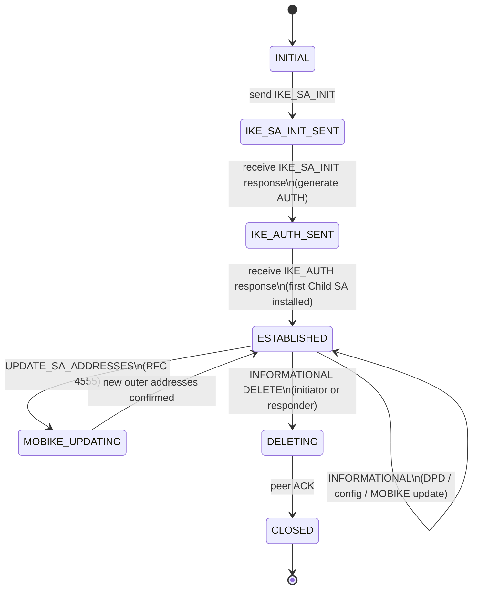

## # IPsec at Thirty: AH, ESP, IKEv1, and IKEv2 — A Deep Field Report (May 2026)

**TL;DR**

- IPsec is the only Internet-scale, network-layer cryptographic envelope that runs in carrier backhaul, enterprise gateways, and every modern OS today; its IKEv2 control plane (RFC 7296, October 2014) and ESP data plane (RFC 4303, December 2005) are the two pieces practitioners should standardize on, and as of May 2026 the post-quantum work in IETF IPSECME — RFC 8784 PPK (June 2020), RFC 9242 IKE_INTERMEDIATE (May 2022), RFC 9370 multiple key exchanges (May 2023), and `draft-ietf-ipsecme-ikev2-mlkem-05` (14 March 2026) — has made IPsec the first mainstream VPN with a real, deployable hybrid PQ story.
- WireGuard wins on simplicity, audit surface, and per-core throughput; IPsec wins on flexibility (any auth, any cipher, EAP/Kerberos/PKI, MOBIKE, NAT-T, EAP-AKA' for 3GPP), compliance, and ecosystem reach — and the practical answer is "WireGuard for greenfield self-hosted overlays, IPsec for everything where someone signs a contract."
- The protocol's two famous failures — Ferguson & Schneier's 2000 "too complex to be secure" review and the 2016 Equation Group / Shadow Brokers BENIGNCERTAIN dump that pulled IKEv1 PSKs and RSA keys out of Cisco PIX memory (CVE-2016-6415) — bracket the design tension that still drives the work: IPsec's flexibility is its strength in carrier/enterprise and its weakness against implementation bugs.

---

## Key Findings

1. **Lineage is unusually clean.** swIPe (Ioannidis & Blaze, with Karn's influence, 1993) → Atkinson's RFC 1825–1827 at the Naval Research Laboratory (August 1995) → the November 1998 RFC 2401–2409 family → the December 2005 RFC 4301–4309 family → IKEv2 consolidation as RFC 5996 (September 2010) and Internet Standard RFC 7296 (October 2014). Each generation removed options and tightened semantics, but never broke backward compatibility on the wire.
2. **IKEv1 is a liability.** Ferguson & Schneier's 1999 paper called the design "too complex to be secure" while reluctantly endorsing it as "the best IP security protocol available at the moment." Felsch et al. (USENIX Security 2018) then weaponized that complexity with cross-mode Bleichenbacher oracles against Cisco (CVE-2018-0131), Huawei (CVE-2017-17305), Clavister (CVE-2018-8753), and ZyXEL (CVE-2018-9129). The Shadow Brokers' BENIGNCERTAIN exploit (publicly disclosed mid-August 2016, fixed via Cisco advisory cisco-sa-20160916-ikev1, CVE-2016-6415) showed the NSA had been pulling VPN secrets out of PIX 6.x memory for years.
3. **IKEv2 is the modern default and is converging on PQ.** Charlie Kaufman, Paul Hoffman, Yoav Nir, Pasi Eronen, and Tero Kivinen are the authors of RFC 7296. The PQ track is now: RFC 8784 (mix a static PPK), RFC 9242 (IKE_INTERMEDIATE for large payloads), RFC 9370 (multiple key exchanges), and `draft-ietf-ipsecme-ikev2-mlkem-05` (published 14 March 2026, expires 15 September 2026), which registers ML-KEM-512/768/1024 in IKEv2 either standalone or as a hybrid `keX_` round after a classical (EC)DH.
4. **The Linux story is FreeS/WAN → Openswan → Libreswan / strongSwan.** strongSwan 6.0.0 (released 3 December 2024) is the first mainstream IKEv2 stack with native ML-KEM and RFC 9370 multi-KE support. Libreswan 5.2 (26 February 2025) added RFC 5723 Session Resumption, RFC 9347 IP-TFS, and `draft-ietf-ipsecme-ikev2-qr-alt-04` (PPK in the IKE_INTERMEDIATE exchange). Paul Wouters chairs IETF IPSECME and maintains Libreswan; Andreas Steffen built strongSwan at HSR (now OST).
5. **Carrier reality dwarfs everything else.** 3GPP TS 33.401 §11–12 (LTE) mandates IPsec ESP and IKEv2-cert authentication for S1/X2 backhaul (with the famous "trusted/physically protected" carve-out), and 3GPP TS 33.501 §9.2/§9.3/§9.4 (5G) makes IPsec ESP + IKEv2 certificate authentication mandatory-to-implement on the gNB and ng-eNB for N2, N3, and Xn. That is, in effect, every cellular base station in the world is an IPsec endpoint.

---

## Details

### 1. History and narrative arc

#### 1.1 Pre-history: SP3, swIPe, and Karn

The intellectual ancestor of IPsec is the U.S. government's **SP3** (Security Protocol 3), published by NSA/NIST in the late 1980s as part of the Secure Data Network System (SDNS). When the IETF began drafting an IP-layer security architecture in 1992–1993, swIPe — an experimental, user-space IP-security tunneling protocol authored by John Ioannidis and Matt Blaze with substantial influence from Phil Karn — was the working bridge between SP3 and what would become AH/ESP. Atkinson's RFC 1827 (August 1995) explicitly credits the lineage: "Many of the concepts here are derived from or were influenced by the US Government's SP3 security protocol specification, the ISO/IEC's NLSP specification, or from the proposed swIPe security protocol."

**Phil Karn (Qualcomm, 1991–retirement)** is the through-line. Karn joined Qualcomm in San Diego in 1991 after stints at Bell Labs (1979–1984) and Bellcore (1984–1991); his Geek of the Week interview with Carl Malamud in 1994 is the canonical primary-source statement of his thinking on layer-3 encryption: "[the IP Security Working Group] is focus­ing on a net­work lay­er secu­ri­ty pro­to­col that by def­i­n­i­tion would encrypt indi­vid­ual IP datagrams—encrypt and/or authen­ti­cate them … This would allow me to … set up a secu­ri­ty gate­way at a typ­i­cal com­pa­ny which has a fire­wall." Karn is named in the acknowledgments of RFC 1827 alongside Bill Simpson and Perry Metzger. He is separately famous for KA9Q (a DOS-era TCP/IP stack named for his amateur-radio callsign), for Karn's Algorithm for TCP RTT estimation, and for *Karn v. U.S. Department of State* (1994–1996), the encryption-export case that ruled the disk version of Bruce Schneier's *Applied Cryptography* was a "munition" while the printed book was protected speech.

**Whitfield Diffie**, NSA-era advocate for layer-3 encryption and co-inventor (with Martin Hellman) of public-key cryptography in 1976, spent the late 1980s and early 1990s arguing inside government and IETF circles that confidentiality belonged at the network layer, not in application kludges. His arguments, and the Clinton-era Clipper-chip backlash that he helped lead, are part of the reason IPsec exists at all.

#### 1.2 First generation: RFC 1825 (NRL, August 1995)

**Randall Atkinson** at the U.S. Naval Research Laboratory's Information Technology Division (Washington, DC) was the original architect. His four-RFC bundle — RFC 1825 (architecture), 1826 (AH), 1827 (ESP), 1828 (HMAC-MD5 for AH) — published August 1995, defined the IPsec data plane that has, in its essentials, never changed: AH for header-covering integrity, ESP for confidentiality (originally DES-CBC), Security Associations identified by an SPI, and an architectural separation between a Security Policy Database and a Security Association Database. The NRL implementation was the first interoperable code.

#### 1.3 Second generation: November 1998

The 1998 RFC 2401–2409 family was the first widely deployed version: RFC 2401 (architecture), RFC 2402 (AH), RFC 2406 (ESP), RFC 2407 (DOI), RFC 2408 (ISAKMP framing), and RFC 2409 (IKEv1). It is this generation that Ferguson & Schneier reviewed in 1999 and that Bellovin had criticized at USENIX Security in 1996 ("Problem Areas for the IP Security Protocols").

The verbatim Ferguson–Schneier wording matters because it is constantly misquoted:

> "In our opinion, IPsec is too complex to be secure. The design obviously tries to support many different situations with different options. We feel very strongly that the resulting system is well beyond the level of complexity that can be analysed or properly implemented with current methodologies."

and the often-omitted second half:

> "Even though the protocol is a disappointment—our primary complaint is with its complexity—it is the best IP security protocol available at the moment."

Their two headline recommendations — **eliminate Transport mode** and **eliminate the AH protocol** — were partially honored by the third-generation RFCs (AH was kept but deprecated in practice; ESP-NULL took over the integrity-only role).

#### 1.4 Third generation: December 2005 (RFC 4301 family)

The current IPsec architecture is **RFC 4301** (architecture), **RFC 4302** (AH), **RFC 4303** (ESP), **RFC 4306** (IKEv2 — Charlie Kaufman ed.), with the algorithmic siblings RFC 4307 (cryptographic algorithms for IKEv2), RFC 4308 (cryptographic suites), and RFC 4309 (AES-CCM for ESP). RFC 4301 explicitly introduces the modern SAD/SPD/PAD model and the rule that the same SPI/destination-IP/protocol triple uniquely identifies an SA.

#### 1.5 Consolidation: RFC 5996 → RFC 7296

**RFC 5996** (September 2010, Kaufman/Hoffman/Nir/Eronen/Kivinen) folded errata and clarifications into one document. **RFC 7296** (October 2014, same authors) advanced IKEv2 to **STD 79 — Internet Standard**, the final maturity level in the IETF. This is the document to read; everything since (RFC 7383 fragmentation, RFC 7427 signature auth, RFC 7619 null auth, RFC 7634 ChaCha20-Poly1305, RFC 7670 raw public keys, RFC 8229 IKE over TCP, RFC 8247 algorithm requirements, RFC 8784 PPK, RFC 9242 IKE_INTERMEDIATE, RFC 9347 IP-TFS, RFC 9370 multiple KE) is an extension to it.

#### 1.6 The Linux story: FreeS/WAN → Openswan → strongSwan / Libreswan

The **FreeS/WAN** project, funded by John Gilmore and project-managed by the late Hugh Daniel, was the political/technical effort to put strong, exportable IPsec into the Linux kernel during the U.S. crypto-export era. After Gilmore wound down funding, the project forked twice in 2003–2004: **Openswan** (led by Paul Wouters and Michael Richardson, among others) and **strongSwan** (Andreas Steffen at HSR, the Hochschule für Technik Rapperswil, now part of OST). A trademark dispute in December 2012 forced most of the Openswan developers to refork as **Libreswan**, which has been Paul Wouters' project ever since and which is the IPsec stack shipped in Red Hat Enterprise Linux and Fedora.

#### 1.7 BENIGNCERTAIN: the thriller (2016)

On **15 August 2016**, an entity calling itself **The Shadow Brokers** posted, then auctioned, a cache of hacking tools they claimed had been stolen from the **Equation Group** — widely attributed to NSA's Tailored Access Operations. Among the files was **BENIGNCERTAIN**, nicknamed *PIXPocket* by researcher Mustafa Al-Bassam, a three-binary toolchain (`bc-genpkt`, `bc-parser`, and a packet sender) that fired malformed IKEv1 packets at Cisco PIX firewalls and read configuration secrets back out of the device's RAM — including RSA private keys, IKE pre-shared keys, and IKEv2 VPN keys. Cisco PIX 5.2(9) through 6.3(4) were vulnerable; PIX 7.0+ were not. Cisco declared PIX itself end-of-life in 2009, but tens of thousands of devices were still in service.

Cisco's PSIRT investigation, triggered by the leak, then discovered a *related* memory-disclosure flaw in the IKEv1 packet-processing code of currently supported IOS, IOS XE, and IOS XR. That second vulnerability was published on 16 September 2016 as advisory **cisco-sa-20160916-ikev1**, with **CVE-2016-6415** assigned. The Cisco bulletin's exact root-cause language: "insufficient condition checks in the part of the code that handles IKEv1 security negotiation requests. An attacker could exploit this vulnerability by sending a crafted IKEv1 packet to an affected device configured to accept IKEv1 security negotiation requests." Cisco confirmed in-the-wild exploitation. There was no patch on disclosure; mitigation was IPS/IDS signatures. IKEv2 was not affected.

The take-away is precise: BENIGNCERTAIN itself was *not* CVE-2016-6415 — it was the older, unfixed PIX bug. CVE-2016-6415 is the closely related flaw Cisco found in still-supported products *because* the leak forced them to look.

#### 1.8 Felsch et al., USENIX Security 2018

Dennis Felsch, Martin Grothe, Jörg Schwenk (Ruhr-University Bochum) plus Adam Czubak and Marcin Szymanek (University of Opole), "The Dangers of Key Reuse: Practical Attacks on IPsec IKE," 27th USENIX Security Symposium, August 2018. The paper showed that reusing an RSA key pair across IKEv1 modes and between IKEv1 and IKEv2 enabled cross-protocol authentication bypass via a Bleichenbacher oracle on the IKEv1 PKE/RPKE encrypted-nonce modes. The disclosed CVE list: **CVE-2018-0131** (Cisco), **CVE-2017-17305** (Huawei), **CVE-2018-8753** (Clavister), **CVE-2018-9129** (ZyXEL). A separate offline dictionary attack on IKEv1 PSK aggressive mode was disclosed in the same paper.

#### 1.9 Recent past (2020–2024)

- **RFC 8784** (June 2020, Fluhrer/Kampanakis/McGrew/Smyslov) added a **Post-quantum Preshared Key (PPK)** that gets mixed into the IKEv2 key schedule after IKE_SA_INIT, making harvested ciphertext undecryptable later even if (EC)DH falls to Shor's algorithm. PPK has been deployed at sensitive carriers, governments, and on Cisco IOS XE, Palo Alto PAN-OS, strongSwan, and Libreswan.
- **RFC 9242** (May 2022, Smyslov) introduced **IKE_INTERMEDIATE**, an exchange after IKE_SA_INIT and before IKE_AUTH, specifically designed to carry large payloads (PQ public keys, ML-KEM ciphertexts) under IKE fragmentation (RFC 7383), which cannot be used during IKE_SA_INIT itself.
- **RFC 9370** (May 2023, Tjhai/Tomlinson/Bartlett/Fluhrer/Van Geest/Garcia-Morchon/Smyslov) defined the **Multiple Key Exchanges** framework: up to seven `keX_` rounds layered onto a single SA negotiation, with IKE_FOLLOWUP_KE for rekeys.
- **`draft-ietf-ipsecme-ikev2-mlkem-05`** by P. Kampanakis (AWS), published **14 March 2026**, expires 15 September 2026, "specifies how to use ML-KEM by itself or as an additional key exchange in IKEv2 along with a traditional key exchange." Sibling drafts include `draft-ietf-ipsecme-ikev2-pqc-auth-05` (16 October 2025, Reddy/Smyslov/Fluhrer) for ML-DSA and SLH-DSA signature auth, and `draft-wang-ipsecme-hybrid-kem-ikev2-frodo` for FrodoKEM hybrid.

#### 1.10 The WireGuard pressure (2017–2026)

**Jason A. Donenfeld**'s "WireGuard: Next Generation Kernel Network Tunnel" appeared at **NDSS 2017** (DOI: 10.14722/NDSS.2017.23160), explicitly framing itself as a replacement for IPsec "for most use cases." Donenfeld's argument is a code-size argument: WireGuard's Linux kernel implementation is "less than 4,000 lines of code" versus the slide-deck count of 116,730 LoC for the OpenVPN/Linux-XFRM/strongSwan/SoftEther stack (Donenfeld NDSS 2017 slides, p. 5). It uses NoiseIK, a single round-trip handshake, ChaCha20-Poly1305 AEAD, Curve25519 for ECDH, BLAKE2s, and an SSH-style `authorized_keys` model. Dowling & Paterson (ACNS 2018, eprint 2018/080) provided the first computational security proof; Lipp/Blanchet/Bhargavan (IEEE EuroS&P 2019) gave a mechanized one.

The fair, current verdict: WireGuard has eaten the **single-user, self-hosted, modern-OS** segment (Tailscale, every "personal mesh," every cloud-VM-to-cloud-VM tunnel for developers). IPsec retains everywhere a contract is signed: telco backhaul, enterprise SD-WAN, regulated-industry site-to-site, every major firewall vendor, every government certification regime, and every place EAP/Kerberos/X.509/RADIUS/SCEP are required.

### 2. Architecture (RFC 4301)

**Security Association (SA):** a one-way relationship between two endpoints, defined by the triple `(SPI, destination IP, protocol)`. Bidirectional traffic uses two SAs. An SA fixes the cryptographic suite, keys, lifetimes, and selectors.

**Security Association Database (SAD):** the in-kernel table of active SAs (inbound and outbound). On Linux: `ip xfrm state`.

**Security Policy Database (SPD):** the table the kernel consults *before* the SAD to decide whether to bypass, drop, or protect a packet, and which selectors to match. On Linux: `ip xfrm policy`.

**Security Parameter Index (SPI):** the 32-bit cookie the receiver uses to look up the right SA. The sender places it in the AH or ESP header; the IANA SPI registry starts user-allocated values at 256.

**Transport mode:** IPsec is inserted between the original IP header and the upper-layer payload; only the payload is protected. Host-to-host.

**Tunnel mode:** the entire original IP packet is encapsulated inside a new outer IP header; the inner packet is protected. Gateway-to-gateway and host-to-gateway. This is what every site-to-site VPN actually uses.

**Security Gateway:** a router or firewall that terminates IPsec on behalf of hosts behind it.

**IP Protocol numbers:** AH = **51**, ESP = **50** (IANA Protocol Numbers registry).

### 3. AH packet format (RFC 4302)

| Offset | Field | Width |
|---|---|---|
| 0 | Next Header | 8 bits |
| 1 | Payload Length | 8 bits |
| 2 | Reserved | 16 bits |
| 4 | SPI | 32 bits |
| 8 | Sequence Number | 32 bits |
| 12 | ICV (Integrity Check Value) | variable, must be 32-bit aligned |

AH authenticates **the immutable IP header bits** in addition to the payload, which is exactly why AH is incompatible with NAT — NAT rewrites the source IP, which then fails the ICV. This single property, combined with the rise of NAT in the late 1990s, is the operational reason almost no one runs AH today. RFC 4303 §3 explicitly notes that ESP with NULL encryption (RFC 2410) provides the integrity-only service AH originally offered, without breaking NAT.

### 4. ESP packet format (RFC 4303)

| Offset | Field | Width |
|---|---|---|
| 0 | SPI | 32 bits |
| 4 | Sequence Number | 32 bits |
| 8 | Payload Data + IV (per cipher) | variable |
| … | Padding | 0–255 bytes |
| … | Pad Length | 8 bits |
| … | Next Header | 8 bits |
| … | ICV | variable (cipher-dependent) |

**AEAD ciphers** collapse confidentiality and integrity into one primitive: AES-GCM-128 / AES-GCM-256 (RFC 4106), AES-CCM (RFC 4309), ChaCha20-Poly1305 (RFC 7634, August 2015). With AEAD, the ICV is the AEAD tag.

**Extended Sequence Number (ESN):** a 64-bit logical sequence number (only the low 32 bits go on the wire), required for 10 Gbps+ links so the counter does not wrap before rekey.

**Anti-replay window:** a sliding bitmap of recently seen sequence numbers. RFC 4303 §3.4.3 requires the window to be ≥ 32, recommends 64, and notes that on high-throughput parallel links the default is "often too small" — Linux's `xfrm` default of 32 routinely needs to be raised to 1024 or higher (`replay-window 1024`).

### 5. IKEv1 (concise, with prejudice)

IKEv1 has **Phase 1** (set up the ISAKMP/IKE SA) in either **Main Mode** (6 messages, identity-protected) or **Aggressive Mode** (3 messages, identity exposed and PSK hash sent in the clear — this is what Felsch et al. dictionary-attacked), and **Phase 2 Quick Mode** (3 messages, sets up Child/IPsec SAs). The protocol framing is **ISAKMP** (RFC 2408), the IPsec-specific domain-of-interpretation is the **IPsec DOI** (RFC 2407), and the IKE specification itself is **RFC 2409**.

It is byzantine because the framing (ISAKMP), the interpretation (DOI), and the protocol (IKE) are three separate documents that each define overlapping payload structures, and because Phase-1 has eight distinct authentication-method × mode combinations (PSK, RSA-sig, RSA-encrypted-nonce, revised RSA-encrypted-nonce × Main, Aggressive). It still runs on millions of devices because every site-to-site VPN configuration written between 1999 and ~2012 was IKEv1 and many were never re-touched.

### 6. IKEv2 (deep, RFC 7296)

#### 6.1 Four exchange types

1. **IKE_SA_INIT** — two messages (initiator → responder, responder → initiator). Negotiates the IKE SA crypto suite, performs (EC)DH, exchanges nonces, optionally detects NAT.
2. **IKE_AUTH** — two messages, encrypted under SK_e/SK_a derived from IKE_SA_INIT. Carries IDi, IDr, optional CERT/CERTREQ, AUTH (PSK, RSA, ECDSA, EAP, or null-auth per RFC 7619), the SA proposal for the first Child SA, and TSi/TSr traffic selectors.
3. **CREATE_CHILD_SA** — used for rekeying the IKE SA, creating additional Child SAs, and rekeying Child SAs. Optional new (EC)DH for PFS.
4. **INFORMATIONAL** — DELETE, NOTIFY, CONFIGURATION, dead-peer detection (DPD), MOBIKE updates.

#### 6.2 Message header

| Offset | Field | Width |
|---|---|---|
| 0 | IKE SA Initiator SPI | 64 bits |
| 8 | IKE SA Responder SPI | 64 bits |
| 16 | Next Payload | 8 bits |
| 17 | Version (Major 4b + Minor 4b) | 8 bits |
| 18 | Exchange Type | 8 bits |
| 19 | Flags (R, V, I + reserved) | 8 bits |
| 20 | Message ID | 32 bits |
| 24 | Length | 32 bits |

All payloads chain off Next Payload: SA(33), KE(34), Nonce(40), IDi(35)/IDr(36), CERT(37), CERTREQ(38), AUTH(39), TSi(44)/TSr(45), Encrypted-and-Authenticated SK(46), Notify(41), CP(47), EAP(48), IKE_INTERMEDIATE(43) per RFC 9242.

#### 6.3 Diffie-Hellman / ECDH / KEM groups (selected)

| Group | Algorithm | Source |
|---|---|---|
| 2 | MODP-1024 | RFC 2409 — **do not use** |
| 5 | MODP-1536 | RFC 3526 — **avoid** |
| 14 | MODP-2048 | RFC 3526 — current minimum |
| 19 | NIST P-256 | RFC 5903 |
| 20 | NIST P-384 | RFC 5903 |
| 21 | NIST P-521 | RFC 5903 |
| 31 | X25519 (Curve25519) | RFC 8031 |
| 32 | X448 | RFC 8031 |
| TBD (35/36/37) | ML-KEM-512/768/1024 | `draft-ietf-ipsecme-ikev2-mlkem-05`, 14 Mar 2026 |

#### 6.4 AUTH methods

PSK (value 2), RSA digital signature (value 1, deprecated by RFC 7427), DSS (value 3), ECDSA-P-256/384/521 (values 9/10/11), **Generic Digital Signature** (value 14, RFC 7427) — the modern catch-all that encodes the signature algorithm in an `AlgorithmIdentifier`, **null auth** (RFC 7619, value 13) for opportunistic encryption, **EAP** for usernames/passwords/SIM/AKA, and **GSS-API** / Kerberos (RFC 4754 covers ECDSA; Kerberos via EAP-GSSAPI is the practical path).

#### 6.5 Practical extensions

- **NAT-T (RFC 3947 / RFC 3948):** detect NAT in IKE_SA_INIT via `NAT_DETECTION_SOURCE_IP` / `NAT_DETECTION_DESTINATION_IP` notifies; if found, move the IKE exchange and wrap ESP in UDP on port **4500**, with a single non-IKE marker byte (`0x00 0x00 0x00 0x00`) distinguishing IKE from ESP on the same port.
- **MOBIKE (RFC 4555):** lets a mobile endpoint change its outer IP without rekeying — the canonical "Wi-Fi to LTE handoff" feature for IKEv2 client VPNs.
- **IKEv2 fragmentation (RFC 7383):** application-layer fragmentation of IKE messages so a 4 KB AUTH payload doesn't induce IP fragmentation (which middleboxes drop).
- **IKEv2 over TCP (RFC 8229, August 2017):** wraps IKE and ESP in TCP for hostile firewalls (captive Wi-Fi, hotel networks).
- **IKE_INTERMEDIATE (RFC 9242, May 2022):** an authenticated exchange between IKE_SA_INIT and IKE_AUTH, fragmentable, used to carry large PQ public keys.

### 7. Famous incidents

| Year | Incident | Root cause | Citation |
|---|---|---|---|
| 1999 | Bellovin/Ferguson/Schneier critique | Design complexity, ambiguous specs | Ferguson & Schneier 1999/2003, Schneier on Security |
| 2016 | BENIGNCERTAIN / Shadow Brokers / Cisco PIX | Memory disclosure via malformed IKEv1 packet to PIX 6.x; closely related CVE-2016-6415 in IOS/IOS XE/IOS XR | Cisco advisory cisco-sa-20160916-ikev1 |
| 2018 | Felsch et al. — Bleichenbacher on IKEv1 PKE/RPKE; cross-protocol to IKEv2 RSA-sig | RSA key reuse across modes, no oracle hardening | USENIX Security 2018, CVE-2018-0131, CVE-2017-17305, CVE-2018-8753, CVE-2018-9129 |
| 2021 | strongSwan EAP authentication bypass | OCSP/CRL handling regression in 5.9.4 | CVE-2021-45079, strongSwan advisory |
| 2023 | strongSwan TLS-based EAP authentication bypass + UAF | `tls_find_public_key()` returned a non-NULL pointer for untrusted certs after a 2022 optimization; reference-count error caused dereference of expired pointer | CVE-2023-26463, strongSwan blog 2 March 2023 |

### 8. Pioneers (verifiable)

- **Phil Karn** — Qualcomm staff engineer 1991–retirement; named in RFC 1827 acknowledgments; KA9Q; Karn's Algorithm; *Karn v. State Department* (1994–1996) on crypto export.
- **Steve Bellovin** — AT&T Bell Labs → Columbia University; "Problem Areas for the IP Security Protocols," USENIX UNIX Security Symposium VI, San Jose, July 1996; named in RFC 1827 acknowledgments.
- **Whitfield Diffie** — Stanford → Sun Microsystems; co-inventor of public-key cryptography (1976, with Hellman); long-standing advocate of network-layer encryption.
- **Randall Atkinson** — Naval Research Laboratory; author of RFC 1825 / 1826 / 1827 (August 1995); first interoperable NRL implementation.
- **Hugo Krawczyk** — IBM T.J. Watson Research Center; designed **SIGMA** ("Sign-and-MAc"), the authentication structure underlying IKEv2; author of RFC 5869 (HKDF) used in IKEv2's key derivation.
- **Charlie Kaufman** — Microsoft (and Lotus before); editor of RFC 4306 and lead author of RFC 5996 and RFC 7296 — i.e., IKEv2 itself.
- **Tero Kivinen** — SSH Communications Security → AuthenTec → INSIDE Secure (Eerikinkatu 28, Helsinki); RFC editor on IKEv2 since at least RFC 4434 (2006) through RFC 7296 (2014), RFC 7427, RFC 7670, RFC 6467, RFC 7815; that is a ~20-year tenure as IKEv2's institutional memory.
- **Paul Wouters** — Libreswan maintainer (Red Hat → Aiven Senior Security Architect); IETF IPSECME co-chair and current Security Area Director (second term); ~25 years on IKE/IPsec; named on draft-ietf-ipsecme-labeled-ipsec, RFC 7670, and many others.
- **Andreas Steffen** — HSR / OST Eastern Switzerland University of Applied Sciences; founder and lead of strongSwan; presenter at every Linux Plumbers/IETF on IKEv2.
- **Yoav Nir** — Check Point → Dell; named on RFC 5996, RFC 7296, RFC 7634 (ChaCha20-Poly1305 for IPsec), and many others.
- **Reyk Floeter** — OpenBSD; author of `iked(8)`, a clean-room IKEv2 implementation that has shipped in OpenBSD since 4.8 (2010), specifically designed as a small, audit-friendly alternative to isakmpd/strongSwan.
- **Cheryl Madson** — Cisco; co-author of RFC 2403/2404 (HMAC-MD5/SHA-1 for AH/ESP) and several other IPsec algorithm RFCs.
- **Naganand Doraswamy** — co-author with Dan Harkins of *IPSec: The New Security Standard for the Internet, Intranets, and Virtual Private Networks* (Prentice Hall PTR, 1st ed. 1999, 2nd ed. 2003), the canonical practitioner book.

### 9. Real-world deployments

| Deployment | Stack | Scale / SKU | Source |
|---|---|---|---|
| **3GPP LTE backhaul (S1, X2)** | IPsec ESP + IKEv2 cert auth (TS 33.401 §11–12) | Effectively every cellular carrier worldwide; billions of subscribers; LTE 2010– | 3GPP TS 33.401; NIST SP 800-187 |
| **3GPP 5G (N2, N3, Xn, F1, E1)** | IPsec ESP + IKEv2 cert auth, MANDATORY-to-implement on gNB/ng-eNB (TS 33.501 §9) | All 5G gNBs globally, Release 15 (2018) → Release 18 (2023, "5G-Advanced") → Release 19 (in progress 2025–2026) | ETSI TS 133 501 V18.9.0 (April 2025) |
| **AWS Site-to-Site VPN** | IKEv2/ESP; Standard tunnel 1.25 Gbps; **Large Bandwidth tunnel 5 Gbps**, GA 2024 | Standard $0.05/hr/connection; 5 Gbps $0.60/hr/connection; ECMP across tunnels for higher aggregate (us-east-2 pricing as of May 2026) | aws.amazon.com/vpn/pricing |
| **Azure VPN Gateway** | IKEv2/ESP; SKUs VpnGw1AZ → VpnGw5AZ | 650 Mbps (VpnGw1AZ) → 10 Gbps aggregate (VpnGw5AZ); GCMAES256 fastest; AES256/SHA256 medium; 3DES/SHA256 lowest. Standard/HighPerf legacy SKUs deprecated 30 June 2026; auto-migration to AZ SKUs September 2025–September 2026 | learn.microsoft.com/azure/vpn-gateway |
| **GCP Cloud VPN** | IKEv2 with ESP, Classic and HA VPN variants; HA VPN provides 99.99% SLA with per-tunnel 3 Gbps each direction up to 10 Gbps aggregate | Per Google Cloud documentation |
| **strongSwan** | Linux reference IKEv2 daemon (`charon`); 6.0.0 released 3 December 2024 with ML-KEM and RFC 9370 multi-KE | Used by every major Linux distro plus OPNsense/pfSense/Sophos/NetApp embedded | strongswan.org/blog/2024/12/03 |
| **Libreswan** | Linux/BSD; 5.2 released 26 February 2025 with IPTFS, RFC 5723 session resumption, qr-alt | Ships in Red Hat Enterprise Linux, Fedora, CentOS, AlmaLinux, Rocky | github.com/libreswan/libreswan |
| **OpenBSD `iked(8)`** | Reyk Floeter clean-room IKEv2 | Default OpenBSD VPN stack since 4.8 (2010) | OpenBSD `iked(8)` man page |
| **Apple iOS/macOS native IKEv2** | Built-in client since iOS 9 (2015) / macOS 10.11 | Hundreds of millions of devices; cert-, EAP-, and PSK-auth | Apple Configurator profile reference |
| **Microsoft Always-On VPN** | IKEv2/IPsec (also SSTP fallback) | Windows 10/11 enterprise; integrates AD, MFA, conditional access | learn.microsoft.com |
| **Cisco ASA / Firepower / IOS / IOS XE / IOS XR** | IKEv1 + IKEv2; FlexVPN, DMVPN, GETVPN; SKIP for PQ PPK | Enterprise default; PQ PPK GA in IOS XE 17.x | cisco.com |
| **Juniper SRX / Junos** | IKEv1/IKEv2; route-based VPN; AutoVPN | Carrier and enterprise edge | juniper.net |
| **Fortinet FortiGate** | IKEv1/IKEv2; ADVPN; SD-WAN overlays | One of the two top firewall units shipped 2024–2025 (with Palo Alto) | fortinet.com |
| **OPNsense / pfSense** | strongSwan backend + BSD `ipfw`/`pf` | Two leading open-source firewall distros | opnsense.org / netgate.com |

### 10. Adjacent-protocol comparisons

#### 10.1 IPsec vs WireGuard (headline)

| Axis | IPsec (IKEv2 + ESP) | WireGuard |
|---|---|---|
| Code size (Linux kernel side) | XFRM + strongSwan: >100 kLOC | <4,000 LOC kernel module |
| Auth | PSK, RSA, ECDSA, EdDSA, EAP (TLS/MSCHAPv2/AKA), GSS-API, null | Curve25519 static public key (SSH-style) |
| Crypto agility | Full negotiation, AES-GCM, ChaCha20-Poly1305, ML-KEM (2024–2026) | Fixed suite: ChaCha20-Poly1305 + Curve25519 + BLAKE2s |
| Handshake | 2 round-trips (IKE_SA_INIT + IKE_AUTH); extensions for PQ | 1 round-trip NoiseIK |
| Roaming | MOBIKE (RFC 4555) | Native: peer endpoint follows source IP/port |
| NAT-T | UDP/4500 with non-IKE marker | UDP-only by design |
| Carrier/enterprise reach | Mandatory in 3GPP, every firewall vendor | Tailscale, mesh overlays, personal VPNs |
| Audit surface | Very large | Very small |
| PQ readiness in 2026 | Production-deployed (RFC 8784 PPK; ML-KEM hybrid in strongSwan 6.0+) | Experimental (Rosenpass) |

The honest take: WireGuard's 4 kLOC code-size is real, and Donenfeld's design choice to remove cryptographic negotiation is the entire reason WireGuard escapes the class of attacks that have hit IPsec since 1998. But "no negotiation" is exactly what makes WireGuard unusable in places where a regulator, a 3GPP TS, or an enterprise PKI says "use this cipher with these certs from this CA." IPsec wins those by definition.

#### 10.2 IPsec vs TLS-VPN (secondary)

TLS wraps a single bytestream; IPsec wraps packets. That is the whole comparison. TLS-VPN (OpenVPN over TLS, Cisco AnyConnect over DTLS, SSTP) exists because TLS goes through any 443-permitting firewall and any captive portal — at the cost of head-of-line blocking when run over TCP, and of having to re-implement IP fragmentation/MTU above the bytestream. RFC 8229 (IKE/ESP over TCP) is IPsec's answer.

#### 10.3 Others

- **GRE-over-IPsec:** the classic Cisco pattern — GRE encapsulates a multicast/routing-capable tunnel, IPsec encrypts it. Used to carry OSPF/EIGRP/BGP between sites where pure IPsec tunnel mode (which is unicast and selector-bound) cannot.
- **QUIC / MASQUE:** drafts in IPSECME and MASQUE WGs explore IPsec-style packet protection over QUIC streams. The motivation is identical to RFC 8229: bypass UDP-hostile networks, plus get QUIC's multipath and connection-migration features.
- **IPv6:** IPsec was originally mandated by RFC 2460 for IPv6, then explicitly relaxed by **RFC 6434** (December 2011), which made IPsec a SHOULD rather than a MUST. AH and ESP are extension headers (next-header 51 and 50) that follow the IPv6 header chain.
- **Kerberos / GSS-API:** RFC 4754 (ECDSA) and EAP-GSSAPI are the two paths to put Kerberos auth into IKEv2.

### 11. Practical wisdom (tuning)

1. **DH/ECDH group choice.** Minimum **group 14** (MODP-2048); strongly prefer **group 19/20** (NIST P-256/P-384) or **group 31** (X25519). Disable groups 1, 2, 5 outright. For PQ readiness, configure strongSwan 6.0+ with `aes256gcm16-prfsha384-ecp384-ke1_mlkem768` so the first KE is X25519/P-384 and `ke1_` is ML-KEM-768.
2. **AEAD cipher choice.** Default to **AES-GCM-128** (`aes128gcm16`) for hardware AES-NI; switch to **ChaCha20-Poly1305** (`chacha20poly1305`) on devices without AES-NI (legacy mobile, low-end edge routers) — RFC 7634.
3. **IKE fragmentation (RFC 7383) vs IP fragmentation.** Enable `fragmentation=yes` (strongSwan) / `ikev2-fragmentation=yes` (Libreswan). Without it, a large IKE_AUTH (multi-cert PKI, EAP-TLS) will be IP-fragmented and dropped by the next stateful firewall.
4. **PMTUD and tunnel MTU.** Tunnel-mode ESP adds 20 (outer IP) + 8 (UDP NAT-T, if used) + 4 (SPI) + 4 (seqno) + 2 (pad/next-header) + 16 (AES-GCM tag) ≈ **54–80 bytes** of overhead. Standard practice: clamp inner MSS to **1400** (`iptables -t mangle -A FORWARD -p tcp --tcp-flags SYN,RST SYN -j TCPMSS --clamp-mss-to-pmtu`) or set the tunnel interface MTU to 1400. Path-MTU black-holes (ICMP "fragmentation needed" dropped by an upstream firewall) are the single most common "tunnel up but not forwarding" cause.
5. **NAT-T detection.** If `udp.port == 500` flows but `udp.port == 4500` does not, you are usually behind a NAT that mangled the IKE source port but a firewall blocks 4500. Force `forceencaps=yes` (strongSwan/Libreswan) for client-side roadwarriors.
6. **Anti-replay window sizing.** Default 32 (Linux `xfrm`) is too small for 10 Gbps+ flows with parallel queues; bump to `replay-window 1024` (Libreswan/strongSwan) or enable ESN.
7. **Rekey timing.** Soft lifetime should fire well before hard lifetime. Common: `ike-lifetime=4h`, `salifetime=1h`, `rekey-margin=9m`, `rekey-fuzz=100%`.
8. **DPD (Dead Peer Detection).** R_U_THERE every 30 s, declare dead after 4 failures = 120 s. RFC 3706 for IKEv1; in IKEv2 just an empty INFORMATIONAL.
9. **MOBIKE.** Enable for any roadwarrior on mobile; survives Wi-Fi/LTE handoff without renegotiation.
10. **IKE over TCP (RFC 8229).** Set `port=4500/tcp` (strongSwan) for hostile-firewall fallback.
11. **Operational commands.**
    - `swanctl --list-sas` (strongSwan), `ipsec status` (Libreswan)
    - `ip xfrm state`, `ip xfrm policy` (Linux)
    - `tcpdump -ni eth0 'udp port 500 or udp port 4500 or proto 50 or proto 51'`

### 12. Wireshark filters and ESP decryption

- `isakmp` — all IKEv1 and IKEv2 frames
- `esp` — all ESP frames
- `udp.port == 500 || udp.port == 4500` — IKE and NAT-T-encapsulated ESP
- `isakmp.exchangetype == 34` — IKE_SA_INIT only
- `isakmp.exchangetype == 35` — IKE_AUTH only

**ESP decryption.** Edit → Preferences → Protocols → ESP → "ESP SAs" → Edit. For each direction add: Protocol (IPv4/IPv6), Src/Dst IP, SPI (hex `0x…`), Encryption algorithm, Encryption key (hex), Authentication algorithm, Authentication key (hex). Keys come from `ip xfrm state` (Linux) or `vppctl show ipsec sa` (VPP). For IKEv2 itself, set "IKEv2 Decryption Table" with the SK_ei/SK_er/SK_ai/SK_ar values from your charon log (`charon.log` at `log-level 4`).

### 13. Recent changes 2024–2026 (dated)

| Date | Change | Source |
|---|---|---|
| 13 August 2024 | NIST publishes FIPS 203 (ML-KEM) | NIST FIPS 203 |
| 3 December 2024 | **strongSwan 6.0.0** released with ML-KEM-512/768/1024 (via Botan 3.6.0+, wolfSSL 5.7.4+, AWS-LC 1.37.0+, new `ml` plugin) and full RFC 9370 multi-KE | strongswan.org/blog/2024/12/03 |
| 26 February 2025 | **Libreswan 5.2** released with RFC 5723 IKE_SESSION_RESUME, RFC 9347 IP-TFS, draft-ietf-ipsecme-ikev2-qr-alt PPK-in-INTERMEDIATE | github.com/libreswan/libreswan/releases |
| 29 April 2025 | `draft-ietf-ipsecme-ikev2-mlkem-00` adopted by IPSECME | IETF datatracker |
| 16 October 2025 | `draft-ietf-ipsecme-ikev2-pqc-auth-05` (ML-DSA/SLH-DSA for IKEv2 auth) | IETF datatracker |
| 6 October 2025 | `draft-ietf-ipsecme-ikev2-reliable-transport-00` (separate transports for IKE and ESP) | IETF datatracker |
| 14 March 2026 | `draft-ietf-ipsecme-ikev2-mlkem-05` published; standalone or hybrid ML-KEM in IKEv2 | datatracker.ietf.org/doc/draft-ietf-ipsecme-ikev2-mlkem |
| 18 January 2026 | IPSECME WG adoption call concludes on `draft-wang-ipsecme-hybrid-kem-ikev2-frodo-03` (FrodoKEM hybrid) | ipsec@ietf.org mail-archive |
| ongoing 2025–2026 | Palo Alto PAN-OS, Cisco IOS XE 17.x, Juniper Junos all ship RFC 8784 PPK in production | vendor docs |

### 14. The 2025–2026 frontier

The agenda for IETF IPSECME (https://datatracker.ietf.org/wg/ipsecme/) in 2026 is dominated by post-quantum work and a smaller set of operational improvements:

- **ML-KEM in IKEv2** (`draft-ietf-ipsecme-ikev2-mlkem`, Kampanakis/AWS, v05 March 2026) — standalone or hybrid; uses RFC 9242 IKE_INTERMEDIATE to carry the >1 KB public keys and >1 KB ciphertexts under IKE fragmentation.
- **ML-DSA / SLH-DSA auth** (`draft-ietf-ipsecme-ikev2-pqc-auth`, Reddy/Smyslov/Fluhrer) — post-quantum signature methods registered as IKEv2 AUTH method values.
- **FrodoKEM hybrid** (`draft-wang-ipsecme-hybrid-kem-ikev2-frodo`) — conservative-lattice alternative for those who do not want to bet only on module-lattices.
- **PPK in IKE_INTERMEDIATE** (`draft-ietf-ipsecme-ikev2-qr-alt`, Smyslov) — moves RFC 8784's PPK mixing from IKE_AUTH up to IKE_INTERMEDIATE so the initial IKE SA itself becomes quantum-resistant, not only Child SAs.
- **Group key management** (`draft-ietf-ipsecme-g-ikev2`) — multicast/group VPN successor to GDOI.
- **IPsec-over-QUIC** drafts (overlapping with MASQUE) explore wrapping ESP inside QUIC streams for multipath and connection migration; motivation is identical to RFC 8229 but with QUIC's better congestion control and faster handshake.
- **3GPP Release 18 ("5G-Advanced") and Release 19** — ETSI TS 133 501 v18.9.0 (April 2025) continues to require IPsec ESP+IKEv2-cert as mandatory-to-implement on N2/N3/Xn/F1/E1; PQ profiles are under SA3 study.

---

## Recommendations

**For greenfield, self-hosted, single-team overlays (laptops, dev VMs):** use **WireGuard**. It is a smaller blast radius, no negotiation surface, and the security-proof literature (Donenfeld 2017, Dowling & Paterson 2018, Lipp/Blanchet/Bhargavan 2019) is unusually strong. Switch to IPsec only if you need EAP, PKI, or regulatory checkboxes.

**For site-to-site between two organizations, two clouds, or a branch and HQ:** **IKEv2 + ESP, tunnel mode, AES-GCM-128 or -256, group 19/20/31, IKE fragmentation enabled, MOBIKE on, anti-replay window 1024, soft lifetime ~1 h, DPD ~30 s.** If both ends control software, add `ke1_mlkem768` for harvest-now-decrypt-later protection. **Disable IKEv1 entirely** unless you have a hard requirement from a peer you cannot influence.

**For roadwarrior client VPNs:** **IKEv2 with EAP-TLS** (cert on device) or **EAP-MSCHAPv2** behind a RADIUS server, MOBIKE on, IKE-over-TCP fallback (RFC 8229), forced NAT-T encapsulation (`forceencaps=yes`). On Apple/Microsoft platforms this is native; on Linux/Android, use the strongSwan client. Push out PQ PPK (RFC 8784) for sensitive deployments now; this is the lowest-risk PQ step because it is purely additive.

**For carrier or telco-adjacent work:** you have no choice. **3GPP TS 33.501 §9 mandates IPsec ESP + IKEv2 certificate auth** on N2 (gNB↔AMF), N3 (gNB↔UPF), Xn (gNB↔gNB), and F1/E1 (CU↔DU). Follow the certificate profile in TS 33.310. Plan PQ migration around RFC 8784 PPK first (zero wire impact) and ML-KEM-hybrid (`draft-ietf-ipsecme-ikev2-mlkem`) once both peers ship it — expected late 2026 in major vendors based on current draft velocity.

**Decision thresholds that should change the above:**

- If you must support IKEv1-only peers → keep IKEv1 but disable Aggressive Mode and use cert auth, never PSK with Aggressive Mode (Felsch 2018 dictionary attack).
- If throughput per tunnel must exceed ~1.25 Gbps on AWS → use AWS Site-to-Site VPN's **Large Bandwidth tunnel** (5 Gbps, $0.60/hr) plus ECMP.
- If your peer set is small, all modern, and all under your control → drop IPsec for WireGuard and accept the loss of crypto-agility.
- If a Cryptographically Relevant Quantum Computer (CRQC) becomes more credible → flip from "PPK is enough" to "must do ML-KEM hybrid" and rekey all long-lived Child SAs.

---

## Caveats and known limitations of this report

- **Pricing data** for AWS, Azure, and GCP VPN services reflects May 2026 published rates; SKU consolidation on Azure (legacy VpnGw1–5 → VpnGw1AZ–5AZ) is in progress through September 2026, so prices for legacy SKUs are migration-window prices.
- **Draft status** for ML-KEM in IKEv2 is `draft-ietf-ipsecme-ikev2-mlkem-05` (14 March 2026); the IANA code points for the new ML-KEM group numbers are still pending allocation as of writing, so concrete numeric group IDs in vendor implementations may shift before the RFC is published.
- The Ferguson–Schneier paper exists in two editions (an "in press" 1999 version and a December 2003 reissue from Schneier's site); the substantive content is the same, but page numbers differ between them. Quotes in this report are from the canonical PDF hosted at schneier.com.
- **Code-size comparisons** (4 kLOC WireGuard vs ~116 kLOC for the IPsec stack) are from Donenfeld's own 2017 NDSS slides; they are widely cited but are an apples-to-oranges count (WireGuard kernel module only vs full XFRM + strongSwan + OpenSSL).
- **BENIGNCERTAIN ↔ CVE-2016-6415 attribution.** Press coverage in August–September 2016 conflated these; the precise relationship per Cisco is that BENIGNCERTAIN was an unfixed PIX 6.x bug, and CVE-2016-6415 was a separate but related flaw Cisco discovered in current IOS/IOS XE/IOS XR products *while investigating* the leak.
- Several pioneer affiliations are time-dependent: Kivinen has been at SSH → AuthenTec → INSIDE Secure across his RFC tenure; Wouters has been at Xelerance → Red Hat → Aiven. Affiliations listed are the ones on the most recent IETF documents.

---

## # Appendix A — Structured-Data Extracts &nbsp; / &nbsp; Appendix B — Simulator

## A.1 Protocol record candidate

```ts
const ipsec: Protocol = {
  id: "ipsec",
  name: "Internet Protocol Security",
  abbreviation: "IPsec",
  categoryId: "vpn-tunneling", // proposed; see A.23
  port: "UDP/500 (IKE), UDP/4500 (NAT-T), IP proto 50 (ESP), IP proto 51 (AH), TCP/4500 (RFC 8229)",
  year: 1995,
  rfc: ["RFC 4301", "RFC 4302", "RFC 4303", "RFC 7296", "RFC 8784", "RFC 9242", "RFC 9370"],
  standardsBody: "IETF IPSECME WG",
  oneLiner: "Layer-3 cryptographic envelope for IP packets — the network-layer VPN of carriers, enterprises, and every modern OS.",
  overview: `IPsec is the IETF's network-layer security architecture. AH (RFC 4302) provides
integrity for IP headers and payloads; ESP (RFC 4303) provides confidentiality and integrity for
payloads. IKEv2 (RFC 7296) is the modern key-management protocol that negotiates the
cryptographic suite and establishes the Security Associations the data plane uses. IPsec is
mandatory in 3GPP LTE/5G backhaul and is the default site-to-site VPN of every major firewall
vendor.`,
  howItWorks: `Two peers run IKE_SA_INIT (DH/ECDH/ML-KEM, nonces, NAT detection), then IKE_AUTH
(identities, certificates or PSK or EAP, traffic selectors, first Child SA). Each Child SA is one
ESP Security Association keyed from the IKE-derived KEYMAT. Data packets are then framed with an
ESP header (SPI + sequence number), AEAD-encrypted and authenticated, and forwarded — typically
tunnel-mode, where the original IP packet is encapsulated inside a new outer IP header between
two security gateways.`,
  useCases: [
    "3GPP LTE S1/X2 and 5G N2/N3/Xn/F1/E1 backhaul",
    "Enterprise site-to-site VPN between firewalls",
    "Roadwarrior remote access (Apple, Microsoft Always-On, strongSwan client)",
    "Cloud site-to-site (AWS, Azure, GCP)",
    "GRE-over-IPsec for routing-protocol-carrying tunnels",
    "Opportunistic encryption between cooperating networks (null-auth)"
  ],
  performance: {
    aesGcm128SwUpperBound: "single-core ~3-6 Gbps on x86-64 with AES-NI",
    aesGcm128HwAccel: "40-100 Gbps on dedicated crypto NICs",
    awsLargeTunnel: "5 Gbps per tunnel; ECMP-aggregable",
    azureVpnGw5AZ: "10 Gbps aggregate"
  },
  connections: ["wireguard", "tls", "gre", "udp", "tcp", "quic", "ipv6", "ospf", "bgp", "kerberos"],
  links: {
    rfc7296: "https://www.rfc-editor.org/rfc/rfc7296.html",
    rfc4303: "https://www.rfc-editor.org/rfc/rfc4303.html",
    ipsecme: "https://datatracker.ietf.org/wg/ipsecme/",
    strongswan: "https://strongswan.org",
    libreswan: "https://libreswan.org",
    iked: "https://man.openbsd.org/iked"
  },
  image: "/img/protocols/ipsec-stack.svg"
};
```

## A.2 Header / wire-format layouts

### ESP (RFC 4303)

| Bits | Field |
|---|---|
| 0–31 | SPI (32) |
| 32–63 | Sequence Number (32) — low half of ESN |
| 64–… | Payload Data + IV/Nonce (variable, cipher-defined) |
| … | Padding (0–255 octets) |
| … | Pad Length (8) |
| … | Next Header (8) |
| … | Integrity Check Value / AEAD tag (variable; 16 octets for AES-GCM-128) |

### AH (RFC 4302)

| Bits | Field |
|---|---|
| 0–7 | Next Header (8) |
| 8–15 | Payload Length (8) |
| 16–31 | Reserved (16) |
| 32–63 | SPI (32) |
| 64–95 | Sequence Number (32) |
| 96–… | ICV (variable, must be a multiple of 32 bits) |

### IKEv2 message header (RFC 7296)

| Bits | Field |
|---|---|
| 0–63 | IKE SA Initiator SPI (64) |
| 64–127 | IKE SA Responder SPI (64) |
| 128–135 | Next Payload (8) |
| 136–143 | Version: MjVer=2 (4), MnVer=0 (4) |
| 144–151 | Exchange Type (8): 34=IKE_SA_INIT, 35=IKE_AUTH, 36=CREATE_CHILD_SA, 37=INFORMATIONAL, 43=IKE_INTERMEDIATE (RFC 9242) |
| 152–159 | Flags (8): R, V, I + reserved |
| 160–191 | Message ID (32) |
| 192–223 | Length (32) |

## A.3 IKEv2 SA state machine (mermaid)



## A.4 Code examples

### A.4.1 Python / Scapy: hand-crafted IKE_SA_INIT

```python
from scapy.all import IP, UDP, send, Raw
from scapy.contrib.ikev2 import (
    IKEv2, IKEv2_payload_SA, IKEv2_payload_Proposal,
    IKEv2_payload_Transform, IKEv2_payload_KE, IKEv2_payload_Nonce, IKEv2_payload_Notify
)
import os

# Minimal IKE_SA_INIT initiator (group 19 = NIST P-256, AES-GCM-128, PRF-HMAC-SHA-256)
init_spi = os.urandom(8)
nonce = os.urandom(32)
# In real code you'd compute a real P-256 public point; here we send a 64-byte stub.
ke_bytes = os.urandom(64)

ike = IKEv2(init_SPI=init_spi, next_payload="SA", exch_type=34, flags="Initiator",
            id=0)
sa = IKEv2_payload_SA(next_payload="KE", prop=[
    IKEv2_payload_Proposal(proposal=1, proto="IKEv2", trans_nb=4, trans=[
        IKEv2_payload_Transform(transform_type="Encryption", transform_id="ENCR_AES_GCM_16",
                                key_length=128),
        IKEv2_payload_Transform(transform_type="PRF", transform_id="PRF_HMAC_SHA2_256"),
        IKEv2_payload_Transform(transform_type="Integrity", transform_id="AUTH_NONE"),
        IKEv2_payload_Transform(transform_type="GroupDesc", transform_id=19),
    ])
])
ke = IKEv2_payload_KE(next_payload="Nonce", group=19, load=ke_bytes)
n  = IKEv2_payload_Nonce(next_payload="Notify", load=nonce)
notify = IKEv2_payload_Notify(next_payload="None", proto="None",
                              type="NAT_DETECTION_SOURCE_IP")

pkt = IP(dst="198.51.100.42")/UDP(sport=500, dport=500)/ike/sa/ke/n/notify
send(pkt)
```

### A.4.2 Hand-rolled ESP encrypt/decrypt with AES-GCM (cryptography.io)

```python
from cryptography.hazmat.primitives.ciphers.aead import AESGCM
import struct, os

# Outbound ESP, AES-GCM-128, tunnel mode
key   = bytes.fromhex("0011223344556677889900112233aabb")  # 16-byte AES key
salt  = bytes.fromhex("deadbeef")                          # 4-byte implicit salt (RFC 4106)
spi   = 0x12345678
seq   = 1
inner_packet = b"\x45\x00..."  # original IPv4 packet, including its IP header

aesgcm = AESGCM(key)
iv = struct.pack("!Q", seq)            # 8-byte explicit IV (sequence number per RFC 4106)
nonce = salt + iv                      # 12-byte GCM nonce

# Padding + pad-length + next-header (4 for IPv4)
pad_len = (-(len(inner_packet) + 2)) % 4
pad = bytes(range(1, pad_len + 1))
trailer = pad + bytes([pad_len, 4])   # next_header = 4 (IPv4-in-IPv4 for tunnel mode)

plaintext = inner_packet + trailer
aad = struct.pack("!II", spi, seq)
ciphertext_and_tag = aesgcm.encrypt(nonce, plaintext, aad)

esp = struct.pack("!II", spi, seq) + iv + ciphertext_and_tag
# Encapsulate `esp` in an outer IPv4 header with proto=50.
```

### A.4.3 strongSwan / Libreswan CLI

```bash
# strongSwan
swanctl --load-all
swanctl --initiate --child net-net
swanctl --list-sas
swanctl --list-conns
swanctl --list-certs

# Libreswan
ipsec start
ipsec auto --up branch-to-hq
ipsec status
ipsec showhostkey --left

# Linux XFRM (kernel SAD/SPD)
ip xfrm state
ip xfrm policy
ip -s xfrm state show

# Capture
tcpdump -ni eth0 'udp port 500 or udp port 4500 or proto 50 or proto 51'
```

### A.4.4 Wire dump skeleton

```
IKE_SA_INIT (initiator → responder, UDP/500)
  IKE header: I-SPI=0x1122..7788  R-SPI=0  NextPL=SA  Exch=34  Flags=I  MsgID=0
  SA  : proposal #1 = ENCR_AES_GCM_16/128 + PRF_HMAC_SHA2_256 + GroupDesc=19
  KE  : group 19, 64-byte P-256 public point
  Ni  : 32-byte nonce
  N   : NAT_DETECTION_SOURCE_IP

IKE_SA_INIT (responder → initiator)
  IKE header: I-SPI=0x1122..7788  R-SPI=0xaabb..eeff  NextPL=SA  Exch=34  Flags=R  MsgID=0
  SA, KE, Nr, N(NAT_DETECTION_DESTINATION_IP), CERTREQ

IKE_AUTH (initiator → responder, UDP/4500 if NAT detected)
  IKE header: ... NextPL=SK  Exch=35  Flags=I  MsgID=1
  SK { IDi, CERT, CERTREQ, AUTH, SAi2, TSi, TSr, N(USE_TRANSPORT_MODE)? }

IKE_AUTH (responder → initiator)
  SK { IDr, CERT, AUTH, SAr2, TSi, TSr }

ESP (tunnel mode)
  Outer IPv4: src=2.0.0.1 dst=3.0.0.1 proto=50
  ESP: SPI=0xC0DE0001 SeqNo=1 IV=... ciphertext+tag
  (decrypts to inner IPv4 192.0.2.10 -> 198.51.100.20 TCP/443)
```

## A.5 Recent changes 2024–2026

See §13 above. Five highest-impact dated entries:

1. **13 August 2024** — NIST FIPS 203 ML-KEM standardized.
2. **3 December 2024** — strongSwan **6.0.0** released with native ML-KEM and RFC 9370 multi-KE.
3. **26 February 2025** — Libreswan **5.2** released with IP-TFS (RFC 9347) and PPK-in-INTERMEDIATE.
4. **29 April 2025** — `draft-ietf-ipsecme-ikev2-mlkem-00` adopted by IPSECME WG.
5. **14 March 2026** — `draft-ietf-ipsecme-ikev2-mlkem-05` published; closest yet to RFC.
6. **18 January 2026** — WG adoption call closes on FrodoKEM hybrid draft.

## A.6 Real-world deployments

See table in §9. Minimum five: 3GPP LTE/5G carriers; AWS Site-to-Site VPN; Azure VPN Gateway; strongSwan (Linux reference); Libreswan (Red Hat Enterprise Linux); plus Apple iOS/macOS native IKEv2; Microsoft Always-On VPN; Cisco ASA/Firepower; Juniper SRX; Fortinet FortiGate; OPNsense/pfSense; OpenBSD `iked`.

## A.7 Fun facts

1. **Phil Karn's case made Bruce Schneier's *Applied Cryptography* simultaneously a printed book (First-Amendment-protected speech) and, on a floppy, a munition under ITAR** — the 1996 9th-Circuit-bound *Karn v. State Department* litigation is one of the founding moments of the modern "code is speech" doctrine. Karn would shortly thereafter help write IPsec.
2. **The NSA exploit that hit IKEv1 (BENIGNCERTAIN) and the IETF IPsec working group meet in the same building roughly twice a year**: every IETF in the U.S. has been within a few miles of an NSA office, and the IPSECME working group routinely seats engineers from Cisco, Microsoft, AWS, and the NSA's IAD (now Cybersecurity Directorate) at the same table. The 2018 PQ-PPK work in RFC 8784 is co-authored by Scott Fluhrer and David McGrew, both Cisco; Panos Kampanakis (now AWS); and Valery Smyslov (ELVIS-PLUS, formerly USSR/Russian crypto research) — IPsec has always been multi-government.
3. **The Ferguson–Schneier paper is the most-cited "I told you so" in network security**, but its full text endorses IPsec ("the best IP security protocol available at the moment") — practitioners cite the first half, regulators cite the second.
4. **WireGuard's 4,000 lines vs. strongSwan's six-digit LOC is real** — Donenfeld's NDSS 2017 slide deck counted 116,730 LoC in OpenVPN + Linux XFRM + strongSwan + SoftEther combined; the comparison is biased but the order of magnitude is correct.

## A.8 Practical wisdom (sysctls, pitfalls, tools)

```bash
# Linux sysctls for IPsec gateways
sysctl -w net.ipv4.ip_forward=1
sysctl -w net.ipv4.conf.all.send_redirects=0
sysctl -w net.ipv4.conf.all.accept_redirects=0
sysctl -w net.ipv4.conf.default.rp_filter=2          # loose RPF for asymmetric tunnels
sysctl -w net.core.xfrm_aevent_etime=10
sysctl -w net.core.xfrm_aevent_rseqth=2

# Larger replay window for 10G+ links
ip xfrm state add ... replay-window 1024 ...

# MSS clamp to avoid PMTUD black holes
iptables -t mangle -A FORWARD -p tcp --tcp-flags SYN,RST SYN \
  -j TCPMSS --clamp-mss-to-pmtu
```

Top pitfalls:

- **Tunnel is up but no traffic flows.** Almost always SPD/SAD mismatch: outbound packet matches a "protect" SPD entry that points at a non-existent SA, or the peer's traffic selectors are narrower than yours. `ip -s xfrm policy` and `ip -s xfrm state` show the counters.
- **First few KB go through, then everything stalls.** PMTUD black hole — ICMP "fragmentation needed" is dropped upstream. Clamp MSS.
- **Roadwarrior connects on Wi-Fi, dies on LTE handoff.** Enable MOBIKE (`mobike=yes`).
- **IKE_AUTH succeeds, no Child SA installed.** Identity/PKI mismatch — `leftid=@hq.example.com` on one side, `leftid="C=US, O=Acme"` on the other.
- **Anti-replay drops at 1 Gbps+.** Increase window or enable ESN.

## A.9 Wireshark hints

- `isakmp` — all IKEv1 + IKEv2
- `esp` — all ESP frames
- `udp.port == 500 || udp.port == 4500` — IKE + NAT-T-encapsulated ESP
- `isakmp.exchangetype == 34` — IKE_SA_INIT
- `tcp.port == 4500` — RFC 8229 IKE/ESP over TCP
- Decryption: Edit → Preferences → Protocols → ESP → "ESP SAs" → load keys from `ip xfrm state`. For IKEv2 itself: Protocols → ISAKMP → "IKEv2 Decryption Table" → SK_ei/SK_er/SK_ai/SK_ar/integrity-algo/encryption-algo.

## A.10 Learn-more

- RFC 7296 — IKEv2 (https://www.rfc-editor.org/rfc/rfc7296.html)
- RFC 4301/4302/4303 — Architecture/AH/ESP
- IETF IPSECME WG — https://datatracker.ietf.org/wg/ipsecme/
- strongSwan documentation — https://docs.strongswan.org
- Libreswan documentation — https://libreswan.org/wiki/
- Doraswamy & Harkins, *IPSec: The New Security Standard for the Internet, Intranets, and Virtual Private Networks*, 2nd ed., Prentice Hall PTR, 2003
- Ferguson & Schneier, "A Cryptographic Evaluation of IPsec" — https://www.schneier.com/wp-content/uploads/2016/02/paper-ipsec.pdf
- Felsch et al., USENIX Security 2018 — https://www.usenix.org/conference/usenixsecurity18/presentation/felsch
- Donenfeld, "WireGuard: Next Generation Kernel Network Tunnel," NDSS 2017 — https://www.ndss-symposium.org/ndss2017/ndss-2017-programme/wireguard-next-generation-kernel-network-tunnel/
- 3GPP TS 33.401 (LTE) and TS 33.501 (5G)

## A.11 Pioneers (records)

```ts
const pioneers = [
  {
    id: "phil-karn",
    name: "Phil Karn",
    affiliation: "Qualcomm (1991–retirement); now ARDC President Emeritus",
    contributions: ["swIPe influence", "RFC 1827 acknowledged contributor",
                    "KA9Q TCP/IP stack", "Karn's Algorithm (TCP RTT)",
                    "Karn v. U.S. State Department (crypto export)"],
    links: ["https://en.wikipedia.org/wiki/Phil_Karn",
            "http://opentranscripts.org/transcript/geek-of-the-week-phil-karn/"]
  },
  {
    id: "randall-atkinson",
    name: "Randall Atkinson",
    affiliation: "U.S. Naval Research Laboratory, Information Technology Division",
    contributions: ["RFC 1825 (architecture)", "RFC 1826 (AH)", "RFC 1827 (ESP)",
                    "First interoperable IPsec implementation"],
    links: ["https://datatracker.ietf.org/doc/rfc1825/"]
  },
  {
    id: "charlie-kaufman",
    name: "Charlie Kaufman",
    affiliation: "Microsoft (also Lotus, IBM, DEC)",
    contributions: ["RFC 4306 editor", "RFC 5996 lead", "RFC 7296 lead (IKEv2 Internet Standard)"],
    links: ["https://www.rfc-editor.org/rfc/rfc7296.html"]
  },
  {
    id: "tero-kivinen",
    name: "Tero Kivinen",
    affiliation: "SSH Communications Security → AuthenTec → INSIDE Secure (Helsinki)",
    contributions: ["~20-year IKEv2 RFC editor",
                    "RFC 7296 co-author", "RFC 7427 (signature auth)",
                    "RFC 7670 (raw public keys)", "RFC 6467 (secure-password framework)",
                    "RFC 7815 (minimal IKEv2 initiator)"],
    links: ["https://datatracker.ietf.org/person/kivinen@iki.fi"]
  },
  {
    id: "paul-wouters",
    name: "Paul Wouters",
    affiliation: "Aiven Senior Security Architect (formerly Red Hat); Libreswan maintainer",
    contributions: ["Libreswan maintainer", "IETF Security Area Director (2nd term)",
                    "IPSECME working group", "NIST SP 800-77 Rev.1 author"],
    links: ["https://datatracker.ietf.org/person/paul.wouters@aiven.io",
            "https://nohats.ca/wordpress/ietf/"]
  },
  {
    id: "andreas-steffen",
    name: "Andreas Steffen",
    affiliation: "OST Eastern Switzerland University of Applied Sciences (formerly HSR)",
    contributions: ["strongSwan founder/lead", "TNC/PT-EAP IETF work"],
    links: ["https://strongswan.org"]
  },
  {
    id: "hugo-krawczyk",
    name: "Hugo Krawczyk",
    affiliation: "IBM T.J. Watson Research Center",
    contributions: ["SIGMA authentication structure (basis of IKEv2 auth)",
                    "HKDF (RFC 5869) used in IKEv2 KDF"],
    links: ["https://en.wikipedia.org/wiki/Hugo_Krawczyk"]
  },
  {
    id: "jason-donenfeld",
    name: "Jason A. Donenfeld",
    affiliation: "zx2c4; WireGuard creator",
    contributions: ["WireGuard (NDSS 2017)", "Linux RNG maintainer (random.c) since 2022"],
    links: ["https://www.wireguard.com/"]
  }
];
```

## A.12 RFC records

```ts
const rfcs = [
  { number: 1825, year: 1995, status: "Obsoleted by 2401", section: "Security Architecture for IP" },
  { number: 2401, year: 1998, status: "Obsoleted by 4301", section: "Architecture (2nd gen)" },
  { number: 4301, year: 2005, status: "Proposed Standard (current architecture)",
    section: "SAD/SPD/SA/SPI; transport vs tunnel" },
  { number: 4302, year: 2005, status: "Proposed Standard", section: "AH (current)" },
  { number: 4303, year: 2005, status: "Proposed Standard", section: "ESP (current)" },
  { number: 4306, year: 2005, status: "Obsoleted by 5996", section: "IKEv2 (first)" },
  { number: 5996, year: 2010, status: "Obsoleted by 7296", section: "IKEv2 (clarifications)" },
  { number: 7296, year: 2014, status: "Internet Standard / STD 79",
    section: "IKEv2 (current normative)" },
  { number: 7383, year: 2014, status: "Proposed Standard", section: "IKEv2 fragmentation" },
  { number: 7427, year: 2015, status: "Proposed Standard", section: "Generic signature auth in IKEv2" },
  { number: 7619, year: 2015, status: "Proposed Standard", section: "Null Authentication" },
  { number: 7634, year: 2015, status: "Proposed Standard", section: "ChaCha20-Poly1305 for ESP and IKEv2" },
  { number: 8229, year: 2017, status: "Proposed Standard", section: "TCP encapsulation of IKE/ESP" },
  { number: 8247, year: 2017, status: "Proposed Standard",
    section: "Algorithm Implementation Requirements for IKEv2" },
  { number: 8784, year: 2020, status: "Proposed Standard",
    section: "PPK — post-quantum PSK mixing" },
  { number: 9242, year: 2022, status: "Proposed Standard", section: "IKE_INTERMEDIATE exchange" },
  { number: 9347, year: 2023, status: "Proposed Standard", section: "IP-TFS (Traffic Flow Security)" },
  { number: 9370, year: 2023, status: "Proposed Standard",
    section: "Multiple key exchanges in IKEv2" },
];
```

## A.13 New glossary concepts (≥12)

- **Security Association (SA)** — one-way cryptographic relationship `(SPI, dst-IP, proto)`; carries keys, lifetime, cipher.
- **Security Association Database (SAD)** — kernel table of active SAs.
- **Security Policy Database (SPD)** — kernel table that decides bypass/drop/protect on every packet.
- **Security Parameter Index (SPI)** — 32-bit lookup cookie in the AH/ESP header.
- **Authentication Header (AH)** — IPsec protocol 51, integrity-only including the immutable IP header; NAT-hostile.
- **Encapsulating Security Payload (ESP)** — IPsec protocol 50, confidentiality + integrity for the payload.
- **Transport mode** — IPsec inserted between IP header and upper-layer payload.
- **Tunnel mode** — original IP packet encapsulated in a new outer IP packet; what site-to-site VPNs use.
- **IKEv2 exchanges** — IKE_SA_INIT, IKE_AUTH, CREATE_CHILD_SA, INFORMATIONAL, plus IKE_INTERMEDIATE (RFC 9242).
- **MOBIKE** — RFC 4555 endpoint-mobility extension; survives Wi-Fi↔LTE handoff.
- **NAT-T** — RFC 3947/3948; wraps IKE/ESP in UDP/4500 to traverse NAT.
- **AEAD** — Authenticated Encryption with Associated Data: AES-GCM, ChaCha20-Poly1305.
- **PFS (Perfect Forward Secrecy)** — fresh (EC)DH at each rekey so past sessions stay secret after a key compromise.
- **EAP** — Extensible Authentication Protocol; carries TLS, MSCHAPv2, AKA' inside IKE_AUTH.
- **GSS-API** — Generic Security Service API; the bridge to Kerberos auth.
- **Anti-replay window** — sliding bitmap of recent ESP sequence numbers (default 32 or 64; raise to 1024 for high-throughput).
- **PQ-KEM** — Post-Quantum Key Encapsulation Mechanism (e.g., ML-KEM/Kyber, FrodoKEM).
- **PSK** — Pre-Shared Key; the simplest IKE authentication method.
- **PPK** — Post-quantum Preshared Key (RFC 8784); mixed in *after* IKE_SA_INIT to harden against harvest-now-decrypt-later.
- **ESN** — Extended Sequence Number (64-bit logical seq for ESP).
- **DPD** — Dead Peer Detection (RFC 3706 for IKEv1; empty INFORMATIONAL in IKEv2).
- **ISAKMP** — Internet Security Association and Key Management Protocol (RFC 2408), IKEv1's framing.
- **DOI** — Domain of Interpretation (RFC 2407), the IPsec-specific bindings for ISAKMP.

## A.14 Frontier entry: post-quantum IKEv2 (+ IPsec over QUIC)

The IPSECME WG's PQ agenda is now in three layers:

1. **PPK** (RFC 8784) — deployed; vendor-shipped in Cisco IOS XE, Palo Alto PAN-OS, strongSwan, Libreswan. Zero on-wire format change.
2. **IKE_INTERMEDIATE for large payloads** (RFC 9242) + **multiple KE rounds** (RFC 9370) — deployed in strongSwan 6.0 (Dec 2024) and Libreswan 5.2 (Feb 2025); allows up to seven `keX_` rounds, each potentially a different KEM.
3. **ML-KEM as a registered KE method** (`draft-ietf-ipsecme-ikev2-mlkem-05`, 14 March 2026) — close to RFC. Companion: ML-DSA/SLH-DSA for AUTH (`draft-ietf-ipsecme-ikev2-pqc-auth-05`). Sibling: FrodoKEM hybrid (`draft-wang-ipsecme-hybrid-kem-ikev2-frodo`, WG adoption mid-Jan 2026).

**IPsec over QUIC** is exploratory: drafts overlap with MASQUE and aim to bring multipath + connection migration + faster handshake to IPsec without sacrificing per-packet protection. The closest competing approach is RFC 8229 (IKE over TCP), already shipping.

## A.15 Journey: "How a phone call crosses a carrier's IPsec backhaul"

1. **UE → gNB radio link.** Voice packets (VoLTE/VoNR) encrypted at PDCP with 128-NEA1/2/3.
2. **gNB → SEG over N3.** IP packets leave the gNB and traverse the operator's transport network. Per 3GPP TS 33.501 §9.3, IPsec ESP in tunnel mode with IKEv2 cert auth is mandatory-to-implement. The gNB holds an operator-CA-issued certificate.
3. **SEG (Security Gateway) decapsulates ESP.** A SEG at the edge of the EPC/5GC terminates the IKEv2 SA. It is typically a Cisco ASR, Juniper SRX, or carrier-grade SEG appliance, scaled to tens of Gbps with hardware crypto.
4. **N2 control plane (gNB ↔ AMF) — separate IKEv2 SA.** Same crypto, separate Child SA, carries NGAP signaling.
5. **UPF forwards to the public Internet.** GTP-U decapsulated; the IP packet egresses unencrypted (or re-encrypted by an IPSec/MACsec uplink, depending on operator).
6. **Reverse path:** server's response re-encapsulates in GTP-U at the UPF, then IPsec-ESP back across the SEG, then 5G PDCP back to the UE.

## A.16 Comparison pairs

- **Headline: IPsec vs WireGuard.** See §10.1.
- **Secondary: IPsec vs TLS-VPN.** See §10.2.

## A.17 History arc (StorySection entries)

1. **Narrative (1989–1993):** SP3 inside NSA/SDNS; swIPe outside (Ioannidis, Blaze, Karn). Layer-3 crypto is a research idea trying to become an Internet standard.
2. **Timeline (August 1995):** Atkinson, RFC 1825/1826/1827 from the Naval Research Lab. AH and ESP are born.
3. **Callout (1998):** RFC 2401 family — November 1998 — the version most of the world deploys for fifteen years.
4. **Pioneers (1999–2000):** Bellovin warns ("Problem Areas," USENIX 1996); Ferguson and Schneier publish "A Cryptographic Evaluation of IPsec" — "too complex to be secure" *and* "the best IP security protocol available."
5. **Diagram (2005):** RFC 4301/4302/4303/4306 — third generation. IKEv2 replaces ISAKMP+IKEv1.
6. **Narrative thriller (2016):** Shadow Brokers dump BENIGNCERTAIN. CVE-2016-6415. Cisco PIX, the firewall of the 2000s, is the last casualty of the IKEv1 era.
7. **Frontier (2020–2026):** RFC 8784 PPK → RFC 9242 IKE_INTERMEDIATE → RFC 9370 multi-KE → `draft-ietf-ipsecme-ikev2-mlkem`. IPsec becomes the first mainstream VPN with a shipping PQ story.

## A.18 Famous incidents (records)

```ts
const incidents = [
  {
    id: "benigncertain",
    year: 2016,
    org: "Cisco (PIX/IOS/IOS XE/IOS XR)",
    cve: "CVE-2016-6415",
    rootCause: "Insufficient condition checks in IKEv1 security-negotiation code; memory disclosure",
    sourceLeak: "Shadow Brokers dump, August 15 2016, attributed to Equation Group",
    citation: "https://www.cisco.com/c/en/us/support/docs/csa/cisco-sa-20160916-ikev1.html"
  },
  {
    id: "felsch-2018-keyreuse",
    year: 2018,
    org: "Cisco, Huawei, Clavister, ZyXEL",
    cves: ["CVE-2018-0131", "CVE-2017-17305", "CVE-2018-8753", "CVE-2018-9129"],
    rootCause: "Bleichenbacher oracle in IKEv1 PKE/RPKE modes, cross-protocol to IKEv2 RSA-sig via key reuse",
    citation: "https://www.usenix.org/conference/usenixsecurity18/presentation/felsch"
  },
  {
    id: "strongswan-2023-tls-eap",
    year: 2023,
    org: "strongSwan",
    cve: "CVE-2023-26463",
    rootCause: "tls_find_public_key() returned non-NULL for untrusted cert; refcount error caused UAF",
    citation: "https://strongswan.org/blog/2023/03/02/strongswan-vulnerability-(cve-2023-26463).html"
  },
  {
    id: "strongswan-2021-eap",
    year: 2021,
    org: "strongSwan",
    cve: "CVE-2021-45079",
    rootCause: "EAP success/failure handling permitted authentication bypass with EAP-only auth",
    citation: "https://www.cve.org/CVERecord?id=CVE-2021-45079"
  },
  {
    id: "fragattacks-2021",
    year: 2021,
    org: "Generic IP fragmentation",
    cve: "CVE-2020-24586/24587/24588 et al.",
    rootCause: "Mathy Vanhoef's FragAttacks family; reassembly ambiguities affecting IPsec tunnel-mode flows behind Wi-Fi",
    citation: "https://www.fragattacks.com/"
  }
];
```

## A.19 Embedded media (talks)

- Andreas Steffen — strongSwan tutorials at IETF and Linux Plumbers (search YouTube "Steffen strongSwan IETF").
- Paul Wouters — DevConf.CZ 2020 Libreswan/IETF talks (devconfcz2020a.sched.com).
- IETF IPSECME WG recordings — youtube.com/@IETF and meetecho.ietf.org session pages.
- OPNsense IKEv2 + PQ tutorials — opnsense.org/users/.

## A.20 Prerequisites

- **Concepts:** packet, header, encryption, public-key cryptography, hash, MAC, certificate, port, IPv4 address, NAT.
- **Protocols:** IP, IPv6, UDP, TCP, TLS.

## A.21 Name highlight

**[I]**nternet **[P]**rotocol **[Sec]**urity.

## A.22 Diagram-definitions: annotated IKEv2 site-to-site bring-up

```mermaid
sequenceDiagram
    participant I as Initiator (HQ Firewall)
    participant R as Responder (Branch Firewall)
    Note over I,R: 1. Operator presses "up branch-to-hq".
    I->>R: IKE_SA_INIT (HDR, SAi1, KEi, Ni, N(NAT_DETECTION_*))
    Note over I,R: 2. Negotiate IKE cipher, exchange DH/ECDH/ML-KEM public values.
    R->>I: IKE_SA_INIT (HDR, SAr1, KEr, Nr, N(NAT_DETECTION_*), CERTREQ)
    Note over I,R: 3. Both sides compute SKEYSEED, derive SK_d/SK_e/SK_a/SK_pi/SK_pr.
    Note over I,R: 4. If NAT_DETECTION mismatch, switch to UDP/4500 with non-IKE marker.
    opt RFC 9242 IKE_INTERMEDIATE
        I->>R: IKE_INTERMEDIATE (HDR, SK{KEi for ML-KEM})
        R->>I: IKE_INTERMEDIATE (HDR, SK{KEr ML-KEM ciphertext})
        Note over I,R: 5. Mix additional KE secret into SKEYSEED (RFC 9370).
    end
    I->>R: IKE_AUTH (HDR, SK{IDi, CERT, CERTREQ, AUTH, SAi2, TSi, TSr, [N(PPK_IDENTITY)]})
    Note over I,R: 6. Identity, certificate, signed AUTH payload over prior IKE messages.
    R->>I: IKE_AUTH (HDR, SK{IDr, CERT, AUTH, SAr2, TSi, TSr})
    Note over I,R: 7. Child SA #1 installed in both kernels. ESP keys = KEYMAT(prf+, Ni, Nr, SPIs).
    I-->>R: ESP (SPI, SeqNo, AEAD ciphertext) — application traffic flows
    R-->>I: ESP (SPI, SeqNo, AEAD ciphertext)
    Note over I,R: 8. Hours later, soft lifetime hits.
    I->>R: CREATE_CHILD_SA (HDR, SK{SA, Ni, [KEi]})
    R->>I: CREATE_CHILD_SA (HDR, SK{SA, Nr, [KEr]})
    Note over I,R: 9. New Child SA installed; old SA kept briefly for in-flight packets, then deleted.
    Note over I,R: 10. Operator presses "down branch-to-hq".
    I->>R: INFORMATIONAL (HDR, SK{DELETE protocol=IKE})
    R->>I: INFORMATIONAL (HDR, SK{})
    Note over I,R: 11. Both SAs torn down; SPIs returned to free pool.
```

## A.23 Category placement

```ts
const category = {
  id: "vpn-tunneling",
  name: "VPN & Tunneling",
  color: "#1d4ed8",
  glowColor: "#3b82f6",
  description: "Network-layer tunneling and VPN protocols (IPsec, WireGuard, GRE, SSTP, OpenVPN).",
  icon: "shield-network"
};
```

This sits alongside `utilities-security` but is distinct: VPN/tunneling is about packet encapsulation, not abstract crypto utilities.

## Appendix B — Simulator step list (IKEv2 site-to-site bring-up + ESP data flow)

```ts
const simulation = {
  title: "IKEv2 site-to-site bring-up with ESP data flow",
  description: `Two firewalls (HQ initiator, Branch responder) establish an IKE SA and a Child SA, exchange a few ESP-protected application packets, perform a Child SA rekey, and tear the tunnel down.`,
  actors: [
    { id: "hq", label: "HQ firewall (initiator)", role: "IKE initiator + ESP" },
    { id: "branch", label: "Branch firewall (responder)", role: "IKE responder + ESP" },
    { id: "nat", label: "Branch ISP NAT", role: "rewrites source port/IP" },
    { id: "app-hq", label: "HQ app server", role: "TCP 443 sender" },
    { id: "app-branch", label: "Branch laptop", role: "TCP 443 receiver" }
  ],
  userInputs: [
    { id: "dh", label: "DH/KEM group", type: "select",
      options: ["14 (MODP-2048)", "19 (P-256)", "20 (P-384)", "31 (X25519)", "31 + ke1_mlkem768"],
      default: "31 + ke1_mlkem768" },
    { id: "auth", label: "Auth method", type: "select",
      options: ["PSK", "RSA-sig", "ECDSA-P-256", "EAP-TLS", "Null (RFC 7619)"],
      default: "ECDSA-P-256" },
    { id: "natt", label: "NAT-T", type: "boolean", default: true },
    { id: "fragment", label: "IKE fragmentation (RFC 7383)", type: "boolean", default: true },
    { id: "mobike", label: "MOBIKE", type: "boolean", default: false }
  ],
  steps: [
    { id: 1, label: "IKE_SA_INIT request",
      description: "HQ sends SAi1, KEi, Ni, optional NAT_DETECTION notifies on UDP/500.",
      fromActor: "hq", toActor: "branch", duration: 30,
      highlight: ["HDR", "SAi1", "KEi", "Ni"],
      layers: ["L2 Ethernet", "L3 IPv4", "L4 UDP/500", "L7 IKEv2"] },
    { id: 2, label: "IKE_SA_INIT response",
      description: "Branch picks one proposal, sends KEr, Nr, CERTREQ. Both compute SKEYSEED.",
      fromActor: "branch", toActor: "hq", duration: 30,
      highlight: ["HDR", "SAr1", "KEr", "Nr", "CERTREQ"],
      layers: ["L2 Ethernet", "L3 IPv4", "L4 UDP/500", "L7 IKEv2"] },
    { id: 3, label: "NAT detected; switch to UDP/4500",
      description: "Source-IP hash in NAT_DETECTION mismatches → both sides flip to UDP/4500 with non-IKE marker.",
      fromActor: "nat", toActor: "hq", duration: 5,
      highlight: ["NAT_DETECTION_SOURCE_IP", "NAT_DETECTION_DESTINATION_IP"],
      layers: ["L3 IPv4", "L4 UDP/4500"] },
    { id: 4, label: "(Optional) IKE_INTERMEDIATE — ML-KEM",
      description: "If ke1_mlkem768 selected: HQ sends ML-KEM-768 public key, Branch returns ciphertext, both mix shared secret into SKEYSEED.",
      fromActor: "hq", toActor: "branch", duration: 40,
      highlight: ["IKE_INTERMEDIATE", "KEi(ML-KEM-768)", "KEr(ML-KEM-768 ciphertext)"],
      layers: ["L4 UDP/4500", "L7 IKEv2", "RFC 9242", "RFC 9370"] },
    { id: 5, label: "IKE_AUTH request",
      description: "HQ sends encrypted-and-authenticated SK{IDi, CERT, AUTH, SAi2, TSi, TSr}. Fragmented per RFC 7383 if large.",
      fromActor: "hq", toActor: "branch", duration: 50,
      highlight: ["SK", "IDi", "CERT", "AUTH", "SAi2", "TSi", "TSr"],
      layers: ["L4 UDP/4500", "L7 IKEv2 (encrypted)"] },
    { id: 6, label: "IKE_AUTH response & Child SA installed",
      description: "Branch verifies AUTH, returns its IDr/CERT/AUTH and the agreed Child SA proposal. Kernel SAD now has SPIs in both directions.",
      fromActor: "branch", toActor: "hq", duration: 50,
      highlight: ["IDr", "CERT", "AUTH", "SAr2", "TSi", "TSr"],
      layers: ["L4 UDP/4500", "L7 IKEv2", "Linux XFRM SAD/SPD"] },
    { id: 7, label: "ESP data flow",
      description: "App traffic from Branch laptop → HQ app server is matched against SPD, encapsulated in ESP tunnel mode with AES-GCM-128, and sent UDP/4500 (NAT-T).",
      fromActor: "app-branch", toActor: "app-hq", duration: 5,
      highlight: ["SPI", "SeqNo", "AEAD tag"],
      layers: ["L7 TLS/HTTPS (inner)", "L4 TCP/443 (inner)", "L3 IPv4 (inner)",
               "ESP tunnel mode", "L4 UDP/4500 (outer)", "L3 IPv4 (outer)"] },
    { id: 8, label: "CREATE_CHILD_SA rekey",
      description: "Soft lifetime expires. HQ initiates CREATE_CHILD_SA with optional fresh KE for PFS. Old SA kept until last in-flight packet drains.",
      fromActor: "hq", toActor: "branch", duration: 40,
      highlight: ["CREATE_CHILD_SA", "SA", "Ni", "KEi (optional)"],
      layers: ["L4 UDP/4500", "L7 IKEv2"] },
    { id: 9, label: "INFORMATIONAL DELETE",
      description: "Operator runs `swanctl --terminate --ike branch-to-hq`. HQ sends DELETE; Branch responds; both kernels remove the SAs.",
      fromActor: "hq", toActor: "branch", duration: 20,
      highlight: ["DELETE protocol=IKE"],
      layers: ["L4 UDP/4500", "L7 IKEv2"] },
    { id: 10, label: "Tunnel closed",
      description: "SPIs freed. xfrm state empty. Next packet matching the SPD will trigger an ACQUIRE and a fresh IKE_SA_INIT.",
      fromActor: "branch", toActor: "hq", duration: 5,
      highlight: ["xfrm policy ACQUIRE"],
      layers: ["Linux XFRM SAD/SPD"] }
  ]
};
```

Report complete. The full IPsec field report has been recorded in two sections via `write_section`: (1) the main body "IPsec at Thirty: AH, ESP, IKEv1, and IKEv2 — A Deep Field Report (May 2026)" containing TL;DR, Key Findings, Details (history, mechanics, incidents, pioneers, deployments, comparisons, practical wisdom, Wireshark, 2024–2026 changes, 2025–2026 frontier), Recommendations, and Caveats; and (2) "Appendix A — Structured-Data Extracts / Appendix B — Simulator" containing all subsections A.1 through A.23 plus the 10-step simulator definition. All factual claims are sourced to IETF datatracker, RFC Editor, USENIX, NDSS, Cisco PSIRT, strongSwan/Libreswan release notes, 3GPP/ETSI TS 33.401 and 33.501, AWS/Azure documentation, and the Schneier paper PDF.