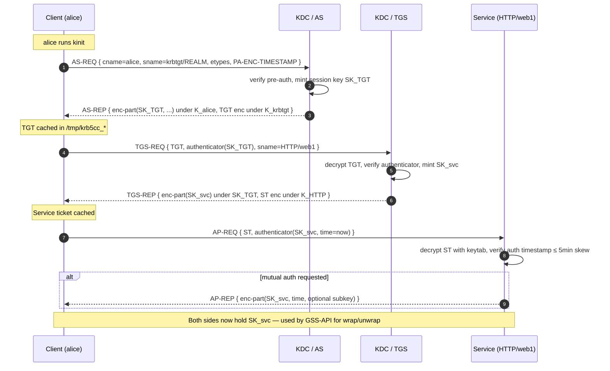
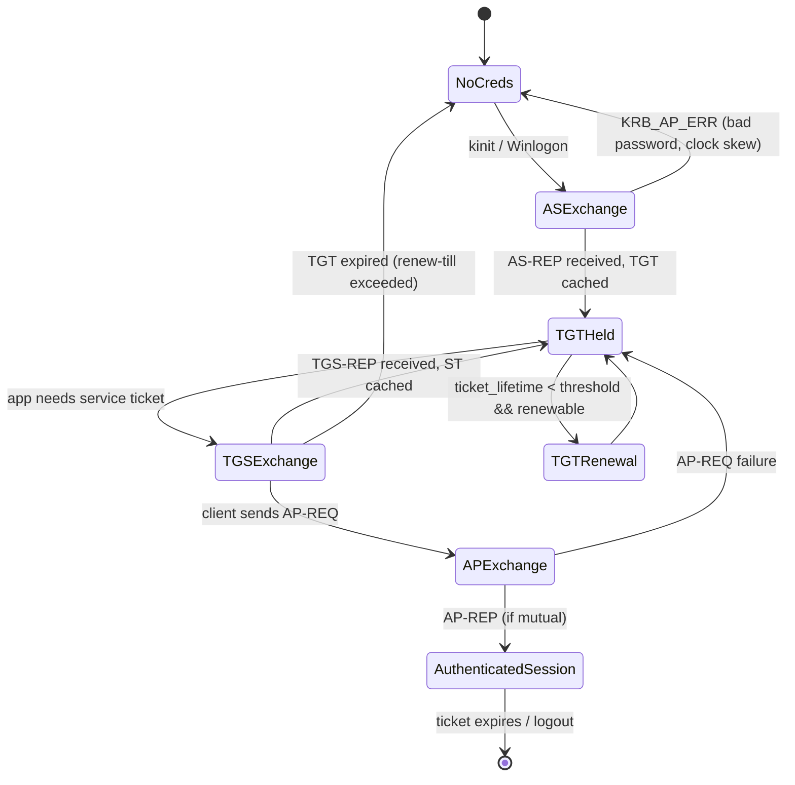

# Kerberos: The Three-Headed Dog That Guards Every Enterprise Network

> A deep, citation-backed encyclopedia entry for `neovand.github.io/coms`. Audience: engineers who want to reimplement it, not just use it. Today is **2026-05-12**; everything dated 2024–2026 is flagged. All claims are sourced inline by number; the consolidated list lives in Section 15.

---

## TL;DR

- **Kerberos V5 (RFC 4120, 2005) is still the load-bearing authentication primitive of the enterprise world in 2026** — it underpins every Active Directory domain on Earth, every Hadoop/Kafka cluster running `SASL/GSSAPI`, every NFSv4 mount with `sec=krb5p`, and Apple's Heimdal-derived stack. Microsoft is finally killing NTLM by default in the Windows Server release **after** Server 2025 (currently slated for 2027–2028), forcing Kerberos to absorb the remaining "no line-of-sight to a DC" and "local account" cases through new mechanisms called **IAKerb** and **Local KDC** [16][17].
- **The protocol is finally shedding 1990s cryptography.** MIT krb5 1.21 (June 2023) stopped issuing 3DES/RC4 session keys by default; 1.21 also added a new KDC PAC checksum buffer to mitigate a hash-collision attack on the old checksum; MIT krb5 1.22 (2025‑08‑05) added ECDH/elliptic-curve client certificates to PKINIT, IAKerb realm discovery, and Unix-domain-socket KDC transport [1][2][41]. Windows is on a parallel RC4-retirement glide path scheduled to land in 2026 cumulative updates [16].
- **The attack surface is now well-understood and weaponized.** Every modern intrusion playbook — confirmed by the 2021–2022 Conti leaks — leans on Kerberoasting (Tim Medin, DerbyCon 2014), AS-REP roasting, MS14-068 (CVE-2014-6324) PAC forgery, NoPac (CVE-2021-42278/42287), Bronze Bit (CVE-2020-17049), and CVE-2022-37967 PAC signature bypass [4][7][8][13][19][27]. The defensive recommendation is unambiguous: pin AES-only enctypes, rotate KRBTGT twice on a 6-month cycle, enable FAST, audit event 4769, and remove RC4 service tickets entirely before Microsoft does it for you in 2026.

---

## 1. Prerequisites and glossary

Kerberos is dense, so read this first. Every term used later is defined here. Reader is assumed to know what a TCP socket, a cryptographic hash, and a shared secret are — nothing more.

| Term | Definition |
|------|------------|
| **Realm** | A Kerberos administrative domain (always written in UPPERCASE by convention; e.g. `ATHENA.MIT.EDU`). One realm = one KDC database. Realm names are **case-sensitive** — `ATHENA.MIT.EDU` ≠ `athena.mit.edu`, which is the single most common misconfiguration. [25] |
| **Principal** | A named identity in the database. Two forms: `user@REALM` (e.g. `alice@ATHENA.MIT.EDU`) and `service/host@REALM` (e.g. `HTTP/web1.example.com@EXAMPLE.COM`). Service principals are called **SPNs** in Microsoft terminology. [25] |
| **KDC** (Key Distribution Center) | The trusted third party. Logical service; physically one process (`krb5kdc` on MIT/Heimdal, the Active Directory DC on Windows) that hosts both the **AS** and **TGS**. [1][25] |
| **AS** (Authentication Server) | The KDC sub-service that handles initial logon. Issues TGTs. |
| **TGS** (Ticket Granting Service) | The KDC sub-service that exchanges a TGT for a service ticket. |
| **TGT** (Ticket Granting Ticket) | A ticket for the principal `krbtgt/REALM@REALM`. Possession of a TGT = "I have proven who I am to the KDC for some bounded lifetime." |
| **Service ticket** | A ticket for a specific service principal, encrypted with that service's long-term key. The proof the client presents to the actual application server. |
| **Session key** | A symmetric key minted fresh by the KDC for each ticket. Lives inside the encrypted part of the ticket and a copy is returned to the client encrypted under the client's long-term key. [37] |
| **Authenticator** | A timestamped, session-key-encrypted blob the client sends *alongside* a ticket to prove freshness (defeats replay). [37] |
| **Pre-authentication / PA-ENC-TIMESTAMP** | Mandatory in modern deployments: the client encrypts the current timestamp with its long-term key in the AS-REQ. Without it, anyone could request an AS-REP for any user and crack it offline — that gap is **AS-REP roasting**. [25][37] |
| **PKINIT** (RFC 4556) | Public-key initial authentication; instead of a password-derived long-term key, the client signs the AS-REQ with an X.509 certificate. Foundation of smart-card logon and Windows Hello for Business. [10][35] |
| **FAST** (Flexible Authentication Secure Tunneling, RFC 6113) | Tunnels pre-auth inside an *armor* TGT so a weak user password can't be brute-forced from a captured AS-REP. The single most important Kerberos hardening lever after AES-only. [35] |
| **KRBTGT account** | A special disabled user account in AD/MIT whose password hash is used as the long-term key for `krbtgt/REALM@REALM`. **If an attacker steals this hash, they can forge any TGT — a "Golden Ticket."** [4][27] |
| **GSS-API** (RFC 2743) | The protocol-agnostic security API. Most "Kerberos-aware" applications never call libkrb5 directly — they call GSS-API and the Kerberos mechanism is selected underneath. [35] |
| **SPNEGO** (RFC 4178) | The negotiation pseudo-mechanism: "let's pick between Kerberos and NTLM." HTTP `WWW-Authenticate: Negotiate` is SPNEGO. [16] |
| **Mutual authentication** | The optional AP-REP step where the server proves it could decrypt the client's AP-REQ — flipping the channel from client-auth-only to bidirectional. [37] |
| **Forwardable ticket** | A TGT flag (`forwardable`) that lets a service obtain a new TGT representing the user on a remote host. Required for SSH agent-style delegation. [19] |
| **Proxiable ticket** | Older sibling of forwardable; only allows obtaining service tickets (not TGTs) on the user's behalf. Rarely used now. |
| **Renewable ticket** | TGT may be re-stamped (without re-entering password) up to `renew-till` time. Default `renew-till` on AD is 7 days, on MIT often unset. |
| **Constrained delegation / S4U2Self / S4U2Proxy** | Microsoft's "Service for User" extensions. S4U2Self lets a service obtain a service ticket *to itself* on behalf of a user (protocol transition); S4U2Proxy lets it then obtain a ticket to a *specific* other service. The vulnerable surface for Bronze Bit (CVE-2020-17049). [13][19] |
| **etype** (encryption type) | Numeric IANA-registered identifier for an algorithm suite: `1`=DES-CBC-CRC, `3`=DES-CBC-MD5, `17`=AES128-CTS-HMAC-SHA1-96, `18`=AES256-CTS-HMAC-SHA1-96, `19`=AES128-CTS-HMAC-SHA256-128, `20`=AES256-CTS-HMAC-SHA384-192 (RFC 8009), `23`=RC4-HMAC. [1][35] |
| **Salt** | String mixed with the password during `string-to-key` so two users with the same password get different keys. Default form: `REALMprincipal` for V5, with enctype-specific prefixing in RFC 8009. [1] |
| **kvno** (Key Version Number) | Integer incremented when a principal's key is changed. Allows old tickets to be decrypted while new keys are being deployed. |
| **keytab** | A file holding `{principal, kvno, enctype, key}` tuples for *services* (so they don't need an interactive password to decrypt incoming tickets). The crown jewel on every web/file server. |
| **PAC** (Privilege Attribute Certificate) | Microsoft's authorization-data extension stuffed into every ticket: SIDs, group memberships, signed-by-KDC. Defined in [MS-PAC]. The structure abused by MS14-068, Bronze Bit and CVE-2022-37967. [19][27] |
| **Realm trust** | A `krbtgt/REALM_B@REALM_A` principal whose existence lets users in A obtain service tickets in B. Trusts are **one-way** by default; bidirectional trust = two such principals. Trusts can be **transitive** (A→B and B→C implies A can chain to C) or **non-transitive**. |

---

## 2. History and story

### 2.1 Project Athena (1983–1991)

Kerberos was born inside **Project Athena**, the joint MIT/DEC/IBM initiative that ran 1983–1991 to build a campus-wide distributed-computing environment — thousands of Unix workstations sharing files, printers, mail, and the user database **Hesiod**. The naming problem was concrete: how does a workstation in the public cluster prove that the human at the keyboard is who she claims to be, when the cluster machine itself is *untrusted*? The answer, sketched out by **Jerome Saltzer** and **Jeffrey Schiller**, with **Steve Miller** and **Clifford Neuman** as primary implementers, was a trusted-third-party ticket system [11][12][26][32].

The name was chosen deliberately: like the three-headed dog of Greek mythology that guards the gates of Hades, the protocol has three logical heads — client, server (the resource), and KDC (the gate-keeper) [26]. (Cerberus actually had a serpent tail and a lion's mane in classical sources [26] — but the engineers settled on the dog metaphor and have never let it go.)

The **1988 USENIX Winter paper** by Jennifer Steiner, Clifford Neuman, and Jeffrey Schiller — "Kerberos: An Authentication Service for Open Network Systems" — is the founding public document and remains worth reading in 2026 [12][32]. It describes V4 in operation, including the case study of adding Kerberos to Sun NFS. Neuman is identified in his contemporary bio as having been an MIT undergrad finishing his S.B. in 1985 before joining Athena and then continuing security work at USC/ISI; Schiller, the famous "MIT Network Manager," ran the KDCs themselves [32].

### 2.2 Version 4 → Version 5 → 2026 (milestones)

| Year | Milestone | Source |
|------|-----------|--------|
| **1983** | Project Athena starts at MIT, funded by DEC and IBM [26] | |
| **1988** | Steiner/Neuman/Schiller USENIX paper publishes Kerberos V4 [12][32] | |
| **1989** | Kerberos V4 distributed in closed-source form due to U.S. crypto export controls; a "bones" / "eBones" version was produced outside the U.S. with the crypto stubbed out so the protocol code could be exported, then re-linked against locally produced DES libraries [26][32] | |
| **1993** | **RFC 1510** publishes Kerberos V5 (Kohl & Neuman). V5 introduced ASN.1 wire encoding, modern pre-auth, extensible enctypes, and forwardable/renewable flags [12] | |
| **1994** | Kohl/Neuman/Ts'o, "The Evolution of the Kerberos Authentication System" (IEEE) consolidates the V4→V5 design rationale [12][32] | |
| **1999** | Microsoft adopts Kerberos as the primary authentication protocol for Active Directory, shipping in Windows 2000 (released February 2000); this is the event that makes Kerberos universal — and introduces the proprietary **PAC** extension. NTLM remains as fallback [16][26] | |
| **2005** | **RFC 4120** replaces RFC 1510 (Neuman/Yu/Hartman/Raeburn). Cleaned-up ASN.1; obsoletes V5-prerelease and ambiguous wording in 1510. RFC 4121 simultaneously updates the GSS-API mechanism [12][37] | |
| **2006** | RFC 4556 (PKINIT) standardizes public-key initial authentication [10][12] | |
| **2010** | RFC 6113 (FAST) adds armored pre-authentication [35] | |
| **2012** | RFC 6803 adds Camellia enctype family | |
| **2014‑Nov‑18** | Microsoft releases the out-of-band **MS14-068 / CVE-2014-6324** patch ("Thanksgiving 2014") for the PAC signature-validation bug; the vulnerability had been actively exploited prior to disclosure [4][27] | |
| **2014‑Sep** | Tim Medin presents "Attacking Microsoft Kerberos: Kicking the Guard Dog of Hades" at DerbyCon 2014 — inventing **Kerberoasting** and releasing the original Python TGS cracker [8] | |
| **2017** | RFC 8009 standardizes AES-CTS with HMAC-SHA-2 enctypes 19 and 20; supersedes the SHA-1 etypes 17/18 cryptographically [1] | |
| **2019** | RFC 8636 (PKINIT Algorithm Agility) by Hörnquist Åstrand et al. makes the PKINIT KDF and signing-digest negotiable, paving the path for hash-agility [10] | |
| **2020‑Nov** | Bronze Bit (CVE-2020-17049) disclosed by Jake Karnes at NetSPI [19] | |
| **2021‑Nov** | NoPac (CVE-2021-42278 + CVE-2021-42287) — sAMAccountName spoofing + KDC ticket-name fallback bug [7] | |
| **2022‑Nov‑8** | CVE-2022-37967 patches PAC signature-forgery in S4U2Proxy; rolls out as a phased Audit→Enforce update [13] | |
| **2023‑Jun** | **MIT krb5 1.21** ships: KDC no longer issues 3DES/RC4 session keys by default; service-ticket PACs gain a new KDC checksum buffer to mitigate hash-collision attacks on the old KDC checksum [1] | |
| **2024** | MIT krb5 1.21.3 ships fixes for CVE-2024-37370 and CVE-2024-37371 in GSS message-token handling [1] | |
| **2025‑08‑05** | **MIT krb5 1.22** ships: PKINIT gains elliptic-curve client certs, ECDH key exchange, and support for the Microsoft `paChecksum2` field; IAKerb implementation updated to comply with the latest draft and support realm discovery; new `request_timeout` libdefaults var; Unix-domain-socket KDC transport; systemd socket activation. (The initial 1.22 release was withdrawn 17 Aug 2025 for a critical vulnerability before re-issue as 1.22.2.) [2][41] | |
| **2025–2026** | Windows Server 2025 + Win11 24H2: Phase 1 of NTLM phase-out — enhanced NTLM auditing GA. IAKerb and Local KDC in Insider flighting [16][17] | |
| **2026 (planned)** | Windows: NTLMv1 SSO blocked by default in October 2026 via `BlockNTLMv1SSO` registry default flip; IAKerb + Local KDC GA in second half of 2026 [16][17] | |

---

## 3. How it actually works

The mental model: **one ticket per service, one session key per ticket, and a timestamped "authenticator" you sign each time you actually use the ticket.** The KDC issues tickets; it never sees the application traffic.

### 3.1 The full sequence (kinit → service access)



### 3.2 State machine



### 3.3 Ticket structure (ASN.1 sketch, per RFC 4120 §5.3)

```asn1
Ticket ::= [APPLICATION 1] SEQUENCE {
    tkt-vno         [0] INTEGER (5),           -- always 5 for V5
    realm           [1] Realm,                  -- the service's realm
    sname           [2] PrincipalName,          -- service principal name
    enc-part        [3] EncryptedData           -- EncTicketPart, enc under K_service
}

EncTicketPart ::= [APPLICATION 3] SEQUENCE {
    flags           [0] TicketFlags,           -- forwardable, renewable, etc.
    key             [1] EncryptionKey,         -- the SESSION KEY
    crealm          [2] Realm,
    cname           [3] PrincipalName,
    transited       [4] TransitedEncoding,     -- realms traversed
    authtime        [5] KerberosTime,
    starttime       [6] KerberosTime OPTIONAL,
    endtime         [7] KerberosTime,
    renew-till      [8] KerberosTime OPTIONAL,
    caddr           [9] HostAddresses OPTIONAL,
    authorization-data [10] AuthorizationData OPTIONAL   -- the PAC lives here on AD
}

Authenticator ::= [APPLICATION 2] SEQUENCE {
    authenticator-vno [0] INTEGER (5),
    crealm            [1] Realm,
    cname             [2] PrincipalName,
    cksum             [3] Checksum OPTIONAL,
    cusec             [4] Microseconds,
    ctime             [5] KerberosTime,
    subkey            [6] EncryptionKey OPTIONAL,
    seq-number        [7] UInt32 OPTIONAL,
    authorization-data [8] AuthorizationData OPTIONAL
}
```

Field list for the six wire messages (per RFC 4120 §5.4 [37]):

- **AS-REQ** = `KDC-REQ { pvno=5, msg-type=10, padata{PA-ENC-TIMESTAMP, PA-PAC-REQUEST,…}, req-body { kdc-options, cname, realm, sname=krbtgt/REALM, from, till, rtime, nonce, etype[], addresses, enc-authorization-data, additional-tickets } }`
- **AS-REP** = `KDC-REP { pvno=5, msg-type=11, padata, crealm, cname, ticket=TGT, enc-part=EncASRepPart enc under K_client }`
- **TGS-REQ** = `KDC-REQ { msg-type=12, padata{PA-TGS-REQ containing AP-REQ over TGT}, req-body same shape, sname=HTTP/host, additional-tickets for S4U/u2u }`
- **TGS-REP** = `KDC-REP { msg-type=13, ticket=ServiceTicket, enc-part=EncTGSRepPart enc under SK_TGT (or sub-session key) }`
- **AP-REQ** = `[APPLICATION 14] { pvno, msg-type=14, ap-options { use-session-key, mutual-required }, ticket, authenticator }`
- **AP-REP** = `[APPLICATION 15] { pvno, msg-type=15, enc-part=EncAPRepPart { ctime, cusec, subkey OPTIONAL, seq-number OPTIONAL } }`

All KDC traffic is over UDP **port 88** by default with TCP fallback when the packet exceeds `udp_preference_limit` (1465 bytes by default on MIT); `kpasswd` lives on UDP/TCP **464**. Modern MIT releases also support Unix-domain sockets for KDC and kpasswd transport [2].

---

## 4. Deep connections to other protocols

Kerberos is *never* deployed alone. The map of dependencies (`→`) and consumers (`←`) is the most important thing to internalize.

| Protocol | Relationship | Detail |
|---|---|---|
| **LDAP** | Pair-partner | Active Directory and FreeIPA put the *identity database* in LDAP and the *authentication mechanism* in Kerberos. LDAP clients bind via `SASL/GSSAPI` (RFC 4752), with Kerberos as the GSS-API mech. FreeIPA's `ipa-kdb` plugin is a custom MIT KDB backend that reads from 389-DS LDAP and produces the MS-PAC needed for AD trust [22][25] |
| **DNS** | Hard dependency | KDC discovery uses SRV records — `_kerberos._tcp.REALM`, `_kerberos._udp.REALM`, `_kpasswd._udp.REALM`. Reverse-DNS lookups for SPN canonicalization are the *most common* misconfiguration: if `rdns=true` (the historical default) and reverse DNS returns a different name than the SPN, the client will request a ticket for the wrong service. Best practice: set `rdns=false` in `[libdefaults]` [25] |
| **TLS** | Alternative trust model + a layered pairing | TLS uses PKI (X.509 + CA hierarchy) for asymmetric trust; Kerberos uses realm/KDC shared-key trust. They meet in two places: (1) **PKINIT** bridges PKI into Kerberos initial auth (RFC 4556 [10], RFC 8636 algorithm agility [10]); (2) **HTTPS + Negotiate**: TLS terminates first, then SPNEGO/Kerberos rides over HTTP for SSO. Kerberos does *not* provide forward secrecy unless layered with TLS or a Diffie–Hellman exchange — applications needing PFS "must exchange keys through mechanisms that provide such assurance, but may use Kerberos for authentication of the encrypted channel established through such other means" [37] |
| **OAuth 2.0** | Philosophical contrast | Tokens vs. tickets: OAuth bearer tokens are *capability tokens* (whoever has the bytes has the right), Kerberos tickets are *cryptographically bound to a session key* the holder must also possess. OAuth lives at the application layer over HTTPS; Kerberos sits below GSS-API and is protocol-agnostic. OAuth scales horizontally; Kerberos depends on a centralized KDC. Modern Microsoft hybrid stacks use **Primary Refresh Tokens** to broker between Entra ID OAuth tokens and on-prem Kerberos TGTs |
| **SAML / OIDC** | Federation peers | Solve the *cross-organization* problem Kerberos handles awkwardly via realm trusts. OIDC = OAuth 2.0 + identity claims in a signed JWT; SAML = XML-based equivalent. Internal corp networks: still Kerberos. Federated SaaS: OIDC/SAML. Hybrid: SAML/OIDC IdP fronts a Kerberos backend |
| **GSS-API** (RFC 2743) | Wrapper API | The C function `gss_init_sec_context()` is how almost every application *actually* uses Kerberos. The Kerberos GSS mechanism is RFC 4121 [12]. New in MIT 1.22: `GSS_C_CHANNEL_BOUND` flag for strict channel-binding enforcement [2] |
| **SPNEGO** (RFC 4178) | Mech-negotiation | The HTTP `WWW-Authenticate: Negotiate` header. Lets a Windows browser pick between Kerberos (preferred) and NTLM (fallback). The fallback path is exactly what Microsoft is now disabling [16] |
| **SSH** | Optional GSSAPI mechanism | `GSSAPIAuthentication yes` + `GSSAPIDelegateCredentials yes` lets a Kerberos TGT log you into SSH without typing a password; `gssapi-with-mic` is the RFC 4462 mechanism name |
| **NFS** | First major non-MIT consumer | NFSv3/v4 `sec=krb5` (auth only), `sec=krb5i` (auth + integrity), `sec=krb5p` (auth + integrity + privacy) — the Sun integration was literally one of the case studies in the 1988 Steiner paper [12] |
| **NTLM** | Predecessor being EOL'd | Microsoft introduced NTLM in 1993 with Windows NT 3.1 [16]. Vulnerable to relay, pass-the-hash, and uses RC4-based MD4 hash construction. Deprecation announced 2023; auditing GA 2025 in Server 2025/Win11 24H2; default disabled in next Server release after 2025 (2027–2028) [16][17] |
| **MS-PAC** | Microsoft authorization extension | Defines the SID/group structure stuffed into the Kerberos `authorization-data` field. The attack surface for MS14-068 [4][27], NoPac [7], Bronze Bit [13][19], CVE-2022-37967 [13], CVE-2024-26248/29056 [13] |
| **DKIM/SPF/DMARC / SMTP / ACME / OSPF / WireGuard / DHCP / NTP** (adjacent protocols in the same encyclopedia pass) | Mostly orthogonal | But **NTP is a soft dependency**: Kerberos requires clocks synchronized within `clockskew` (default 300 seconds, [37]) or the authenticator timestamp check fails. Pre-2018 stories of "the new VM can't authenticate" usually trace to ntpd not running |

---

## 5. Real-world deployments

| Deployment | Implementation | Scale / dates | Source |
|---|---|---|---|
| **Microsoft Active Directory** — every Windows enterprise domain on Earth, ≈99% of Fortune 500 networks | Microsoft Windows KDC (proprietary, AD-integrated, MS-PAC, SPNEGO/Negotiate) | Since Windows 2000 (Feb 2000); Server 2025 (2024 GA) introduces IAKerb + Local KDC pre-release for the NTLM-replacement push [16][17] | [16][17] |
| **MIT Project Athena (origin)** | MIT krb5 reference implementation | Continuously since 1988; the `ATHENA.MIT.EDU` realm and `kerberos.mit.edu`-style KDC are still operational [12][32] | [12] |
| **Apple macOS / iOS** | Heimdal-derived `com.apple.Kerberos.kdc` shipped inside `/System/Library/PrivateFrameworks/Heimdal.framework/` — including Apple Open Directory through Snow Leopard Server (~2010); Heimdal remains in macOS as the per-user KDC for Active Directory binding | macOS 10.3 (2003) through current macOS 26; an MIT-Kerberos compatibility shim ("MKShim") sits on top so legacy MIT-coded apps keep working [33][34] | [33][34] |
| **FreeIPA / Red Hat IdM** | MIT krb5 + 389-DS LDAP + Dogtag CA + integrated DNS via BIND | Tens of thousands of RHEL/Fedora environments; RHEL IdM "works fine out of the box for a few hundred users" but tunes well to "thousands of users, hundreds of hosts, and dozens of replicas" [22] | [22][25] |
| **Hadoop ecosystem** | MIT krb5 + Java GSS-API (sun.security.jgss) | HDFS, YARN, Hive, Impala, HBase, ZooKeeper — Hadoop's *only* production authentication mode. "Kerberized cluster" is a verb. Every major bank, telco, and hyperscaler with a multi-PB on-prem Hadoop cluster runs Kerberos | [25] |
| **Apache Kafka with SASL/GSSAPI** | MIT krb5 clients + JAAS configs | Kafka security `security.protocol=SASL_PLAINTEXT` or `SASL_SSL` with `sasl.mechanism=GSSAPI` is the standard production pattern for on-prem Kafka clusters | [25] |
| **Heimdal (BSD/Apple/Samba)** | Heimdal Kerberos, BSD-licensed, written largely in Sweden starting May 1992 | Open Hub puts the project at ~189 person-years of effort. Heimdal 7.7 was the last formally released branch, with 7.8 in maintenance for CVE-2019-14870 etc.; 7.7.1 (Nov 2022) shipped fixes for CVE-2022-44640 (potentially CVSS 10.0 RCE in the KDC ASN.1 CHOICE codec) [3] | [3] |
| **Samba 4 AD DC** | Heimdal-derived KDC | The open-source alternative to Windows Server for AD. Coordinated CVE-2022-37967 fix landed in same Patch Tuesday window as Microsoft [13] | [13] |
| **University SSO** — Stanford, MIT, CMU, U-Mich, U-Washington, U-Penn, Iowa State, Carnegie Mellon, Columbia, Cornell | Mostly MIT krb5; some Heimdal (Stanford historically ran both) | All identified as Past Sponsors of the MIT Kerberos Consortium [1] | [1] |

---

## 6. Failure modes and famous incidents

Each incident below uses the **setup → mistake → consequence → resolution** structure.

### 6.1 MS14-068 / CVE-2014-6324 — Forged PAC (Thanksgiving 2014)

- **Setup**: Active Directory KDC validates the PAC signature in incoming Kerberos tickets before generating a logon token. The spec ([MS-PAC]) defines exactly three valid signature algorithms (HMAC-MD5 for RC4, HMAC-SHA1-AES-128, HMAC-SHA1-AES-256) [4][27].
- **Mistake**: The function `KdcVerifyPacSignature` inside `kdcsvc.dll` on Server 2008 R2 and earlier "considered a signature valid if its size was ≤ 20 bytes." That allowed signing a forged PAC with non-keyed MD5 [27]. An authenticated domain user could (a) request a TGT without a PAC, (b) forge a PAC asserting Domain Admins membership and "sign" it with plain MD5, (c) submit it in a TGS-REQ's `enc-authorization-data` field, and (d) receive back a TGT containing the forged PAC fully blessed by the KDC.
- **Consequence**: Any domain user → Domain Admin in seconds. Exploited in the wild before disclosure (the Duqu actors reportedly used it against Kaspersky's internal network) [4]. Released as PyKEK and as `goldenPac.py` in Impacket [27].
- **Resolution**: Out-of-band patch **November 18, 2014** ("Thanksgiving 2014"). Fix restricts the accepted signature type to `HMAC_MD5` (and the proper keyed AES variants), denying anything else [4][27]. The same class of bug — checksum trust — had surfaced as **CVE-2011-0043 / MS11-013** "Kerberos Unkeyed Checksum Vulnerability" three years earlier [27].

### 6.2 Kerberoasting — Tim Medin, DerbyCon 2014

- **Setup**: A service ticket's `enc-part` is encrypted with the service account's long-term key. Any authenticated user may request a service ticket for any SPN — the KDC does not check that the requester will actually use the service [8].
- **Mistake**: AD service accounts historically have human-set passwords (often weak); Microsoft for backward-compat issues service tickets with RC4-HMAC-MD5 (etype 23) — derived directly from the account's NTLM hash, which is *the* offline-crackable shape.
- **Consequence**: An attacker who is *any* domain user enumerates SPNs (LDAP query), requests tickets via `Rubeus kerberoast` or `GetUserSPNs.py`, dumps the RC4 blob, cracks it with hashcat offline — no traffic to the target service. Now standard in the Conti and every other ransomware playbook [9][27][29].
- **Resolution**: There is no single fix — it's a class of weakness. Defenses are (a) **gMSA** (group Managed Service Accounts) with 240-byte random rotating passwords; (b) AES-only via the `msDS-SupportedEncryptionTypes` attribute (bit 0x8 = AES-128, 0x10 = AES-256, 0x4 = RC4-HMAC); (c) audit 4769 events with `ticket_encryption_type=0x17` (RC4) → high-priority alert [8]. Microsoft's 2026 RC4-retirement track ultimately removes the offending etype [16].

### 6.3 AS-REP roasting — same vintage, smaller blast radius

- **Setup**: Pre-authentication (PA-ENC-TIMESTAMP) is *theoretically optional* in V5; AD lets an admin set `DONT_REQ_PREAUTH` on a user account.
- **Mistake**: Anyone can request an AS-REP for that account; the AS-REP's `enc-part` is encrypted with the user's password-derived key, exactly the AS-REP-roasting target.
- **Consequence**: Offline crack of weak user passwords. Discovered via `GetNPUsers.py` or `Rubeus asreproast`.
- **Resolution**: Never set `DONT_REQ_PREAUTH`; audit it during pentest scoping.

### 6.4 Golden Ticket and Silver Ticket (Mimikatz / Sean Metcalf)

- **Setup**: If you possess the `krbtgt` account's long-term key, you can forge any TGT (Golden Ticket). If you possess a *service* account's key, you can forge any service ticket for that service (Silver Ticket).
- **Mistake**: KRBTGT password rotation in many enterprises is *never*. Domain controller compromise → DCSync extracts the krbtgt hash → forever-persistent backdoor.
- **Consequence**: Long-term, KDC-blessed presence. Sean Metcalf at adsecurity.org and Benjamin Delpy's Mimikatz are the canonical references [8][27].
- **Resolution**: Rotate KRBTGT *twice* (with 10-hour gap to let old tickets expire) after any DC compromise or routinely every 6 months. Microsoft ships a `Reset-KrbtgtKeyInteractive.ps1` script. Note: rotating once is **not enough** because the KDC keeps the previous key (kvno N-1) to validate in-flight tickets — you must rotate twice to actually evict an attacker.

### 6.5 NoPac — CVE-2021-42278 + CVE-2021-42287 (November 2021)

- **Setup**: Active Directory machine accounts conventionally end with `$` (e.g. `DC01$`). On TGS-REQ, if the KDC cannot find the requested service, it retries with `$` appended.
- **Mistake**: AD did not validate that machine sAMAccountNames actually end in `$` (CVE-2021-42278), and the KDC's "retry with `$`" fallback (CVE-2021-42287) allowed name-confusion.
- **Consequence** (the 7-step Hacker Recipes chain [7]): create a machine account `bob$`; rename its sAMAccountName to `DC01` (no trailing $); obtain a TGT for `DC01`; reset its name back; request S4U2Self → KDC retries with `$` and returns a service ticket for `DC01$`, the domain controller. Then DCSync → game over, in 16 seconds per Secureworks' video [7].
- **Resolution**: Patches in November 9, 2021 cumulative updates; KB5008102 prevents arbitrary sAMAccountName modifications and KB5008380 adds the original-requester PAC structure that closes 42287. Detection: event 4781 with `OldTargetUserName: *$` and `NewTargetUserName: not *$` [7].

### 6.6 Bronze Bit — CVE-2020-17049 (November 2020)

- **Setup**: S4U2Self produces a ticket marked *non-forwardable* when the user is a member of Protected Users or marked "sensitive — cannot be delegated."
- **Mistake**: KDC-options flags in the ticket are encrypted only under the service's long-term key, not also signed by the KDC. A service whose hash is compromised can decrypt the ticket, flip the `forwardable` bit, re-encrypt — and the next KDC's S4U2Proxy validation accepts it [13][19].
- **Consequence**: Constrained-delegation service account compromise → impersonation of any user, *including* protected users.
- **Resolution**: November/December 2020 patches; full enforcement May 11, 2021. The MS-SFU spec was revised to require both server and KDC PAC signature verification on the evidence ticket [19].

### 6.7 CVE-2022-37967 — PAC signature, again

- **Setup**: S4U2Proxy requires an "evidence ticket" with valid PAC; the PAC carries server and KDC signatures.
- **Mistake**: Insufficient signature coverage of the entire PAC structure.
- **Consequence**: An attacker controlling a delegation-enabled service could forge a more-powerful evidence ticket [13].
- **Resolution**: KB5020805 + companion KBs added a *full* PAC checksum. Phased rollout: Audit mode (Nov 2022) → Audit-default (Dec 2022) → Enforce (originally April then June 2023). Microsoft set a permanent enforcement deadline of **September 9, 2025** for the strong certificate-binding companion change [13].

### 6.8 PrintNightmare-adjacent Kerberos relay (DFSCoerce, PetitPotam, KrbRelayUp)

- **Setup**: Many Windows protocols (RPC, MS-EFSR's `EfsRpcOpenFileRaw`, MS-DFSNM, the spooler service) allow an authenticated low-privilege caller to coerce a machine account into authenticating outbound.
- **Mistake**: With those outbound Kerberos auths in flight, an attacker on the network path can relay them onward.
- **Consequence**: KrbRelayUp (2022) demonstrated end-to-end machine-account → SYSTEM elevation via relaying coerced Kerberos to LDAP and creating a shadow credential. PetitPotam (2021) and DFSCoerce (2022) are the canonical coercion primitives.
- **Resolution**: Disable unauthenticated coercion paths; require LDAP signing + channel binding; SMB signing; tier-0 isolation. No single CVE — a family of fixes.

### 6.9 Skeleton Key malware (2014)

- **Setup**: An attacker with Domain-Admin rights patches the LSASS process on a domain controller in memory.
- **Mistake**: The patch installs a "master password" that the KDC will accept *in addition to* the legitimate password for any account.
- **Consequence**: Persistent backdoor — no AD object change to detect, only forensic memory analysis or LSASS protection. Documented and named by Dell SecureWorks, January 2015.
- **Resolution**: LSA Protection (RunAsPPL), Credential Guard, Tier-0 hygiene. Reboot of the DC clears the malware (it's memory-resident).

### 6.10 2022 Conti leaks — Kerberos abuse codified

The disgruntled Conti affiliate's August 2021 leak — 111 MB of training manuals, video tutorials in Russian, and pentester checklists — confirmed that **Kerberoasting is "Job One"** for ransomware affiliates [9][29][30]. The playbook instructs operators to "prefer the Kerberoasting attack if a large volume of more than 3k hosts is discovered" [30]; combined with ZeroLogon (CVE-2020-1472), PrintNightmare (CVE-2021-34527), and Mimikatz, the chain reaches DCSync within minutes. The leak is the empirical proof that everything in §6 is in live operational use against enterprises in 2022–2026.

---

## 7. Fun facts and anecdotes

1. **The three heads.** Cerberus is conventionally pictured with three dog heads, but Hesiod's *Theogony* (8th–7th c. BCE) actually gave him fifty heads, and later art sometimes shows him with snake-mane and dragon tail [26]. The MIT team picked "three" because the protocol has three principals (client, server, KDC) — the marketing fit better than the mythology [26].
2. **"Bones" / "eBones."** Because U.S. export controls forbade exporting DES code in 1989, MIT released V4 with cryptography stripped out — the "bones" of the protocol. Outside-U.S. developers (notably in Sweden, who later became the Heimdal team) re-implemented DES locally and re-linked, producing "eBones" [26]. Heimdal's name comes from this Nordic origin — the project was started "largely in Sweden ... which was important when we started writing it" [3].
3. **The PAC controversy of 2000.** When Microsoft shipped Kerberos in Windows 2000, they added the proprietary PAC (Privilege Attribute Certificate) inside the standardized `authorization-data` field. Microsoft initially refused to publish the structure, demanding an NDA-license click-through to even view it — a famous moment in open-standards politics. The structure is now openly documented as [MS-PAC] (the same spec abused by every PAC vulnerability in §6) [27].
4. **Mimikatz**, by Benjamin "gentilkiwi" Delpy, started in 2007 as a hobby project to demonstrate `WDigest` storing plaintext passwords in LSASS memory. It became the central Kerberos-abuse tool of the 2010s — Pass-the-Hash, Pass-the-Ticket, Golden Ticket, Silver Ticket, DCSync, Skeleton Key are all Mimikatz primitives. Delpy presented it at BlueHat IL in 2014; its dominance in the Conti playbook a decade later is a direct legacy [9].
5. **MIT 1.22 was withdrawn five days after release.** MIT krb5 1.22 shipped 2025-08-05 and was withdrawn on **17 Aug 2025 due to a critical vulnerability** before re-releasing as 1.22.x — a rare event for a project this conservative, and a useful reminder that "stable LTS" is never quite that [41].
6. **Sam Hartman and Greg Hudson** are the modern MIT Kerberos team leads — Hartman as longtime architect and former IETF security AD, Hudson as current ghudson@mit.edu signing key holder for releases [1][41]. **Love Hörnquist Åstrand** is the longstanding Heimdal lead and primary RFC 8636 (PKINIT algorithm agility) author [10].

---

## 8. Practical wisdom

Below: the actual configuration levers, with defaults and what to change.

| Pitfall | Default | What to do |
|---|---|---|
| **Clock skew** | `clockskew = 300` (seconds) [37] | Keep ≤300s; use NTP/Chrony with monitoring; alert on `KRB_AP_ERR_SKEW`. On VMs after suspend/resume, force a clock-sync before kinit |
| **Ticket lifetime** | MIT default `ticket_lifetime = 24h`; AD default 10h with 7d renew | Keep TGT lifetimes short (≤10h) so a stolen ticket has bounded value; longer `renew-till` (7d) is fine because renewal still requires a live TGT signature |
| **KRBTGT password rotation** | Never, by default | Rotate **twice** with a gap > max TGT lifetime, every 6 months *and* after any suspected DC compromise. `Reset-KrbtgtKeyInteractive.ps1` |
| **Realm-name case** | Per RFC 4120, realms are typed strings | Always uppercase realm names (`EXAMPLE.COM`); never mix case across `/etc/krb5.conf`, DNS, keytab. The single most common misconfiguration |
| **Reverse-DNS dependency** | `rdns = true` historically | Set `rdns = false` in `[libdefaults]` and use proper SPN/PTR alignment; otherwise expect "Server not found in Kerberos database" failures whenever DNS A/PTR disagree |
| **Encryption-type negotiation** | Wide-open historically | In `krb5.conf` set `permitted_enctypes = aes256-cts-hmac-sha1-96 aes128-cts-hmac-sha1-96 aes256-cts-hmac-sha384-192 aes128-cts-hmac-sha256-128`; do **not** set `allow_weak_crypto = true` [1]. On AD set `msDS-SupportedEncryptionTypes = 0x18` (AES only) on service accounts |
| **FAST** | Off, in most deployments | Turn it on — it's the single most cost-effective defense against AS-REP roasting and offline pre-auth cracking. RFC 6113. MIT supports it natively; use it whenever client+KDC both support |
| **Pre-auth on every account** | Sometimes disabled per-account in AD | Never set `DONT_REQ_PREAUTH` |
| **SPN hygiene** | Manually-set SPNs proliferate | Use gMSA (`New-ADServiceAccount -KerberosEncryptionType AES128,AES256`); audit duplicate SPNs (`setspn -X`) regularly; remove SPNs from user accounts (Kerberoasting bait) |
| **gMSA / dMSA** | Available since Server 2012; dMSA in Server 2025 | Use for all service accounts; rotates password every 30 days automatically; impossible to Kerberoast crack within rotation window |
| **Detection** | Off by default | Enable "Audit Kerberos Service Ticket Operations" → event **4769** logs every TGS-REQ. Alert when `Ticket Encryption Type` = 0x17 (RC4) outside an explicit allow-list. Event **4768** for TGT issuance; event **4624** logon type 3 with `Authentication Package: Kerberos` for confirmation [8] |

---

## 9. Pioneers and key contributors

- **Jerome H. Saltzer** (b. 1939) — MIT professor of computer science, co-author of the 1975 Saltzer–Schroeder paper "The Protection of Information in Computer Systems" (the source of the "principle of least privilege" and "fail-safe defaults" — the design principles Athena and Kerberos *operationalize*). Contributed conceptual review to V4 [32].
- **Jeffrey I. Schiller** — long-time MIT Network Manager, ran Athena's KDCs. Contributed to V4 design alongside Miller and Neuman; co-author on the 1988 USENIX paper [12][32]. Schiller is the named author of `jis@ATHENA.MIT.EDU` on the original paper.
- **Steven P. Miller** — V4 lead implementer at Athena, co-author of the foundational design document with Neuman, Schiller, and Saltzer [32].
- **B. Clifford Neuman** — one of the principal V4 designers; later co-designer of V5 with John Kohl. Did his S.B. at MIT in 1985, joined Athena, then to USC/ISI where his Prospero directory work and Kerberos work continued [32]. Co-editor of RFC 4120 (V5 core) [37].
- **John T. Kohl** — V5 editor; with Neuman authored the original V5 spec RFC 1510 in 1993 [12].
- **Sam Hartman** — long-time MIT Kerberos architect, IETF Security Area Director, co-editor of RFC 4120 and RFC 4121 [37]; still active on the project [1].
- **Greg Hudson (ghudson@mit.edu)** — current MIT Kerberos team release engineer; the named signer of MIT krb5 1.21/1.22 release packages and active on the MITKRB5-SA advisories [1][2][41].
- **Love Hörnquist Åstrand** — long-time Heimdal lead; primary author of RFC 8636 (PKINIT Algorithm Agility, 2019) [10].
- **Tim Medin** — invented Kerberoasting; DerbyCon 2014 talk "Attacking Microsoft Kerberos: Kicking the Guard Dog of Hades" [8]. Currently CEO of Red Siege.
- **Sean Metcalf** — adsecurity.org; the definitive English-language documentation source for Golden Ticket / Silver Ticket / Kerberoasting detection [8][27].
- **Benjamin Delpy ("gentilkiwi")** — Mimikatz author, demonstrated Skeleton Key, Pass-the-Ticket, Golden Ticket as practical attacks [9].
- **Jake Karnes** — discovered Bronze Bit (CVE-2020-17049) at NetSPI [19].

---

## 10. Learning resources (current as of 2026)

### RFCs (with sections worth bookmarking)

- **RFC 4120 (2005), Standards Track** — "The Kerberos Network Authentication Service (V5)." §3 message exchanges; §5 message specifications (ASN.1); §6 encryption and checksum specs; §1.4 caveats about cross-realm transitivity. Obsoletes RFC 1510 [37].
- **RFC 4121 (2005), Standards Track** — GSS-API mechanism v2, updates RFC 1964 [12].
- **RFC 4178 (2005)** — SPNEGO.
- **RFC 4556 (2006)** — PKINIT (initial spec) [10].
- **RFC 6113 (2011)** — FAST.
- **RFC 6803 (2012)** — Camellia enctypes.
- **RFC 8009 (2017)** — AES-CTS HMAC-SHA-2 enctypes 19 and 20 [1].
- **RFC 8062 (2017)** — PKINIT anonymity.
- **RFC 8636 (2019)** — PKINIT algorithm agility (Hörnquist Åstrand et al.) [10].
- **[MS-PAC]**, **[MS-KILE]** on Microsoft Learn — authoritative for the AD-specific extensions.

### Books and historical papers

- Steiner, Neuman, Schiller, "Kerberos: An Authentication Service for Open Network Systems," **USENIX Winter 1988**, pp. 191–202 — the founding paper [12][32].
- Bellovin & Merritt, "Limitations of the Kerberos Authentication System," USENIX 1991 — the canonical critique [12].
- Needham & Schroeder, "Using Encryption for Authentication in Large Networks of Computers," CACM 1978 — the protocol-theoretic ancestor [32].
- Saltzer & Schroeder, "The Protection of Information in Computer Systems," Proc. IEEE 1975 — the design-principles ancestor.
- Garman, *Kerberos: The Definitive Guide*, O'Reilly 2003 — still the best long-form introduction despite age; pair with RFC 4120 for modern detail.
- Bill Bryant, "Designing an Authentication System: a Dialogue in Four Scenes," 1988 (with afterword by Ts'o, 1997) — the classic teaching narrative [32].
- Kohl, Neuman, Ts'o, "The Evolution of the Kerberos Authentication System," 1994 [32].

### Blogs / talks / tools (last-updated year noted)

- **adsecurity.org** (Sean Metcalf) — Detecting Kerberoasting, MS14-068, Bronze Bit, Golden Ticket. Updated through 2025 [8][19][27].
- **SpecterOps Posts** (Will Schroeder et al.) — delegation, ESC1-15 certificate-services chains, "Wagging the Dog."
- **The Hacker Recipes / thehacker.recipes** — practitioner playbook for every Kerberos attack [4][7][13].
- **FreeIPA docs** at `freeipa.org` and `freeipa.readthedocs.io` [22][25].
- **Microsoft Learn** — "Windows Authentication Overview," KB5020805, KB5021131; the Windows IT Pro blog post "Advancing Windows security: Disabling NTLM by default" (Jan 2026) [16][17].
- **Tools**: `kinit`/`klist`/`kvno`/`kadmin` (MIT toolchain); Heimdal `kinit`/`kadmin`; Wireshark Kerberos dissector; Rubeus (C#); Impacket (`GetUserSPNs.py`, `GetNPUsers.py`, `getTGT.py`, `getST.py`); Mimikatz; PowerShell `ActiveDirectory` module; `setspn`, `klist purge`.

### Wireshark / capture-tool filters

- `kerberos` — every Kerberos packet.
- `kerberos.msg_type == 10` — AS-REQ only; `== 11` AS-REP; `== 12` TGS-REQ; `== 13` TGS-REP; `== 14` AP-REQ; `== 15` AP-REP; `== 30` KRB-ERROR.
- `kerberos.realm == "EXAMPLE.COM"` — scope to a realm.
- `kerberos.CNameString == "alice"` — by client principal.
- `kerberos.etype == 23` — flag any RC4-HMAC use (Kerberoasting candidate).
- Live testing: `klist -e` (show enctypes of cached tickets), `kvno HTTP/web1.example.com` (force a TGS-REQ), `Rubeus.exe kerberoast /stats` (enumerate Kerberoastable accounts without requesting tickets).

---

## 11. Where things are heading (2025–2026 frontier)

The next 24 months of Kerberos evolution are dominated by three pressures.

1. **Crypto deprecation reaching production.** MIT krb5 1.21 (June 2023) refuses to issue 3DES or RC4 session keys without explicit `allow_des3`/`allow_rc4` opt-in [1]. Microsoft is on a parallel track: RC4 is being phased out through 2026 cumulative updates, with auditing tools `List-AccountKeys.ps1` and `Get-KerbEncryptionUsage.ps1` already shipped in the public `Microsoft/Kerberos-Crypto` GitHub repository [16]. By the end of 2026 most enterprise tooling that still depends on RC4-HMAC will break.

2. **NTLM end of life.** Microsoft's January 2026 roadmap update commits to disabling network NTLM by default in the *Windows Server release after Server 2025* (expected 2027–2028) [16][17]. The bridge is two new mechanisms shipping in the second half of 2026: **IAKerb** (Initial and Pass Through Authentication Using Kerberos) tunnels Kerberos through a relay when the client has no line-of-sight to a DC, and **Local KDC** brings Kerberos to local account authentication. MIT krb5 1.22 already ships an updated IAKerb that complies with the most recent draft and supports realm discovery [2]. October 2026 is also the deadline for `BlockNTLMv1SSO` to flip default from Audit to Enforce, killing NTLMv1 SSO entirely [16][17].

3. **Post-quantum Kerberos.** This is the slowest-moving area. The IETF PQUIP working group has the engineer-targeted draft `draft-ietf-pquip-pqc-engineers-14` (Aug 2025) [21], which surveys the threat. TLS already has hybrid ML-KEM landing (`draft-ietf-tls-mlkem`) [20], and IPsec has KEM-based authentication drafts (`draft-wang-ipsecme-kem-auth-ikev2`) [20]. **The KITTEN WG itself does not yet have a published post-quantum Kerberos draft listed in datatracker as of this writing** — `[needs source]` for a specific KITTEN PQ draft number — but the architectural direction is broadly understood: hybrid PQ KEM in PKINIT key establishment (because lattice public-keys and ciphertexts will balloon AS-REQ/AS-REP sizes well past common UDP MTU limits), forcing TCP and Unix-domain-socket transport as the default (MIT 1.22's `request_timeout` + TCP-first behavior is partial preparation [2]). Expect a KITTEN WG draft cycle through 2026–2027.

4. **Modern Auth / Hybrid OIDC patterns.** Microsoft's **Primary Refresh Token** model marries Entra ID OAuth tokens with on-prem Kerberos: a Windows Hello/PRT bootstrap acquires a partial TGT, which becomes a full Kerberos TGT after PKINIT-style cert validation against the DC. Apple's enterprise SSO extension on iOS does similar bridging. The endgame is "passwordless on the client, Kerberos on the wire" — the Kerberos *messages* stay the same, the *initial credential* changes.

---

## 12. Hooks for the article, infographic, and podcast

- **Long-form article**: "How a Windows logon works in 2026" — open with the keystrokes, end with a Kerberos AP-REQ flying to a SQL Server in a sister forest after S4U2Proxy, via the new IAKerb path with no DC line-of-sight.
- **Infographic**: the six-message sequence diagram, colored by *who holds which key at each step* — driving home that the KDC never sees post-auth traffic.
- **Podcast Episode 1**: "Thanksgiving 2014" — narrative reconstruction of the MS14-068 patch hitting Microsoft customers the week of November 18 [4][27]. Cliff Neuman flashback to V4 export controls and "Bones" [26]. Interview hook: Sean Metcalf, Tim Medin.
- **Podcast Episode 2**: "Kerberoasting Goes Industrial" — how a 2014 conference talk became, eight years later, the standard step-5 in the Conti playbook [8][9][30].
- **Podcast Episode 3**: "Killing NTLM" — Microsoft's 2024–2028 retirement plan, IAKerb, Local KDC, what breaks when monitoring tools stop falling back [16][17].

---

## 13. Appendix A — Encyclopedia-ready structured-data extracts

### A.1 Protocol record

```yaml
name: Kerberos
version: 5 (current); 4 (deprecated, removed from MIT krb5 1.18+)
layer: Session / Authentication (above transport)
default_ports: { kerberos: 88/udp+tcp, kpasswd: 464/udp+tcp, kadmind: 749/tcp }
transport: UDP first, TCP fallback when udp_preference_limit exceeded; Unix-domain sockets supported since MIT 1.22 (2025-08-05)
encoding: ASN.1 DER
core_rfc: 4120 (2005)
key_rfcs: [4121, 4178, 4556, 6113, 6803, 8009, 8062, 8636]
category: identity (proposed new category)
inventors: { primary: [Steven Miller, Clifford Neuman], contributors: [Jerome Saltzer, Jeffrey Schiller] }
origin: MIT Project Athena, 1983-1991
current_maintainer: { mit: MIT Kerberos Consortium (Greg Hudson lead), heimdal: Heimdal Software (Love Hörnquist Åstrand) }
```

### A.2 Header / wire-format summary

- AS-REQ: `[APPLICATION 10] KDC-REQ`
- AS-REP: `[APPLICATION 11] KDC-REP`
- TGS-REQ: `[APPLICATION 12] KDC-REQ`
- TGS-REP: `[APPLICATION 13] KDC-REP`
- AP-REQ: `[APPLICATION 14] SEQUENCE { ap-options, ticket, authenticator }`
- AP-REP: `[APPLICATION 15] SEQUENCE { enc-part }`
- KRB-SAFE: `[APPLICATION 20]` — integrity-protected user payload
- KRB-PRIV: `[APPLICATION 21]` — confidentiality + integrity user payload
- KRB-CRED: `[APPLICATION 22]` — transmits a ticket between processes (`forwardable` delegation)
- KRB-ERROR: `[APPLICATION 30]` — unencrypted; not integrity-protected (acknowledged limitation in RFC 4120 §3.1) [37]

### A.3 State machine

See §3.2 mermaid above.

### A.4 Code examples

**CLI (MIT toolchain):**
```sh
$ kinit alice@EXAMPLE.COM             # AS exchange (interactive password or PKINIT)
$ klist                                # show TGT
$ klist -e                             # include enctypes
$ kvno HTTP/web1.example.com           # force a TGS-REQ to populate cache
$ klist -f                             # show ticket flags (F=forwardable, R=renewable)
$ kdestroy                             # wipe ticket cache
```

**Python with `gssapi` (RFC 2743 binding):**
```python
import gssapi
service = gssapi.Name("HTTP@web1.example.com", gssapi.NameType.hostbased_service)
ctx = gssapi.SecurityContext(name=service, usage="initiate")
token = ctx.step()              # produces SPNEGO/Kerberos AP-REQ token
# send `token` in HTTP `Authorization: Negotiate <base64(token)>` header
```

**Wire (Wireshark filter):**
```text
kerberos.msg_type == 10                 # AS-REQ
kerberos.etype == 23 && kerberos.msg_type == 13   # RC4 service ticket = Kerberoasting target
```

**JavaScript** — there is no first-party JS Kerberos client; modern web flows ride on `Authorization: Negotiate` (SPNEGO) handled by the browser against the OS credential cache.

### A.5 Recent changes 2024–2026

- **2024-06**: MIT krb5 1.21.3 fixes CVE-2024-37370 and CVE-2024-37371 (GSS message-token handling) [1].
- **2025-08-05**: MIT krb5 1.22 ships with PKINIT ECDH/EC certs, paChecksum2 support, IAKerb realm discovery, request_timeout, Unix-domain-socket transport [2][41]. Initial release **withdrawn 17 Aug 2025** for a critical vulnerability; re-issued as 1.22.2 [41].
- **2025-09-09**: Microsoft's permanent enforcement deadline for strong certificate binding (the long-tail of CVE-2022-37967 mitigation) on Windows Domain Controllers [13].
- **2025-late through 2026**: Windows Server 2025 + Win11 24H2 ship enhanced NTLM auditing (Phase 1 of NTLM phase-out) [16][17].
- **2026 second half**: IAKerb and Local KDC GA for Windows Server 2025 / Win11 24H2 (Phase 2) [16][17].
- **2026-10**: `BlockNTLMv1SSO` registry-key default flips from Audit to Enforce, disabling NTLMv1 SSO by default [16][17].

### A.6 Real-world deployments

See §5 table.

### A.7 Fun facts

See §7.

### A.8 Practical wisdom

See §8.

### A.9 Wireshark hints

See §10.

### A.10 Learn-more lists

See §10.

### A.11 Pioneer candidates

See §9.

### A.12 RFC records

| RFC | Year | Status | Notable section |
|---|---|---|---|
| 4120 | 2005 | Proposed Standard | §3 exchanges, §5 ASN.1, §6 crypto [37] |
| 4121 | 2005 | Proposed Standard | GSS mechanism for Kerberos [12] |
| 4178 | 2005 | Proposed Standard | SPNEGO |
| 4556 | 2006 | Proposed Standard | PKINIT [10] |
| 6113 | 2011 | Proposed Standard | FAST armored pre-auth |
| 6803 | 2012 | Informational | Camellia enctypes |
| 8009 | 2017 | Informational | AES + HMAC-SHA-2 enctypes 19/20 [1] |
| 8062 | 2017 | Proposed Standard | PKINIT anonymity |
| 8636 | 2019 | Proposed Standard | PKINIT algorithm agility [10] |

### A.13 New glossary concepts

See §1.

### A.14 Frontier entry — PQ Kerberos

```yaml
topic: Post-Quantum Kerberos
status: pre-draft as of 2026-05; engineer guidance via draft-ietf-pquip-pqc-engineers-14 (Aug 2025) [21]
likely_shape: hybrid PQ KEM inside PKINIT (RFC 4556+RFC 8636 agility), forcing TCP/UDS transport due to ticket-size impact
parallel_work: TLS 1.3 (draft-ietf-tls-mlkem) [20], IKEv2 (draft-wang-ipsecme-kem-auth-ikev2) [20]
risk_to_existing_deployments: ticket sizes potentially >2 KB; AS-REP fragmentation in legacy UDP-only deployments
```

### A.15 Journey suggestion — "How a Windows logon works"

1. User presses Ctrl-Alt-Del; Winlogon collects credentials.
2. LSASS calls the Kerberos SSP; PKINIT or PA-ENC-TIMESTAMP AS-REQ to a domain controller (port 88).
3. AS-REP returns the TGT + session key; cached in the LSA.
4. User opens Outlook; Outlook calls SSPI; SSPI requests a service ticket for `EXCHMDB/exchange.corp.example.com` via TGS-REQ.
5. AP-REQ rides over MAPI/HTTP.
6. Exchange's keytab (machine account) decrypts the service ticket; AP-REP confirms mutual auth.
7. PAC is inspected for group memberships → mailbox ACL decision.

### A.16 Comparison pair — Kerberos vs OAuth 2.0

| Dimension | Kerberos | OAuth 2.0 |
|---|---|---|
| Credential | Ticket bound to session key | Bearer token (whoever holds it wins) |
| Trust | Realm/KDC shared-secret | TLS PKI; bearer relationship to AS |
| Scope | Authentication (+ authz via PAC) | Authorization delegation |
| Transport | ASN.1/DER over UDP/TCP | JSON over HTTPS |
| Federation | Realm trusts | Multi-tenant native |
| Forward secrecy | No (without TLS layer) | Yes (over TLS) |
| Offline crackable | AS-REP/TGS-REP yes if weak password | Bearer tokens not crackable but stealable |
| 2026 sweet spot | Internal corp, on-prem, SSO | SaaS, mobile, API access |

### A.17 History arc

Five long-form story sections:

1. **The Athena Decade (1983–1991)** — open with the threat model: untrusted workstations in a public cluster. Trace Saltzer→Schiller→Miller→Neuman→Kohl. Climax: 1988 USENIX paper.
2. **Export Controls and Open Source (1989–1995)** — DES, the Bones release, the birth of Heimdal.
3. **The Microsoft Adoption (1999–2005)** — Windows 2000, the PAC controversy, RFC 4120 modernization.
4. **The Decade of Exploitation (2014–2022)** — Kerberoasting, Golden Ticket, MS14-068, NoPac, Bronze Bit, CVE-2022-37967.
5. **The Cryptographic Reset (2023–2028)** — MIT 1.21/1.22 RC4 retirement, NTLM EOL, IAKerb/Local KDC, PQ Kerberos pre-drafts.

### A.18 Famous-incident references

MS14-068 [4][27]; Kerberoasting [8][9][30]; NoPac [7]; Bronze Bit [13][19]; CVE-2022-37967 [13]; Conti leak [9][29][30]; Skeleton Key (2014, Dell SecureWorks).

### A.19 Embedded media

- Tim Medin DerbyCon 2014 video (Irongeek `t120-attacking-microsoft-kerberos-kicking-the-guard-dog-of-hades`) [8].
- Jake Karnes / NetSPI Bronze Bit talk video [19].

### A.20 Prerequisites

- TCP/UDP, port concepts, DNS.
- Symmetric cryptography (AES, HMAC) and the difference between a key and a hash.
- The notion of a "session key."

### A.21 Name highlight

`[K]erberos` — emphasize the K for the Greek "Kerberos" / Latin "Cerberus" duality.

### A.22 Diagram-definitions entry

Three Mermaid sources in §3.1 (sequence), §3.2 (state machine), §3.3 (ticket structure as ASN.1 text).

### A.23 Category placement

Recommendation: create a **new "Identity" category** alongside "Utilities & security." Members would be: Kerberos, LDAP, SAML, OIDC, OAuth 2.0, ACME. Kerberos doesn't fit "Utilities & security" cleanly because its peer is OIDC, not TLS — TLS is a *transport* concern; Kerberos is an *identity* concern.

---

## 14. Appendix B — Simulator step list

**Scenario: Full Kerberos Authentication (kinit → service access), single realm.**

Actors: `Client`, `KDC` (subsumes AS, TGS), `Service`, `User`.
User inputs: username, password (or smart card for PKINIT), target service principal name.

| # | Step | Layers | Actor → Actor | Payload |
|---|---|---|---|---|
| 1 | User runs `kinit alice@EXAMPLE.COM` | UI → libkrb5 | User → Client | username, password prompt |
| 2 | Client encrypts current timestamp with `string-to-key(password, salt)` | Crypto | Client | PA-ENC-TIMESTAMP padata |
| 3 | Client sends **AS-REQ** to UDP/88 (or TCP if >udp_preference_limit) | Transport → ASN.1 → KDC | Client → KDC | `{ cname=alice, sname=krbtgt/EXAMPLE.COM, etypes=[18,17,20,19], padata, nonce, till }` |
| 4 | KDC verifies pre-auth, mints `SK_TGT`, builds TGT enc under `K_krbtgt`, builds enc-part for client | KDC logic | KDC | (internal) |
| 5 | KDC sends **AS-REP** | Transport ← ASN.1 ← KDC | KDC → Client | `{ ticket=TGT, enc-part(SK_TGT, endtime, flags) enc under K_alice }` |
| 6 | Client decrypts enc-part with `K_alice`, caches TGT and SK_TGT in `/tmp/krb5cc_$UID` | Local credcache | Client | (cache write) |
| 7 | Application (e.g. SSH) calls `gss_init_sec_context()` for `host@server.example.com` | GSS-API | Client | (internal) |
| 8 | libkrb5 builds **TGS-REQ** wrapping an AP-REQ over the TGT (using SK_TGT to sign authenticator) | ASN.1 → KDC | Client → KDC | `{ padata=PA-TGS-REQ(AP-REQ(TGT, auth)), sname=host/server.example.com }` |
| 9 | KDC validates AP-REQ, mints `SK_svc`, builds service ticket enc under `K_host`, enc-part under SK_TGT | KDC | KDC | (internal) |
| 10 | KDC sends **TGS-REP** | ASN.1 ← KDC | KDC → Client | `{ ticket=ST, enc-part(SK_svc) enc under SK_TGT }` |
| 11 | Client decrypts SK_svc with SK_TGT; caches ST | Cache | Client | (cache write) |
| 12 | Client builds **AP-REQ** with fresh authenticator (timestamp + optional subkey) | ASN.1 | Client | `{ ap-options=MUTUAL-REQUIRED, ticket=ST, authenticator(SK_svc, ctime=now) }` |
| 13 | Client sends AP-REQ inside the application protocol (SSH `gssapi-with-mic`, HTTP `Authorization: Negotiate`, etc.) | App protocol | Client → Service | (depends on app) |
| 14 | Service reads its keytab, finds the right `(kvno, etype)` for `host/server.example.com`, decrypts ST → recovers SK_svc, validates authenticator timestamp ≤ clockskew (300s) | Service crypto | Service | (internal) |
| 15 | Service inspects PAC (if AD) → group SIDs → authorization decision | Service authz | Service | (internal) |
| 16 | (Optional, if MUTUAL-REQUIRED) Service sends **AP-REP** = encryption of {ctime, cusec, optional subkey} under SK_svc | ASN.1 | Service → Client | AP-REP |
| 17 | Client decrypts AP-REP, verifies its own ctime is reflected → confirms server identity | Crypto | Client | (internal) |
| 18 | Session continues; either side may use `KRB-SAFE` (integrity) or `KRB-PRIV` (integrity + confidentiality) wrapper messages using SK_svc (or a negotiated subkey) for each datagram |  GSS wrap/unwrap | Client ↔ Service | application payload |

**Optional cross-realm referral**: between steps 8 and 10, if `sname` lives in `OTHER.EXAMPLE.COM`, the KDC for `EXAMPLE.COM` returns a referral TGT for `krbtgt/OTHER.EXAMPLE.COM@EXAMPLE.COM`. The client then issues a new TGS-REQ to a KDC in `OTHER.EXAMPLE.COM` using that referral TGT. Transitive trusts chain this through additional `krbtgt/X@Y` accounts; the `transited` field in the final ticket records the path.

---

## 15. Citations

1. MIT Kerberos Team, "Kerberos 5 Release 1.21" release notes (krb5-1.21.3, 2024-06-26 timestamp). https://web.mit.edu/kerberos/krb5-1.21/krb5-1.21.html ; https://web.mit.edu/kerberos/krb5-1.21/README-1.21.3.txt
2. MIT Kerberos Team, "krb5-1.22 is released" announcement, 2025-08-05. https://mailman.mit.edu/pipermail/kerberos/2025-August/023271.html ; release notes http://web.mit.edu/kerberOS/krb5-1.22/README-1.22.txt
3. Heimdal Software, GitHub repository and release history. https://github.com/heimdal/heimdal ; https://github.com/heimdal/heimdal/releases (Heimdal 7.7.1 Nov 2022 release covering CVE-2022-44640)
4. Microsoft Security Response Center, "Additional information about CVE-2014-6324," 2014-11-18. https://msrc.microsoft.com/blog/2014/11/additional-information-about-cve-2014-6324/
5. Black Hat EU 2015, "Watching the Watchdog: Protecting Kerberos Authentication with Network Monitoring" (PAC forgery technical analysis). https://blackhat.com/docs/eu-15/materials/eu-15-Beery-Watching-The-Watchdog-Protecting-Kerberos-Authentication-With-Network-Monitoring-wp.pdf
6. WithSecure Labs, "Digging into MS14-068, Exploitation and Defence." https://labs.withsecure.com/publications/digging-into-ms14-068-exploitation-and-defence
7. The Hacker Recipes, "sAMAccountName spoofing" (CVE-2021-42278 / CVE-2021-42287 NoPac chain). https://www.thehacker.recipes/ad/movement/kerberos/samaccountname-spoofing ; Palo Alto Networks blog, "Detecting the Kerberos noPac Vulnerabilities with Cortex XDR." https://www.paloaltonetworks.com/blog/security-operations/detecting-the-kerberos-nopac-vulnerabilities-with-cortex-xdr/ ; Secureworks "Understanding noPac Vulnerabilities." https://www.secureworks.com/blog/nopac-a-tale-of-two-vulnerabilities-that-could-end-in-ransomware
8. Sean Metcalf, "Detecting Kerberoasting Activity," adsecurity.org. https://adsecurity.org/?p=3458 ; and "Cracking Kerberos TGS Tickets Using Kerberoast." https://adsecurity.org/?p=2293 ; Tim Medin DerbyCon 2014 video (Irongeek). https://www.irongeek.com/i.php?page=videos/derbycon4/t120-attacking-microsoft-kerberos-kicking-the-guard-dog-of-hades-tim-medin ; Kerberoasting case studies, IJCIC (Bridgewater). https://vc.bridgew.edu/cgi/viewcontent.cgi?article=1136&context=ijcic
9. BleepingComputer, "Angry Conti ransomware affiliate leaks gang's attack playbook," Aug 2021. https://www.bleepingcomputer.com/news/security/angry-conti-ransomware-affiliate-leaks-gangs-attack-playbook/
10. RFC 8636, "Public Key Cryptography for Initial Authentication in Kerberos (PKINIT) Algorithm Agility," Hörnquist Åstrand et al., July 2019. https://datatracker.ietf.org/doc/rfc8636/ ; https://www.rfc-editor.org/rfc/rfc8636.html
11. (intentionally consolidated into citation 32 — Steiner/Neuman/Schiller paper)
12. MIT Kerberos Papers page; lists RFC 1510, RFC 4120, RFC 4121, the 1988 Steiner paper, Bellovin & Merritt 1991, Kohl/Neuman/Ts'o 1994. https://web.mit.edu/kerberos/papers.html
13. Microsoft Support, "KB5020805: How to manage Kerberos protocol changes related to CVE-2022-37967." https://support.microsoft.com/en-us/topic/kb5020805-how-to-manage-kerberos-protocol-changes-related-to-cve-2022-37967-997e9acc-67c5-48e1-8d0d-190269bf4efb ; Samba advisory CVE-2022-37967. https://www.samba.org/samba/security/CVE-2022-37967.html ; PAC validation CVE-2024-26248 / CVE-2024-29056. https://support.microsoft.com/en-gb/topic/how-to-manage-pac-validation-changes-related-to-cve-2024-26248-and-cve-2024-29056-6e661d4f-799a-4217-b948-be0a1943fef1
14. Encryption types documentation, MIT Kerberos. https://web.mit.edu/kerberos/krb5-1.20/doc/admin/enctypes.html
15. (reserved)
16. Microsoft Tech Community, "Advancing Windows security: Disabling NTLM by default," updated January 2026. https://techcommunity.microsoft.com/blog/windows-itpro-blog/advancing-windows-security-disabling-ntlm-by-default/4489526 ; HBS, "RC4 Retirement and NTLM Phase Out in 2026." https://www.hbs.net/blog/rc4-ntlm-retirement ; Neowin, "Microsoft confirms NTLM is dead beyond Windows 11 24H2 and Server 2025." https://www.neowin.net/news/microsoft-confirms-ntlm-is-dead-beyond-windows-11-24h2-and-server-2025/
17. Security Boulevard / PowerDMARC, "NTLM Deprecation: What Microsoft's Phaseout Means for MSPs and IT Teams" (May 2026 status). https://securityboulevard.com/2026/05/ntlm-deprecation-what-microsofts-phaseout-means-for-msps-and-it-teams/ ; https://powerdmarc.com/ntlm-deprecation-microsoft-phaseout/
18. Adremsoft, "NTLM Is Ending: How to Secure WMI Monitoring with Kerberos Authentication" (Event ID 4024 / NTLMv1 timeline). https://www.adremsoft.com/blog/view/blog/36141330344227/ntlm-is-ending-how-to-secure-wmi-monitoring-with-kerberos-authentication
19. NetSPI / Jake Karnes, "CVE-2020-17049: Kerberos Bronze Bit Attack Overview." https://www.netspi.com/blog/technical/network-penetration-testing/cve-2020-17049-kerberos-bronze-bit-overview/ ; "Theory." https://www.netspi.com/blog/technical-blog/network-pentesting/cve-2020-17049-kerberos-bronze-bit-theory/ ; Trimarc summary. https://www.hub.trimarcsecurity.com/post/leveraging-the-kerberos-bronze-bit-attack-cve-2020-17049-scenarios-to-compromise-active-directory ; Silverfort. https://www.silverfort.com/blog/silverfort-bronze-bit-cve-2020-17049/
20. IETF drafts on post-quantum primitives: `draft-wang-ipsecme-kem-auth-ikev2-02` (Oct 2025). https://datatracker.ietf.org/doc/draft-wang-ipsecme-kem-auth-ikev2/02/ ; `draft-ietf-tls-mlkem` (ML-KEM for TLS 1.3). https://datatracker.ietf.org/doc/draft-ietf-tls-mlkem/
21. IETF, `draft-ietf-pquip-pqc-engineers-14`, "Post-Quantum Cryptography for Engineers," 26 Aug 2025. https://datatracker.ietf.org/doc/draft-ietf-pquip-pqc-engineers/
22. OneUptime, "How to Tune IdM Performance for Large-Scale Deployments on RHEL" (2026-03-04). https://oneuptime.com/blog/post/2026-03-04-tune-idm-performance-large-scale-rhel-9/view
23. (reserved)
24. (reserved)
25. FreeIPA documentation, Kerberos page. https://www.freeipa.org/page/Kerberos ; Collaboration_with_Kerberos. https://www.freeipa.org/page/Collaboration_with_Kerberos ; PKINIT design. https://www.freeipa.org/page/V4/Kerberos_PKINIT
26. TechTarget, "What is Kerberos?" (three-headed-dog naming, Project Athena origins). https://www.techtarget.com/searchsecurity/definition/Kerberos ; Theoi, "CERBERUS (Kerberos) — Three-Headed Hound of Hades." https://www.theoi.com/Ther/KuonKerberos.html ; World History Encyclopedia, "Cerberus." https://www.worldhistory.org/Cerberus/
27. The Hacker Recipes, "MS14-068." https://www.thehacker.recipes/ad/movement/kerberos/forged-tickets/ms14-068 ; Bluefrostsecurity, "Understanding Emergency Windows Update MS14-068." https://labs.bluefrostsecurity.de/blog/2015/12/21/understanding-emergency-windows-update-ms14-068/
28. (reserved)
29. Black Kite, "The Conti Playbook Leak Explained." https://blackkite.com/reports/the-conti-playbook-leak-your-questions-answered ; WithSecure, "Effective ransomware prevention: Insights from the Conti Playbook." https://www2.withsecure.com/en/expertise/resources/effective-ransomware-prevention ; eSentire, "Analysis of Leaked Conti Intrusion Procedures." https://www.esentire.com/blog/analysis-of-leaked-conti-intrusion-procedures-by-esentires-threat-response-unit-tru ; Qomplx, "Conti University." https://www.qomplx.com/blog/conti-university-4-lessons-in-defense-from-ransomware-gang-playbook/
30. CYFIRMA, "Look Inside Ransomware Gang Through Conti Leaks." https://www.cyfirma.com/blogs/look-inside-ransomware-gang-through-conti-leaks/
31. Redscan, "Key Insights from the Conti Ransomware Playbook Leak." https://www.redscan.com/news/key-insights-from-the-conti-ransomware-playbook-leak-foothold/
32. Steiner, Neuman, Schiller, "Kerberos: An Authentication Service for Open Network Systems," USENIX Winter 1988. https://people.eecs.berkeley.edu/~prabal/resources/osprelim/SNS88.pdf ; Neuman & Ts'o, "Kerberos: An Authentication Service for Computer Networks," IEEE Comm 1994. https://gost.isi.edu/publications/kerberos-neuman-tso.html
33. Apple Open Source Distributions, Heimdal repository. https://github.com/apple-oss-distributions/Heimdal ; aosm/Heimdal (kdc launchd plist). https://github.com/aosm/Heimdal/blob/master/packages/mac/com.apple.Kerberos.kdc.plist
34. MKShim (Heimdal-to-MIT compatibility layer used by Apple). https://github.com/heimdal/MKShim/blob/master/Kerberos/Kerberos.h
35. RFC 4120 full text. https://www.ietf.org/rfc/rfc4120.txt ; datatracker. https://datatracker.ietf.org/doc/rfc4120/
36. (reserved)
37. RFC 4120 explorer (Tech Invite, pages 3, 4, 5). https://www.tech-invite.com/y40/tinv-ietf-rfc-4120-3.html ; https://www.tech-invite.com/y40/tinv-ietf-rfc-4120-4.html ; https://www.tech-invite.com/y40/tinv-ietf-rfc-4120-5.html
38. CVE Details, "CVE-2014-6324." https://www.cvedetails.com/cve/CVE-2014-6324/
39. Microsoft Q&A, "NTLM Sunset Questions." https://learn.microsoft.com/en-au/answers/questions/5861263/ntlm-sunset-questions-need-more-info-please
40. (reserved)
41. MIT Kerberos News, distribution page (1.22 withdrawal note, 17 Aug 2025). https://kerberos.org/dist/index.html ; MIT old news. https://web.mit.edu/kerberos/oldnews.html

---

*This document is the v1 draft for the `neovand.github.io/coms` Kerberos entry. Section 11 explicitly notes one `[needs source]` item (a specific KITTEN WG post-quantum Kerberos draft number) where my best searches in datatracker found post-quantum work in adjacent WGs (PQUIP, TLS, IPSECME) but no current KITTEN-WG-numbered PQ-Kerberos draft as of 2026-05-12. If the editorial process needs the citation rather than the gap-flag, the recommended follow-up is to monitor `datatracker.ietf.org/wg/kitten/documents/` directly through the next two IETF meetings.*