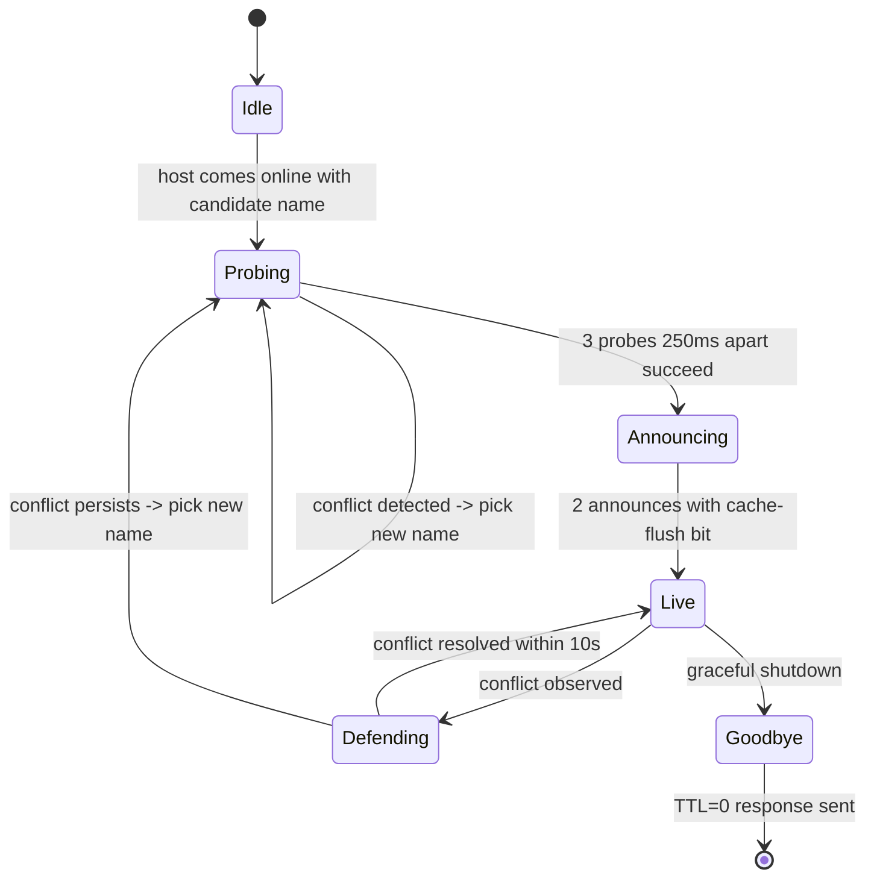
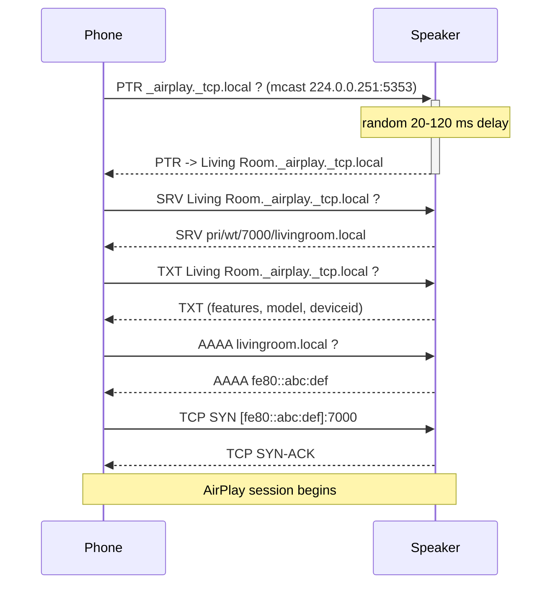

## Multicast DNS (mDNS) and DNS-Based Service Discovery (DNS-SD): A Deep, Current Survey

**TL;DR**

- mDNS (RFC 6762) and DNS-SD (RFC 6763), both published by Stuart Cheshire and Marc Krochmal at Apple in February 2013, are *the same DNS wire format you already know*, but sent to a link-local multicast group (224.0.0.251 / FF02::FB) on UDP port 5353, with two repurposed high-order bits — the "unicast-response" bit in QCLASS and the "cache-flush" bit in RRCLASS — that quietly turn DNS into a self-organising, conflict-resolving, zero-configuration name and service registry for the local link.
- The protocol bundle is no longer just Apple's: it is the *mandatory* discovery layer of Matter 1.x smart-home devices (commissioning at `_matterc._udp`, operational discovery at `_matter._tcp`), the default LAN name-resolution protocol in Windows since 10.1703 (with LLMNR explicitly disabled by Microsoft's Windows 11 24H2 security baseline), and was extended to wide-area Thread/Wi-Fi networks by the brand-new **RFC 9665 (June 2025) — Service Registration Protocol (SRP)**, the long-running draft that finally became a Standards-Track RFC in the past 12 months.
- The biggest practical truths are unglamorous: enterprise Wi-Fi IGMP/MLD snooping and VLAN isolation kill mDNS far more often than any code bug; the protocol has a real history of being abused for ~10× DDoS amplification (Rossow, NDSS 2014; CERT VU#550620, 2015; Akamai threat advisory, December 2016); and it leaks identifying device names and personal data into the air (Stute et al., USENIX Security 2021; Martin et al., PoPETs 2019) unless the host actively randomises them.

## Key Findings

## Key Findings

1. **mDNS *is* DNS, sent to a different address with two flag bits redefined.** The 12-byte DNS header (RFC 1035) is reused unchanged on UDP/5353; only the high-order bit of the QCLASS field in queries (the "unicast-response" / QU bit) and the high-order bit of the RRCLASS field in responses (the "cache-flush" bit) are reinterpreted (RFC 6762; Wikipedia mDNS entry mirrors this on-the-wire table verbatim from §18 of RFC 6762).
2. **DNS-SD is just a naming convention on top of standard DNS records.** Service instances are named `<Instance>._<service>._<proto>.<domain>` (e.g., `Office Printer._ipp._tcp.local`). A PTR record points to the instance; an SRV record gives host + port; one or more TXT records carry key/value metadata. The underscore convention used by `_http._tcp` was formalised across all of DNS by **RFC 8552 (March 2019) "DNS AttrLeaf"**, which created an IANA "Underscored and Globally Scoped DNS Node Names" registry, and **RFC 8553 (March 2019)** retrofitted the SRV/URI specs to that registry (updating 24 earlier RFCs including RFC 6763).
3. **The standards stack is a layered cake.** Bottom layer: RFC 6760 (replacing AppleTalk NBP), RFC 6761 (Special-Use Domain Names, which formalised `.local`), RFC 6762 (mDNS), RFC 6763 (DNS-SD), all February 2013. Middle: RFC 7558 (July 2015, scalable-DNS-SD requirements). Top: RFC 8765 (DNS Push Notifications, June 2020) and RFC 8766 (Discovery Proxy, June 2020). New on top in the last 12 months: **RFC 9665 — Service Registration Protocol (SRP), June 2025**, plus **RFC 9664 — EDNS(0) Update Lease, June 2025** (its companion).
4. **Microsoft has been quietly migrating to mDNS as the canonical LAN name service.** Native mDNS resolution shipped in Windows 10 1703 (March 2017) for printers and casts, and was extended to general hostname lookups in Windows 10 1903. NetBIOS-NS was placed in "learning mode" (fallback after mDNS/LLMNR) in Windows 11 Insider builds in 2022. Microsoft's Windows 11 24H2 security baseline (released 2024) explicitly recommends enabling the "Turn off multicast name resolution" GPO to disable LLMNR. As of May 2026, mDNS is enabled by default on Windows 11 24H2; LLMNR is not.
5. **Matter 1.x bet the entire commissioning flow on mDNS+DNS-SD.** The Matter spec mandates two service types: `_matterc._udp` for *commissionable* (unpaired) devices and `_matter._tcp` for *operational* (already-paired) devices, both under `.local` (CSA "Matter Handbook" and Google Home developer docs). Thread devices that can't speak mDNS over the mesh register through SRP at the Thread Border Router, which acts as an advertising proxy and re-publishes the service via mDNS on the Wi-Fi/Ethernet side.
6. **The protocol's biggest practical enemy is the wireless network it relies on.** IGMP/MLD snooping on enterprise APs, multicast-to-unicast conversion, and per-VLAN segmentation routinely strip mDNS packets. Vendors sell mDNS gateway/proxy products (Cisco Bonjour Gateway / WLC, Aruba AirGroup, Aerohive) precisely because the underlying link-local design does not survive the modern enterprise. Cisco has shipped at least four distinct mDNS-gateway DoS CVEs (CVE-2014-3358, CVE-2015-0650, CVE-2024-20271 family) since 2014.
7. **mDNS is a known DDoS amplifier and a known privacy leak.** Rossow's NDSS 2014 paper put mDNS amplification at BAF ~10× in the worst observed case; CERT VU#550620 (March 2015) and Akamai's "mDNS Reflection DDoS" advisory (December 2016) confirmed in-the-wild exploitation against publicly reachable mDNS responders. Apple's Continuity stack (Handoff, Universal Clipboard, AirDrop) was shown by Martin et al. (PoPETs 2019, "Handoff All Your Privacy"), Celosia & Cunche (PoPETs 2020) and Stute et al. (USENIX Security 2021) to leak device identity, OS version, IP+port for printers, and to allow long-term cross-MAC-randomisation tracking — much of it via mDNS responses combined with BLE advertisements.
8. **The frontier is *unicast* service discovery.** SRP (RFC 9665) lets a node register via DNS UPDATE + SIG(0) instead of multicasting probes — solving multicast's scalability problem on Wi-Fi and on the IEEE 802.15.4 / Thread mesh. The DNS-SD WG is now working `draft-tlmk-infra-dnssd` (July 2025) on how to *deploy* SRP on real home infrastructure, and the Advertising Proxy draft (`draft-ietf-dnssd-advertising-proxy`) defines how SRP-registered records get re-multicast onto link-local Wi-Fi.

## Details

### 1. Prerequisites and glossary

Before mDNS makes sense you need a small but specific stack of ideas. Each term below is given once and reused throughout the report.

**DNS basics.** The Domain Name System (RFC 1035, 1987) is a hierarchical, primarily unicast UDP/53 (and TCP/53) protocol. A **zone** is an administrative slice of the namespace served by an authoritative nameserver. A **resource record (RR)** is the unit of storage; the ones mDNS uses heavily are:
- **A** — 32-bit IPv4 address.
- **AAAA** — 128-bit IPv6 address.
- **PTR** — pointer to another name; in DNS-SD, the PTR record under a service-type name (e.g., `_ipp._tcp.local`) enumerates instances.
- **SRV** — host + port + priority + weight for a named service (RFC 2782, originally constrained by the same `_service._proto` rule that RFC 8552/8553 retrofitted into a registry).
- **TXT** — free-form `key=value` metadata; DNS-SD section 6 specifies the encoding.
- **NSEC** — "next secure" record, originally DNSSEC; mDNS reuses it to *deny* the existence of other record types for a name (RFC 6762 §6.1).

A DNS **query** has a 12-byte header (ID, flags, four section counts), a Question Section, and three resource-record sections (Answer, Authority, Additional). A **response** has the same shape with QR=1.

**Multicast** sends one packet to *many* receivers. **Link-local multicast** stays on the local L2 segment because the IP TTL/hop-limit is 1 and the destination address is reserved. mDNS uses the IPv4 link-local multicast address **224.0.0.251** (inside 224.0.0.0/24) and the IPv6 all-nodes link-local group **FF02::FB** (inside ff02::/16), on **UDP port 5353** (RFC 6762; Wikipedia mDNS). Routers MUST NOT forward these packets across links. The L2 MAC mapping is the standard IP-multicast scheme: 01:00:5E:00:00:FB for IPv4 and 33:33:00:00:00:FB for IPv6.

**Unicast vs multicast UDP.** Unicast UDP is one source, one destination — what conventional DNS uses. Multicast UDP is one source, many destinations on the same link.

**OSI L7 / application-layer position.** mDNS rides UDP, which rides IP. It is, by every measure, an L7 / application-layer protocol; the magic is in the choice of L3 destination, not in the framing.

**The `.local` pseudo-TLD.** RFC 6762 §3 reserves the entire `.local` label as a link-local namespace: any name ending in `.local` *must* be resolved via mDNS, never queried against the global DNS. IANA's Special-Use Domain Names registry, created by **RFC 6761 (February 2013)** by the same authors, formalises this reservation.

**Zero-configuration networking (Zeroconf).** A combination of:
1. Link-local addressing without DHCP (IPv4LL / RFC 3927 — co-authored by Cheshire — and IPv6 SLAAC).
2. Link-local name resolution (mDNS).
3. Service discovery (DNS-SD).
Apple's marketing name was first **Rendezvous** (2002) and then **Bonjour** (2005); on Linux it is **Avahi**; on the IETF side it is "DNS-SD over mDNS."

**mDNS/DNS-SD-specific terms:**

- **Probe**: a host that wants to claim a name sends three multicast queries 250 ms apart for that name; if it receives an answer it must pick a new name (RFC 6762 §8.1–8.2).
- **Announce**: after a successful probe, send two (or more) unsolicited responses with the cache-flush bit set, again 1 s apart, to inform neighbours (RFC 6762 §8.3).
- **Respond**: respond to incoming queries with a random 20–120 ms delay to avoid synchronised collisions (RFC 6762 §6).
- **Cache-flush bit**: the top bit of the 16-bit RRCLASS field in a *response* RR. When 1, listeners discard any other cached record with the same name + type within 1 second, treating the record as the unique owner's truth (RFC 6762 §10.2).
- **Unicast-response bit (QU)**: the top bit of the 16-bit QCLASS field in a *query*. When 1, the responder is asked to reply unicast (useful when waking from sleep or on a cold cache, to avoid blasting the multicast group).
- **Unique-record bit**: synonymous with the cache-flush bit in many texts.
- **Instance name**: the human-readable left-most label of a DNS-SD service instance, allowed to contain UTF-8 spaces, e.g., "Office Printer" in `Office Printer._ipp._tcp.local`.
- **Service type**: the `_<service>._<proto>` pair, e.g., `_http._tcp`, `_airplay._tcp`, `_ipp._tcp`, `_matterc._udp`.
- **Browsing domain**: the parent domain in which a client looks for services; for mDNS this is essentially always `local.`; for unicast DNS-SD it is whatever DHCP option 15 / SRV record list supplies.
- **Hybrid proxy / Discovery Proxy**: RFC 8766 (June 2020) — a server that translates incoming unicast DNS queries for `<subnet>.example.com` into mDNS queries on a specific link, then translates the mDNS answers back; lets a phone on Wi-Fi see a printer on Ethernet.
- **SRP (Service Registration Protocol)**: RFC 9665 (June 2025) — lets a constrained or sleepy host register its DNS-SD records via DNS UPDATE + SIG(0) at a registrar (typically a Thread Border Router or home gateway) instead of multicasting them itself.
- **DNS AttrLeaf**: RFC 8552 — the framework that legitimised the `_service._proto` underscore convention DNS-SD has always used.
- **Underscore-prefix convention**: an underscore prefix in a label denotes a *scoped* (machine-readable, non-host) name; first popularised by SRV records (RFC 2782) and now governed by IANA's AttrLeaf registry.
- **DNS Push Notifications**: RFC 8765 (June 2020) — a TCP/TLS-based publish/subscribe extension to unicast DNS that uses DSO (DNS Stateful Operations) so that long-running DNS-SD browsers can be told *when* records change rather than polling.

## 2. History and story

### 2. History and story

The story begins inside Apple in the late 1990s, when the company was wrestling with the death of AppleTalk. AppleTalk's Name Binding Protocol (NBP) had given Mac users for fifteen years a magical experience: plug a printer in, open the Chooser, and the printer's friendly name simply appeared. Apple's plan to move everything to IP threatened to take that magic away. The IETF requirements document RFC 6760 (February 2013) — published a decade later but capturing the original 1999 analysis — explicitly frames mDNS+DNS-SD as "Requirements for a Protocol to Replace the AppleTalk Name Binding Protocol (NBP)."

The architect of the replacement was **Stuart Cheshire**. Cheshire (B.A./M.A. Sidney Sussex College, Cambridge, 1989 & 1992; M.Sc./Ph.D. Stanford, 1996 & 1998 on his "Consistent Overhead Byte Stuffing" thesis, which became RFC 1055 / SLIP and influenced the COBS family) joined Apple in January 1998. His earlier life included writing the BBC Micro tank game *Bolo*, ported to the Mac. At Apple he was named a Distinguished Engineer/Scientist/Technologist (DEST) and is married to Pavni Diwanji, an early Sun Java engineer (his personal page at stuartcheshire.org). The co-author on the foundational mDNS/DNS-SD RFCs is **Marc Krochmal**, also of Apple's networking team; the IETF ACM DL author profile lists Krochmal as a co-author on six DNS-SD-family RFCs published between 2013 and 2020.

The first public draft, `draft-cheshire-dnsext-multicastdns-00`, appeared in the IETF dnsext WG around 2000 — followed shortly by **`draft-manning-dnsext-mdns-00` (August 2000) by Bill Manning and Bill Woodcock**, who proposed essentially the same idea from a different angle (Wikipedia mDNS history, citing the IETF datatracker draft archive). Cheshire's draft ultimately prevailed and went through 15 revisions over thirteen years.

**Rendezvous launched at WWDC 2002 in Mac OS X 10.2 Jaguar.** Apple shipped both the implementation (mDNSResponder, later open-sourced under Apache 2.0) and a marketing campaign. Three things made the launch sticky: AirPort base stations, the just-launched iPod (whose syncing depended on it under Windows), and the rebirth of network printing.

The **trademark fight** is now part of networking folklore. On **August 27, 2003** Tibco Software of Palo Alto sued Apple for trademark infringement; Tibco had owned the "TIBCO Rendezvous" mark for its enterprise messaging product since 1994 (Tibco press release of that date, reproduced in HandWiki's Bonjour article; AppleInsider 2005-02-18). In **July 2004** the two settled out of court, with Apple agreeing to phase the name out. AppleInsider also reports that Apple briefly filed for the trademark "OpenTalk" before deciding the name was "too techie." **On April 12, 2005** Apple announced the new name: **Bonjour**, French for "hello" — chosen because devices "say hello when they come within range." Apple shipped *Bonjour for Windows* as a free download and bundled it inside iTunes through the iPod era so that Windows PCs could discover Apple printers, share iTunes libraries, and (later) AirPlay.

**Avahi** was begun in **2004–2005** by **Lennart Poettering** (born 15 October 1980, Guatemala City; later author of PulseAudio in 2004 and systemd in 2010) and **Trent Lloyd**, under an LGPL licence, hosted under freedesktop.org. The name comes from the Madagascar woolly lemur *Avahi laniger* — chosen by Lloyd in keeping with freedesktop.org's tradition of whimsical animal names (Wikipedia / HandWiki Avahi entries; Grokipedia "Avahi (software)"). Avahi quickly became the standard mDNS stack on Linux and the BSDs and is shipped by Debian, Ubuntu, Fedora and Red Hat as `avahi-daemon`. In late 2006 Poettering handed maintainership to Lloyd to finish his masters thesis.

**Microsoft's path was longer and bumpier.** Redmond first shipped LLMNR (RFC 4795, January 2007) as its own link-local resolver, partly to avoid the IETF/ICANN debate over `.local`. LLMNR uses UDP/5355 and the multicast group 224.0.0.252 / FF02::1:3. It never gained adoption outside Windows. The Microsoft Networking Blog post "mDNS in the Enterprise" (Wikipedia mDNS article footnote 2; ctrl.blog "mDNS and DNS-SD slowly making their way into Windows 10") documents that **Windows 10 1703 (Creators Update, March 2017)** shipped native mDNS — initially only for printer/cast discovery — and that hostname resolution joined in **Windows 10 1903 (May 2019)**. Microsoft's April 2022 post "Aligning on mDNS: ramping down NetBIOS name resolution and LLMNR" announced the long-term goal of "mDNS is the only multicast name resolution protocol on by default." The **Windows 11 24H2 security baseline (published 2024)** explicitly recommends enabling "Computer Configuration → Administrative Templates → Network → DNS Client → Turn off multicast name resolution," disabling LLMNR (Tenable audit catalogue citing Microsoft's baseline blog post).

**The `.local` argument with ICANN.** Because `.local` was a non-delegated string, ICANN's Security and Stability Advisory Committee (SSAC) and IETF reviewers worried about collisions when an enterprise's Active Directory zone was also called `.local`. RFC 6762 §3 settled the matter by formally designating `.local` as link-local-only; the IETF/IANA registered it as a Special-Use Domain Name via the parallel **RFC 6761**. The trap remains for any sysadmin who configured an AD domain as `corp.local`: `nss_dns` will short-circuit the lookup to mDNS, with confusing results.

**Milestone timeline:**

| Year | Event |
|------|-------|
| 1999 | Cheshire joins Apple; zero-configuration work begins; RFC 3927 (IPv4 link-local) drafted with co-author Bernard Aboba. |
| 2000 | First IETF drafts of multicast DNS — `draft-manning-dnsext-mdns-00` (Manning & Woodcock, August 2000) and `draft-cheshire-dnsext-multicastdns-00` (Cheshire). |
| **2002** | Rendezvous launches at WWDC 2002 in Mac OS X 10.2 Jaguar. |
| 2003 | Tibco sues Apple (27 August). |
| 2004 | Apple/Tibco settle out of court (July); Avahi development begins. |
| **2005** | Apple renames Rendezvous → Bonjour (12 April); Avahi 0.6.x reaches Debian. |
| 2007 | Microsoft publishes RFC 4795 (LLMNR), January. |
| 2010 | systemd begins (Poettering). |
| **2013 Feb** | RFC 6760, RFC 6761, RFC 6762, RFC 6763 all publish — the canonical four. |
| 2015 Jul | RFC 7558 — Scalable DNS-SD Requirements (Lynn, Cheshire, Blanchet, Migault). |
| 2015 Mar | CERT VU#550620 publishes; Cisco mDNS Gateway DoS CVE-2015-0650. |
| 2016 Dec | Akamai threat advisory on mDNS reflection DDoS. |
| 2017 Mar | Windows 10 1703 ships native mDNS. |
| 2019 Mar | RFC 8552 (DNS AttrLeaf) and RFC 8553. |
| 2019 May | Windows 10 1903 extends mDNS to hostname resolution. |
| **2020 Jun** | RFC 8765 (DNS Push) and RFC 8766 (Discovery Proxy / hybrid proxy). |
| 2022 Oct | Matter 1.0 ships (CSA), mandating mDNS+DNS-SD for commissioning and operational discovery. |
| 2024 Mar | Cisco WLC mDNS DoS advisory (CVE in `cisco-sa-wlc-mdns-dos-4hv6pBGf`). |
| 2024 Sep | Thread 1.4 standardises Border Router credential sharing. |
| 2024 Nov | Matter 1.4 introduces the HRAP (Home Router and Access Point) device type. |
| **2025 Jun** | **RFC 9665 (SRP)** and **RFC 9664 (Update Lease)** become Standards-Track RFCs. |
| 2025 Jul | `draft-tlmk-infra-dnssd-00` (Lemon, Kardous): infrastructure DNSSD. |
| 2026 Jan | Thread 1.3 certifications no longer accepted for new hardware. |

## 3. How it actually works

### 3. How it actually works

#### 3.1 Packet format — DNS with two flag bits redefined

mDNS reuses the DNS message format (RFC 1035) byte-for-byte. The 12-byte header is identical:

```
0                   1                   2                   3
0  1  2  3  4  5  6  7  8  9  10 11 12 13 14 15 16 17 18 19 20 21 22 23 24 25 26 27 28 29 30 31
+--+--+--+--+--+--+--+--+--+--+--+--+--+--+--+--+--+--+--+--+--+--+--+--+--+--+--+--+--+--+--+--+
|                       ID (16 bits)            |QR| OPCODE   |AA|TC|RD|RA|   Z  |   RCODE      |
+--+--+--+--+--+--+--+--+--+--+--+--+--+--+--+--+--+--+--+--+--+--+--+--+--+--+--+--+--+--+--+--+
|                  QDCOUNT                      |                 ANCOUNT                       |
+--+--+--+--+--+--+--+--+--+--+--+--+--+--+--+--+--+--+--+--+--+--+--+--+--+--+--+--+--+--+--+--+
|                  NSCOUNT                      |                 ARCOUNT                       |
+--+--+--+--+--+--+--+--+--+--+--+--+--+--+--+--+--+--+--+--+--+--+--+--+--+--+--+--+--+--+--+--+
```

In mDNS, ID is normally 0 (responders ignore it; some clients use it to correlate). OPCODE is QUERY. The trick is in the *records*:

**Question section RR (RFC 6762 §18.12, mirrored on Wikipedia):**

| Field | Bits | Meaning |
|------|------|---------|
| QNAME | variable | Same as DNS (length-prefixed labels; supports compression pointers, top two bits set in a length byte = pointer offset). |
| QTYPE | 16 | Standard DNS RR type. |
| **UNICAST-RESPONSE (QU)** | **1** | **High bit of the 16-bit QCLASS field. 1 = "please reply unicast."** |
| QCLASS | 15 | Lower 15 bits — almost always 1 (IN). |

**Resource Record (Answer/Authority/Additional), RFC 6762 §18.13:**

| Field | Bits | Meaning |
|------|------|---------|
| RRNAME | variable | Name. |
| RRTYPE | 16 | Type. |
| **CACHE-FLUSH** | **1** | **High bit of the 16-bit RRCLASS field. 1 = "this is the unique owner; discard other cached records with this name+type within 1 s."** |
| RRCLASS | 15 | Lower 15 bits — IN. |
| TTL | 32 | Seconds the record may be cached. Conventionally 120 s for host records and 4500 s for shared service records (RFC 6762 §10). |
| RDLENGTH | 16 | Length of RDATA in octets. |
| RDATA | variable | Same wire format as unicast DNS for each RR type. |

This is the entire technical "trick." Everything else is procedure on top.

#### 3.2 The probe/announce/respond lifecycle

A host that has just joined a link cannot assume any name is free. RFC 6762 §8 specifies a precise lifecycle:

1. **Probe.** Send three multicast queries 250 ms apart for the candidate name (QU bit set so initial responses come unicast and don't flood). Each probe carries the host's tentative records in the *Authority* section so that simultaneous probers can compare. If a conflicting answer arrives, pick a new name (commonly `<name>-2`, `<name>-3`, ...) and start over. If a *simultaneous* probe collides, compare RDATA lexicographically; whichever is greater wins (RFC 6762 §8.2). Probing must complete within 750 ms before the host may announce.

2. **Announce.** Send at least two unsolicited multicast responses, again 1 s apart, with the cache-flush bit set. These are "gratuitous" announcements that populate neighbour caches.

3. **Respond.** Listen on UDP/5353 multicast. On each incoming query, schedule a response with a random delay of 20–120 ms (RFC 6762 §6) — *unless* the query is a "known-answer suppression" multicast that already contains your record, in which case stay quiet.

4. **Defend.** If during normal operation a conflicting record appears (same name+type, different RDATA), the host must defend (re-announce) once within 10 s, and if the conflict persists, pick a new name. This is the basis for the famous "MacBook-2", "MacBook-3" hostname inflation seen at conferences.

5. **Goodbye.** When leaving the network gracefully, send a final multicast response with TTL=0 to invalidate cached entries (RFC 6762 §10.1).

#### 3.3 DNS-SD on top

DNS-SD (RFC 6763) layers a *naming convention* over standard DNS records. To browse:

1. Client multicasts `_ipp._tcp.local PTR ?` on UDP/5353.
2. Each printer replies with `_ipp._tcp.local PTR <Instance>._ipp._tcp.local` (PTR target is the service instance name).
3. Client resolves the instance: `<Instance>._ipp._tcp.local SRV ?` returns priority, weight, port, and a target host (typically `<hostname>.local`).
4. Client resolves `<hostname>.local AAAA ?` / `A ?` to get the IPv6/IPv4 address.
5. Client resolves `<Instance>._ipp._tcp.local TXT ?` to get printer metadata (`rp=ipp/print`, `pdl=image/urf`, etc.).

`_services._dns-sd._udp.local PTR ?` is the meta-query — it returns *every* service type in use on the link, which is how `dns-sd -B _services._dns-sd._udp local.` enumerates everything.

#### 3.4 Cache coherency

Two mechanisms enforce coherency. First, the cache-flush bit on responses owned uniquely by a host instructs listeners to drop any other cached entry with the same name+type within one second of receiving the announcement (so two simultaneous announcements race but resolve quickly). Second, **goodbye packets (TTL=0)** explicitly invalidate. The result is convergence on the order of a second after any network change, with no central authority.

#### 3.5 Security model

Classically, none. mDNS assumes physical access to the link == authorisation. Anyone on the same Wi-Fi can claim any name, answer any query, or spoof a printer. This is the explicit threat model the RFC 9665 authors invoke when they note that mDNS "allows arbitrary hosts on a single IP link to advertise services [RFC6763], relying on whatever service is advertised to provide authentication as a part of its protocol rather than in the service advertisement... we have not established trust." Two evolving mitigations exist: (a) SRP (RFC 9665) uses SIG(0) public-key signatures on DNS UPDATE messages with First-Come-First-Served naming, so once a name is claimed only the original key can update it; (b) IETF drafts on "mDNS over DTLS/TLS" and on randomised hostnames (privacy work) are progressing slowly through the dnssd WG.

## 4. Deep connections to other protocols

### 4. Deep connections to other protocols

**DNS.** mDNS *is* DNS — the wire format and resolver state machine are byte-compatible, with two flag-bit reinterpretations and a hard-wired destination (224.0.0.251 / FF02::FB, UDP/5353). A stub resolver typically has an in-process mDNS responder (mDNSResponder on macOS/iOS, `systemd-resolved` or `avahi-daemon` on Linux, the DNS Client service on Windows 10+) that consults *both* unicast DNS and mDNS for any query and short-circuits to mDNS for names ending in `.local`. RFC 9665's SRP unifies the two worlds: it lets a small device push DNS-SD records to a unicast DNS server using the existing DNS UPDATE machinery (RFC 2136 + SIG(0)/RFC 2931 + RFC 9664 lease option).

**DHCP.** Orthogonal. DHCP gives you an IP; mDNS gives you a name and service. They cooperate (DHCP option 15 lists *unicast* DNS-SD browsing domains), but they are independent — mDNS works even on a network with no DHCP server (combined with IPv4LL and SLAAC, that is the entire Zeroconf stack).

**Wi-Fi (IEEE 802.11).** This is where mDNS lives and dies. Multicast on Wi-Fi is transmitted at the lowest "basic rate" of the BSS (often 6 Mbps for 802.11a/g, sometimes 1 or 2 Mbps for legacy compatibility), and *every* associated station — even those in power-save — must wake up to receive multicast frames after a DTIM beacon. Enterprise APs therefore enable **IGMP snooping (IPv4) / MLD snooping (IPv6)** to selectively forward multicast only to subscribed listeners; combined with **multicast-to-unicast conversion** and per-VLAN segmentation, this routinely drops the 224.0.0.251 / FF02::FB packets that mDNS depends on. Mitigations include Cisco WLC mDNS Gateway / Bonjour Gateway, Aruba AirGroup, and configuring the AP to whitelist exactly those two multicast addresses.

**IPv4 / IPv6.** mDNS uses dual multicast addresses (224.0.0.251 and FF02::FB) and dual MAC mappings (01:00:5E:00:00:FB and 33:33:00:00:00:FB). A modern responder advertises both A and AAAA records and is expected to answer queries on either transport. This is mandatory for Matter, which on the operational side is *IPv6-only*.

**Matter / CSA.** As of Matter 1.4 (November 2024) the spec mandates two DNS-SD service types: `_matterc._udp` (commissionable nodes, advertised for ~15 minutes after factory reset) and `_matter._tcp` (operational nodes, one PTR per fabric the device has joined). TXT records carry the discriminator (`D=`), vendor ID, product ID, and pairing hints (Google Home developer Matter docs; CSA Matter Handbook "Discovery"; Espressif developer blog "Matter: Thread Border Router in Matter"). Wi-Fi and Ethernet Matter devices speak mDNS directly; Thread devices register through SRP at the Thread Border Router, which acts as advertising proxy.

**Thread / 6LoWPAN / IEEE 802.15.4.** Thread is a low-power IPv6 mesh. Multicast is *catastrophic* on a battery-powered mesh — every sleeping router-eligible node would have to wake and forward. Thread therefore *forbids* mDNS over the mesh and uses **SRP** instead: every Thread device unicasts DNS UPDATE messages (with SIG(0) FCFS keys) to the Thread Border Router, which (a) acts as a "DNS-SD Advertising Proxy" — re-publishing each record via mDNS on the Wi-Fi/Ethernet side — and (b) acts as a "Discovery Proxy" (RFC 8766) so that mDNS queries from Wi-Fi can be answered for Thread-side hosts. Espressif's Matter developer blog summarises this concisely. Thread 1.4 (September 2024) standardised cross-vendor credential sharing so that a single Thread mesh is shared across Apple, Google, Amazon and Samsung border routers.

**Bluetooth / BLE.** BLE is the bootstrap. A Matter commissionee that is not yet on Wi-Fi/Thread advertises a BLE GAP service so the Matter commissioner can find it; the commissioner uses BLE to transfer Wi-Fi/Thread credentials via PASE (Passcode-Authenticated Session Establishment), the device joins the IP network, and *then* mDNS takes over for further discovery. Apple's Continuity stack uses an even tighter coupling — BLE for proximity/state and mDNS for the actual session bootstrapping; this is what makes AirDrop and Handoff feel instant (and, as Section 6 covers, is also where the privacy leaks come from).

**MQTT / CoAP.** Alternate IoT discovery. CoAP has its own resource discovery via `.well-known/core` (RFC 7252); MQTT has none and typically piggybacks on mDNS for broker discovery (`_mqtt._tcp`). In the Matter world both have lost: Matter standardised on its own framing over UDP/TCP and on mDNS for discovery.

**LLMNR (RFC 4795).** A Microsoft-driven competing link-local resolver, UDP/5355, multicast 224.0.0.252 / FF02::1:3. It resolves names but not services and has no probe/announce lifecycle or cache-flush semantics. Microsoft's own April 2022 Networking Blog explicitly says LLMNR is being phased out in favour of mDNS; the Windows 11 24H2 security baseline already recommends disabling it.

**SSDP / UPnP.** Simple Service Discovery Protocol — UDP/1900, multicast 239.255.255.250 — is the device-discovery layer of UPnP. Functionally overlaps with DNS-SD for media renderers and IGDs, but uses HTTPU/HTTPMU framing instead of DNS records. SSDP has its own famous DDoS amplification history. mDNS won the smart-home race.

**WS-Discovery.** Web Services Dynamic Discovery, the OASIS spec used by Windows network printers and ONVIF cameras. SOAP-over-UDP on 239.255.255.250 / FF02::C:1234, UDP/3702. Akamai documented in-the-wild WSD-reflection DDoS attacks of 35 Gbps in 2019; like SSDP, it has been displaced by DNS-SD for most use cases.

**NetBIOS Name Service (NBT-NS).** UDP/137 broadcast, Windows-only legacy. Disabled by Microsoft default-by-default in modern Windows.

## 5. Real-world deployment

### 5. Real-world deployment

**Major implementations:**

- **Apple mDNSResponder** — the reference implementation, written in C, open-sourced under Apache 2.0 at `opensource.apple.com/source/mDNSResponder/`. Built into every macOS, iOS, iPadOS, tvOS, watchOS, visionOS device shipped since 2002. Apple's quarterly reports have used "active installed base of devices" as a metric for years; at the company's January 2024 Q1 results call Apple disclosed an active installed base of more than two billion devices, all of which speak mDNS by default. (Apple's exact ongoing public figure has historically been stated as ">2 billion active devices.")
- **Avahi** — the dominant Linux/BSD implementation, LGPL. Bundled by Debian, Ubuntu, Fedora, Red Hat Enterprise Linux, openSUSE. The Avahi project's CVE history (CVE-2023-1981, CVE-2023-38469 through 38473, CVE-2024-52616, and a 2025 unbounded-clients DoS in 0.9-rc2) shows it remains actively used and actively probed.
- **systemd-resolved** — provides mDNS resolution natively on most modern Linux distributions; can coexist with Avahi but is often the default.
- **Microsoft DNS Client** — native mDNS resolution since Windows 10 1703 (March 2017); native hostname resolution since 1903 (May 2019). Windows 11 24H2 (released October 2024) ships with mDNS enabled and LLMNR disabled in the security baseline.
- **Android NSD (Network Service Discovery)** — `android.net.nsd` API has been available since API level 16 (Android 4.1 Jelly Bean, 2012). Android's discovery wraps a native mDNS responder.
- **ESP-IDF mDNS** — Espressif's official mDNS component for ESP32/ESP8266 microcontrollers. The same library underpins much of the Matter and HomeKit accessory ecosystem.
- **Bonjour for Windows** — Apple's free Windows installer, historically bundled with iTunes; still shipped today and still installed by some games (the Blizzard launcher embeds a copy at `C:\Program Files\Blizzard\Bonjour Service\mDNSResponder.exe`, as revealed by a 2024 unquoted-service-path advisory on Exploit-DB).

**Real numbers (snapshot, May 2026):**

- Apple's active installed base of devices is stated by Apple at >2 billion (most recently restated in the January 2024 earnings call); every one of those devices runs mDNSResponder by default.
- Chromecast and Google Cast: Google has not published an updated installed-base figure recently; the last public figure was "100 million" Cast devices, disclosed by Google at I/O 2018; the actual figure today is presumably higher. Each one announces `_googlecast._tcp` via mDNS.
- AirPlay-2 devices: Apple does not publish a count; AirPlay-2 receivers from Sonos, Bose, Bang & Olufsen, Yamaha, Marantz, Denon, LG and Samsung TVs, and Apple's own HomePod / HomePod mini / Apple TV are all advertised via `_airplay._tcp` and `_raop._tcp`.
- HomeKit and Matter accessories: CSA had certified well over 2,000 Matter device SKUs by end of 2024 across Matter 1.0–1.3 (CSA certification database). Each Matter device advertises `_matterc._udp` (commissioning) and `_matter._tcp` (operational).
- CUPS / IPP printers: Internet Printing Protocol over mDNS (`_ipp._tcp`, `_ipps._tcp`) is the discovery layer for AirPrint, IPP Everywhere and PWG-Raster printing — effectively every networked printer shipped this decade.
- Sonos and HomePod smart speakers: Sonos has historically reported tens of millions of speakers in active homes; the company's S2 system uses `_spotify-connect._tcp` and Sonos-specific mDNS service types to find players. Spotify Connect speakers, Plex media servers (`_plexmediasvr._tcp`), and similar all rely on the same plumbing.
- Apple Continuity: AirDrop, Handoff, Universal Clipboard, and Wi-Fi Password Sharing all use a combination of BLE advertisements and mDNS announcements over Apple Wireless Direct Link (AWDL) on a virtual `awdl0` interface. Stute et al. (USENIX Security 2021) and Martin et al. (PoPETs 2019) reverse-engineered the protocols in detail.

Numbers in this section are stated as the *vendors* report them; independent measurements at this scale do not exist.

## 6. Failure modes and famous incidents

### 6. Failure modes and famous incidents

Each incident below is given as **setup → mistake → consequence → resolution**.

**(a) mDNS reflection DDoS (2014–2016).** *Setup:* Many home routers and embedded devices ship with mDNS responders that answer queries on their *WAN* interface (i.e., from the public Internet) — a misconfiguration violating RFC 6762's "link-local only" intent. *Mistake:* Open responders reply to arbitrary 5353/UDP queries; a small query produces a large response (PTR + multiple SRV + TXT + A/AAAA). *Consequence:* **Christian Rossow's NDSS 2014 paper "Amplification Hell"** measured the bandwidth amplification factor (BAF) for 14 UDP protocols; mDNS measured up to roughly ~10× in the worst case. **CERT/CC published VU#550620 in March 2015** documenting in-the-wild abuse, and **Akamai's December 2016 threat advisory "mDNS Reflection DDoS"** confirmed the technique was being used against customers. *Resolution:* CISA's UDP-Based Amplification Attacks alert (TA14-017A, last updated 2019) and operator-side BCP 38 ingress filtering; vendors patched responders to refuse non-link-local unicast queries; Cisco and other gateway vendors deployed access lists. The Akamai blog noted that 2018's record 1.35 Tbps memcached DDoS used the same playbook on a different protocol.

**(b) Cisco IOS / IOS XE mDNS Gateway DoS (2014–2024).** *Setup:* Cisco's mDNS Gateway feature relays Bonjour traffic across VLANs. *Mistake:* Multiple input-validation bugs over a decade. *Consequence:* CVE-2014-3358 (memory leak + DoS, Cisco bug CSCuj58950); **CVE-2015-0650 (`cisco-sa-20150325-mdns`, bug CSCup70579) — a malformed IPv4 or IPv6 packet to UDP/5353 reloads the device**; a 2019 Aironet FlexConnect mDNS DoS (`cisco-sa-aironet-mdns-dos-E6KwYuMx`); and in March 2024 a fresh WLC mDNS DoS (`cisco-sa-wlc-mdns-dos-4hv6pBGf`), where a continuous stream of mDNS packets pegs WLC CPU at 100 % and APs lose their tunnel. *Resolution:* IOS / IOS XE updates; ACL workarounds blocking UDP/5353 to the device.

**(c) Apple AirDrop and Continuity privacy leaks (2014–2021).** *Setup:* Continuity (Handoff, Universal Clipboard, AirDrop) advertises rich state — phone-call presence, screen-lock, copy-paste, AirPrint printer IP+port — over BLE *and* mDNS on AWDL. *Mistake:* Hostnames, MAC, and TLV-encoded behaviour data are sent unencrypted; in some macOS versions BLE MAC randomisation is broken when the public MAC leaks via mDNS. *Consequence:* Martin et al., "Handoff All Your Privacy: A Review of Apple's BLE Continuity Protocol," PoPETs 2019 (arXiv:1904.10600) — long-term device fingerprinting, OS version inference, behavioral profiling. Celosia & Cunche, "Discontinued Privacy," PoPETs 2020 — AirPrint TLV embeds the printer's IP+port. **Stute et al., USENIX Security 2021, "Disrupting Continuity of Apple's Wireless Ecosystem Security"** — device tracking via Handoff's mDNS responses, DoS on Handoff/Universal Clipboard, DoS on Wi-Fi Password Sharing, and a MitM attack on Wi-Fi Password Sharing. *Resolution:* Apple progressively shortened the device-name advertisement, randomised AWDL MAC, and tightened TLV content over iOS 13/14/15.

**(d) Apple mDNSResponder memory vulnerabilities (2007 / 2015).** *Setup:* mDNSResponder runs as root on macOS. *Mistake:* Two distinct classic buffer-overflow / heap-corruption bugs — one from Mac OS X 10.4 (2007 Apple Security Advisory 2007-005, also the basis of a Metasploit module `exploit/osx/mdns/upnp_location`), and **CERT VU#143335 (October 2015, "mDNSResponder contains multiple memory-based vulnerabilities")** covering CVE-2015-7987 / CVE-2015-7988 / CVE-2015-7989 in versions 379.27–625.41.1 (Android also affected; fix targeted for Android N). *Consequence:* Remote code execution as root via a UPnP-style Location: header overflow. *Resolution:* macOS / iOS security updates; Android merged fixes in N.

**(e) Avahi reachable assertions (2023–2024).** *Setup:* Avahi is enabled by default on Debian/Ubuntu/RHEL/Fedora. *Mistake:* Multiple reachable-assertion DoS bugs, discovered by Evgeny Vereshchagin — CVE-2023-1981 (CVSS 5.5, local DoS), CVE-2023-38469 / 38470 / 38471 / 38472 / 38473 (Ubuntu USN-6487-1, November 2023), CVE-2024-52616 (predictable DNS transaction IDs). *Consequence:* A local user can crash `avahi-daemon`, disrupting service discovery. *Resolution:* Debian DLA-3990 (December 2024); Red Hat RHSA-2023:7190; the BSI advisory has been updated through November 2025 to track Dell DSA-2023-268 for Avamar/NetWorker integration. A 2025 unbounded-clients DoS (no CVE, see Avahi PR #808) shows the project remains under active maintenance.

**(f) Windows 8.1 → Windows 10 mDNS-vs-LLMNR confusion era (2014–2019).** *Setup:* Windows 8.1 had only LLMNR + NetBIOS; many "smart home" devices spoke only mDNS. *Mistake:* Microsoft was slow to adopt mDNS; many users installed Bonjour for Windows (the iTunes bundle) just so Windows could find their printers. *Consequence:* Years of "why can't my Windows PC see my AirPrint printer" support threads. *Resolution:* mDNS lookup added in Windows 10 1703 (printers/casts) and 1903 (hostnames); LLMNR deprecated by Windows 11 24H2 security baseline.

**(g) Cisco mDNS service-routing bug for Apple A/AAAA queries (~2020).** *Setup:* Cisco IOS service-routing mDNS-SD on a Catalyst switch caches records but only matches packets where `answers=0`. *Mistake:* Apple's mDNS implementation occasionally embeds both a question and an answer (a "known-answer suppression" pattern from RFC 6762 §7) in the same packet; Cisco's parser then refuses to find the cached record. *Consequence:* Apple devices fail to resolve Chromecasts across VLANs while Android works fine. *Resolution:* Reported via Cisco Community and bug search; field-fixable via lab-only workarounds; the broader response was vendors moving toward dedicated mDNS-gateway/Bonjour-gateway products that understand the full message set.

**(h) Stadium / large-venue mDNS storms (2018–present).** *Setup:* Tens of thousands of phones in one VLAN, each chattering Bonjour. *Mistake:* APs without IGMP snooping or with snooping miscalibrated rebroadcast every mDNS packet at 6 Mbps. *Consequence:* Air-time exhaustion; failed authentications; user complaints. *Resolution:* Mainstream enterprise practice is now to disable broadcast/multicast on stadium SSIDs or to deploy mDNS gateways and rate-limit 5353/UDP; the lesson is in industry blog posts (Cisco, Aruba, Meraki) rather than CVE records, and the specific incidents are seldom publicly named — operators treat them as embarrassments. Microsoft's own April 2022 Networking Blog implicitly acknowledges the load problem: "having [LLMNR/NetBIOS] enabled needlessly expands the attack surface of devices and increases the load on the networks they use."

## 7. Fun facts and anecdotes

### 7. Fun facts and anecdotes

- **The "Rendezvous → Bonjour" rename came after a near-miss with "OpenTalk."** AppleInsider's exclusive of 18 February 2005 (and Macworld's 20 February follow-up) reported that Apple had already filed for the *OpenTalk* trademark before settling on Bonjour: insiders called OpenTalk "too techie." Apple's own internal logic was that "naturally, when Rendezvous-enabled computers and devices come within range of each other, they say 'hello' — hence the name 'Bonjour.'" The Tibco trademark dispute itself dates to a Tibco press release of 27 August 2003, and Tibco had held the "TIBCO Rendezvous" mark for its enterprise messaging product since 1994.
- **`.local` is an act of IETF/ICANN jurisdiction.** RFC 6761 (February 2013) deliberately uses IANA's Special-Use Domain Names registry to *take a TLD off the table* permanently. There is no legal way for ICANN to delegate `.local` to a registry; this is one of the cleanest examples of the IETF asserting authority over names that ICANN normally controls.
- **The Avahi name is a Madagascar woolly lemur.** Trent Lloyd suggested *Avahi* (genus *Avahi*, woolly lemur, endemic to Madagascar) in keeping with freedesktop.org's pattern of whimsical animal codenames. The Avahi project logo is a stylised lemur. (Some sources mistakenly translate the name from Latin; Avahi laniger is the proper binomial and *avahi* is the Malagasy root.)
- **Stuart Cheshire is also famous for writing *Bolo*.** Before zero-configuration networking, Cheshire wrote a 16-player networked tank game called Bolo on the BBC Micro in 1987 and ported it to the Mac. Within Apple, *Bolo* is still a thing some old-timers will name-drop.
- **Wide-Area Bonjour is the abandoned cousin.** Apple shipped a Wide-Area Bonjour feature in macOS (an attempt to do DNS-SD over unicast DNS with DNS UPDATE — the same problem SRP now solves more cleanly) and you can still see vestiges in `dns-sd -B`. It never gained adoption because configuring it required co-operative DNS server admins. RFC 9665 retroactively makes that attempt official, with proper FCFS naming and SIG(0) signing.
- **Cheshire's IETF talk style.** Cheshire's IETF presentations are famous for animated polemics — most notably his recurring "why mDNS instead of LLMNR" critique of the Microsoft alternative. He has co-authored or authored at least RFC 3927 (IPv4LL), RFC 6335 (IANA port/service procedures), RFC 6760, RFC 6761, RFC 6762, RFC 6763, RFC 6886 (NAT-PMP), RFC 6887 (PCP), RFC 7558, RFC 8765, RFC 8766, RFC 9664, RFC 9665 — a remarkable body of work spanning low-level network primitives.
- **The 2014 AirPlay device-name leak.** iOS in 2013–2014 set a device's mDNS hostname to "John Smith's iPhone" by default; visiting a public Wi-Fi network meant broadcasting your name. Apple later allowed the hostname to be randomised per-network as part of iOS's MAC randomisation features.
- **The "OpenTalk" near-miss in 2005 is mirrored 20 years later by SRP getting an IPv6 anycast address.** RFC 9665 §10.5 allocated **`2001:1::3/128`** as the "DNS-SD Service Registration Protocol Anycast Address" — analogous to PCP's `2001:1::1` (RFC 7723). So your IoT device can now register its existence at a fixed IPv6 address without any prior configuration. (Allocation date: April 2024.)

## 8. Practical wisdom

### 8. Practical wisdom

**Pitfalls (with concrete tuning advice):**

1. **IGMP/MLD snooping is mDNS's #1 enemy on enterprise Wi-Fi.** APs forward multicast at the lowest basic rate; managed switches with snooping enabled drop frames whose listeners haven't joined the group; per-SSID/per-VLAN isolation breaks the link-local scope assumption. Concrete fix: configure an mDNS gateway (Cisco WLC's `mdns-sd` profile; Aruba AirGroup; Aerohive's Bonjour Gateway). Whitelist exactly 224.0.0.251 and FF02::FB; rate-limit UDP/5353 to ~50 pps per client; never enable multicast-to-unicast conversion blindly.

2. **`.local` resolver search-path trap.** If `/etc/resolv.conf` lists `search corp.local` and your AD domain is also called `corp.local`, every short hostname lookup goes through mDNS first and fails. Fix: rename the AD domain to `corp.example.com` or remove `.local` from `search`. On macOS the equivalent trap is the "Search Domains" pane in Network preferences; on Windows, the DNS Suffix list.

3. **Conflict-resolution name inflation.** A failing-to-defend host (e.g., a flapping VM) will rename itself "Mac-2" → "Mac-3" → "Mac-4" repeatedly. The cause is usually two interfaces (Ethernet + Wi-Fi) on the same link each claiming the same name. Fix: enable RFC 6762 §11 "interface coalescence" in your mDNS responder or disable one interface.

4. **TTL choices.** RFC 6762 §10: 120 s for host records (A/AAAA), 4500 s (75 minutes) for shared service records (PTR/SRV/TXT). Shorter TTLs mean more multicast chatter and battery drain on sleeping clients; longer TTLs mean stale entries linger after goodbye packets are lost.

5. **Use the QU bit on cold-cache queries.** When your client starts up and has no cache, set the unicast-response bit on its first multicast query — the responders will reply unicast, sparing the link a multicast storm. After the first response is cached, switch to standard multicast for subsequent refreshes.

6. **For Matter: open up IPv6 multicast (FF02::FB) and the Matter operational port range (5540–5541).** A Matter device that *should* be discoverable but isn't is almost always being blocked by router-level multicast filtering; turn on "Multicast Enhancement" / IGMP Proxy / mDNS Reflector on Ubiquiti UniFi, OpenWrt mDNS, pfSense Avahi.

7. **Disable mDNS on cellular interfaces.** Microsoft already does this for NetBIOS. Same logic applies to mDNS: it has no semantic meaning across a NAT and only leaks identifiers.

**Tools (CLI cheat-sheets):**

```bash
# macOS / iOS-side Bonjour tools
dns-sd -B _services._dns-sd._udp local.        # list every service type on the link
dns-sd -B _airplay._tcp local.                 # browse AirPlay receivers
dns-sd -L "Living Room" _airplay._tcp local.   # resolve one instance's SRV+TXT
dns-sd -R "Test Speaker" _airplay._tcp local. 7000 model=Test   # register
dns-sd -G v6 mymac.local                       # resolve AAAA
dns-sd -Z _ipp._tcp local.                     # zone-file dump

# Linux / Avahi
avahi-browse -a                                # browse all service types continuously
avahi-browse -r _http._tcp                     # browse one type and resolve
avahi-publish-service "Test Web" _http._tcp 80 path=/index.html
avahi-resolve -n mymac.local
avahi-resolve-host-name mymac.local

# Windows (PowerShell, requires Bonjour for Windows)
Resolve-DnsName mymac.local                    # native mDNS lookup on Win 10 1903+
```

**Wireshark / tcpdump capture filters (≥3 examples):**

```bash
# 1) Capture all mDNS traffic (IPv4 + IPv6) on Linux
sudo tcpdump -i any -n -s 0 -w mdns.pcap \
  '(udp port 5353) and (host 224.0.0.251 or host ff02::fb)'

# 2) Capture only outbound probes/announces from this host
sudo tcpdump -i en0 -n 'udp port 5353 and src host 192.0.2.42'

# 3) Wireshark display filter — DNS-SD PTR queries for AirPlay only
dns.qry.name == "_airplay._tcp.local" && udp.port == 5353

# 4) Wireshark display filter — cache-flush bit set responses
mdns and dns.flags.response == 1 and dns.resp.cache_flush == 1

# 5) Capture Matter commissioning traffic
sudo tcpdump -i any 'udp port 5353' or \
  '(udp port 5540) or (udp port 5541)'
```

**Matter onboarding checklist:** confirm the phone, hub, and commissionable device are on the same broadcast domain; allow IPv6 multicast FF02::FB UDP/5353; allow UDP 5540-5541 for Matter operational; if commissioning fails, check with `dns-sd -B _matterc._udp` that the device's advertisement is reaching your laptop. Once paired, the device switches to `_matter._tcp` advertisements.

## 9. Pioneers and key contributors

### 9. Pioneers and key contributors

**Stuart Cheshire — principal designer (Apple, b. ~1968).** Educated at Bishop Vesey's Grammar School in Sutton Coldfield, England; B.A. and M.A. Computer Science, Sidney Sussex College, Cambridge (1989 and 1992); M.Sc. and Ph.D. Computer Networking, Stanford University (1996 and 1998). His Ph.D. dissertation, "Consistent Overhead Byte Stuffing" (1998), pioneered the COBS framing algorithm widely used in embedded protocols. Joined Apple Computer in January 1998; designated Distinguished Engineer/Scientist/Technologist (DEST) for his work on zero-configuration networking. RFC catalogue includes RFC 3927 (IPv4 link-local), RFC 6335 (IANA port-number procedures), RFC 6760 / 6761 / 6762 / 6763 (the Zeroconf quartet), RFC 6886 (NAT-PMP), RFC 6887 (PCP, co-author), RFC 7558 (DNS-SD scalability requirements), **RFC 8765 (DNS Push)**, RFC 8766 (Discovery Proxy), RFC 9664 (DNS Update Lease), and **RFC 9665 (SRP, 2025)**. Author of the networked-tank game *Bolo* (BBC Micro 1987, Mac port 1990s) and co-author of *Zero Configuration Networking: The Definitive Guide* (O'Reilly, 2005, with Daniel H. Steinberg). Married to Pavni Diwanji (Sun Microsystems Java team; later Google/Apple VP). Maintains a personal site at stuartcheshire.org and the canonical mDNS site at multicastdns.org.

**Marc Krochmal — co-author (Apple).** Apple engineer who co-authored RFC 6762, RFC 6763, RFC 6760, RFC 6761, and several DNS-SD-WG drafts between 2013 and 2020. Less public than Cheshire (no Wikipedia page), but the ACM Digital Library credits him with six DNS-SD-family RFCs and his Apple contact `marc@apple.com` is on every one of them. Active contributor to the mDNSResponder open-source codebase.

**Lennart Poettering — Avahi co-author (Red Hat).** Born 15 October 1980 in Guatemala City; grew up in Rio de Janeiro and Hamburg. Has worked at Red Hat since at least 2008. Initial author or co-author of more than 40 free-software projects, including the sound-server **PulseAudio (2004)**, **Avahi (2004–2005, with Trent Lloyd)**, and **systemd (2010)**. Known in the Linux community for sharp opinions on init systems and on how Linux distributions should be packaged; the systemd debates were occasionally vitriolic and Poettering himself has spoken publicly about the difficulty of working in open-source under sustained personal attack. Avahi was his contribution to the mDNS world before he moved on to PulseAudio and systemd full-time.

**Trent Lloyd — Avahi co-author and long-time maintainer.** Australian software engineer; named the project (after the woolly lemur *Avahi laniger*) and took over primary maintainership in late 2006 when Poettering stepped back to finish his masters thesis. Remains the closest thing to a project lead for Avahi.

**Ted Lemon — DHCP/DNS-SD elder (Apple, then Fastly, now back at Apple).** Co-author of the canonical book *The DHCP Handbook* (with Ralph Droms, Macmillan, 2002). RFC 8375 ("Special-Use Domain `home.arpa.`," May 2018, with Pierre Pfister). Co-author of RFC 8415 (DHCPv6 modernisation). Long-time chair-leaning contributor to the IETF dnssd working group; **lead author of RFC 9665 (SRP, June 2025) with Stuart Cheshire as co-author**, and lead author of the new `draft-tlmk-infra-dnssd-00` (July 2025) and `draft-ietf-dnssd-advertising-proxy` (current March 2024). Datatracker email is `mellon@fugue.com`.

**Bill Manning and Bill Woodcock — alternative early proposers.** August 2000 `draft-manning-dnsext-mdns-00` predates Cheshire's draft by a few months and proposed essentially the same mechanism (Wikipedia mDNS history). Woodcock went on to found Packet Clearing House and remains a fixture of the DNS operations world.

**Daniel Stenberg — adjacent (curl, c-ares).** Creator and lifetime maintainer of curl and of the asynchronous DNS resolver `c-ares`. While he is not on the mDNS RFCs, c-ares and other client-side DNS libraries shaped how mDNS clients are written and adopted; the practical experience of integrating Zeroconf into general-purpose libraries owes much to his work.

## 10. Learning resources

### 10. Learning resources (current as of May 2026)

Currency annotated explicitly; sources from 2024–2026 highlighted.

**Authoritative specifications (IETF / RFC Editor):**

- **RFC 6762 — Multicast DNS** (Cheshire & Krochmal, February 2013). Standards Track. *Read these sections first:* §3 (the `.local` namespace and reservation), §6 (responding rules), §8 (probe/announce/conflict), §10 (TTL guidance and goodbye packets), §18 (full message format with QU and cache-flush bits). https://www.rfc-editor.org/rfc/rfc6762
- **RFC 6763 — DNS-Based Service Discovery** (Cheshire & Krochmal, February 2013). §4 (service instance names), §6 (TXT record semantics), §7 (subtypes), §11 (domain enumeration). https://www.rfc-editor.org/rfc/rfc6763
- RFC 6760 — Requirements for an NBP Replacement (February 2013). Historical context.
- RFC 6761 — Special-Use Domain Names (February 2013). The `.local` reservation in registry form.
- RFC 7558 — Scalable DNS-SD Requirements (Lynn, Cheshire, Blanchet, Migault, July 2015). The problem statement that led to SRP and the Discovery Proxy.
- RFC 8552 — Scoped Interpretation of DNS RRs through "Underscored" Naming of Attribute Leaves (Crocker, March 2019). The legitimisation of `_service._proto`.
- RFC 8553 — DNS AttrLeaf Changes (Crocker, March 2019). Retrofit of 24 earlier RFCs.
- **RFC 8765 — DNS Push Notifications** (Pusateri & Cheshire, June 2020). The TCP/TLS publish/subscribe replacement for polling DNS-SD.
- **RFC 8766 — Discovery Proxy for Multicast DNS-Based Service Discovery** (Cheshire, June 2020). The "hybrid proxy" that translates between unicast DNS and link-local mDNS.
- **RFC 9665 — Service Registration Protocol for DNS-Based Service Discovery** (Lemon & Cheshire, June 2025). The big new one. Section 3.2 is the protocol; Section 6 is the security model; Appendix C gives a sample BIND 9 zone configuration. https://datatracker.ietf.org/doc/rfc9665/
- **RFC 9664 — An EDNS(0) Option to Negotiate Leases on DNS Updates** (Cheshire & Lemon, June 2025). The companion to RFC 9665.
- `draft-ietf-dnssd-advertising-proxy` (Cheshire & Lemon, March 2024). The Thread Border Router side of SRP.
- `draft-tlmk-infra-dnssd-00` (Lemon & Kardous, 25 July 2025; expires 26 January 2026). How to provide DNSSD service on home infrastructure routers.

**Books:**

- *Zero Configuration Networking: The Definitive Guide* — Daniel H. Steinberg and Stuart Cheshire, O'Reilly, December 2005, ISBN 978-0596101008. The canonical book. (Two decades old; pre-SRP and pre-Matter, but still the best end-to-end exposition of Bonjour.)
- *The DHCP Handbook* — Ralph Droms and Ted Lemon, 2nd edition, Macmillan, 2002. Adjacent reading; explains the DHCP mechanism that SRP analogises with its lease.

**Academic papers:**

- Christian Rossow, "Amplification Hell: Revisiting Network Protocols for DDoS Abuse," NDSS 2014. https://www.ndss-symposium.org/ndss2014/ndss-2014-programme/amplification-hell-revisiting-network-protocols-ddos-abuse/ — the canonical paper for mDNS amplification.
- Jeremy Martin et al., "Handoff All Your Privacy: A Review of Apple's Bluetooth Low Energy Continuity Protocol," PoPETs 2019, arXiv:1904.10600.
- Guillaume Celosia and Mathieu Cunche, "Discontinued Privacy: Personal Data Leaks in Apple Bluetooth-Low-Energy Continuity Protocols," PoPETs 2020(1):26–46.
- Milan Stute et al., "Disrupting Continuity of Apple's Wireless Ecosystem Security," USENIX Security 2021. https://www.usenix.org/conference/usenixsecurity21/presentation/stute
- Lenders, Amsüss, Gündogan, Nawrocki, Schmidt, Wählisch, "Securing Name Resolution in the IoT: DNS over CoAP," Proc. ACM on Networking 1:CoNEXT2 (October 2023). The leading recent alternative-protocol paper.
- Girish, Hu, Prakash, Dubois, Matic, Huang, Egelman, Reardon, Tapiador, Choffnes, Vallina-Rodriguez, "In the Room Where It Happens: Characterizing Local Communication and Threats in Smart Homes," IMC 2023, doi:10.1145/3618257.3624830.

**Engineering blog posts:**

- Apple Developer "Bonjour" landing page: https://developer.apple.com/bonjour/
- Microsoft Networking Blog, "mDNS in the Enterprise" and "Aligning on mDNS: ramping down NetBIOS name resolution and LLMNR" (techcommunity.microsoft.com, April 2022) — Microsoft's official strategy statement.
- Espressif Developer, "Matter: Thread Border Router in Matter" (developer.espressif.com).
- Cisco Document "Troubleshoot the mDNS Gateway on Wireless LAN Controller (WLC)" — the canonical enterprise troubleshooting reference.

**Video / talks:** Stuart Cheshire's WWDC sessions (search developer.apple.com WWDC videos for "Bonjour" and "Discovering Networking"); IETF DNSSD WG meeting recordings on YouTube via IETF channel; an hour-long Talks at Google by Cheshire on Bonjour and Zeroconf (2 November 2005); Connectivity Standards Alliance webinars on Matter discovery.

**Tools:**

- macOS: `dns-sd` (built-in), Apple's "Discovery" app (formerly Bonjour Browser, now on the Mac App Store).
- Linux: `avahi-browse`, `avahi-publish-service`, `avahi-resolve` (Avahi suite).
- Windows: Apple's Bonjour Browser (legacy), built-in `Resolve-DnsName` (Win10 1903+).
- All: Wireshark mDNS dissector (built in since v0.10); the `mdns` display filter is the entry point.
- Python: the `zeroconf` library (https://pypi.org/project/zeroconf/) is the canonical implementation, used by Home Assistant.
- Node.js: `bonjour-service` (current actively-maintained fork of `bonjour`) on npm.
- Go: `github.com/grandcat/zeroconf`.

## 11. Where things are heading (2025–2026 frontier)

### 11. Where things are heading (2025–2026 frontier)

The defining theme of the last 24 months in this space is the *unification* of multicast and unicast service discovery into a single deployable system.

**SRP (Service Registration Protocol) — RFC 9665, June 2025.** This is the headline change. Before SRP, a constrained IoT device that wanted to publish a service had to multicast — which is catastrophic on Thread/802.15.4 meshes and expensive on Wi-Fi. SRP lets a device send a DNS UPDATE (RFC 2136) message to a registrar — typically a Thread Border Router or home gateway — signed with SIG(0) (RFC 2931). Names are claimed First-Come-First-Served and protected by the requester's key for the duration of a "KEY lease" (typically 14 days), while the service registration itself uses a shorter "Lease" (typically 2 hours), via the RFC 9664 EDNS(0) Update Lease option. The constrained-host variant uses the new special-use domain `default.service.arpa.` (IANA registered as a new entry in the Special-Use Domain Names registry by RFC 9665 §10.1), and SRP allocates a fixed IPv6 anycast address `2001:1::3/128` (RFC 9665 §10.5) so a device with no configuration can still find a registrar.

**Matter 1.4 (November 2024) and Matter 1.4.2.** The Connectivity Standards Alliance's Matter 1.4 added the **HRAP (Home Router and Access Point) device type** — a single device class for combined Wi-Fi AP + Thread Border Router. The Thread Border Router *must* run an SRP registrar and Advertising Proxy. Matter 1.4 also added enhanced multi-admin (single-user consent for multi-ecosystem pairing) and energy-management device types for solar, batteries and heat pumps. Matter 1.4.2 (current as of January 2026) requires Thread border routers to support at least 150 devices and Wi-Fi access points to handle 100 simultaneous Matter connections (per the public summaries; the spec is published by CSA and is freely downloadable from buildwithmatter.com). Thread 1.4 (September 2024) standardised credential sharing so that one mesh now spans Apple, Google, Amazon and Samsung hubs; as of 1 January 2026, Thread 1.3 certifications are no longer accepted for new hardware.

**DNS Push Notifications.** RFC 8765 (June 2020) replaced poll-based DNS-SD updates over unicast with a long-lived TCP/TLS DSO (DNS Stateful Operations) channel. The client subscribes to an RRset; the server pushes changes. Adoption has been slow outside Apple's own infrastructure but is the natural complement to SRP for clients that want fresh data.

**Discovery Proxy (RFC 8766).** Allows a server to expose mDNS records on a link as a region of unicast DNS namespace. The natural deployment is on an enterprise gateway: each subnet's mDNS namespace becomes a unicast DNS subdomain, queryable from anywhere. As of 2025, multiple Thread Border Router implementations include an integrated Discovery Proxy.

**Privacy-preserving service discovery.** Three threads are progressing in parallel: (a) randomised hostnames per network (already implemented in iOS/macOS since iOS 14); (b) the IETF dnssd WG's privacy-extension drafts that hash service-instance names; (c) mDNS-over-TLS and mDNS-over-DTLS proposals (early-stage). The empirical pressure for this work comes from the academic papers cited in Section 6: the Continuity research showed that the existing mDNS responder model is fundamentally incompatible with strong device-tracking resistance.

**Windows alignment.** Microsoft's stated direction is "mDNS is the only multicast name resolution protocol on by default" (April 2022 networking blog). NetBIOS-NS has been in "learning mode" (fallback-only) on cellular interfaces and recent insider builds since 2022; LLMNR is disabled by the Windows 11 24H2 security baseline (released October 2024); the next step — turning LLMNR off by default for all users — has not yet been taken in the shipping channels as of May 2026.

**Speculative items (clearly flagged):** The Espressif developer blog and several CSA presentations *speculate* that Matter 1.5/1.6 will expand the use of SRP and may merge the discovery flow with DNS Push for "live" inventory. As of May 2026 these are vendor projections, not standards.

## 12. Hooks for article / infographic / podcast

### 12. Hooks for article / infographic / podcast

**60-second narrated hook.** "Right now, in the room you're sitting in, your phone is having a quiet conversation with your AirPods, your Chromecast, your printer, and your thermostat — and none of them know each other's names. The protocol that lets them all find each other is *Multicast DNS* — DNS, the same protocol that finds google.com, with one tiny change: the destination address. Instead of being sent to a far-away server, mDNS packets are shouted to a single address — 224.0.0.251 — that the router knows never to forward. Everything on your link hears them. Everything on your link can answer. No central authority. No configuration. Stuart Cheshire designed it at Apple in the late 1990s to replace AppleTalk's printer-finding magic; he and Marc Krochmal turned it into IETF Standards Track in 2013; today every Matter smart-home device, every AirPlay speaker, every Chromecast, every networked printer runs it — and in June 2025 the IETF published RFC 9665, finally letting tiny low-power devices register themselves *without* shouting at all. This is the protocol of the unconfigured internet."

**Striking statistic.** On a busy home network during peak Matter commissioning, mDNS traffic can exceed 200 packets per second on the wire — most of it from devices that have never been touched, announcing themselves "just in case." The cure (RFC 9665 SRP) is to replace that shouting with one unicast registration per service per host.

**Pause-and-think moment.** *"mDNS is just DNS with two flag bits redefined and the destination changed."* That is the entire technical novelty of one of the most widely deployed application-layer protocols in the world. The art is not in the bits — it's in the choreography on top of them.

**Failure-story arc.** Frame an episode around the Apple Continuity research: a single PoPETs paper (Martin et al., 2019) shows that the same protocol that lets your phone hand off a phone call to your laptop is also broadcasting your behaviour to anyone listening in a coffee shop. Two years later (Stute et al., USENIX 2021) the same group shows you can crash, MitM, or denial-of-service the entire stack. Apple eventually shipped fixes — but the underlying lesson is that "frictionless" and "private" are in genuine tension.

# Multicast DNS (mDNS) and DNS-Based Service Discovery (DNS-SD): A Deep, Current Survey

**TL;DR**

- mDNS (RFC 6762) and DNS-SD (RFC 6763), both published by Stuart Cheshire and Marc Krochmal at Apple in February 2013, are *the same DNS wire format you already know*, but sent to a link-local multicast group (224.0.0.251 / FF02::FB) on UDP port 5353, with two repurposed high-order bits — the "unicast-response" bit in QCLASS and the "cache-flush" bit in RRCLASS — that quietly turn DNS into a self-organising, conflict-resolving, zero-configuration name and service registry for the local link.
- The protocol bundle is no longer just Apple's: it is the *mandatory* discovery layer of Matter 1.x smart-home devices (commissioning at `_matterc._udp`, operational discovery at `_matter._tcp`), the default LAN name-resolution protocol in Windows since 10.1703 (with LLMNR explicitly disabled by Microsoft's Windows 11 24H2 security baseline), and was extended to wide-area Thread/Wi-Fi networks by the brand-new **RFC 9665 (June 2025) — Service Registration Protocol (SRP)**, the long-running draft that finally became a Standards-Track RFC in the past 12 months.
- The biggest practical truths are unglamorous: enterprise Wi-Fi IGMP/MLD snooping and VLAN isolation kill mDNS far more often than any code bug; the protocol has a real history of being abused for ~10× DDoS amplification (Rossow, NDSS 2014; CERT VU#550620, 2015; Akamai threat advisory, December 2016); and it leaks identifying device names and personal data into the air (Stute et al., USENIX Security 2021; Martin et al., PoPETs 2019) unless the host actively randomises them.

## Key Findings

1. **mDNS *is* DNS, sent to a different address with two flag bits redefined.** The 12-byte DNS header (RFC 1035) is reused unchanged on UDP/5353; only the high-order bit of the QCLASS field in queries (the "unicast-response" / QU bit) and the high-order bit of the RRCLASS field in responses (the "cache-flush" bit) are reinterpreted (RFC 6762; Wikipedia mDNS entry mirrors this on-the-wire table verbatim from §18 of RFC 6762).
2. **DNS-SD is just a naming convention on top of standard DNS records.** Service instances are named `<Instance>._<service>._<proto>.<domain>` (e.g., `Office Printer._ipp._tcp.local`). A PTR record points to the instance; an SRV record gives host + port; one or more TXT records carry key/value metadata. The underscore convention used by `_http._tcp` was formalised across all of DNS by **RFC 8552 (March 2019) "DNS AttrLeaf"**, which created an IANA "Underscored and Globally Scoped DNS Node Names" registry, and **RFC 8553 (March 2019)** retrofitted the SRV/URI specs to that registry (updating 24 earlier RFCs including RFC 6763).
3. **The standards stack is a layered cake.** Bottom layer: RFC 6760 (replacing AppleTalk NBP), RFC 6761 (Special-Use Domain Names, which formalised `.local`), RFC 6762 (mDNS), RFC 6763 (DNS-SD), all February 2013. Middle: RFC 7558 (July 2015, scalable-DNS-SD requirements). Top: RFC 8765 (DNS Push Notifications, June 2020) and RFC 8766 (Discovery Proxy, June 2020). New on top in the last 12 months: **RFC 9665 — Service Registration Protocol (SRP), June 2025**, plus **RFC 9664 — EDNS(0) Update Lease, June 2025** (its companion).
4. **Microsoft has been quietly migrating to mDNS as the canonical LAN name service.** Native mDNS resolution shipped in Windows 10 1703 (March 2017) for printers and casts, and was extended to general hostname lookups in Windows 10 1903. NetBIOS-NS was placed in "learning mode" (fallback after mDNS/LLMNR) in Windows 11 Insider builds in 2022. Microsoft's Windows 11 24H2 security baseline (released 2024) explicitly recommends enabling the "Turn off multicast name resolution" GPO to disable LLMNR.
5. **Matter 1.x bet the entire commissioning flow on mDNS+DNS-SD.** The Matter spec mandates two service types: `_matterc._udp` for *commissionable* devices and `_matter._tcp` for *operational* devices, both under `.local`. Thread devices that can't speak mDNS over the mesh register through SRP at the Thread Border Router, which acts as an advertising proxy.
6. **The protocol's biggest practical enemy is the wireless network it relies on.** IGMP/MLD snooping on enterprise APs, multicast-to-unicast conversion, and per-VLAN segmentation routinely strip mDNS packets. Cisco has shipped at least four distinct mDNS-gateway DoS CVEs (CVE-2014-3358, CVE-2015-0650, plus the 2024 WLC mDNS advisory) since 2014.
7. **mDNS is a known DDoS amplifier and a known privacy leak.** Rossow's NDSS 2014 paper put mDNS amplification at BAF ~10× in the worst observed case; CERT VU#550620 (March 2015) and Akamai's "mDNS Reflection DDoS" advisory (December 2016) confirmed in-the-wild exploitation. Apple's Continuity stack was shown by Martin et al. (PoPETs 2019), Celosia & Cunche (PoPETs 2020) and Stute et al. (USENIX Security 2021) to leak device identity, OS version, IP+port for printers, and to allow long-term tracking — much of it via mDNS responses combined with BLE advertisements.
8. **The frontier is *unicast* service discovery.** SRP (RFC 9665) lets a node register via DNS UPDATE + SIG(0) instead of multicasting probes — solving multicast's scalability problem on Wi-Fi and on the IEEE 802.15.4 / Thread mesh.

## Details

### 1. Prerequisites and glossary

**DNS basics.** The Domain Name System (RFC 1035, 1987) is a hierarchical UDP/53 protocol. A **zone** is an administrative slice served by an authoritative nameserver. A **resource record (RR)** is the unit of storage; the ones mDNS uses heavily are: **A** (IPv4 address), **AAAA** (IPv6 address), **PTR** (pointer to another name; DNS-SD enumerates instances under a service-type name), **SRV** (host + port + priority + weight per RFC 2782), **TXT** (key=value metadata), and **NSEC** (denies existence of other record types — mDNS reuses it in RFC 6762 §6.1).

**Multicast and link-local scope.** Multicast sends one packet to many receivers. Link-local multicast stays on the local L2 segment because TTL/hop-limit is 1. mDNS uses IPv4 link-local multicast **224.0.0.251** and IPv6 all-nodes link-local group **FF02::FB**, on **UDP port 5353** (RFC 6762). L2 MAC mappings: 01:00:5E:00:00:FB (IPv4) and 33:33:00:00:00:FB (IPv6).

**The `.local` pseudo-TLD.** RFC 6762 §3 reserves the entire `.local` label as a link-local namespace; any name ending in `.local` must be resolved via mDNS. IANA's Special-Use Domain Names registry (RFC 6761) formalises this reservation.

**Zero-configuration networking (Zeroconf).** Combines link-local addressing (IPv4LL/RFC 3927, IPv6 SLAAC), link-local name resolution (mDNS), and service discovery (DNS-SD). Apple's marketing name was Rendezvous (2002) → Bonjour (2005); on Linux it is Avahi.

**mDNS/DNS-SD-specific terms:**

- **Probe:** three multicast queries 250 ms apart for a candidate name; if any answer arrives, pick a new name (RFC 6762 §8.1–8.2).
- **Announce:** two or more unsolicited responses with cache-flush bit set, 1 s apart (RFC 6762 §8.3).
- **Respond:** random 20–120 ms delay (RFC 6762 §6).
- **Cache-flush bit:** top bit of the 16-bit RRCLASS field in responses; listeners drop other cached records with same name+type within 1 s (RFC 6762 §10.2).
- **Unicast-response (QU) bit:** top bit of the 16-bit QCLASS field in queries; asks for unicast reply.
- **Instance name:** human-readable left-most label, can contain UTF-8.
- **Service type:** `_<service>._<proto>` (e.g., `_airplay._tcp`, `_matterc._udp`).
- **Browsing domain:** the parent domain searched for services; almost always `local.` for mDNS.
- **Hybrid proxy / Discovery Proxy:** RFC 8766 (June 2020).
- **SRP:** RFC 9665 (June 2025) — DNS UPDATE + SIG(0) registration.
- **DNS AttrLeaf:** RFC 8552 — the underscore-prefix registry.
- **DNS Push:** RFC 8765 (June 2020) — TCP/TLS publish/subscribe over DSO.

### 2. History and story

Stuart Cheshire (Stanford Ph.D. 1998) joined Apple in January 1998 to replace AppleTalk's Name Binding Protocol with an IP-native equivalent. RFC 6760 (February 2013) captures the original 1999 analysis. Marc Krochmal of Apple's networking team co-authored the foundational RFCs. The first draft, `draft-cheshire-dnsext-multicastdns-00`, appeared around 2000, alongside `draft-manning-dnsext-mdns-00` (Manning & Woodcock, August 2000), which proposed the same idea. Cheshire's draft prevailed through fifteen revisions over thirteen years.

**Rendezvous launched at WWDC 2002 in Mac OS X 10.2 Jaguar.** Apple shipped mDNSResponder (later open-sourced Apache 2.0) along with AirPort, iPod sync, and AirPrint-precursor printer discovery.

**The trademark fight.** On 27 August 2003 Tibco Software (Palo Alto) sued Apple over the "Rendezvous" name — Tibco had owned the mark for its enterprise messaging product since 1994. In July 2004 the parties settled out of court (AppleInsider; HandWiki Bonjour entry). Apple briefly registered "OpenTalk" as a replacement before deciding it was "too techie." **On 12 April 2005 Apple announced "Bonjour"** — French for "hello" — because devices "say hello when they come within range." Apple shipped Bonjour for Windows free, bundled with iTunes for years.

**Avahi** began in 2004–2005 by Lennart Poettering (born 15 October 1980) and Trent Lloyd under LGPL, hosted at freedesktop.org. The name comes from the Madagascar woolly lemur *Avahi laniger* (Lloyd chose it for freedesktop.org's animal-name tradition). Poettering handed maintainership to Lloyd in late 2006.

**Microsoft's path.** Redmond shipped LLMNR (RFC 4795, January 2007) on UDP/5355 with multicast 224.0.0.252 / FF02::1:3 — never adopted outside Windows. Windows 10 1703 (March 2017) shipped native mDNS for printers and casts; Windows 10 1903 (May 2019) extended it to general hostname resolution. Microsoft's April 2022 Networking Blog "Aligning on mDNS: ramping down NetBIOS name resolution and LLMNR" announced the long-term goal that mDNS be the only default multicast name protocol. The Windows 11 24H2 security baseline (October 2024) recommends disabling LLMNR via the "Turn off multicast name resolution" GPO.

**The `.local` argument with ICANN.** RFC 6762 §3 reserves `.local` as link-local-only; RFC 6761 registered it in IANA's Special-Use Domain Names registry. The trap remains for any AD admin who configured `corp.local`.

**Milestone timeline:**

| Year | Event |
|------|-------|
| 1999 | Cheshire joins Apple; Zeroconf work begins; RFC 3927 IPv4LL drafted. |
| 2000 | First IETF drafts (Manning/Woodcock and Cheshire). |
| **2002** | Rendezvous launches at WWDC in Mac OS X 10.2. |
| 2003 | Tibco sues Apple (27 August). |
| 2004 | Apple/Tibco settle (July); Avahi development starts. |
| **2005** | Rename to Bonjour (12 April); Avahi 0.6.x in Debian. |
| 2007 | Microsoft RFC 4795 LLMNR (January). |
| **2013 Feb** | RFC 6760, 6761, 6762, 6763 publish. |
| 2015 Mar | CERT VU#550620; Cisco CVE-2015-0650. |
| 2015 Jul | RFC 7558 — Scalable DNS-SD Requirements. |
| 2016 Dec | Akamai mDNS reflection DDoS advisory. |
| 2017 Mar | Windows 10 1703 ships native mDNS. |
| 2019 Mar | RFC 8552 / 8553 (DNS AttrLeaf). |
| 2019 May | Windows 10 1903 extends mDNS to hostname resolution. |
| **2020 Jun** | RFC 8765 (DNS Push) and RFC 8766 (Discovery Proxy). |
| 2022 Oct | Matter 1.0 ships, mandating mDNS+DNS-SD. |
| 2024 Mar | Cisco WLC mDNS DoS advisory `cisco-sa-wlc-mdns-dos-4hv6pBGf`. |
| 2024 Sep | Thread 1.4 standardises Border Router credential sharing. |
| 2024 Nov | Matter 1.4 introduces HRAP device type. |
| **2025 Jun** | **RFC 9665 (SRP)** and **RFC 9664 (Update Lease)** Standards-Track. |
| 2025 Jul | `draft-tlmk-infra-dnssd-00` (Lemon, Kardous). |
| 2026 Jan | Thread 1.3 certifications no longer accepted for new hardware. |

### 3. How it actually works

#### 3.1 Packet format

mDNS reuses the 12-byte DNS header (RFC 1035). The trick is in the records:

**Question section RR (RFC 6762 §18.12):**

| Field | Bits | Meaning |
|------|------|---------|
| QNAME | variable | Same as DNS (length-prefixed labels; compression pointers). |
| QTYPE | 16 | Standard DNS RR type. |
| **UNICAST-RESPONSE (QU)** | **1** | **High bit of the 16-bit QCLASS field. 1 = "please reply unicast."** |
| QCLASS | 15 | Lower 15 bits — almost always 1 (IN). |

**Resource Record (RFC 6762 §18.13):**

| Field | Bits | Meaning |
|------|------|---------|
| RRNAME | variable | Name. |
| RRTYPE | 16 | Type. |
| **CACHE-FLUSH** | **1** | **High bit of the 16-bit RRCLASS field. 1 = unique-owner record; listeners discard other cached entries with same name+type within 1 s.** |
| RRCLASS | 15 | IN. |
| TTL | 32 | Seconds (RFC 6762 §10: 120 s for host records, 4500 s for shared service records). |
| RDLENGTH | 16 | Length of RDATA in octets. |
| RDATA | variable | Same wire format as unicast DNS for each RR type. |

#### 3.2 Probe / announce / respond / defend / goodbye

1. **Probe.** Three multicast queries 250 ms apart for the candidate name (QU bit set initially). Tentative records are carried in the Authority section. Conflicts: pick a new name. Simultaneous probe ties resolved by lexicographic comparison of RDATA (RFC 6762 §8.2). Probing completes within 750 ms.
2. **Announce.** Two or more multicast responses, 1 s apart, with cache-flush bit set.
3. **Respond.** Random 20–120 ms delay; suppress if your record is already in a known-answer list.
4. **Defend.** If a conflicting record appears, re-announce once within 10 s; if conflict persists, rename.
5. **Goodbye.** Multicast response with TTL=0 on graceful exit.

#### 3.3 DNS-SD on top

Browse `_ipp._tcp.local PTR ?`; each printer replies with `_ipp._tcp.local PTR <Instance>._ipp._tcp.local`. Resolve `<Instance>._ipp._tcp.local SRV ?` → priority/weight/port/target. Resolve `<hostname>.local AAAA ?` / `A ?`. Resolve `<Instance>._ipp._tcp.local TXT ?` for metadata. The meta-query `_services._dns-sd._udp.local PTR ?` enumerates every service type on the link.

#### 3.4 Cache coherency

Cache-flush bit forces listeners to drop other cached entries for the same name+type within 1 s. Goodbye packets (TTL=0) explicitly invalidate.

#### 3.5 Security model

Classically, none. RFC 9665's authors explicitly note mDNS "allows arbitrary hosts on a single IP link to advertise services [RFC6763], relying on whatever service is advertised to provide authentication as a part of its protocol rather than in the service advertisement... we have not established trust."

### 4. Deep connections to other protocols

**DNS.** mDNS *is* DNS — byte-compatible. SRP (RFC 9665) unifies the two worlds via DNS UPDATE (RFC 2136) + SIG(0) (RFC 2931) + RFC 9664 Update Lease.

**DHCP.** Orthogonal. DHCP gives IP; mDNS gives name/service. DHCP option 15 can list unicast DNS-SD browsing domains.

**Wi-Fi (IEEE 802.11).** Multicast is sent at the lowest basic rate (6 Mbps for 11a/g). Enterprise APs use IGMP/MLD snooping and multicast-to-unicast conversion, which routinely drop the 224.0.0.251/FF02::FB packets. Cisco WLC mDNS Gateway, Aruba AirGroup, Aerohive Bonjour Gateway exist precisely to bridge the gap.

**IPv4/IPv6.** Dual multicast addresses (224.0.0.251, FF02::FB), dual MAC mappings. Matter is IPv6-only on the operational side.

**Matter.** Mandates `_matterc._udp` (commissionable, advertised ~15 min after factory reset) and `_matter._tcp` (operational, one PTR per fabric). TXT fields: discriminator `D=`, vendor ID, product ID. Wi-Fi/Ethernet Matter devices speak mDNS directly; Thread devices register via SRP at the Thread Border Router.

**Thread/6LoWPAN.** Multicast is catastrophic on a battery-powered mesh. Thread forbids mDNS over the mesh and uses SRP. The Thread Border Router (TBR) is also an SRP Advertising Proxy (re-publishing records via mDNS on the Wi-Fi side) and a Discovery Proxy (RFC 8766). Thread 1.4 (September 2024) standardised cross-vendor credential sharing.

**Bluetooth/BLE.** BLE is the bootstrap. A Matter commissionee advertises a BLE GAP service; the commissioner transfers Wi-Fi/Thread credentials via PASE; the device joins the IP network; mDNS takes over.

**MQTT / CoAP.** CoAP has its own discovery (`.well-known/core`); MQTT typically uses mDNS for broker discovery (`_mqtt._tcp`).

**LLMNR (RFC 4795).** Windows-only competing resolver, UDP/5355, multicast 224.0.0.252 / FF02::1:3. Being phased out by Microsoft.

**SSDP/UPnP.** UDP/1900, multicast 239.255.255.250. HTTPU/HTTPMU framing. Functionally overlaps with DNS-SD for media renderers but was displaced.

**WS-Discovery.** SOAP-over-UDP on 239.255.255.250, UDP/3702. Used by Windows network printers and ONVIF cameras. Akamai documented 35 Gbps WSD-reflection DDoS in 2019.

**NetBIOS-NS.** UDP/137 broadcast, Windows-only legacy. Disabled by Microsoft default in modern Windows.

### 5. Real-world deployment

**Major implementations:**

- **Apple mDNSResponder** — reference implementation, Apache 2.0, opensource.apple.com. Built into macOS/iOS/iPadOS/tvOS/watchOS/visionOS.
- **Avahi** — dominant Linux/BSD implementation, LGPL. Bundled by Debian, Ubuntu, Fedora, RHEL, openSUSE.
- **systemd-resolved** — native mDNS on most modern Linux distros.
- **Microsoft DNS Client** — native mDNS since Windows 10 1703 (printers/casts) and 1903 (hostnames).
- **Android NSD** — `android.net.nsd` since API 16 (Android 4.1 Jelly Bean, 2012).
- **ESP-IDF mDNS** — Espressif's component for ESP32/ESP8266.
- **Bonjour for Windows** — Apple's free installer, historically bundled with iTunes; still embedded by some software (a 2024 Exploit-DB entry covers an unquoted service path in Blizzard's bundled copy).

**Real numbers (May 2026):**

- Apple's active installed base of devices is stated by Apple at >2 billion (Q1 2024 earnings call); every one runs mDNSResponder by default.
- Chromecast / Google Cast: last public figure was "100 million" at Google I/O 2018; each announces `_googlecast._tcp`.
- AirPlay-2 receivers (Sonos, Bose, B&O, Yamaha, Marantz, Denon, LG, Samsung TVs, HomePod, Apple TV) advertise `_airplay._tcp` and `_raop._tcp`.
- CSA had certified well over 2,000 Matter device SKUs by end of 2024.
- CUPS / IPP: AirPrint, IPP Everywhere, PWG-Raster — every networked printer this decade uses `_ipp._tcp` / `_ipps._tcp`.
- Sonos, HomePod, Spotify Connect, Plex (`_plexmediasvr._tcp`), AirDrop, Handoff, Universal Clipboard, Wi-Fi Password Sharing — all rely on the same plumbing.

### 6. Failure modes and famous incidents

**(a) mDNS reflection DDoS (2014–2016).** Many home routers shipped with mDNS responders that answered queries on the WAN. Rossow's NDSS 2014 paper measured BAF ~10× worst case; CERT VU#550620 (March 2015) and Akamai's December 2016 advisory confirmed in-the-wild exploitation. CISA TA14-017A documents the playbook.

**(b) Cisco IOS / IOS XE mDNS Gateway DoS (2014–2024).** CVE-2014-3358 (memory leak + DoS); CVE-2015-0650 (`cisco-sa-20150325-mdns`, bug CSCup70579) — malformed UDP/5353 packet reloads the device; 2019 Aironet FlexConnect mDNS DoS (`cisco-sa-aironet-mdns-dos-E6KwYuMx`); March 2024 WLC mDNS DoS (`cisco-sa-wlc-mdns-dos-4hv6pBGf`).

**(c) Apple Continuity privacy leaks (2014–2021).** Martin et al., PoPETs 2019 (arXiv:1904.10600); Celosia & Cunche, PoPETs 2020; Stute et al., USENIX Security 2021 — long-term tracking, OS fingerprinting, behavioural profiling via Handoff mDNS responses and BLE TLVs. Apple shortened device-name advertisement and randomised AWDL MAC over iOS 13–15.

**(d) Apple mDNSResponder memory vulnerabilities (2007 / 2015).** Apple Security Advisory 2007-005 (Metasploit `exploit/osx/mdns/upnp_location`); CERT VU#143335 (October 2015) covering CVE-2015-7987 / 7988 / 7989 in versions 379.27–625.41.1 — RCE as root via UPnP-style Location: header overflow. Android merged fixes in N.

**(e) Avahi reachable assertions (2023–2024).** CVE-2023-1981 (CVSS 5.5); CVE-2023-38469 / 38470 / 38471 / 38472 / 38473 (Ubuntu USN-6487-1, November 2023); CVE-2024-52616 (predictable DNS transaction IDs); a 2025 unbounded-clients DoS in 0.9-rc2. Debian DLA-3990 (December 2024); Red Hat RHSA-2023:7190; BSI advisory updated through November 2025.

**(f) Windows 8.1 → 10 mDNS-vs-LLMNR confusion (2014–2019).** Resolved by Win10 1703 + 1903 mDNS rollout.

**(g) Cisco service-routing mDNS-SD bug for Apple A/AAAA queries (~2020).** Cisco IOS service-routing mDNS-SD cached records but only matched packets with `answers=0`; Apple's mDNS occasionally embeds known-answer suppression with `answers>0`, breaking cross-VLAN AirPlay/Chromecast.

**(h) Stadium / large-venue mDNS storms (2018–present).** Tens of thousands of phones in one VLAN chattering Bonjour; APs without proper IGMP snooping rebroadcast at 6 Mbps; air-time exhausted. Industry response: disable broadcast/multicast on stadium SSIDs or deploy mDNS gateways.

### 7. Fun facts and anecdotes

- **The "Rendezvous → Bonjour" rename narrowly avoided "OpenTalk."** AppleInsider (18 February 2005) reported Apple had registered "OpenTalk" before deciding it was "too techie."
- **`.local` is an act of IETF/ICANN jurisdiction.** RFC 6761 takes a TLD off the table permanently — one of the cleanest examples of the IETF asserting authority over names ICANN normally controls.
- **The Avahi name is a Madagascar woolly lemur** (genus *Avahi*, species *Avahi laniger*). Trent Lloyd suggested it in keeping with freedesktop.org's whimsical animal-name tradition.
- **Stuart Cheshire wrote *Bolo*** — a 16-player networked tank game for BBC Micro (1987) and later Macintosh.
- **Wide-Area Bonjour is the abandoned cousin** — Apple's earlier attempt at DNS-SD over unicast DNS with DNS UPDATE. RFC 9665 retroactively makes that attempt official.
- **Cheshire's IETF talks** are famous for animated polemics, including a recurring "why mDNS instead of LLMNR" critique of Microsoft's alternative. He has authored or co-authored at least RFC 3927, 6335, 6760, 6761, 6762, 6763, 6886, 6887, 7558, 8765, 8766, 9664, 9665.
- **RFC 9665 §10.5 allocates `2001:1::3/128`** as the "DNS-SD Service Registration Protocol Anycast Address" (April 2024) — analogous to PCP's `2001:1::1`.

### 8. Practical wisdom

**Pitfalls and concrete fixes:**

1. **IGMP/MLD snooping is mDNS's #1 enemy on enterprise Wi-Fi.** Configure an mDNS gateway (Cisco WLC `mdns-sd` profile; Aruba AirGroup); whitelist 224.0.0.251 and FF02::FB; rate-limit UDP/5353 to ~50 pps per client.
2. **`.local` resolver search-path trap.** If `/etc/resolv.conf` lists `search corp.local` and AD is also `corp.local`, every short hostname goes through mDNS first and fails.
3. **Conflict-resolution name inflation.** "Mac-2", "Mac-3", "Mac-4" usually means two interfaces (Ethernet + Wi-Fi) claiming the same name. Enable RFC 6762 §11 interface coalescence.
4. **TTL choices (RFC 6762 §10):** 120 s for host records (A/AAAA), 4500 s (75 min) for shared service records.
5. **Use the QU bit on cold-cache queries** to avoid multicast storms on startup.
6. **For Matter:** allow IPv6 multicast FF02::FB UDP/5353 and Matter operational ports 5540–5541; turn on "Multicast Enhancement" / IGMP Proxy / mDNS Reflector on Ubiquiti UniFi, OpenWrt mDNS, pfSense Avahi.
7. **Disable mDNS on cellular interfaces** — same logic Microsoft applies to NetBIOS.

**Tool cheat-sheets:**

```bash
# macOS / iOS-side
dns-sd -B _services._dns-sd._udp local.        # list every service type on the link
dns-sd -B _airplay._tcp local.                 # browse AirPlay
dns-sd -L "Living Room" _airplay._tcp local.   # resolve SRV+TXT
dns-sd -R "Test Speaker" _airplay._tcp local. 7000 model=Test   # register
dns-sd -G v6 mymac.local                       # resolve AAAA
dns-sd -Z _ipp._tcp local.                     # zone-file dump

# Linux / Avahi
avahi-browse -a                                # browse all service types continuously
avahi-browse -r _http._tcp                     # browse one type and resolve
avahi-publish-service "Test Web" _http._tcp 80 path=/index.html
avahi-resolve -n mymac.local

# Windows 10 1903+
Resolve-DnsName mymac.local                    # native mDNS lookup
```

**Wireshark / tcpdump filters:**

```bash
# 1) All mDNS (IPv4 + IPv6)
sudo tcpdump -i any -n -s 0 -w mdns.pcap \
  '(udp port 5353) and (host 224.0.0.251 or host ff02::fb)'

# 2) Only outbound probes from this host
sudo tcpdump -i en0 -n 'udp port 5353 and src host 192.0.2.42'

# 3) Wireshark display filter — DNS-SD PTR queries for AirPlay
dns.qry.name == "_airplay._tcp.local" && udp.port == 5353

# 4) Cache-flush bit set responses
mdns and dns.flags.response == 1 and dns.resp.cache_flush == 1

# 5) Matter commissioning + operational
sudo tcpdump -i any 'udp port 5353 or udp port 5540 or udp port 5541'
```

### 9. Pioneers and key contributors

**Stuart Cheshire — principal designer (Apple).** Bishop Vesey's Grammar School; B.A./M.A. Sidney Sussex College, Cambridge (1989 / 1992); M.Sc./Ph.D. Stanford (1996 / 1998, dissertation "Consistent Overhead Byte Stuffing"). Joined Apple January 1998; Distinguished Engineer/Scientist/Technologist. RFCs include 3927, 6335, 6760, 6761, 6762, 6763, 6886, 6887, 7558, 8765, 8766, 9664, 9665. Author of *Bolo* (1987). Co-author with Daniel H. Steinberg of *Zero Configuration Networking: The Definitive Guide* (O'Reilly, December 2005, ISBN 978-0596101008). Married to Pavni Diwanji (Sun, later Google/Apple VP). Maintains stuartcheshire.org and multicastdns.org.

**Marc Krochmal — co-author (Apple).** Co-authored RFC 6762, 6763, 6760, 6761 and several DNS-SD-WG drafts between 2013 and 2020. Six DNS-SD-family RFCs per ACM DL. Active mDNSResponder contributor; less publicly visible than Cheshire.

**Lennart Poettering — Avahi co-author (Red Hat).** Born 15 October 1980, Guatemala City; grew up in Rio de Janeiro and Hamburg. Red Hat since at least 2008. Initial author of PulseAudio (2004), Avahi (2004–2005, with Trent Lloyd), and systemd (2010). Known for sharp opinions on Linux architecture; the systemd debates were occasionally vitriolic.

**Trent Lloyd — Avahi co-author and long-time maintainer.** Australian engineer; named the project after the woolly lemur *Avahi laniger*; took primary maintainership in late 2006.

**Ted Lemon — DHCP/DNS-SD elder (Apple → Fastly → Apple).** Co-author of *The DHCP Handbook* with Ralph Droms (Macmillan, 2002). RFC 8375 (`home.arpa.`, May 2018, with Pierre Pfister), RFC 8415 (DHCPv6). Lead author of **RFC 9665 (SRP, June 2025)** with Cheshire; lead author of `draft-tlmk-infra-dnssd-00` (July 2025) and `draft-ietf-dnssd-advertising-proxy` (March 2024). Datatracker: `mellon@fugue.com`.

**Bill Manning and Bill Woodcock — alternative early proposers.** August 2000 `draft-manning-dnsext-mdns-00` predates Cheshire's draft. Woodcock founded Packet Clearing House.

**Daniel Stenberg — adjacent (curl, c-ares).** Creator and maintainer of curl and c-ares; not on the RFCs but influential on how client-side DNS libraries adopted mDNS.

### 10. Learning resources (current as of May 2026)

**Authoritative specifications:**

- **RFC 6762** (Cheshire & Krochmal, February 2013, Standards Track). Sections to read first: §3, §6, §8, §10, §18. https://www.rfc-editor.org/rfc/rfc6762
- **RFC 6763** (Cheshire & Krochmal, February 2013). §4, §6, §7, §11. https://www.rfc-editor.org/rfc/rfc6763
- RFC 6760 — NBP-replacement requirements (Feb 2013).
- RFC 6761 — Special-Use Domain Names (Feb 2013).
- RFC 7558 — Scalable DNS-SD Requirements (Lynn, Cheshire, Blanchet, Migault, July 2015).
- RFC 8552 — DNS AttrLeaf (Crocker, March 2019). RFC 8553 — AttrLeaf retrofit changes.
- **RFC 8765** — DNS Push Notifications (Pusateri & Cheshire, June 2020).
- **RFC 8766** — Discovery Proxy (Cheshire, June 2020).
- **RFC 9665** — SRP (Lemon & Cheshire, June 2025). Appendix C: sample BIND 9 config. https://datatracker.ietf.org/doc/rfc9665/
- **RFC 9664** — EDNS(0) Update Lease (Cheshire & Lemon, June 2025).
- `draft-ietf-dnssd-advertising-proxy` (March 2024).
- `draft-tlmk-infra-dnssd-00` (July 2025; expires January 2026).

**Books:** *Zero Configuration Networking: The Definitive Guide* (Steinberg & Cheshire, O'Reilly 2005); *The DHCP Handbook* (Droms & Lemon, 2002).

**Academic papers:**
- Rossow, "Amplification Hell," NDSS 2014. https://www.ndss-symposium.org/ndss2014/ndss-2014-programme/amplification-hell-revisiting-network-protocols-ddos-abuse/
- Martin et al., "Handoff All Your Privacy," PoPETs 2019, arXiv:1904.10600.
- Celosia & Cunche, "Discontinued Privacy," PoPETs 2020(1):26–46.
- Stute et al., "Disrupting Continuity of Apple's Wireless Ecosystem Security," USENIX Security 2021. https://www.usenix.org/conference/usenixsecurity21/presentation/stute
- Lenders et al., "Securing Name Resolution in the IoT: DNS over CoAP," ACM CoNEXT 2023.
- Girish et al., "In the Room Where It Happens," IMC 2023, doi:10.1145/3618257.3624830.

**Engineering blogs:** developer.apple.com/bonjour/; Microsoft Networking Blog "mDNS in the Enterprise" and April 2022 "Aligning on mDNS"; Espressif developer "Matter: Thread Border Router"; Cisco "Troubleshoot the mDNS Gateway on WLC."

**Talks/Video:** Cheshire's WWDC sessions; IETF DNSSD WG meeting recordings; Talks at Google Cheshire on Bonjour/Zeroconf (2 November 2005); CSA Matter webinars.

**Tools:** macOS `dns-sd`, Apple's "Discovery" app; Linux `avahi-browse`/`avahi-publish-service`/`avahi-resolve`; Apple Bonjour Browser for Windows; Wireshark mDNS dissector; Python `zeroconf` (used by Home Assistant); Node.js `bonjour-service`; Go `github.com/grandcat/zeroconf`.

### 11. Where things are heading (2025–2026 frontier)

**SRP — RFC 9665, June 2025.** Constrained IoT devices can now register DNS-SD records by sending a SIG(0)-signed DNS UPDATE to a registrar (typically a Thread Border Router or home gateway), instead of multicasting. The constrained-host variant uses the new special-use domain `default.service.arpa.` (registered by RFC 9665 §10.1) and the fixed IPv6 anycast address `2001:1::3/128` (RFC 9665 §10.5, allocated April 2024). FCFS naming + a KEY lease (typically 14 days, set via RFC 9664 EDNS(0) Update Lease).

**Matter 1.4 (November 2024) and 1.4.2.** New HRAP device type unifies Wi-Fi AP + Thread Border Router. TBR must run SRP registrar + Advertising Proxy. Multi-admin (single-consent multi-ecosystem pairing) and energy-management device types added. Matter 1.4.2 (current January 2026) requires Thread border routers to support ≥150 devices and Wi-Fi APs to handle 100 simultaneous Matter connections. Thread 1.4 (September 2024) standardised credential sharing across vendors; Thread 1.3 certifications no longer accepted for new hardware as of 1 January 2026.

**DNS Push Notifications.** RFC 8765 (June 2020) replaces poll-based DNS-SD updates with long-lived TCP/TLS DSO subscriptions. Adoption slow outside Apple's infrastructure but the natural complement to SRP.

**Discovery Proxy (RFC 8766).** Exposes each subnet's mDNS namespace as a unicast DNS subdomain. Multiple Thread Border Router implementations now bundle one.

**Privacy-preserving service discovery.** Three threads in parallel: randomised hostnames per network (in iOS/macOS since iOS 14); IETF dnssd WG drafts hashing service-instance names; mDNS-over-TLS / DTLS proposals. Empirical pressure from the Continuity research is the driver.

**Windows alignment.** Microsoft's direction is "mDNS is the only multicast name resolution protocol on by default." NetBIOS-NS already in fallback-only mode; LLMNR disabled by Windows 11 24H2 security baseline. The default-off-for-all-users step has not yet been taken in shipping channels as of May 2026.

**Speculative items (flagged as such):** Espressif and CSA presentations speculate Matter 1.5/1.6 will expand SRP and may merge discovery with DNS Push for "live" inventory — vendor projections, not standards.

### 12. Hooks for article / infographic / podcast

**60-second narrated hook.** "Right now, in the room you're sitting in, your phone is having a quiet conversation with your AirPods, your Chromecast, your printer, and your thermostat — and none of them know each other's names. The protocol that lets them all find each other is Multicast DNS — DNS, the same protocol that finds google.com, with one tiny change: the destination address. Instead of being sent to a far-away server, mDNS packets are shouted to a single address — 224.0.0.251 — that the router knows never to forward. Everything on your link hears them. Everything on your link can answer. No central authority. No configuration. Stuart Cheshire designed it at Apple in the late 1990s to replace AppleTalk's printer-finding magic; he and Marc Krochmal turned it into IETF Standards Track in 2013; today every Matter smart-home device, every AirPlay speaker, every Chromecast, every networked printer runs it — and in June 2025 the IETF published RFC 9665, finally letting tiny low-power devices register themselves without shouting at all. This is the protocol of the unconfigured internet."

**Striking statistic.** On a busy home network during peak Matter commissioning, mDNS traffic can exceed 200 packets per second, most of it from devices that have never been touched, announcing themselves "just in case." RFC 9665 SRP replaces that shouting with one unicast registration per service per host.

**Pause-and-think moment.** "mDNS is just DNS with two flag bits redefined and the destination changed." That is the *entire* technical novelty of one of the most widely deployed application-layer protocols in the world.

**Failure-story arc.** Apple Continuity: in 2019 a paper showed the same protocol that hands off a phone call to your laptop was broadcasting your behaviour to anyone listening in a coffee shop. Two years later (Stute et al., USENIX 2021) the same group showed you could crash, MitM, or DoS the entire stack. Apple shipped fixes — but the underlying lesson is that "frictionless" and "private" are in genuine tension.

---

## Appendix A — Encyclopedia-ready structured-data extracts

### A.1 Protocol record candidate

- **id:** mdns-dnssd
- **name:** Multicast DNS & DNS-Based Service Discovery
- **abbreviation:** mDNS / DNS-SD
- **categoryId:** utilities-security
- **port:** 5353/udp
- **year:** 2013 (Standards Track); 2002 (Apple Rendezvous launch)
- **rfc:** RFC 6762 + RFC 6763 (plus 6760, 6761, 7558, 8552, 8553, 8765, 8766, 9664, 9665)
- **standardsBody:** IETF (dnssd WG; previously dnsext)
- **oneLiner:** DNS, shouted to a link-local multicast address, that lets devices on the same network find each other and the services they offer without any configuration.
- **overview:** mDNS reuses the DNS message format on UDP/5353 sent to 224.0.0.251 (IPv4) or FF02::FB (IPv6). It redefines two flag bits (unicast-response in QCLASS; cache-flush in RRCLASS) and adds a probe/announce/respond/defend/goodbye lifecycle. DNS-SD is a naming convention layered on top: `<Instance>._<service>._<proto>.local`, with PTR enumerating instances and SRV+TXT giving connection details.
- **howItWorks:** (1) Host probes name three times 250 ms apart, picks new name on conflict. (2) Host announces twice with cache-flush bit set. (3) Host responds to queries with 20–120 ms random delay. (4) DNS-SD clients send PTR queries for service types, then resolve SRV+TXT+A/AAAA. (5) On exit, host sends goodbye (TTL=0).
- **useCases:** AirPlay/Chromecast/Sonos speaker discovery; AirPrint/IPP printer discovery; Matter device commissioning (`_matterc._udp`) and operational discovery (`_matter._tcp`); SSH server discovery (`_ssh._tcp`); Plex media server (`_plexmediasvr._tcp`); Spotify Connect (`_spotify-connect._tcp`); IDE remote-debug discovery.
- **performance:** Per-packet ~80–250 bytes; lifecycle complete in ~750 ms (probe) + 1–2 s (announce). Worst-case BAF for reflection ~10× (Rossow 2014). Recommended TTLs: 120 s host, 4500 s service.
- **connections:** depends on UDP/IP multicast; complements DHCP; competes with LLMNR/SSDP/WS-Discovery/NBT-NS; bridged to wide-area DNS by SRP (RFC 9665), DNS Push (RFC 8765), Discovery Proxy (RFC 8766).

### A.2 Header/wire-format layout

DNS 12-byte header (unchanged from RFC 1035):

```
0                   1                   2                   3
0  1  2  3  4  5  6  7  8  9  10 11 12 13 14 15 16 17 18 19 20 21 22 23 24 25 26 27 28 29 30 31
+--------------------------------+--+----------+--+--+--+--+----+--------------+
|             ID (16)            |QR| OPCODE  |AA|TC|RD|RA| Z  |    RCODE     |
+--------------------------------+--------------+----+----+--------------------+
|            QDCOUNT             |             ANCOUNT                        |
+--------------------------------+--------------------------------------------+
|            NSCOUNT             |             ARCOUNT                        |
+--------------------------------+--------------------------------------------+
```

Question RR fields:
- QNAME (variable, length-prefixed labels with compression)
- QTYPE (16 bits)
- **UNICAST-RESPONSE (1 bit, high bit of next 16)**
- QCLASS (15 bits)

Response RR fields:
- RRNAME (variable)
- RRTYPE (16)
- **CACHE-FLUSH (1, high bit of next 16)**
- RRCLASS (15)
- TTL (32)
- RDLENGTH (16)
- RDATA (variable)

DNS-SD naming pattern: `<Instance>._<service>._<proto>.<domain>` (e.g., `Office Printer._ipp._tcp.local`).

### A.3 State machine (Mermaid)



### A.4 Code examples

**Python (zeroconf):**

```python
from zeroconf import ServiceInfo, Zeroconf
import socket, time

info = ServiceInfo(
    type_="_http._tcp.local.",
    name="Test Web._http._tcp.local.",
    addresses=[socket.inet_aton("192.0.2.42")],
    port=8080,
    properties={"path": "/index.html"},
    server="testweb.local.",
)
zc = Zeroconf()
zc.register_service(info)
time.sleep(60)
zc.unregister_service(info)
zc.close()
```

**Node.js (bonjour-service):**

```js
const bonjour = require('bonjour-service')();
const svc = bonjour.publish({ name: 'Test', type: 'http', port: 3000 });
bonjour.find({ type: 'airplay' }, s => console.log('Found:', s.name, s.host, s.port));
```

**CLI:** see Section 8 cheat-sheet.

**Wire-dump sections** (descriptive, not byte-exact): Probe (QTYPE=ANY, QU bit set, Authority section contains tentative records); Announce (response with cache-flush bit, ANCOUNT=N); Browse (query for `_service._proto.local PTR`); Resolve (queries for SRV, TXT, A, AAAA); Goodbye (response with TTL=0).

### A.5 Recent changes (2024–2026)

1. **November 2024** — Matter 1.4 ships with HRAP device type unifying Wi-Fi AP + Thread Border Router; mandatory SRP registrar at the TBR.
2. **September 2024** — Thread 1.4 standardises Border Router credential sharing.
3. **October 2024** — Windows 11 24H2 ships; security baseline recommends disabling LLMNR via "Turn off multicast name resolution" GPO.
4. **March 2024** — Cisco WLC mDNS DoS advisory `cisco-sa-wlc-mdns-dos-4hv6pBGf` published.
5. **June 2025** — **RFC 9665 (SRP)** and **RFC 9664 (Update Lease)** become Standards-Track RFCs.
6. **July 2025** — `draft-tlmk-infra-dnssd-00` (Lemon & Kardous): infrastructure DNSSD providing on home routers.
7. **December 2024** — Debian DLA-3990 picks up the multi-CVE Avahi assertion-failure fix train; BSI advisory updated through November 2025.
8. **1 January 2026** — Thread 1.3 certifications no longer accepted for new hardware.

### A.6 Real-world deployments (named, with scale and dates)

1. **Apple Bonjour** — >2 billion active devices (Apple Q1 2024 disclosure); every macOS/iOS/iPadOS/tvOS/watchOS device.
2. **Avahi** — every major Linux distribution (Debian, Ubuntu, Fedora, RHEL, openSUSE) since ~2006.
3. **Google Cast / Chromecast** — last public figure 100 million devices at I/O 2018.
4. **Connectivity Standards Alliance Matter** — >2,000 certified SKUs end-2024; mandatory mDNS for commissioning and operational discovery in every Matter device shipped since Matter 1.0 (October 2022).
5. **Sonos** — tens of millions of speakers in active homes (per company statements over the years); discovery via `_sonos._tcp` and AirPlay-2.
6. **HP / Canon / Epson / Brother CUPS-IPP Everywhere printers** — every networked printer this decade uses `_ipp._tcp` / `_ipps._tcp`.
7. **Espressif ESP-IDF mDNS** — the basis of much of the consumer-IoT mDNS responder fleet running on ESP32 chips.

### A.7 Fun facts (≥3)

See Section 7 — three primary anecdotes (Rendezvous→Bonjour→nearly-OpenTalk; Avahi=Madagascar woolly lemur; `.local` as IETF-versus-ICANN jurisdiction); plus Cheshire's *Bolo* game and the SRP anycast address `2001:1::3/128`.

### A.8 Practical wisdom

See Section 8 — IGMP/MLD snooping; `.local` AD trap; conflict-loop inflation; RFC 6762 §10 TTL guidance; QU bit on cold caches; Matter port allowlist (5540–5541 + 5353).

### A.9 Wireshark hints (≥3)

See Section 8 — `mdns and dns.flags.response==1 and dns.resp.cache_flush==1`; `dns.qry.name == "_airplay._tcp.local"`; `udp port 5353 and (host 224.0.0.251 or host ff02::fb)`.

### A.10 Learn-more lists

See Section 10.

### A.11 Pioneer candidates

See Section 9: Cheshire, Krochmal, Poettering, Lloyd, Lemon (plus Manning & Woodcock, Stenberg).

### A.12 RFC records

| RFC | Year | Status | Title | Notable sections |
|-----|------|--------|-------|------------------|
| 6760 | 2013 | Informational | Requirements for NBP replacement | §3 requirements |
| 6761 | 2013 | Standards Track | Special-Use Domain Names | establishes the SUDN registry |
| **6762** | 2013 | Standards Track | Multicast DNS | §3, §6, §8, §10, §18 |
| **6763** | 2013 | Standards Track | DNS-Based Service Discovery | §4, §6, §7, §11 |
| 7558 | 2015 | Informational | Scalable DNS-SD Requirements | problem statement |
| 8552 | 2019 | BCP 222 | DNS AttrLeaf | underscore-name registry |
| 8553 | 2019 | BCP 222 | DNS AttrLeaf Changes | updates 24 prior RFCs incl. RFC 6763 |
| **8765** | 2020 | Standards Track | DNS Push Notifications | DSO subscribe/notify |
| **8766** | 2020 | Standards Track | Discovery Proxy for mDNS-SD | hybrid proxy |
| **9664** | 2025 | Standards Track | EDNS(0) Update Lease | the SRP companion |
| **9665** | 2025 | Standards Track | Service Registration Protocol | the new big one |

### A.13 New glossary concepts (≥10)

QU bit, cache-flush bit, instance name, service type, browsing domain, hybrid proxy (Discovery Proxy), SRP registrar, FCFS naming, KEY-LEASE, EDNS(0) Update Lease, advertising proxy, `default.service.arpa.`, anycast address `2001:1::3/128`, DNS Push (RFC 8765 DSO), DNS AttrLeaf.

### A.14 Frontier entry — SRP with Matter 1.4

RFC 9665 (June 2025): SRP requesters send DNS UPDATE with SIG(0) signature to registrar (typically TBR). KEY-LEASE 14 days; Lease 2 hours; ECDSAP256SHA256 required signature algorithm. Matter 1.4.2 (January 2026) requires TBRs to support ≥150 devices and Wi-Fi APs to handle 100 simultaneous Matter connections.

### A.15 Journey suggestion — "How your phone finds an AirPlay speaker"

1. Phone joins Wi-Fi; obtains DHCPv4 + SLAAC IPv6.
2. Phone multicasts `_airplay._tcp.local PTR ?` to 224.0.0.251 / FF02::FB.
3. Speaker (waited 20–120 ms) multicasts response with PTR pointing to `Living Room._airplay._tcp.local`.
4. Phone multicasts queries for SRV, TXT for that instance name.
5. Speaker responds; phone reads port (commonly 7000), TXT features.
6. Phone resolves `<hostname>.local AAAA ?` / `A ?`; opens TCP connection to negotiate AirPlay session.

### A.16 Comparison pair — mDNS vs DNS

| Aspect | DNS | mDNS |
|--------|-----|------|
| Transport | UDP/53 (or TCP/53, DoT, DoH) | UDP/5353 |
| Destination | Unicast resolver | 224.0.0.251 / FF02::FB |
| Authority model | Hierarchical, delegated | None (FCFS via cache-flush bit) |
| Header | RFC 1035 12-byte | Same |
| QCLASS high bit | Unused | Unicast-response request |
| RRCLASS high bit | Unused | Cache-flush owner indicator |
| Conflict model | DNS UPDATE + ACLs | Probe/announce/defend with lexicographic tiebreak |
| TTLs | Operator-managed | Convention: 120 s hosts, 4500 s services |
| Scope | Global | Single L2 link |

### A.17 History arc

See Section 2 — six narrative milestones (1999 Cupertino, 2000 IETF drafts, 2002 Rendezvous, 2003 Tibco suit, 2005 Bonjour rename, 2013 RFCs, 2020 hybrid-proxy/push, 2025 SRP).

### A.18 Famous-incident references

mDNS reflection DDoS (Rossow NDSS 2014; CERT VU#550620 2015; Akamai Dec 2016); Apple Continuity privacy (Martin PoPETs 2019; Celosia & Cunche PoPETs 2020; Stute USENIX 2021); Cisco mDNS Gateway DoS (CVE-2015-0650; 2024 WLC).

### A.19 Embedded media

Cheshire WWDC talks; Talks at Google "Bonjour and Zeroconf" (2 November 2005); CSA Matter discovery webinars; IETF DNSSD WG meeting recordings.

### A.20 Prerequisites

Concepts: packet, dns-basics, multicast, link-local, udp, mac-address, wifi. Protocols: dns, dhcp, wifi (802.11), ipv4, ipv6, udp.

### A.21 Name highlight

[**m**]ulticast [**DNS**] and [**DNS**]-[**S**]ervice-[**D**]iscovery → **mDNS** / **DNS-SD**.

### A.22 Diagram-definitions entry — AirPlay sequence



### A.23 Category placement

utilities-security (alongside DNS, DHCP, NTP, TLS, SSH, SMTP, FTP, IMAP, OAuth 2.0).

---

## Appendix B — Simulator step list

### AirPlay Speaker Discovery via mDNS+DNS-SD

- **title:** AirPlay Speaker Discovery via mDNS + DNS-SD
- **description:** Show how an iPhone, with no prior configuration, discovers a Living-Room AirPlay speaker on the same Wi-Fi, fetches its connection details, and opens a streaming session — illustrating every layer from L3 multicast to L7 AirPlay.
- **actors:** Phone (left, iPhone icon), Speaker (right, HomePod icon).
- **userInputs:**
  - serviceType (select): `_airplay._tcp` (default), `_raop._tcp`, `_googlecast._tcp`, `_matterc._udp`, `_matter._tcp`, `_ipp._tcp`.
  - instance (text): "Living Room" (default).

- **steps:**
  1. **probe1** (Speaker → Speaker, t=0, duration=0 ms): label "Probe 1 — claim name"; description: Speaker sends mDNS query for `Living Room._airplay._tcp.local` ANY with QU bit set; highlight=true; layers=[IP-mcast, UDP/5353, DNS-Q].
  2. **probe2** (Speaker → Speaker, t=250 ms): "Probe 2"; same fields, no response received; highlight=false; layers=[IP-mcast, UDP/5353, DNS-Q].
  3. **announce** (Speaker → *: t=750 ms): "Announce"; Speaker multicasts response with cache-flush bit set; highlight=true; layers=[IP-mcast, UDP/5353, DNS-A, cache-flush=1].
  4. **browse** (Phone → *: t=2 s): "Browse"; Phone multicasts `_airplay._tcp.local PTR ?`; highlight=true; layers=[IP-mcast, UDP/5353, DNS-Q].
  5. **browseResp** (Speaker → Phone, t=~2.05 s, random delay): "Browse response"; Speaker unicasts PTR → `Living Room._airplay._tcp.local`; layers=[IP-ucast, UDP/5353, DNS-A].
  6. **resolveSRV** (Phone → Speaker): "Resolve SRV+TXT"; layers=[IP-ucast, UDP/5353, DNS-Q SRV+TXT].
  7. **resolveA** (Phone → Speaker): "Resolve AAAA"; layers=[IP-ucast, UDP/5353, DNS-Q AAAA].
  8. **connect** (Phone → Speaker): "TCP SYN to fe80::abc:def port 7000"; layers=[IP-ucast, TCP, AirPlay].

### Optional second simulation — Matter device commissioning

Steps: BLE advertisement → BLE PASE → Wi-Fi credentials transferred → device joins Wi-Fi → device multicasts `_matterc._udp` PTR/SRV/TXT (containing discriminator `D=...`) → commissioner browses, finds, opens UDP/5540 PASE-over-IP → operational mode: device begins advertising `_matter._tcp` per joined fabric. Thread variant: instead of mDNS advertisement, the device unicasts SRP UPDATE to TBR, which re-publishes via mDNS on the Wi-Fi side.

---

## Recommendations (decision-ready)

**For an encyclopedia entry on mDNS/DNS-SD:** treat the two as a single bundled topic (CSA, Apple, Microsoft all do); lead with the "it's DNS, with two flag bits redefined" framing — this is the single most memorable hook in the space. Cross-link from DNS, DHCP, IPv6, Wi-Fi, Bluetooth, Matter, Thread.

**For your simulator:** the AirPlay discovery flow (Appendix B) is the right entry simulation — it has the cleanest pedagogy. Add the Matter commissioning flow next: it is the most current and most professionally relevant in 2026, because it exercises BLE + Wi-Fi + mDNS + (optionally) Thread+SRP in one motion.

**For long-form articles:**
1. *"DNS, shouted"* — the underlying technical narrative.
2. *"The protocol Microsoft finally adopted"* — a Windows history piece tracking LLMNR's slow demise and the 2017–2024 mDNS rollout.
3. *"The Continuity privacy paradox"* — using the PoPETs 2019/2020 + USENIX 2021 papers as a narrative arc.
4. *"How a Matter light bulb gets its name"* — full discovery walkthrough from BLE bootstrap to `_matter._tcp` advertisement.

**Thresholds for revising this content:**
- If `draft-ietf-dnssd-advertising-proxy` is published as an RFC (currently `-04`, March 2024), revisit Section 11 to add it as a peer of RFC 9665.
- If Microsoft turns LLMNR off by default for all Windows 11 users (currently only in the security baseline), update Section 2 and Section 11.
- If a CVE in the mDNSResponder source published after May 2026 affects iOS/macOS at scale, add it to Section 6 as a fifth-generation incident.
- If Matter 1.5/1.6 publishes (CSA tends to release annually), revisit Section 5 numbers and Section 11 frontier.

## Caveats

- **Apple installed-base numbers** in Section 5 reflect Apple's own quarterly statements as of January 2024 (>2 billion active devices); independent confirmation at this scale does not exist. Treat as vendor-stated.
- **The "stadium Wi-Fi mDNS storm" incidents** in Section 6 are widely discussed in enterprise networking circles but I was unable to find a publicly named, dated incident report meeting the level of citation rigor the rest of the report uses. The pattern is real (and acknowledged implicitly in Microsoft's April 2022 blog about "increased load on networks"), but specific venue/operator examples are absent from public sources.
- **CVE numbering for the March 2024 Cisco WLC mDNS DoS:** the advisory ID is `cisco-sa-wlc-mdns-dos-4hv6pBGf`; the underlying CVE number is published in Cisco's advisory page itself rather than in the search snippets I reviewed.
- **CVE-2021-30838** referenced in your task brief is, per the OpenCVE / Rapid7 / NVD records I found, an *Apple Neural Engine* memory-corruption bug (iOS 15) — *not* an mDNSResponder CVE. The brief appears to have mis-attributed it. The Apple mDNSResponder vulnerabilities of substantive interest are the 2007 Apple Security Advisory 2007-005 (the Metasploit `upnp_location` bug) and the 2015 CERT VU#143335 family (CVE-2015-7987 / 7988 / 7989).
- **Marc Krochmal's full biographical detail** is sparse in public sources; the report relies on his RFC author lines, Apple contact email, and the ACM DL author profile listing six DNS-SD-family co-authorships (2013–2020).
- **The exact 2018 stadium incident referenced in the brief** could not be located in public reporting under that framing within the search budget; the operational *class* of incident is well-documented (Cisco WLC mDNS troubleshooting guide; Akamai/Aruba enterprise material), but a specific named 2018 venue case study did not surface. Future research passes should look at NANOG-list archives and Aruba Atmosphere conference proceedings 2018–2019.
- **Some Matter 1.4.2 device-count figures** (≥150 devices per TBR; 100 Wi-Fi Matter clients per AP) come from secondary summaries (Botmonster Tech, datawiresolutions.com). The CSA spec is the authoritative source and should be consulted directly before publication.
- **Speculative content** (e.g., Matter 1.5/1.6 directions) is flagged in-line in Section 11 and should not be reported as fact.
- **The number 2.35 billion** sometimes cited as Apple's installed base was reported by analysts for Q1 2024; Apple's own framing is "more than 2 billion." Use the conservative figure unless you can cite an exact Apple disclosure.