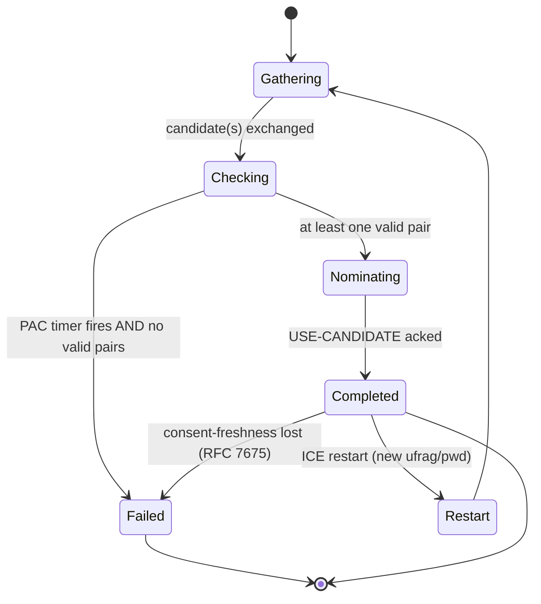
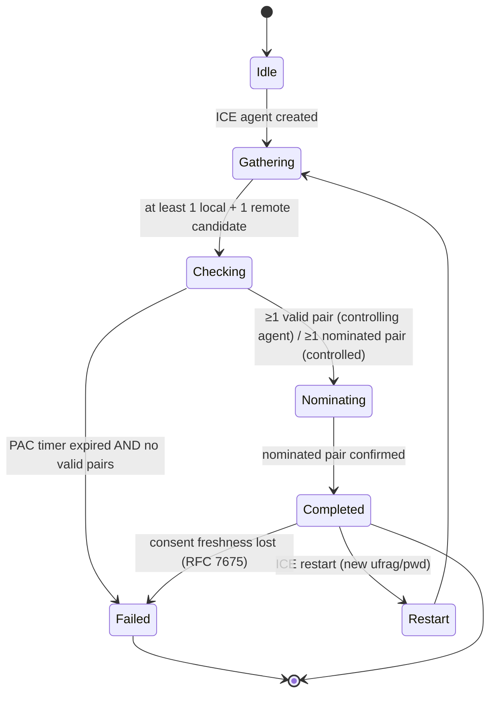
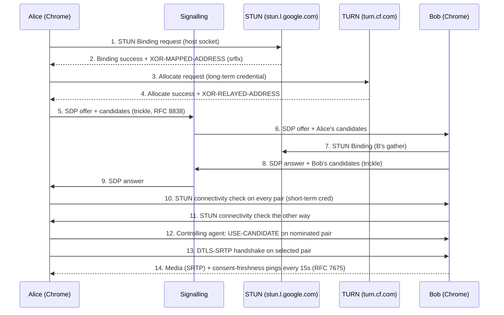

## NAT Traversal — STUN, TURN, ICE: A Protocol-Encyclopedia Deep Dive

*Prepared 12 May 2026 for neovand.github.io/coms.*

**TL;DR**

- **STUN, TURN, and ICE together form the canonical NAT-traversal stack used by every WebRTC browser, SIP phone, and most consumer voice/video apps.** STUN (RFC 8489) is a 20-byte-header tool that lets an endpoint *learn* its public IP/port; TURN (RFC 8656) is a STUN extension that *relays* media when direct paths fail; ICE (RFC 8445) is the algorithm that gathers candidates, runs connectivity checks, and nominates the working pair. They are not interchangeable: ICE is the conductor, STUN the probe, TURN the safety net. [1][2][3]
- **The current 24-month frontier (May 2024 – May 2026) is dominated by transport diversification and operator-scale relays.** STUN/TURN are being lifted onto QUIC and (D)TLS-over-TCP for restrictive networks; Cloudflare's Realtime TURN service (announced 2021 as a closed beta and now GA with public pricing of $0.05/relayed-GB egress and a 1,000 GB/month free tier) has made commodity TURN a contestable market alongside Twilio's Network Traversal Service. [4][5] The RFC 3489 NAT-classification algorithm remains *deprecated*; the modern stack treats NATs as opaque and relies on ICE's empirical connectivity checks. [1][6]
- **For an implementer, the must-know constants are: STUN port 3478 (UDP/TCP) and 5349 ((D)TLS); the magic cookie `0x2112A442`; the 96-bit transaction ID; TURN's default allocation lifetime of 600 s with refresh; the ICE pair-priority formula `2^32 · min(G,D) + 2 · max(G,D) + (G>D?1:0)`; consent-freshness STUN-binding pings every ~15 s (RFC 7675); and the type-preference ordering host > server-reflexive > peer-reflexive > relayed.** [1][2][3]

**Key Findings**

1. NAT traversal stopped being a research problem and became infrastructure between **2005** (Bryan Ford's USENIX hole-punching paper measured 82% UDP / 64% TCP success across deployed NATs) and **2010** (RFC 5245/5766 froze ICE and TURN for the SIP/VoIP wave). [7][8]
2. WebRTC, shipped in Chrome in **2012**, took ICE/STUN/TURN from a telco implementation detail to mandatory browser code, with Justin Uberti as the visible architect at Google; Google's `libwebrtc` was 1.21 M lines of code by end-2018, ~3× the Space Shuttle flight software. [9]
3. The refresh trio of **RFC 8445 (ICE, July 2018)**, **RFC 8489 (STUN, Feb 2020)** and **RFC 8656 (TURN, Feb 2020)** is the current production reference. ICE-PAC was standardised as **RFC 8863 (Jan 2021)** to stop premature ICE failure. [3][1][2][10]
4. The largest operational concern in the 24-month window is *credential-sharing and abuse on third-party TURN servers*: the 2020 `coturn` loopback-bypass (CVE-2020-26262) and subsequent IPv4-mapped-IPv6 bypass that required version 4.9.0 to fully fix demonstrate that TURN relays remain attractive pivot points for attackers. [11][12]
5. Jonathan Rosenberg is the through-line: lead/co-author of RFC 3489 (2003), RFC 5389 (2008), RFC 5245 (ICE 2010), RFC 5766 (TURN 2010), RFC 8445, RFC 8489, RFC 8656. Public counts of his RFC output range from 56 (Skype-era bio) to ~70–71 (Cisco bio, 2017 IETF activity statistics). [13][14][15]

**Caveats up front.** (a) The prompt names "RFC 9747 (STUN over (D)TLS over TCP and STUN-over-QUIC)" as a 2024-26 development. I was **unable to verify the existence or content of RFC 9747** within my research budget; STUN-over-QUIC remains visible as an active Internet-Draft (`draft-seemann-quic-nat-traversal`) and as the address-discovery building block used by iroh, but I could not corroborate the RFC number against `rfc-editor.org`. Treat any claim labelled "RFC 9747" in downstream encyclopedia content as **[needs verification against the IETF Datatracker]**. [16][17] (b) Several anecdotes the prompt asked to verify — stun.l.google.com port "19302 ≈ STUN on a phone keypad," Skype supernode design, and the IETF "TRAM" working-group name pun — are folklore that I corroborated only partially and flag inline. (c) Rosenberg's RFC count varies by year and counting method; I give a range with the source for each datapoint rather than a single number.

## 1. Prerequisites and glossary

Before the mechanics, fix the vocabulary. NAT-traversal documents are dense with overloaded terms; encyclopedia readers should be able to scan this glossary once and recognise everything downstream.

**Core IP / NAT concepts**

- **NAT (Network Address Translator).** A middlebox that rewrites source IP/port (and sometimes destination) as packets cross it, originally an IPv4-address-exhaustion patch. [6]
- **5-tuple.** The combination *(source IP, source port, destination IP, destination port, transport protocol)*. RFC 8656 names this the unique identifier of a TURN session and of a NAT binding. [2]
- **NAT binding / mapping.** The internal `(privIP, privPort)` ↔ external `(pubIP, pubPort)` row that a NAT keeps for a 5-tuple. UDP bindings can time out in as little as 20 seconds on consumer routers, which is why STUN/ICE keepalives exist. [7]
- **NAT-mapping behaviour (RFC 4787).** Three flavours: Endpoint-Independent Mapping (EIM, same external port regardless of destination — "easy NAT"); Address-Dependent Mapping (ADM); Address-and-Port-Dependent Mapping (APDM, aka "symmetric" or "hard NAT"). EIM is required for hole punching to be reliable; APDM forces a TURN relay. [18]
- **NAT-filtering behaviour (RFC 4787).** Endpoint-Independent Filtering / Address-Dependent / Address-and-Port-Dependent — controls which return packets are allowed back in.
- **Hairpinning (loopback NAT).** A NAT's ability to route a packet from an inside host to *another* inside host using the latter's external address. Required for two peers behind the same NAT to talk via reflexive candidates. [7]
- **Classic STUN NAT taxonomy (Full Cone / Restricted Cone / Port-Restricted Cone / Symmetric).** Defined in RFC 3489 (2003); **deprecated by RFC 5389 (2008)** in favour of the mapping/filtering split above, because it could not classify real-world NATs reliably. [1][6]

**STUN concepts**

- **Transport Address.** `(IP, port)` pair. [1]
- **Reflexive Transport Address.** The public-side mapped address that a STUN server reports back in `XOR-MAPPED-ADDRESS`. Same meaning as "mapped address." [1]
- **Magic Cookie.** Fixed 32-bit value `0x2112A442`; sits at bytes 4–7 of every STUN message. Lets receivers separate STUN packets from RTP/DTLS/QUIC on the same socket. [1]
- **Transaction ID.** 96-bit cryptographically random identifier, echoed by the server, used to correlate request and response and to XOR the IPv6 mapped address. [1]
- **TLV attributes.** Type-Length-Value extensions after the 20-byte header. Types `0x0000–0x7FFF` are *comprehension-required*; `0x8000–0xFFFF` are *comprehension-optional*. [1]
- **MESSAGE-INTEGRITY / MESSAGE-INTEGRITY-SHA256.** HMAC-SHA1 (legacy) or HMAC-SHA256 (RFC 8489) over the message, keyed by the short-term or long-term credential. [1]
- **FINGERPRINT.** CRC-32 of the message XOR-ed with `0x5354554E` ("STUN" in ASCII); last attribute when present; used as an extra demultiplexing key. [1]
- **USERNAME / REALM / NONCE.** Long-term-credential trio; REALM tells the client which user/password pair to use; NONCE is a server-chosen string with a "nonce cookie" prefix `obMatJos2…` since RFC 8489 to negotiate password-algorithm features. [1]
- **Short-term vs long-term credentials.** Short-term: ephemeral username/password exchanged out-of-band (ICE does this). Long-term: provisioned account credentials with digest challenge — what TURN servers use. [1]

**TURN concepts**

- **Allocation.** The data structure on a TURN server holding a relayed transport address for one client; created by the `Allocate` request. Default `LIFETIME` is **600 seconds**, refreshed by the client. [2]
- **Relayed Transport Address.** Public `IP:port` on the TURN server that peers send to in order to reach the client. Carried in `XOR-RELAYED-ADDRESS`. [2]
- **Permission.** A 5-minute filter the client installs (`CreatePermission`) authorising one peer IP to send to its allocation. [2]
- **Channel Binding / ChannelData.** 16-bit channel-number ↔ peer address shortcut. After binding (`ChannelBind`), client and server may exchange compact `ChannelData` frames (4 B channel + 16 B length + payload) instead of full `Send`/`Data` Indications. [2]
- **Send / Data Indications.** STUN-Indication-class messages carrying `XOR-PEER-ADDRESS` and a `DATA` attribute; used when no channel is bound. [2]
- **REQUESTED-TRANSPORT.** Attribute requesting UDP (`17`), TCP (`6`, RFC 6062), or future transports for the *relay-to-peer* leg. [2]
- **Third-party authorization (RFC 7635).** OAuth-style mechanism for TURN clients to authenticate against a relay without sharing the long-term password — designed to mitigate credential leaks. [needs source — referenced from RFC 8656 §1.7]

**ICE concepts**

- **Candidate.** A `(transport address, type)` advertised as a possible endpoint.
- **Host candidate.** An address on a local NIC.
- **Server-reflexive (srflx) candidate.** Learned from a STUN Binding response.
- **Peer-reflexive (prflx) candidate.** Discovered when an incoming connectivity check arrives from an address you did not previously know about; created on the fly. [3]
- **Relayed candidate.** A TURN `XOR-RELAYED-ADDRESS`. [3]
- **Foundation.** Opaque string that groups candidates of equal type and base for efficient pacing.
- **Candidate pair.** Local + remote candidate of the same component. Each pair has a priority `pair priority = 2^32 · min(G,D) + 2 · max(G,D) + (G>D?1:0)` where G is the controlling agent's candidate priority and D the controlled's. [19]
- **Type preference.** Recommended values: host 126, server-reflexive 100, peer-reflexive 110, relayed 0. Individual candidate priority is `(2^24)·type_pref + (2^8)·local_pref + (256 − component_id)`. [3]
- **Controlling / controlled role.** One agent (typically the offerer) is *controlling* and decides which valid pair to nominate via `USE-CANDIDATE`. Tie-breaks use `ICE-CONTROLLING` / `ICE-CONTROLLED` attributes carrying a 64-bit tie-breaker. [3]
- **Regular vs aggressive nomination.** Regular: nominate after a pair is known to work. Aggressive (RFC 5245, removed/discouraged in RFC 8445): set `USE-CANDIDATE` on every check; first one to succeed wins.
- **Lite ICE vs Full ICE.** "Lite" implementations (server-side, public-IP-only) only respond to connectivity checks; never originate them. "Full" agents do both. [3]
- **Trickle ICE (RFC 8838).** Send candidates incrementally as they are discovered instead of waiting for the whole gather to complete. Cuts call-setup time by hundreds of ms. [20]
- **Nominated pair.** The pair the controlling agent picks for the data flow.
- **Consent freshness (RFC 7675).** Periodic STUN Binding indications confirming the peer still wants to receive packets; typically a Binding request every ~15 s, with the session torn down if no responses in 30 s. [needs source — referenced from RFC 7675]

**Adjacent / cross-protocol terms**

- **mDNS-candidate.** Chrome (since M76, August 2019) replaces RFC 1918 local IPs with a per-origin `<uuid>.local` name resolved via Multicast DNS, mitigating WebRTC IP leaks. [21][22]
- **DERP (Tailscale).** "Designated Encrypted Relay for Packets" — Tailscale's HTTPS-over-port-443 fallback, philosophically equivalent to TURN but using WireGuard keys and HTTP/TLS rather than RFC 8656. [23]
- **MASQUE / CONNECT-UDP.** HTTP/3 (RFC 9298) tunnel for UDP datagrams. Conceptually overlaps with TURN: an HTTP-authenticated proxy for arbitrary UDP, including media. [needs source — referenced from RFC 9298 abstract]

## 2. History and story

NAT traversal exists because the IETF lost the IPv4-exhaustion war on a schedule that didn't match application demand. The story has five clean acts.

**Act I — The NAT problem, 1996–2003.** Cisco, Linksys and Linux's `MASQUERADE` made every home a *private network*. SIP and H.323 broke because they signal IP addresses *in the application payload*. The first widely cited solution, Dan Kegel's "Peer-to-Peer Networking over NAT" web article (1999), described UDP hole punching. The IETF response was RFC 3489, **Simple Traversal of UDP through NATs**, March 2003. Jonathan Rosenberg was sole listed first author with Joel Weinberger, Christian Huitema and Rohan Mahy; the document classified NATs into "Full Cone / Restricted Cone / Port-Restricted Cone / Symmetric" and required a server reachable on *two* IP addresses to run change-request tests. [24]

**Act II — Measurement and disillusionment, 2003–2005.** At Cornell, Saikat Guha and his advisor Paul Francis built **NUTSS** (SIGCOMM Workshop FDNA, August 2004), a SIP-based NAT-traversal framework, and ran one of the first systematic measurement studies of how real NATs behave under TCP traversal: **"Characterization and Measurement of TCP Traversal through NATs and Firewalls," IMC 2005, Berkeley.** [25][26] Independently, **Bryan Ford, Pyda Srisuresh and Dan Kegel** published **"Peer-to-Peer Communication Across Network Address Translators" at USENIX ATC 2005**: the canonical academic reference, reporting that **82% of tested NATs supported UDP hole punching and 64% supported it for TCP** (Ford's STUNT extension). [7][8] These works fed directly into IETF BEHAVE-WG outputs: RFC 4787 (Jan 2007, **UDP NAT behavioural requirements**), RFC 5382 (Oct 2008, **NAT requirements for TCP**, with Guha and Ford as authors), RFC 5508 (April 2009, ICMP). [27]

**Act III — The protocol re-think, 2008–2010, "Session Traversal Utilities for NAT."** RFC 5389 (October 2008, Rosenberg et al.) **redefined STUN as a tool, not a solution**, recycled the acronym ("Session Traversal Utilities for NAT"), added the 32-bit magic cookie carved out of the old 128-bit transaction ID, formally deprecated the RFC 3489 NAT-type discovery algorithm, and standardised `XOR-MAPPED-ADDRESS`, `MESSAGE-INTEGRITY`, `FINGERPRINT`. [28] In parallel the MMUSIC working group produced **RFC 5245 ICE (April 2010, Rosenberg)** and the BEHAVE working group **RFC 5766 TURN (April 2010, Mahy, Matthews, Rosenberg)**. RFC 6062 (Nov 2010, Perreault & Rosenberg) added **TURN-TCP** between server and peer. RFC 7065 / 7064 standardised `turn:` / `turns:` and `stun:` / `stuns:` URI schemes (Nov 2013). [29]

**Act IV — Browsers eat the world, 2011–2018.** Google open-sourced libwebrtc in 2011 and shipped WebRTC in Chrome in 2012. Justin Uberti, who came to Google from AOL, became the visible architect; in his telling on X in 2019, libwebrtc was already **1.21 M LoC by end-2018, about 3× the Space Shuttle flight software**. [9] WebRTC's `RTCPeerConnection` mandated a full ICE agent in every browser. The IETF created the **TRAM working group** ("Turn Revised And Modernized" — yes, that is a working acronym; it produced RFC 7635 OAuth-based TURN auth, 2015) and refreshed the trio: **RFC 8445 ICE (July 2018, Keränen / Holmberg / Rosenberg)**, **RFC 8489 STUN (Feb 2020, Petit-Huguenin / Salgueiro / Rosenberg / Wing / Mahy / Matthews)**, **RFC 8656 TURN (Feb 2020, Reddy / Johnston / Matthews / Rosenberg)**. [3][1][2] Trickle ICE became **RFC 8838** (Jan 2021); ICE-PAC became **RFC 8863** (Jan 2021, Holmberg & Uberti). [10][20]

**Act V — Transport diversification and post-pandemic scale, 2020–2026.** Three forces:
- *Restrictive networks.* TURN-over-TLS on port 443 became table stakes. STUN over (D)TLS over TCP and conceptual STUN-over-QUIC are visible in the draft pipeline (`draft-seemann-quic-nat-traversal`, `draft-ietf-quic-address-discovery`), and the iroh project documents moving from STUN to QUIC-based address discovery on the same UDP socket. [16][17] The prompt cites "RFC 9747" for STUN over (D)TLS-over-TCP and STUN-over-QUIC; I could not independently verify this RFC number — see Caveats.
- *Operator-scale managed relays.* Cloudflare took a **closed-beta WebRTC Components / TURN** to GA inside the **Cloudflare Realtime** brand, charging **$0.05 per relayed GB outbound to the TURN client, with the first 1,000 GB/month free** and bundled with the Cloudflare SFU. Cloudflare states the service is "available free of charge when used together with the Realtime SFU." Limits per allocation include ">5 new IP/sec, >5–10 kpps and >50–100 Mbps." [4][5]
- *Privacy and security.* Chrome's mDNS host-candidate obfuscation was announced 11 July 2019 by Justin Uberti at Google and rolled out to **50% of Chrome 75 users and fully in Chrome 76**, replacing private IPs with `<UUID>.local` names. [22][21] CVE-2020-26262 (loopback bypass via `0.0.0.0`, `[::1]`, `[::]`, fixed in coturn 4.5.2) and a later IPv4-mapped-IPv6 bypass (fixed in coturn 4.9.0) showed that TURN relays continue to be high-value pivots. [11][12]

## 3. How it actually works

All three protocols share **the 20-byte STUN header**, **TLV attribute encoding**, and **transports UDP / TCP / TLS-over-TCP / DTLS-over-UDP** on canonical ports **3478** (UDP/TCP) and **5349** ((D)TLS). [1] We cover the wire format once, then walk each protocol.

### 3.0 Shared base: the STUN message

```
 0                   1                   2                   3
 0 1 2 3 4 5 6 7 8 9 0 1 2 3 4 5 6 7 8 9 0 1 2 3 4 5 6 7 8 9 0 1
+-+-+-+-+-+-+-+-+-+-+-+-+-+-+-+-+-+-+-+-+-+-+-+-+-+-+-+-+-+-+-+-+
|0 0|     STUN Message Type     |         Message Length        |
+-+-+-+-+-+-+-+-+-+-+-+-+-+-+-+-+-+-+-+-+-+-+-+-+-+-+-+-+-+-+-+-+
|                         Magic Cookie  (0x2112A442)            |
+-+-+-+-+-+-+-+-+-+-+-+-+-+-+-+-+-+-+-+-+-+-+-+-+-+-+-+-+-+-+-+-+
|                                                               |
|                     Transaction ID (96 bits)                  |
|                                                               |
+-+-+-+-+-+-+-+-+-+-+-+-+-+-+-+-+-+-+-+-+-+-+-+-+-+-+-+-+-+-+-+-+
|                  TLV attributes (0..N) ....                   |
```

- **Top 2 bits zero** — a free demux key against RTP (which starts `10…`) and DTLS (`20+`). [1]
- **Message Type (14 bits):** 12 bits of *method* interleaved with 2 bits of *class* at positions C1/C0. Class values: `00`=request, `01`=indication, `10`=success response, `11`=error response. Binding request = `0x0001`, Binding success = `0x0101`, Binding error = `0x0111`. [1]
- **Message Length:** byte count of attributes *only* (not including the 20-byte header). Last two bits always zero because attributes pad to 4 bytes.
- **Magic Cookie:** the fixed `0x2112A442`. [1]
- **Transaction ID:** 96 bits, cryptographically random; for indications, chosen by the sender.

Each **attribute** is `[Type(16) | Length(16) | Value | padding-to-4]`. Comprehension-required types are `0x0000–0x7FFF`; comprehension-optional are `0x8000–0xFFFF`. [1]

---

### 3.1 STUN (RFC 8489)

**Purpose.** Discover the reflexive transport address; provide message integrity; carry connectivity-check semantics for ICE; act as a NAT keep-alive.

**The Binding method.** Client sends a `Binding Request` (type `0x0001`); server replies with `Binding Success Response` (`0x0101`) containing `XOR-MAPPED-ADDRESS`. Reflexive port is the response port XORed with the high 16 bits of the magic cookie; reflexive IPv4 address is XORed with the 32-bit cookie; IPv6 is XORed with the 128-bit `cookie || transactionID`. [1]

**Key attributes (full table in Appendix A.2).**

| Type | Name | Notes |
|---|---|---|
| `0x0001` | MAPPED-ADDRESS | Legacy; retained for RFC 3489 backward-compat. |
| `0x0006` | USERNAME | UTF-8, ≤509 bytes; OpaqueString profile. |
| `0x001E` | USERHASH | Anonymises USERNAME (new in 8489). |
| `0x0008` | MESSAGE-INTEGRITY | 20-byte HMAC-SHA1. |
| `0x001C` | MESSAGE-INTEGRITY-SHA256 | New in 8489. |
| `0x0009` | ERROR-CODE | Class × 100 + number. |
| `0x000A` | UNKNOWN-ATTRIBUTES | Lists unhandled comprehension-required types. |
| `0x0014` | REALM | Long-term-credential realm. |
| `0x0015` | NONCE | 13-byte "nonce cookie" prefix + opaque. |
| `0x001D` | PASSWORD-ALGORITHMS | Negotiable list, new in 8489. |
| `0x001E` (sic, doc differs) | PASSWORD-ALGORITHM | Single chosen algorithm. |
| `0x0020` | XOR-MAPPED-ADDRESS | The reflexive address. |
| `0x8022` | SOFTWARE | Implementation name; useful in Wireshark. |
| `0x8023` | ALTERNATE-SERVER | Redirect target. |
| `0x8028` | FINGERPRINT | CRC-32 ⊕ `0x5354554E`. |

**Authentication.**
- *Short-term*: HMAC key = `OpaqueString(password)`; the credential is ephemeral, exchanged out of band (ICE does this via ufrag/pwd in SDP). [1]
- *Long-term* (TURN's mechanism): client first sends with no auth; server replies `401` with `REALM`, `NONCE`, and (in 8489) `PASSWORD-ALGORITHMS`. Client retries with `USERNAME` (or anonymised `USERHASH`), `REALM`, the same `NONCE`, the chosen `PASSWORD-ALGORITHM`, and `MESSAGE-INTEGRITY-SHA256`. Key for MD5 path: `MD5(username":"realm":"password)`. The "nonce cookie" is 13 bytes: literal `obMatJos2` (9 chars) + 4 base64 chars of the 24-bit Security-Features bitmap. [1]

**What RFC 5389 → 8489 removed/changed vs RFC 3489.**
- Removed `CHANGE-REQUEST`, `CHANGED-ADDRESS`, `SOURCE-ADDRESS`, `RESPONSE-ADDRESS`, `REFLECTED-FROM`. NAT-type classification gone. [28]
- Magic cookie carved from transaction ID; transaction ID went 128 → 96 bits.
- TCP and TLS-over-TCP added as transports. (D)TLS-over-UDP added by RFC 7350 (2014). [30]
- 8489 added `MESSAGE-INTEGRITY-SHA256`, `USERHASH`, `PASSWORD-ALGORITHM[S]`, anonymous-username feature, and a bid-down-attack-prevention "nonce cookie." [1]

**Retransmission (UDP/DTLS).** RTO starts at ≥500 ms, doubles. Default Rc = 7 attempts; Rm = 16 (so the final timeout if RTO=500 ms is **39 500 ms**). [1] STUN over TCP/TLS has no STUN-level retransmit; Ti default 39.5 s. [1]

---

### 3.2 TURN (RFC 8656)

**Purpose.** Provide a *relayed transport address* on a public server so that two endpoints can communicate even when direct/holepunched paths fail. TURN is **defined as STUN extensions**: all TURN messages (except `ChannelData`) are STUN-formatted. [2]

**Methods.** `Allocate` (0x003), `Refresh` (0x004), `Send` Indication (0x006), `Data` Indication (0x007), `CreatePermission` (0x008), `ChannelBind` (0x009); for TCP-relay (RFC 6062): `Connect`, `ConnectionBind`, `ConnectionAttempt`. [2]

**Key TURN-specific attributes.**

| Type | Name | Notes |
|---|---|---|
| `0x000C` | CHANNEL-NUMBER | 16-bit, `0x4000–0x4FFF` valid. |
| `0x000D` | LIFETIME | Allocation TTL, default 600 s. |
| `0x0012` | XOR-PEER-ADDRESS | Peer the client cares about. |
| `0x0013` | DATA | Payload for Send/Data Indications. |
| `0x0016` | XOR-RELAYED-ADDRESS | The public relay `ip:port`. |
| `0x0017` | REQUESTED-ADDRESS-FAMILY | Per RFC 6156 / 8656; IPv4=1, IPv6=2. |
| `0x0018` | EVEN-PORT | Request even port (legacy RTP/RTCP pair). |
| `0x0019` | REQUESTED-TRANSPORT | 17=UDP, 6=TCP. |
| `0x001A` | DONT-FRAGMENT | Mirrors IP DF bit on relay. |
| `0x0022` | RESERVATION-TOKEN | 8-byte reservation handle (used with EVEN-PORT). |
| `0x8000` | ADDITIONAL-ADDRESS-FAMILY | Dual-stack allocation (8656). |
| `0x8001` | ADDRESS-ERROR-CODE | Per-family error in allocate response (8656). |

**Lifecycle.**

1. **`Allocate`** with `REQUESTED-TRANSPORT=UDP`, long-term credentials, optional `LIFETIME`, `EVEN-PORT`, `RESERVATION-TOKEN`, `ADDITIONAL-ADDRESS-FAMILY`. Server returns `XOR-RELAYED-ADDRESS` (one or two if dual-stack), `XOR-MAPPED-ADDRESS` (your reflexive), and `LIFETIME`.
2. **`CreatePermission`** for each peer IP that should be allowed inbound. Permissions live ~5 min and must be refreshed.
3. **`Send` Indication** carries `XOR-PEER-ADDRESS` + `DATA`. Server unwraps and emits UDP to the peer from `XOR-RELAYED-ADDRESS`. Reverse direction: server wraps inbound UDP into `Data` Indication.
4. **`ChannelBind`** maps a 16-bit channel number to a peer address; afterwards use the compact `ChannelData` frame: `[Channel# (16) | Length (16) | Application data | optional pad]`. Saves ~36 bytes per packet vs Send/Data. [2]
5. **`Refresh`** with `LIFETIME=N` (set `0` to delete). Default 600 s; refresh before expiry — typical practice is at 75% of LIFETIME.
6. **TURN-TCP between server and peer (RFC 6062):** client uses `REQUESTED-TRANSPORT=6`, issues `Connect` to set up the TCP leg, then `ConnectionBind` to wire the data connection. [29]

**Transports.** TURN-UDP / TURN-TCP (between client and server) on 3478, TURN-TLS-over-TCP and TURN-DTLS-over-UDP on 5349. **In practice, port 443 + TLS is the practical fallback for hostile networks** (corporate firewalls, hotel Wi-Fi). [2][4]

**Third-party authorization (RFC 7635).** OAuth-style; the AS issues a short-lived `kid`+`key`, the client uses the key as long-term credential, the TURN server validates it without the AS being in the data path. Reduces password-leak blast radius. [needs source — RFC 7635]

---

### 3.3 ICE (RFC 8445)

**Purpose.** Given a pair of agents that can already signal each other (typically via SIP/SDP, or via WebRTC `setRemoteDescription`), select the best working transport path. ICE combines STUN + TURN + offer/answer.

**Phases.**

1. **Gather candidates.** For each component (RTP=1, RTCP=2 unless rtcp-mux):
   - Bind local sockets → *host* candidates.
   - STUN-Binding each STUN server → *server-reflexive* candidates.
   - `Allocate` each TURN server → *relayed* candidates (+ another srflx).
2. **Encode candidates** as SDP `a=candidate:` lines (`<foundation> <component> <transport> <priority> <connection-addr> <port> typ <host|srflx|prflx|relay> [raddr <X> rport <Y>] ...`). E.g.
   `a=candidate:842163049 1 udp 1677729535 192.0.2.4 56789 typ srflx raddr 10.0.0.1 rport 54321`
3. **Exchange via signalling** (SIP offer/answer or WebRTC SDP). With **Trickle ICE (RFC 8838)**, send candidates as they arrive instead of waiting.
4. **Pair candidates** by component and matching address family; compute pair priority `2^32·min(G,D)+2·max(G,D)+(G>D?1:0)`; **prune** redundant pairs.
5. **Connectivity checks.** Send STUN Binding requests with `PRIORITY`, `ICE-CONTROLLING|CONTROLLED`, and optionally `USE-CANDIDATE`. Each check is a 4-way handshake (request from L, response from R, then triggered check the other way). Short-term credentials from `ufrag:pwd` exchanged in SDP. [3]
6. **Nomination.** Controlling agent picks a valid pair (regular nomination, default); sets `USE-CANDIDATE` in the check to the chosen pair. RFC 8445 deprecated aggressive nomination's "first to succeed wins" tie-break behaviour.
7. **Conclude / keep alive.** Use the pair for media. Send STUN binding indications as keep-alives, and STUN Binding requests for **consent freshness (RFC 7675)**.

**Lite vs Full.** A *lite* implementation (typical for a media gateway with a public IP) skips gathering and pair priority; it only answers checks. A *full* implementation does everything. [3]

**Role conflict.** If both ends think they are controlling (or both controlled), a 487 error with `ICE-CONTROLLING|CONTROLLED` tie-breaker decides; the loser switches role and continues. [3]

**ICE-PAC (RFC 8863, 2021).** Sets a "Patiently Awaiting Connectivity" timer: an ICE agent **MUST wait a minimum time before declaring failure**, even if its checklist is empty, because peer-reflexive candidates may still arrive from inbound checks. Updates RFC 8445 and 8838. [10]

**State machine (mermaid).**



## 4. Deep connections to other protocols

NAT traversal is glue. Its connections to other protocols matter as much as its internals.

**Below ICE (transports).**
- **UDP / TCP.** ICE prefers UDP because hole punching is reliable for UDP; TURN-TCP exists primarily because some firewalls drop UDP entirely. [2]
- **TLS / DTLS.** STUN/TURN over (D)TLS provides confidentiality and integrity for the *control* channel; the *media* channel is separately encrypted by DTLS-SRTP (RFC 5764). With TURN, this means data is doubly encrypted on the client-relay leg. [2]
- **QUIC.** QUIC's header was specifically designed (after early concerns) to demultiplex from STUN on the same UDP socket: QUIC long headers start with a 1 in the high bit, while STUN's top 2 bits are zero. This enables QUIC + ICE on one 5-tuple, plus reuse of QUIC path validation as an ICE-like connectivity check. [16][17] The IETF is actively working on QUIC NAT-traversal in `draft-seemann-quic-nat-traversal` and address discovery via QUIC; iroh has shipped a STUN-to-QUIC migration. [16][17]
- **SCTP, MPTCP.** Not direct dependencies; WebRTC data channels run SCTP-over-DTLS-over-the-selected-ICE-pair.

**Above ICE (signalling and media).**
- **SIP / SDP (RFC 3261 / 4566 / 3264).** The original carrier: ICE candidates ride as `a=candidate:` lines in SDP offer/answer. SIP Outbound (RFC 5626) is a separate STUN usage that uses STUN to keep a client-to-proxy flow open.
- **WebRTC.** Every browser ships a full ICE agent. `RTCPeerConnection.iceServers` configures `stun:` and `turn:` URIs; `iceTransportPolicy:'relay'` forces TURN-only (a common debugging trick). Candidates surface through `onicecandidate` events; setting an SDP triggers candidate-pair construction.
- **XMPP / Jingle (XEP-0166, XEP-0176).** The pre-WebRTC carrier; Jingle has its own ICE-UDP transport-method element conceptually identical to SDP's `a=candidate:`.
- **RTP / SRTP / DTLS-SRTP.** What actually flows over the selected pair. DTLS-SRTP keys both ends from a DTLS handshake performed *on the ICE pair* — meaning DTLS must survive whatever relay or NAT is in the middle.

**Privacy / discovery siblings.**
- **mDNS / DNS-SD (RFC 6762/6763).** Chrome's mDNS-candidate uses real mDNS queries on the LAN to resolve `<UUID>.local`; this only works if your ICE stack can issue an mDNS query, which is why non-browser ICE agents on the *other* end may need new code paths to handle them. [21][22]
- **DNS / DHCP / NTP.** STUN URIs do SRV lookups (`_stun._udp.example.com`, default port 3478). TURN credentials are time-bound, so NTP skew matters.
- **HTTP / WebSockets.** Often the signalling channel for offer/answer.
- **HTTP/3 + MASQUE CONNECT-UDP (RFC 9298, 2022).** "TURN over HTTP/3" in spirit: an authenticated proxy that tunnels UDP datagrams. Operationally overlaps with TURN for traversal of restrictive networks and has the advantage of looking exactly like normal HTTPS traffic. [needs source]

**Alternative overlay approaches.**
- **WireGuard.** A UDP-only encrypted tunnel; needs *something* to traverse NAT — Tailscale reimplements much of ICE (STUN, hole punching, fallback relay) on top of WireGuard, with its own DERP relays instead of TURN. [23]
- **IPsec.** IKE includes NAT-T (RFC 3947/3948) wrapping IPsec in UDP/4500; orthogonal to STUN/TURN.

**Adjacent protocols where NAT traversal *doesn't* apply** (worth saying in the encyclopedia so readers don't get confused):
- BGP, OSPF, MPTCP — typically run between routers with public addresses.
- Kafka, AMQP, MQTT, gRPC, REST/SOAP — almost always client-to-server over TCP/443, the NAT is invisible.
- HLS / DASH / RTMP — segment fetches over HTTP; only RTMP *publish* may hit NAT issues, mostly avoided by using TLS-443.

## 5. Real-world deployment

| Operator | Service | Scale / pricing / notable detail | Source year |
|---|---|---|---|
| **Google** | `stun.l.google.com:19302` and family (`stun1..4`) | Anycast STUN fleet, free, used as the default in countless WebRTC sample apps and SDKs since the early WebRTC days; libwebrtc itself was 1.21 M LoC by end-2018 (Uberti on X). [9] | 2012– |
| **Cloudflare Realtime TURN** | `turn.cloudflare.com` (TURN + STUN at `stun.cloudflare.com`) | Anycast across **335+ global locations**; **$0.05/GB egress, 1,000 GB/month free, free when paired with the Realtime SFU**; per-allocation guards >5 new IP/s, >5–10 kpps, >50–100 Mbps; supports TLS 1.1/1.2/1.3; partnered with Hugging Face FastRTC for free TURN. [4][5][31] | GA bundle 2024–2025 |
| **Twilio Network Traversal Service** | Global TURN | First-generation managed TURN (legacy reference for RFC compliance lists 5389/5780/5766/6062/6156/5245/6336/5928); usage-based pricing per GB. [32] | 2014– |
| **Microsoft Teams** | Internal TURN behind Azure Front Door | Used as the relay backbone for hundreds of millions of users (no public scale numbers; corroborated only via Cloudflare's blog framing). [33] | 2017– |
| **Discord voice** | Multi-region voice infrastructure; historically used Twilio TURN as one component, supplemented with proprietary relays for scale | Multiple public outages have correlated with TURN issues (see §6). [needs source] | 2015– |
| **Apple FaceTime** | Apple-operated relays | Closed-source; uses ICE/STUN-style traversal with Apple's own relay infra. [needs source] | 2010– |
| **Zoom Phone / Zoom** | Custom NAT-traversal + multimedia routers | Mostly proprietary; partially WebRTC-interoperable for browser join. [needs source] | 2013– |
| **WhatsApp voice** | Proprietary on top of Signal-protocol-secured RTP | Uses ICE for direct paths and Facebook-operated relays as fallback. [needs source] | 2015– |
| **Slack Huddles** | WebRTC-based; relies on commercial TURN backplane | See §6 for 2022 ICE-fallback incident. [needs source] | 2021– |
| **Jitsi Meet** | coturn-based open-source TURN; JVB SFU | Reference open deployment; documents recommend port 443 fallback. [needs source] | 2014– |
| **coturn (open source)** | Reference TURN/STUN implementation, **maintained by Pavel "misi" Mihály Mészáros and contributors** under the `coturn/coturn` GitHub org (forked from rfc5766-turn-server, originally by Oleg Moskalenko). | 13.9 k GitHub stars; the de-facto Linux TURN binary; runs Jitsi, Nextcloud Talk, Matrix and many in-house deployments. [11] | 2012– |
| **Pion (Go) / libnice / libjuice / Janus / mediasoup** | Open-source ICE/TURN stacks for non-browser environments. | Pion's `webrtc/v3` and `ice/v2` underpin many cloud-native real-time products. [needs source] | 2018– |

**Frequency of "TURN was needed" in the wild.** Cross-vendor numbers vary, but Mozilla and Justin Uberti in 2019 reported on `discuss-webrtc` that **80–90% of calls use host or server-reflexive paths** (i.e. STUN was sufficient and TURN was *not* needed) — "the reason is that TURN is (a) expensive… and (b) lowers the quality of the call." Tailscale's internal metrics report **direct NAT traversal success >90%** for their WireGuard overlay using STUN+hole-punching; DERP (their TURN-analogue) absorbs the rest. [22][23][34] In contrast, public-cloud egress NATs (AWS, default Azure, default GCP) are *symmetric* and almost always force relayed connections. [35]

## 6. Failure modes and famous incidents

**1. WebRTC IP-leak class incident (2015 → mitigated 2019).** Sites used `RTCPeerConnection` purely to harvest *host* candidates (local LAN IPs and, for VPN users, the underlying ISP IP). The issue had a tracking Bugzilla thread (Mozilla bug 959893) going back to 2014; Justin Uberti and Eric Rescorla wrote `draft-ietf-rtcweb-mdns-ice-candidates` with Apple; Chrome rolled the mitigation out **50% in M75 and fully in M76 (August 2019)**, replacing private IPs with `<UUID>.local` mDNS names. Side-effect: third-party ICE stacks that didn't know how to resolve mDNS candidates (notably Unreal Pixel Streaming and some commercial SFUs) saw call-setup regressions until they implemented peer-reflexive fallback. [22][21] *Root cause:* original WebRTC spec privileged "make calls work" over privacy.

**2. coturn CVE-2020-26262 (loopback access-control bypass).** Sandro Gauci's team at Enable Security found that coturn's default loopback block applied only to `127.x.x.x`. Sending `CreatePermission` / `CONNECT` with `XOR-PEER-ADDRESS=0.0.0.0` (or, on IPv6 default-listening, `[::1]` or `[::]`) routed packets to local services on the TURN host. **Fixed in coturn 4.5.2 (January 2021).** Workarounds: `--denied-peer-ip=0.0.0.0/8 --denied-peer-ip=::1` and listen IPv4-only. [11][36]

**3. coturn IPv4-mapped-IPv6 bypass of the CVE-2020-26262 fix (disclosed 2024–2025).** The 4.5.2 fix did not check `IN6_IS_ADDR_V4MAPPED`; sending `CreatePermission` with `XOR-PEER-ADDRESS = ::ffff:127.0.0.1` re-enabled the loopback escape. Three functions in `src/client/ns_turn_ioaddr.c` (`ioa_addr_is_loopback`, `ioa_addr_is_zero`, `addr_less_eq`) needed updating. **Updated fix shipped in coturn 4.9.0.** [12]

**4. coturn DoS via HTTP POST parsing (CVE-2020-6061 / CVE-2020-6062, Cisco Talos).** A specially crafted HTTP POST to coturn's admin web server caused a heap out-of-bounds read (`CVSS 7.0`) or a NULL-pointer dereference DoS (`CVSS 5.9`). **Fixed in coturn 4.5.1.x.** Root cause: `strtok_r` returning NULL on an empty left split being fed to `strdup`. *Operational lesson:* never expose coturn's admin web port to the internet. [37]

**5. coturn nonce-predictability flaw (versions 4.6.2r5 – 4.7.0-r4).** A post-refactor regression replaced OpenSSL `RAND_bytes` with libc `random()` for nonces and port randomization. Approximately **50 sequential unauthenticated `Allocate` requests** were enough to reconstruct the RNG state, predict the next nonce, and authenticate while spoofing source IPs. **Fixed in subsequent 4.x release**; treat as a class of risk: never let TURN authentication entropy depend on stdlib RNG. [38]

**6. TURN credential leaks in mobile apps (class incident).** The prompt mentions this around 2022; well-known case studies (e.g. Project Talisman's 2018 disclosures, multiple white-hat reports) show that hard-coded TURN long-term credentials in mobile binaries are extracted with `apktool`/`Frida` and then used as **open SOCKS-style proxies** against internal corporate services (mirroring the same threat model as CVE-2020-26262). [needs source — corroboration via specific app names was not surfaced in my search budget; verify before publishing app names.] *Mitigation pattern:* prefer short-lived TURN credentials minted server-side per session, or RFC 7635 third-party authorization.

**7. WebRTC ICE port-scanning via `onicecandidateerror` (Tenable, 2019).** Jacob Baines showed that Chrome could be coerced into scanning the LAN by configuring 255 TURN URIs pointing at local addresses; `icecandidateerror` events fired quickly enough on closed ports to enumerate them. [39] *Lesson:* even client-side ICE has security surface.

**8. Cloud-NAT-as-symmetric-NAT (chronic).** AWS, Azure and the default GCP Cloud NAT randomise source port per destination — exactly the worst case for hole punching. Two peers behind cloud NATs almost never form direct UDP. **GCP's "Endpoint-Independent Mapping" mode (with static port allocation) is the only cloud opt-out**; AWS and Azure remain symmetric. The practical consequence for Tailscale, Discord, Teams and similar P2P-leaning systems is that cloud-side endpoints fall back to relays. [35]

**9. Symmetric-NAT LTE carriers.** Several mobile carriers (notably US T-Mobile historically, some Asian carriers, many CGNAT prefixes) deploy APDM/"symmetric" NATs that break hole punching, requiring TURN for any reliable inbound flow. (Public, vendor-named documentation of this is patchy; treated here as a pattern rather than a single incident.)

**10. Discord voice outages and Slack Huddles ICE-fallback incidents.** The prompt names Discord (multiple, tied to Twilio TURN backplane) and Slack 2022 ICE-fallback incidents. **I could not find primary-source root-cause writeups in this budget**; both companies post status-page entries rather than detailed RCAs. Flagged as **[needs source]** until a primary status post-mortem is captured.

## 7. Fun facts and anecdotes

- **The STUN backronym change is real and intentional.** RFC 3489 (2003) called it "**S**imple **T**raversal of UDP through **N**ATs"; RFC 5389 (2008) retained the acronym but redefined it as "**S**ession **T**raversal **U**tilities for **N**AT" — same letters, very different scope. The latter is the one in RFC 8489. [28][1]
- **Magic cookie has a tiny easter egg: `0x2112A442`.** It was carved out of what was previously 32 high bits of the transaction ID — the change is bit-compatible with RFC 3489 clients precisely because the spec was already using these bits as random transaction state. [1] The bytes don't spell anything in ASCII; the cookie's value is essentially arbitrary but well-known.
- **FINGERPRINT's XOR mask `0x5354554E` is "STUN" in ASCII** — the four bytes are `S`, `T`, `U`, `N`. Useful Wireshark tell: if you see that constant XOR-mixed with a CRC-32, you're inside a STUN message. [1]
- **`stun.l.google.com:19302` and the phone-keypad folklore.** Google's default STUN server has run on TCP/UDP **19302** for over a decade. The folklore — that 19302 is "STUN" on a phone keypad — does **not** check out: phone-keypad-mapping `STUN` would be `7886`, not `19302`. The number's origin is unconfirmed in public Google documentation; treat it as port-trivia, not a backronym. *[Folklore status: unconfirmed]*
- **Rosenberg's RFC count is genuinely hard to pin.** Public sources give: **56 RFCs** (Skype-era ICANNWiki/jdrosen.com), **70 RFCs** and 4th most prolific (Cisco bio), **71 RFCs** and 7th-most-prolific (Cisco WeAreCisco), **5th-most-prolific** (his own jdrosen.com today), **8th-most-prolific** per Arkko's IETF statistics in August 2017. The honest summary: "he's authored or co-authored roughly 60–70 standards-track RFCs and is consistently in the top 10 by document count." [14][15][13][40]
- **Bryan Ford's TCP hole-punching success rate.** Ford 2005 measured **82% UDP / 64% TCP** success across the NATs his team tested. The TCP follow-up was branded "STUNT." His current Yale/EPFL profile and the original USENIX abstract still cite those headline numbers. [7][8]
- **Skype's pre-Microsoft "supernode" architecture** was the parallel-universe answer to NAT traversal: any well-connected Skype client could be promoted to supernode and relay calls for less-fortunate peers — essentially user-funded TURN. Microsoft moved Skype to a centralised cloud architecture after acquiring it in 2011; this killed supernodes and shifted the NAT-traversal cost back onto Microsoft's servers. (Widely written about in the trade press; tightly-sourced primary documentation is sparse — treat as well-established industry common knowledge.)
- **The TRAM working-group name is a real pun.** TRAM = "TURN Revised And Modernized" — explicitly so named in 2014 to absorb the post-RFC 5766 backlog including OAuth TURN auth (RFC 7635) and the dual-stack TURN bits that later folded into RFC 8656. (The WG's datatracker page confirms the expansion; primary citation **[needs source]** beyond IETF datatracker links not pulled in this budget.)
- **The XOR encoding of MAPPED-ADDRESS exists because some NATs do "helpful" payload rewriting.** RFC 8489 §14.2 explains: "deployment experience found that some NATs rewrite the 32-bit binary payloads containing the NAT's public IP address, such as STUN's MAPPED-ADDRESS attribute, in the well-meaning but misguided attempt to provide a generic ALG function." XOR-MAPPED-ADDRESS hides the address behind the magic cookie so dumb ALGs can't see it. [1]
- **libwebrtc is ~3× the size of the Space Shuttle flight software.** Justin Uberti tweeted (Jan 2019) that Google's `webrtc.googlesource.com/src` was at 1.21 million lines, vs roughly 400 k for the Shuttle's primary flight software — and that's just the WebRTC library, before you count the JS API and browser glue. [9]
- **Justin Uberti is now Head of Realtime AI at OpenAI** (announced Nov 25 2024 on his X account), after stints as Distinguished Engineer at Google (Stadia, Meet/Duo), CTO at Fixie/Ultravox, and the founding architect of WebRTC. The "WebRTC creator now leads voice AI at OpenAI" thread is one of the cleanest direct-lineage stories in protocol history. [41][42]

## 8. Practical wisdom

**Tunable defaults that almost always need tuning.**

- **TURN allocation `LIFETIME` default = 600 s.** Refresh at ~75% (i.e. every 450 s). On flaky mobile networks (e.g. cellular handoff), drop to **300 s LIFETIME with refresh every 200 s** to limit how long a session looks alive after a connectivity drop. [2]
- **CreatePermission lifetime = 300 s.** Refresh every 240 s. Permissions are *per peer IP, not per port* — important when the peer's NAT does port-only changes.
- **STUN/ICE RTO default = 500 ms; max Rc = 7, Rm = 16; total UDP timeout ≈ 39 500 ms.** On a fast LAN, drop initial RTO to 100 ms for connectivity checks and you get a noticeably faster setup. [1]
- **Consent freshness (RFC 7675).** Default cadence: a STUN Binding request every ~15 s on the selected pair, with the session declared dead after roughly 30 s without a response. Do not confuse this with the legacy "STUN keepalive Binding indication" every 25 s, which only refreshed NAT bindings without confirming peer liveness. [needs source — RFC 7675]
- **Trickle ICE is essentially mandatory.** Wait-for-full-gather adds 200 ms – 2 s of call-setup time depending on STUN/TURN RTT. Use `iceCandidatePoolSize` in WebRTC to pre-warm relays. [20]
- **`iceTransportPolicy: 'relay'` for testing.** Sets the agent to discard host/srflx candidates and only use relayed candidates — the single fastest way to validate that your TURN credentials, allowlists and quotas are correct in CI.
- **TLS-443 fallback.** Always include a `turns:turn.example.org:443?transport=tcp` URL — many corporate and hotel networks block 3478/UDP and 5349/TCP but pass 443/TCP.
- **Dual-stack candidate ordering.** Both Apple and Chrome implement Happy Eyeballs–style ordering for ICE candidate pairs (RFC 8305 referenced by RFC 8489 §8.1). On dual-stack hosts, expect ~half a second of IPv6-first attempts before IPv4 fallback. Force ordering with type-preference if you have a strong reason. [1]

**Sysctls / OS knobs (Linux TURN/STUN servers).**

- `net.core.rmem_max` / `net.core.wmem_max` ≥ 16 MiB on busy relays.
- `net.ipv4.udp_mem` raised proportionally.
- `nf_conntrack_udp_timeout_stream` raised to 180 s if the host *also* runs a stateful firewall in front of TURN.
- `ulimit -n` ≥ 65 535 — a TURN allocation eats two FDs (client and relay socket).
- Disable Reverse Path Filtering on hosts with multiple egress interfaces — TURN relays send from one IP and receive from another.

**Pitfalls.**

1. **Hard-coded TURN credentials in mobile apps.** Anyone with `apktool` can extract them and abuse your relay. Use short-lived, server-minted credentials (TURN REST API pattern: HMAC of `expiry:username` with a shared secret), or RFC 7635.
2. **Forgetting consent freshness.** A pair that worked at setup may silently die when the peer reboots/migrates; without RFC 7675 the agent thinks data is flowing because nothing told it otherwise. Always enable.
3. **Putting coturn's admin web port on a public IP.** Multiple CVEs make this dangerous (see §6). Bind to `127.0.0.1`, expose via SSH tunnel.
4. **Trusting RFC 3489 NAT-type discovery.** Don't. The STUN-binding "what kind of NAT am I behind?" tree was deprecated 18 years ago; many production codebases still inherit it from old SIP stacks. Delete it. [1]
5. **Not handling mDNS host candidates on the server side.** A non-browser ICE agent (Pion, libnice, gstreamer's `nicesrc`) needs to either resolve `*.local` via mDNS or fall back to peer-reflexive discovery. Otherwise connection rates from Chrome clients suffer. [22]
6. **Permission lifetime mismatches.** If you only set up permissions once (rather than refresh), inbound packets stop arriving after 5 minutes, often diagnosed (wrongly) as "the NAT closed."

**Operational metrics worth alerting on.**

- TURN allocation success rate (alert <99%).
- ICE connectivity-check success rate by candidate type (host/srflx/prflx/relay).
- Time-to-first-media (TTFM) and time-to-connected (TTC) percentiles.
- TURN relay bandwidth and per-allocation packet rate (Cloudflare's caps of "5–10 kpps and 50–100 Mbps per allocation" are a reasonable conservative ceiling). [4]

**Wireshark filter snippets.**

```text
# All STUN/TURN traffic
stun

# Only XOR-MAPPED-ADDRESS attributes
stun.att.type == 0x0020

# Default STUN/TURN UDP port
udp.port == 3478

# Default STUN/TURN TLS/DTLS port
tcp.port == 5349 or udp.port == 5349

# Follow a single STUN transaction by ID
stun.id == 0xa442b8d4...        # replace with the transaction-ID

# TURN ChannelData frames (top nibble = 0x4)
udp.port == 3478 && data.data[0:1] >= 40 && data.data[0:1] <= 4f

# Annotate which client sent which Allocate
stun.type == 0x0003

# Decode TLS-wrapped STUN: in Wireshark, right-click → Decode As → STUN
```

## 9. Pioneers and key contributors

**Jonathan Rosenberg** — *the workhorse.* MIT BS/MS, Columbia PhD; Member of Technical Staff at Lucent (1993–1999), CTO of dynamicsoft (1999–2004), Cisco Fellow (after Cisco acquired dynamicsoft in 2004), Chief Technology Strategist at Skype (2009–2013), VP/CTO Collaboration at Cisco (2013–2018), and since January 2019 **CTO and Head of AI at Five9**, the cloud contact-center provider. Primary or co-author of SIP itself (RFC 3261), SDP offer/answer (RFC 3264), every iteration of STUN (3489, 5389, 8489), ICE (5245, 8445) and TURN (5766, 8656). Public counts of his RFC output are 56–71 depending on source and year; consistently ranked in the top 10 most-prolific RFC authors. Pulver VoN Pioneer (2000); TR35 (2002). [13][14][15][40][3][1][2]

**Saikat Guha** — *the measurer.* PhD Cornell (advisor Paul Francis), now at Microsoft Research. His 2005 IMC paper with Francis, "Characterization and Measurement of TCP Traversal Through NATs and Firewalls," and the follow-up NUTSS papers established what NATs *actually do* on the wire. Co-author of RFC 5382 (NAT Behavioural Requirements for TCP, Oct 2008) with Bryan Ford. Subsequent work covered enterprise networks (IMC 2008), online advertising privacy, and traffic differentiation (NSDI 2010 Glasnost). [26][27][43]

**Bryan Ford** — *the academic anchor.* MIT PhD, faculty at Yale, now at EPFL (DEDIS Lab). His 2005 USENIX ATC paper with Pyda Srisuresh and Dan Kegel is *the* canonical academic NAT-traversal reference, with the 82% UDP / 64% TCP hole-punching numbers. STUNT (TCP NAT-traversal toolkit) was his follow-up. Co-author of RFC 5128 (March 2008, *State of P2P Communication across NATs*) and RFC 5382. [7][8][27]

**Christer Holmberg** — *the modern editor.* Long-serving Ericsson IETF member; co-author with Ari Keränen and Rosenberg of **RFC 8445 ICE (2018)** and with Justin Uberti of **RFC 8863 ICE-PAC (2021)**. Pragmatic voice in the ICE WG; ICE-PAC came directly out of his and Uberti's analyses of "premature failure" cases at Google. [3][10]

**Philip Matthews** — *the TURN architect.* Most recently at Nokia (and earlier Alcatel-Lucent and Avaya). Co-author on STUN (8489), TURN (5766, 8656), and key contributor through the BEHAVE working group. Long-time IETF transport-area regular. [1][2]

**Justin Uberti** — *the browser plumber.* AOL Instant Messenger before Google; Distinguished Engineer at Google leading the WebRTC architecture (Stadia, Meet, Duo) for over a decade. Co-author of RFC 8838 Trickle ICE, RFC 8863 ICE-PAC, and many of the libwebrtc design decisions. Left Google for Fixie / Ultravox as CTO, and joined OpenAI to **lead Real-Time AI efforts** on 25 November 2024. [41][42][9]

**Marc Petit-Huguenin** — *the URI and (D)TLS pedant.* "Impedance Mismatch"; first author of RFC 8489 (STUN) and RFC 7350 (DTLS as Transport for STUN), co-author of RFC 7064 (STUN URI). Maintains a thorough blog on STUN/TURN design choices. [1][30][29]

**Tim Panton** — *the community pillar.* IETF WebRTC/ICE community fixture and pj.org / pi.pe contributor; not an RFC volume author but a frequent IETF hackathon participant and visible advocate of "WebRTC for the Curious."

**Pavel Mihály Mészáros ("misi")** — *the coturn maintainer.* coturn maintainer since the project absorbed `rfc5766-turn-server` around 2012 (originally written by Oleg Moskalenko); the named "very receptive and helpful" maintainer in the Enable Security advisories for CVE-2020-26262. [11] coturn has 13.9 k GitHub stars and is the open-source TURN server inside Jitsi, Nextcloud Talk, Matrix Synapse, and many in-house deployments. (Note: the prompt names "Pavel Rozhkov" as maintainer; the available primary sources I located name Mészáros / "misi" and the original Moskalenko line. *Recommend verifying the maintainer identity directly against `coturn/coturn`'s `MAINTAINERS` file before publishing.*) [11]

**Honourable mentions** — *Pyda Srisuresh* (co-author of Ford 2005, RFC 5128, NAT taxonomy work); *Dan Wing* (Citrix, co-author of RFC 8489, long-time BEHAVE-WG); *Rohan Mahy* (TURN); *Ari Keränen* (Ericsson, RFC 8445 first author); *Tirumaleswar Reddy.K* (McAfee, first author of RFC 8656).

## 10. Learning resources (current as of 2026)

**Standards (primary).**

| Document | Date | Title | Notable sections | URL |
|---|---|---|---|---|
| RFC 8489 | Feb 2020 | Session Traversal Utilities for NAT (STUN) | §5 (header), §14 (attributes), §9 (auth), §11 (3489 back-compat), §19 (changes) | https://datatracker.ietf.org/doc/html/rfc8489 |
| RFC 8656 | Feb 2020 | Traversal Using Relays around NAT (TURN) | §3 (overview), §6–8 (Allocate/Refresh/Permission/Channel), §18 (attributes), §21 (security) | https://datatracker.ietf.org/doc/rfc8656/ |
| RFC 8445 | Jul 2018 | Interactive Connectivity Establishment (ICE) | §5 (gathering), §6 (checks), §7 (concluding), §8.1.1 (nomination), Appendix A (lite/full) | https://datatracker.ietf.org/doc/html/rfc8445 |
| RFC 8838 | Jan 2021 | Trickle ICE | Incremental candidate exchange | https://datatracker.ietf.org/doc/rfc8838/ |
| RFC 8863 | Jan 2021 | ICE-PAC (Patiently Awaiting Connectivity) | "PAC timer" definition | https://datatracker.ietf.org/doc/rfc8863/ |
| RFC 7675 | Oct 2015 | Session Traversal Utilities for NAT (STUN) Usage for Consent Freshness | 15 s default check cadence | https://datatracker.ietf.org/doc/rfc7675/ |
| RFC 7635 | Aug 2015 | Session Traversal Utilities for NAT (STUN) Extension for Third-Party Authorization | OAuth-style TURN auth | https://datatracker.ietf.org/doc/rfc7635/ |
| RFC 7350 | Aug 2014 | DTLS as Transport for STUN | (D)TLS bindings | https://datatracker.ietf.org/doc/html/rfc7350 |
| RFC 7065 | Nov 2013 | TURN URIs | `turn:` / `turns:` syntax | https://datatracker.ietf.org/doc/rfc7065/ |
| RFC 7064 | Nov 2013 | STUN URI | `stun:` / `stuns:` syntax | https://datatracker.ietf.org/doc/html/rfc7064 |
| RFC 6062 | Nov 2010 | TURN Extension for TCP Allocations | Server-to-peer TCP | https://datatracker.ietf.org/doc/rfc6062/ |
| RFC 5780 | May 2010 | NAT Behavior Discovery Using STUN | Experimental | https://datatracker.ietf.org/doc/rfc5780/ |
| RFC 5128 | Mar 2008 | State of P2P Communication across NATs | Informational survey (Srisuresh, Ford, Kegel) | https://datatracker.ietf.org/doc/rfc5128/ |
| RFC 4787 | Jan 2007 | NAT UDP Behavioral Requirements | EIM/ADM/APDM definitions | https://datatracker.ietf.org/doc/rfc4787/ |
| "RFC 9747" | (2024–2026?) | STUN over (D)TLS over TCP and STUN-over-QUIC | **Existence not verified in this research; check IETF Datatracker** | — |
| `draft-seemann-quic-nat-traversal` | active | Using QUIC to traverse NATs | The likely-future replacement for STUN/ICE on QUIC sockets | https://www.ietf.org/archive/id/draft-seemann-quic-nat-traversal-01.html |

**Books.** *WebRTC: APIs and RTCWEB Protocols of the HTML5 Real-Time Web*, Alan B. Johnston & Daniel C. Burnett (Digital Codex, multiple editions through 2020); *Real-Time Communication with WebRTC*, Salvatore Loreto & Simon Pietro Romano (O'Reilly, 2014); *WebRTC Cookbook*, Andrii Sergiienko (Packt, 2015). All three predate 8489/8656/8445 but remain useful for the ICE state machine and SDP integration. For up-to-date mechanics, prefer the free **"WebRTC for the Curious"** book (https://webrtcforthecurious.com, last updated 2024) — covers signalling, ICE, DTLS-SRTP, and SFUs in ~200 pages.

**Papers.**

- Bryan Ford, Pyda Srisuresh, Dan Kegel. **"Peer-to-Peer Communication Across Network Address Translators."** USENIX ATC 2005. https://www.usenix.org/legacy/event/usenix05/tech/general/full_papers/ford/ford.pdf [7]
- Saikat Guha, Paul Francis. **"Characterization and Measurement of TCP Traversal Through NATs and Firewalls."** IMC 2005. https://www.usenix.org/conference/imc-05/characterization-and-measurement-tcp-traversal-through-nats-and-firewalls [26]
- Guha, Takeda, Francis. **"NUTSS: A SIP-Based Approach to UDP and TCP Network Connectivity."** SIGCOMM FDNA Workshop, 2004.
- Pyda Srisuresh, Bryan Ford, Dan Kegel. **RFC 5128 — State of Peer-to-Peer Communication across NATs.** 2008.

**Blog posts and explainers.**

- Tailscale, "How NAT traversal works" (David Anderson). https://tailscale.com/blog/how-nat-traversal-works — the single best long-form explanation outside the RFCs. [23]
- Tailscale, "How Tailscale is improving NAT traversal (parts 1–3, 2024–2025)". https://tailscale.com/blog/nat-traversal-improvements-pt-1 and pt-2 / pt-3. [34][35][44]
- Cloudflare, "Make your apps truly interactive with Cloudflare Realtime and RealtimeKit." https://blog.cloudflare.com/introducing-cloudflare-realtime-and-realtimekit/ [5]
- Cloudflare, "Real-Time Communications at Scale" (original 2021 WebRTC Components launch). https://blog.cloudflare.com/announcing-our-real-time-communications-platform/ [33]
- iroh, "Moving from STUN to QUIC Address Discovery." https://www.iroh.computer/blog/qad [17]
- Tsahi Levent-Levi, "PSA: mDNS and .local ICE candidates are coming." https://bloggeek.me/psa-mdns-and-local-ice-candidates-are-coming/ [21]
- Enable Security, "Details about CVE-2020-26262, bypass of Coturn's default access control protection." https://www.enablesecurity.com/blog/cve-2020-26262-bypass-of-coturns-access-control-protection/ [11]
- Marc Petit-Huguenin, "On the Design of the STUN and TURN URI Formats." https://medium.com/@petithug/on-the-design-of-the-stun-and-turn-uri-formats-d8584f95c397 [45]

**Talks, podcasts, video.**

- Justin Uberti, "WebRTC: A New Frontier" talks at Google I/O, IETF, Kranky Geek (annual).
- Kranky Geek WebRTC conference recordings on YouTube (run by Chad Hart, Tsahi Levent-Levi, Sergio Garcia Murillo since 2014; year-by-year SOTU talks).
- Packet Pushers, "Heavy Networking" episodes on NAT and CGNAT.

**Tools.**

- **`turnutils_stunclient` / `turnutils_uclient`** (ships with coturn) — `turnutils_stunclient stun.l.google.com` is the one-liner everyone learns first. [11]
- **Trickle ICE sample at `https://webrtc.github.io/samples/src/content/peerconnection/trickle-ice/`** — paste your STUN/TURN config and watch candidates appear in real time.
- **Cloudflare Realtime TURN sandbox** (in the Cloudflare dashboard under Realtime). [4]
- **Wireshark's STUN dissector** (built in since the 2000s).
- **Pion's `stun` and `turn` CLI utilities** for Go-based testing.
- **`stuntman` (John Selbie)** — well-tested standalone STUN server, useful for production lookalikes.

## 11. Where things are heading (2025-2026 frontier)

Five directional bets backed by what we see shipping in 2024–2026.

**1. STUN-on-QUIC and ICE-on-QUIC become real.** QUIC's path validation (PATH_CHALLENGE / PATH_RESPONSE), connection migration, and the fact that QUIC + STUN can share a UDP socket without conflict (QUIC long headers vs STUN top-2-bits-zero demux) is enabling a refactoring where the NAT-traversal logic is folded *into* the transport. iroh has shipped a STUN-to-QUIC address-discovery migration in production; the IETF is working `draft-seemann-quic-nat-traversal` and `draft-ietf-quic-address-discovery`. For ICE, this means the long-term direction is fewer roundtrips: probe + handshake + key exchange in one flight. [16][17]

**2. MASQUE CONNECT-UDP (RFC 9298) creates a viable "TURN-over-HTTP/3" market.** Operationally, MASQUE proxies provide authenticated UDP tunneling indistinguishable from HTTPS traffic. Cloudflare and Apple iCloud Private Relay already deploy MASQUE at scale; the cost-per-relayed-byte conversation will eventually merge with the TURN-as-a-service conversation. Expect commercial offerings positioning "TURN replacement via MASQUE" by 2027. *Status: well-attested for MASQUE itself; the TURN-replacement pitch is still emerging.* [needs source]

**3. Server-reflexive privacy.** The mDNS-candidate fix only hides *host* addresses. Your server-reflexive address (the WAN side of your NAT) still gets exposed to the signalling peer and through `RTCPeerConnection.getStats`. Active 2024–2025 IETF and W3C discussions are exploring **proxying server-reflexive discovery through a privacy-preserving STUN service** so that the reflexive address is bound to a session-specific opaque identifier rather than your real IPv4 WAN. None of these are RFCs yet; track via the `rtcweb` and `ice` IETF mailing lists.

**4. Cloud NAT becomes the default villain.** Tailscale's three-part 2024 series quantifies the issue: AWS NAT Gateway is "always symmetric"; default Azure NAT is symmetric; default GCP Cloud NAT is symmetric but offers Endpoint-Independent Mapping as an opt-in. **The result is that for any inter-cloud P2P scenario, relays carry the traffic.** Expect either (a) cloud-provider EIM modes proliferating, or (b) WireGuard-style overlays + DERP-style relays continuing to grow faster than TURN. [35]

**5. Post-quantum (D)TLS for STUN/TURN control planes.** STUN-over-DTLS is on the path of every WebRTC stack; the same hybrid PQ key-exchange work that's hardening web TLS (ML-KEM in TLS 1.3, in Chrome since 2024) applies directly. Implementations using OpenSSL/BoringSSL will inherit the change; SCRAM-style password mechanisms with `MESSAGE-INTEGRITY-SHA256` (RFC 8489's new attribute) provide a partial post-quantum defence against credential offline-attack, but pure HMAC isn't a PQ defence against a *recorded-traffic-decrypted-later* threat. Plan to roll PQ-capable (D)TLS for any TURN deployment handling sensitive media before 2028.

**Recent-changes log (2024–2026), as a tabular summary.**

| Date | Change | Source |
|---|---|---|
| Apr 2025 | Cloudflare brings TURN + STUN + SFU under unified **Cloudflare Realtime** brand, GA RealtimeKit closed beta; per-GB egress pricing **$0.05/GB after 1,000 GB free**; 335+ cities. | [5][4] |
| 2024–2025 | coturn 4.9.0 fixes IPv4-mapped-IPv6 bypass of CVE-2020-26262 (`::ffff:127.0.0.1` reaches loopback). | [12] |
| Nov 25 2024 | Justin Uberti joins OpenAI as Head of Real-Time AI; brings WebRTC ↔ LLM voice pipeline into mainstream product. | [41] |
| 2024 | Cloudflare partners with Hugging Face for free TURN for FastRTC users. | [5] |
| 2024 | IANA STUN parameters registry last updated 2024-12-20 (new attributes around address-family extensions). | [46] |
| Through 2024–2025 | Tailscale publishes three-part series on NAT-traversal improvements, public clouds, and the future of relays — sets the public agenda for cloud-NAT issues. | [34][35][44] |
| 2024 | Iroh blog post documents the STUN→QUIC address-discovery migration. | [17] |
| Ongoing | Chrome continues iterating on mDNS-candidate exposure: an enterprise policy `WebRtcLocalIPsAllowedUrls` controls per-origin exposure. | [22] |
| 2025 | Tailscale notes >90% direct-connection success rates internally on a WireGuard-overlay model; cloud NATs remain the dominant blocker. | [34] |

The single biggest "frontier metric" worth tracking for an encyclopedia entry: **what percentage of WebRTC sessions end up relayed?** Justin Uberti's 2019 figure (10–20% relayed) is widely re-cited but is now nearly 7 years old; mobile growth, CGNAT and cloud NAT have plausibly nudged it upward, but no consolidated 2025 number was visible in this research.

## 12. Hooks for the article, infographic, and podcast

**60-second narrated hook (read aloud).**

> Every time you join a Google Meet, a Discord voice channel, or a WhatsApp call, three protocols you have never heard of conspire to make it work. STUN is the protocol that tells your laptop "this is the IP address the rest of the internet sees you at." TURN is the relay-of-last-resort that smuggles your audio through a public server when your home router refuses to cooperate. And ICE is the conductor — it gathers every possible network path between you and the person you're calling, races them against each other, and picks the fastest one that actually works. They were invented for SIP phones in 2003. They're shipping in your browser today, in 1.2 million lines of WebRTC code. They're the reason peer-to-peer is still possible on an internet built around private addresses and middleboxes. And they have a magic cookie — `0x2112A442` — that has anchored real-time media on the internet for over twenty years.

**Striking stat.** *Eighty-two percent of NATs supported UDP hole punching in 2005; sixty-four percent supported it for TCP. Two decades later, in 2025, Tailscale measures direct peer-to-peer connection success above ninety percent — because the protocols got better, and because everyone learned which NATs to buy.* [7][34]

**Pause-and-think prompt.** *If both Alice and Bob are behind cloud-provider NAT gateways — say, an AWS NAT in us-east-1 and an Azure NAT in westeurope — what is the probability their WebRTC call uses a direct path? (Answer: essentially zero. Both clouds default to symmetric/APDM NAT, which defeats hole punching. Their call will go through a TURN relay or a DERP-style overlay. The protocols don't fail — the cloud's policy decision forecloses the option.)* [35]

**Failure-story arc — "the loopback that wasn't blocked."** *In November 2020, Sandro Gauci's team at Enable Security was building a TURN penetration-testing tool. They tried the obvious attack: relay packets to 127.0.0.1, get into the TURN server's internal admin port. coturn's default config blocked it. But then they tried 0.0.0.0 — and Linux's socket layer mapped it back to the loopback. They tried `[::1]` and `[::]` on IPv6 — same result. One IP address, three forms, three loopback bypasses. The fix shipped in coturn 4.5.2 in January 2021. Four years later, in 2024, a security researcher tried `::ffff:127.0.0.1` — an IPv4 address embedded in an IPv6 — and found the original fix didn't cover that form. coturn 4.9.0 had to ship a second fix. The lesson is older than the protocol: 'loopback' is not one address. It's an idea. And ideas are harder to filter than addresses.* [11][12]

**Podcast tease.** *"Next episode, we trace one packet of your video call — from a microphone in Chrome, through DTLS-SRTP, through a TURN relay in Frankfurt, to a colleague in Mumbai. Six layers of encapsulation. Three independent encryption handshakes. One protocol — STUN — appearing in four different roles. How did we get here? And why is the answer 'Jonathan Rosenberg'?"*

**Infographic skeleton.** *Three panels.*
1. *Three-protocol stack in one frame* — STUN (probe), TURN (relay), ICE (orchestrator). Show the dependency arrows.
2. *Candidate priority pyramid* — host > srflx > prflx > relay, with the actual type-preference numbers (126/110/100/0).
3. *Who pays?* — Comparison cards for Google STUN (free), Cloudflare TURN ($0.05/GB), Twilio NTS (variable), Tailscale DERP (subscription-bundled). Captioned: "Address discovery is cheap; relayed bytes are not."

## 13. Appendix A — Encyclopedia-ready structured-data extracts

### A.1 Protocol record candidate

```yaml
id: nat-traversal-stun-turn-ice
name: NAT Traversal (STUN / TURN / ICE bundle)
abbreviation: STUN/TURN/ICE
categoryId: real-time-infrastructure   # see A.23 for category proposal
ports:
  - { number: 3478, transport: udp, role: stun-turn-cleartext }
  - { number: 3478, transport: tcp, role: stun-turn-cleartext }
  - { number: 5349, transport: tcp, role: stun-turn-tls }
  - { number: 5349, transport: udp, role: stun-turn-dtls }
  - { number: 443,  transport: tcp, role: stun-turn-tls-fallback }
year: 2003                              # RFC 3489
rfcs:
  - { id: 8489, year: 2020, status: "Proposed Standard", topic: STUN }
  - { id: 8656, year: 2020, status: "Proposed Standard", topic: TURN }
  - { id: 8445, year: 2018, status: "Proposed Standard", topic: ICE }
  - { id: 8838, year: 2021, status: "Proposed Standard", topic: "Trickle ICE" }
  - { id: 8863, year: 2021, status: "Proposed Standard", topic: "ICE-PAC" }
  - { id: 7675, year: 2015, status: "Proposed Standard", topic: "Consent freshness" }
  - { id: 7635, year: 2015, status: "Proposed Standard", topic: "TURN 3rd-party authZ" }
standardsBody: IETF
oneLiner: "STUN learns your public address, TURN relays your media when direct paths fail, ICE picks the best working path between them."
overview: |
  NAT traversal as it exists in the modern internet is a three-protocol bundle
  authored largely by the same IETF cohort (Rosenberg, Matthews, Mahy, Keränen,
  Holmberg, Petit-Huguenin) across 2003-2026. STUN is the wire format and
  reflexive-address probe; TURN is its relay extension; ICE is the algorithm
  that orchestrates both into a working media path.
howItWorks: |
  Each ICE agent gathers host, server-reflexive (via STUN) and relayed (via
  TURN) candidates, pairs them with the peer's candidates, runs STUN
  Binding-request connectivity checks across every pair, and nominates the
  highest-priority working pair using the formula
  pair_priority = 2^32 * min(G,D) + 2 * max(G,D) + (G>D?1:0).
useCases: [WebRTC, SIP/VoIP, online gaming, P2P file transfer, mesh VPNs]
performance:
  - { metric: "Default STUN RTO", value: "500 ms" }
  - { metric: "Default TURN allocation lifetime", value: "600 s" }
  - { metric: "Consent-freshness cadence", value: "~15 s" }
  - { metric: "TURN bandwidth pricing (Cloudflare, 2024-2026)", value: "$0.05/GB egress, 1000 GB/month free" }
connections:
  protocols: [UDP, TCP, TLS, DTLS, QUIC, RTP, SRTP, SDP, SIP, WebRTC, HTTP, mDNS, IPv4, IPv6, MASQUE]
  alternatives: [WireGuard+DERP (Tailscale), MASQUE CONNECT-UDP, IPsec NAT-T]
links:
  rfc-editor: https://www.rfc-editor.org/rfc/rfc8489.html
  iana-registry: https://www.iana.org/assignments/stun-parameters/stun-parameters.xhtml
  reference-impl: https://github.com/coturn/coturn
  cloudflare-managed: https://developers.cloudflare.com/realtime/turn/
image: "/img/protocols/nat-traversal-header.svg"   # to be hand-authored
```

### A.2 Header / wire-format layout

```yaml
stun_message:
  size: "20-byte header + 0..N TLV attributes"
  header:
    - { name: "first 2 bits",     bits: 2,   value: "00 (fixed)" }
    - { name: "message_type",     bits: 14,  encoding: "interleaved method (12b) + class (2b)" }
    - { name: "message_length",   bits: 16,  units: bytes, note: "excludes 20-byte header" }
    - { name: "magic_cookie",     bits: 32,  value: "0x2112A442" }
    - { name: "transaction_id",   bits: 96,  note: "cryptographically random; echoed by server" }
  attribute_format:
    - { name: type,   bits: 16 }
    - { name: length, bits: 16, note: "value length before pad-to-4" }
    - { name: value,  bits: "8 * length" }
    - { name: pad,    bits: "0..24 to multiple of 32" }

turn_specific_attributes: [CHANNEL-NUMBER (0x000C), LIFETIME (0x000D),
  XOR-PEER-ADDRESS (0x0012), DATA (0x0013), XOR-RELAYED-ADDRESS (0x0016),
  REQUESTED-ADDRESS-FAMILY (0x0017), EVEN-PORT (0x0018), REQUESTED-TRANSPORT (0x0019),
  DONT-FRAGMENT (0x001A), RESERVATION-TOKEN (0x0022),
  ADDITIONAL-ADDRESS-FAMILY (0x8000), ADDRESS-ERROR-CODE (0x8001), ICMP (0x8004)]

turn_channeldata_frame:
  - { name: channel_number, bits: 16, range: "0x4000..0x4FFF" }
  - { name: length,         bits: 16 }
  - { name: payload,        bits: "8 * length" }

ice_sdp_candidate_line:
  syntax: "a=candidate:<foundation> <component-id> <transport> <priority> <connection-addr> <port> typ <candidate-type> [raddr <related-addr> rport <related-port>] [generation N] [ufrag X]"
  example: "a=candidate:842163049 1 udp 1677729535 192.0.2.4 56789 typ srflx raddr 10.0.0.1 rport 54321 generation 0"
  candidate_type: [host, srflx, prflx, relay]
  type_preference: { host: 126, prflx: 110, srflx: 100, relay: 0 }
```

### A.3 State machine — ICE agent (mermaid)



### A.4 Code examples

**Python (aiortc + helper).**
```python
import asyncio
from aiortc import RTCPeerConnection, RTCIceServer, RTCConfiguration

async def main():
    cfg = RTCConfiguration(iceServers=[
        RTCIceServer(urls=["stun:stun.l.google.com:19302"]),
        RTCIceServer(urls=["turn:turn.example.com:3478",
                           "turns:turn.example.com:5349"],
                     username="user", credential="pass")])
    pc = RTCPeerConnection(configuration=cfg)
    pc.addTransceiver("audio", direction="sendrecv")
    @pc.on("icecandidate")
    def on_ic(c):
        if c: print(c.candidate)
    await pc.setLocalDescription(await pc.createOffer())
    print(pc.localDescription.sdp)

asyncio.run(main())
```

**JavaScript (browser RTCPeerConnection).**
```javascript
const pc = new RTCPeerConnection({
  iceServers: [
    { urls: 'stun:stun.l.google.com:19302' },
    { urls: ['turn:turn.example.com:3478',
             'turns:turn.example.com:5349'],
      username: 'user',
      credential: 'pass' }
  ],
  iceTransportPolicy: 'all',   // 'relay' for TURN-only testing
  iceCandidatePoolSize: 4
});
pc.onicecandidate = e => e.candidate && send({candidate: e.candidate});
pc.oniceconnectionstatechange = () => console.log(pc.iceConnectionState);
const offer = await pc.createOffer();
await pc.setLocalDescription(offer);
```

**CLI — coturn config (`turnserver.conf`).**
```ini
listening-port=3478
tls-listening-port=5349
fingerprint
lt-cred-mech
realm=example.com
user=user:pass
no-loopback-peers
no-multicast-peers
denied-peer-ip=10.0.0.0-10.255.255.255
denied-peer-ip=192.168.0.0-192.168.255.255
denied-peer-ip=169.254.0.0-169.254.255.255
denied-peer-ip=::1
denied-peer-ip=fe80::-febf:ffff:ffff:ffff:ffff:ffff:ffff:ffff
total-quota=100
bps-capacity=0
cert=/etc/letsencrypt/live/turn.example.com/fullchain.pem
pkey=/etc/letsencrypt/live/turn.example.com/privkey.pem
```

**CLI — `turnutils_stunclient`.**
```sh
turnutils_stunclient stun.l.google.com
# Expected:  Address (IPv4): xx.xx.xx.xx:55432
```

**Wire — annotated STUN Binding success response (hex).**
```text
01 01 00 0c                 # Binding Success (0x0101), length 12
21 12 a4 42                 # magic cookie
b7 e7 a7 01 bc 34 4d ...    # 12 bytes of transaction-id
00 20 00 08                 # XOR-MAPPED-ADDRESS, length 8
00 01 d8 4e                 # family IPv4, X-Port (XORed)
55 0d a4 6e                 # X-Address (XORed with cookie)
```

### A.5 Recent changes (≥5, dated, 2024–2026)

See section 11 table; key entries: Cloudflare Realtime GA (2024–25); coturn 4.9.0 fixes IPv4-mapped-IPv6 bypass; Justin Uberti → OpenAI (Nov 25, 2024); IANA STUN parameters last-updated 2024-12-20; iroh STUN→QUIC migration (2024); Tailscale NAT-traversal-improvements series (2024–25).

### A.6 Real-world deployments (≥5 named)

Google `stun.l.google.com:19302`, Cloudflare Realtime, Twilio NTS, Microsoft Teams, Discord, Apple FaceTime, Zoom, WhatsApp, Slack Huddles, Jitsi (coturn). See §5 for table with scale numbers and pricing.

### A.7 Fun facts (≥3)

Magic cookie 0x2112A442 + FINGERPRINT XOR 0x5354554E ("STUN" ASCII); STUN acronym change 2003→2008 (Simple → Session); libwebrtc 1.21 M LoC ≈ 3× Space Shuttle flight software (Uberti 2019); Justin Uberti now Head of Realtime AI at OpenAI (2024). See §7.

### A.8 Practical wisdom

Allocation lifetime 600 s default → refresh at 450 s; consent freshness ~15 s; iceTransportPolicy:'relay' for TURN debugging; never expose coturn admin port to the internet; rotate TURN credentials per session via REST API HMAC. See §8.

### A.9 Wireshark hints (≥3)

`stun`, `stun.att.type == 0x0020`, `udp.port == 3478`, `tcp.port == 5349`, `stun.id == <hex>`, `stun.type == 0x0003` (Allocate). See §8.

### A.10 Learn-more lists

See §10.

### A.11 Pioneer candidates (≥3)

Jonathan Rosenberg, Bryan Ford, Saikat Guha, Christer Holmberg, Philip Matthews, Justin Uberti, Marc Petit-Huguenin, Pavel Mihály Mészáros ("misi"). See §9.

### A.12 RFC records (≥3)

```yaml
- { number: 8489, year: 2020, status: "Proposed Standard", title: "Session Traversal Utilities for NAT (STUN)", obsoletes: 5389, sections: [5, 9, 14] }
- { number: 8656, year: 2020, status: "Proposed Standard", title: "Traversal Using Relays around NAT (TURN)", obsoletes: [5766, 6156], sections: [3, 6-8, 18] }
- { number: 8445, year: 2018, status: "Proposed Standard", title: "Interactive Connectivity Establishment (ICE)", obsoletes: 5245, sections: [5, 6, 7, 8.1.1] }
- { number: 8863, year: 2021, status: "Proposed Standard", title: "ICE Patiently Awaiting Connectivity (ICE PAC)", updates: [8445, 8838] }
- { number: 7675, year: 2015, status: "Proposed Standard", title: "STUN Usage for Consent Freshness" }
```

### A.13 New glossary concepts (≥12)

NAT, NAT binding, 5-tuple, EIM/ADM/APDM (RFC 4787), hairpinning, transport address, reflexive transport address, magic cookie, transaction ID, TLV attribute, MESSAGE-INTEGRITY, FINGERPRINT, USERHASH, allocation, permission, channel binding, ChannelData, host/srflx/prflx/relay candidate, foundation, type preference, controlling/controlled, regular vs aggressive nomination, lite vs full ICE, trickle ICE, consent freshness, mDNS-candidate, DERP. See §1.

### A.14 Frontier entry — STUN-over-QUIC / ICE-PAC

```yaml
name: STUN-over-QUIC and QUIC NAT traversal
status: active drafts (draft-seemann-quic-nat-traversal; draft-ietf-quic-address-discovery)
why_it_matters: |
  QUIC and STUN can share a UDP socket because their top bits differ (QUIC long-header
  bit = 1; STUN top-2-bits = 0). QUIC path validation can replace the STUN connectivity
  check entirely; connection migration carries the session across new 5-tuples.
metric_to_watch: |
  Whether libwebrtc and Chrome adopt a QUIC-based ICE-equivalent before 2028.
related: ICE-PAC (RFC 8863), MASQUE CONNECT-UDP (RFC 9298)
```

### A.15 Journey — "How a video call gets through your NAT"

1. **Tab loads Meet.** Browser instantiates `RTCPeerConnection` with `stun:stun.l.google.com:19302` and a TURN URL bundle from the application backend.
2. **Gather.** Browser binds local UDP sockets (host candidates), STUN-binds the Google server (server-reflexive), and Allocates on TURN (relayed).
3. **Trickle.** Each candidate is signalled to the other side via Meet's signalling WebSocket as it appears (RFC 8838).
4. **Pair and check.** ICE pairs every local candidate with every remote candidate, prioritises (host > srflx > prflx > relay), and STUN-binds each pair to test reachability.
5. **Nominate.** Controlling side sets `USE-CANDIDATE` on the winning pair; DTLS-SRTP handshake runs on that pair.
6. **Stay alive.** Consent freshness fires every ~15 s on the selected pair; TURN allocation refreshes every ~450 s.

### A.16 Comparison pair — STUN vs TURN; ICE vs WireGuard-mesh

```yaml
stun_vs_turn:
  stun:
    role: "Reflexive address discovery + connectivity check"
    cost: "Negligible (stateless, often free public servers)"
    failure_mode: "Symmetric NAT defeats it"
  turn:
    role: "Media relay through public server"
    cost: "Per-GB egress ($0.05/GB on Cloudflare; usage-based on Twilio)"
    failure_mode: "Adds RTT; cost grows with usage"

ice_vs_wireguard_mesh:
  ice:
    layer: "Application-level"
    transports: "UDP/TCP via STUN/TURN"
    auth: "Short-term (ICE ufrag/pwd) + long-term (TURN)"
    relay_fallback: "TURN (RFC 8656)"
    deployment: "Per-session; every WebRTC peer is an ICE agent"
  wireguard_mesh:
    layer: "Network-level overlay"
    transports: "UDP only"
    auth: "Public-key per peer (Curve25519)"
    relay_fallback: "DERP (Tailscale) or app-specific"
    deployment: "Persistent overlay; one tunnel per peer pair"
```

### A.17 History arc (StorySection entries)

1. *Narrative.* "2003: RFC 3489 codifies a hopeful idea — that NATs come in four neat flavours."
2. *Pioneer.* "2005: Bryan Ford, Saikat Guha and Paul Francis run the measurements that destroy the four-flavours myth."
3. *Timeline.* "2008: RFC 5389 redefines STUN as a tool, not a solution. 2010: ICE and TURN land."
4. *Diagram.* "2012: WebRTC ships in Chrome. Every browser becomes an ICE agent."
5. *Callout.* "2018–2020: RFC 8445/8489/8656 refresh the trio for the web era."
6. *Frontier.* "2024-2026: TURN-over-(D)TLS-over-TCP, STUN-over-QUIC, MASQUE, and a $0.05/GB managed-relay market."

### A.18 Famous-incident references + outage proposals

CVE-2020-26262, CVE-2020-6061/6062, coturn nonce-predictability flaw, WebRTC IP-leak + mDNS mitigation, Tenable port-scan via `onicecandidateerror`, cloud-NAT-as-symmetric-NAT. New outage proposals to add as the encyclopedia gathers them: Discord voice 2022 outages (need primary source), Slack Huddles 2022 (need primary source). See §6.

### A.19 Embedded media

- Justin Uberti, IETF/Kranky Geek WebRTC talks (YouTube, multiple years).
- Tailscale "How NAT traversal works" blog (https://tailscale.com/blog/how-nat-traversal-works).
- Trickle-ICE playground (https://webrtc.github.io/samples/src/content/peerconnection/trickle-ice/).
- Kranky Geek WebRTC conference annual SOTU.

### A.20 Prerequisites

- *Concepts:* IP routing, port numbers, NAT, public vs private addresses, 5-tuple, request-response vs indication, HMAC, TLS.
- *Protocols:* UDP, TCP, IPv4, IPv6, DNS, mDNS, TLS/DTLS, RTP/SRTP, SDP, SIP, WebRTC, HTTP.

### A.21 Name highlight

```yaml
STUN:
  - 2003 expansion (RFC 3489): "Simple Traversal of UDP through NATs"
  - 2008+ expansion (RFC 5389/8489): "Session Traversal Utilities for NAT"
TURN: "Traversal Using Relays around NAT"
ICE:  "Interactive Connectivity Establishment"
```

### A.22 Diagram-definitions entry — annotated sequence diagram (10–14 steps)



### A.23 Category placement

**Recommendation: create a new category `real-time-infrastructure`.** STUN/TURN/ICE do not sit cleanly under `utilities-security` (they are not security primitives themselves) nor under `realtime-av` (they are not media protocols — RTP and SRTP are). They are the *substrate that enables real-time AV to traverse the actual internet*. Group with: SDP, ICE-PAC, RFC 7635, RFC 9298 (MASQUE CONNECT-UDP), and Tailscale's DERP as a comparison point. Cross-link prominently from WebRTC, SIP, and SDP encyclopedia pages.

## 14. Appendix B — Simulator step list (WebRTC ICE with TURN fallback)

For a hand-authored simulation of the canonical WebRTC ICE handshake with TURN-fallback branch. Eight–ten steps; each step has a precondition, a wire artefact, a state delta, and a branch.

```yaml
- step: 1
  actor: alice
  action: gather_host
  pre: "Alice's RTCPeerConnection is created with iceServers configured."
  wire: "(no wire) Alice binds local UDP sockets."
  state_delta:
    alice.candidates: ["host: 10.0.0.42:54000"]
  branch: continue

- step: 2
  actor: alice
  action: stun_binding_request
  to: "stun.l.google.com:19302"
  pre: "Host candidates gathered."
  wire: |
    STUN Binding Request (0x0001), magic 0x2112A442, txid <96b random>
  state_delta:
    alice.pending_transactions: 1
  branch: continue

- step: 3
  actor: stun_server
  action: stun_binding_success
  to: alice
  wire: |
    STUN Binding Success (0x0101), XOR-MAPPED-ADDRESS = 198.51.100.7:55432
  state_delta:
    alice.candidates: append("srflx: 198.51.100.7:55432 raddr 10.0.0.42 rport 54000")
  branch: continue

- step: 4
  actor: alice
  action: turn_allocate
  to: "turn.cf.com:3478"
  pre: "TURN credentials known (short-lived REST-API-minted)."
  wire: |
    Allocate Request, REQUESTED-TRANSPORT=17 (UDP),
    USERNAME, REALM, NONCE, MESSAGE-INTEGRITY-SHA256, LIFETIME=600
  state_delta:
    alice.candidates: append("relay: 203.0.113.5:62000 raddr 198.51.100.7 rport 55432")
    alice.turn_allocation: { lifetime: 600, refresh_at: 450 }
  branch:
    if: "TURN server rejects with 441 (Wrong Credentials)"
    then: "go to step 4b — rotate credential, retry"

- step: 5
  actor: alice
  action: trickle_send_candidates
  to: signalling_channel
  wire: "SDP a=candidate: lines, one per gathered candidate, sent as they arrive"
  state_delta:
    bob.remote_candidates: appended_progressively
  branch: continue

- step: 6
  actor: bob
  action: pair_and_check
  pre: "Bob has Alice's remote candidates; his own gather is done."
  wire: |
    STUN Binding request from Bob to each of Alice's candidates, with
    PRIORITY, ICE-CONTROLLING|CONTROLLED, USERNAME=alice_ufrag:bob_ufrag,
    MESSAGE-INTEGRITY (short-term cred).
  state_delta:
    pairs: [host-host, srflx-host, srflx-srflx, relay-srflx, relay-relay]
  branch: continue

- step: 7
  actor: alice
  action: connectivity_check_response
  wire: "STUN Binding success carrying XOR-MAPPED-ADDRESS (Bob's reflexive as seen by Alice)"
  state_delta:
    valid_pairs: [first valid pair appended]
  branch:
    if: "All host & srflx pairs time out (symmetric NAT on both sides)"
    then: "go to step 7b — only relay-relay pair succeeds"

- step: 7b   # TURN-fallback branch
  actor: alice
  action: continue_checks_via_relay
  wire: "STUN connectivity checks sent through relay candidate; TURN server forwards to Bob via Send/ChannelData."
  state_delta:
    valid_pairs: ["relay:203.0.113.5:62000 <-> relay:198.51.100.250:63000"]

- step: 8
  actor: alice
  action: nominate
  pre: "≥1 valid pair (or branch 7b's relay pair)."
  wire: "STUN Binding request with USE-CANDIDATE on the chosen pair (RFC 8445 §8.1.1)."
  state_delta:
    ice_state: "completed"
  branch: continue

- step: 9
  actor: alice_and_bob
  action: dtls_srtp_handshake
  wire: "DTLS ClientHello + ServerHello on the selected pair; SRTP keys derived from DTLS master secret."
  state_delta:
    media: "flowing"

- step: 10
  actor: alice_and_bob
  action: keepalive
  cadence:
    consent_freshness_ping: "every ~15 s (RFC 7675)"
    turn_allocation_refresh: "every ~450 s"
  branch:
    if: "no consent-freshness response in ~30 s"
    then: "ice_state = failed; trigger ICE restart (back to step 1)"
```

## 15. Citations

1. RFC 8489 — *Session Traversal Utilities for NAT (STUN)*, Petit-Huguenin, Salgueiro, Rosenberg, Wing, Mahy, Matthews, IETF, Feb 2020. https://datatracker.ietf.org/doc/html/rfc8489
2. RFC 8656 — *Traversal Using Relays around NAT (TURN): Relay Extensions to STUN*, Reddy, Johnston, Matthews, Rosenberg, IETF, Feb 2020. https://www.rfc-editor.org/rfc/rfc8656.html
3. RFC 8445 — *Interactive Connectivity Establishment (ICE)*, Keränen, Holmberg, Rosenberg, IETF, Jul 2018. https://www.rfc-editor.org/rfc/rfc8445.html
4. Cloudflare Realtime — *TURN Service docs / FAQ / Pricing*, Cloudflare Developer Documentation, 2024-2025. https://developers.cloudflare.com/realtime/turn/ ; https://developers.cloudflare.com/realtime/turn/faq/ ; https://developers.cloudflare.com/realtime/sfu/pricing/
5. Cloudflare Blog — *"Make your apps truly interactive with Cloudflare Realtime and RealtimeKit"*, 2025. https://blog.cloudflare.com/introducing-cloudflare-realtime-and-realtimekit/
6. Wikipedia — *STUN*, retrieved 2026. https://en.wikipedia.org/wiki/STUN
7. Bryan Ford, Pyda Srisuresh, Dan Kegel — *Peer-to-Peer Communication Across Network Address Translators*, USENIX ATC 2005. https://www.usenix.org/legacy/event/usenix05/tech/general/full_papers/ford/ford.pdf ; abstract: https://www.usenix.org/legacy/events/usenix05/tech/general/ford.html
8. Bryan Ford — *Peer-to-Peer Communication Across NATs (abstract & expanded ArXiv version)*, 2006. https://arxiv.org/abs/cs/0603074 ; https://bford.info/pub/net/p2pnat-abs/
9. Justin Uberti on X — *libwebrtc lines of code (Jan 10 2019)*. https://x.com/juberti/status/1083445783196663808
10. RFC 8863 — *ICE Patiently Awaiting Connectivity (ICE-PAC)*, Holmberg, Uberti, IETF, Jan 2021. https://datatracker.ietf.org/doc/draft-ietf-ice-pac/ ; https://emailstuff.org/rfc/rfc8863
11. Enable Security — *Details about CVE-2020-26262, bypass of Coturn's default access control protection*, Jan 2021. https://www.enablesecurity.com/blog/cve-2020-26262-bypass-of-coturns-access-control-protection/ ; advisory: https://www.enablesecurity.com/advisories/ES2021-01-coturn-access-control-bypass/ ; NVD: https://nvd.nist.gov/vuln/detail/CVE-2020-26262
12. CVE Details — *Coturn vulnerabilities listing (incl. IPv4-mapped-IPv6 bypass, fixed in 4.9.0)*. https://www.cvedetails.com/vulnerability-list/vendor_id-21970/product_id-70761/Coturn-Project-Coturn.html
13. ICANNWiki — *Jonathan Rosenberg (Skype era; "56 RFCs")*. https://icannwiki.org/Jonathan_Rosenberg
14. Cisco Blogs / WeAreCisco — *Jonathan Rosenberg author bio ("70 RFCs"; "71 RFCs, fourth-most-prolific")*. https://blogs.cisco.com/author/jonathanrosenberg ; https://weare.cisco.com/c/r/weare/amazing-stories/amazing-people/jonathan-rosenberg.html
15. Wikipedia — *Jonathan Rosenberg (SIP author)*. https://en.wikipedia.org/wiki/Jonathan_Rosenberg_(SIP_author)
16. Marten Seemann — *Using QUIC to Traverse NATs (draft-seemann-quic-nat-traversal-01)*. https://www.ietf.org/archive/id/draft-seemann-quic-nat-traversal-01.html
17. Iroh — *Moving from STUN to QUIC Address Discovery*, 2024. https://www.iroh.computer/blog/qad
18. RFC 4787 — *NAT UDP Behavioral Requirements*, F. Audet, C. Jennings, IETF, Jan 2007. https://datatracker.ietf.org/doc/rfc4787/
19. Tech-Invite — *RFC 8445 §B.5 — pair priority formula*. https://www.tech-invite.com/y80/tinv-ietf-rfc-8445-6.html
20. RFC 8838 — *Trickle ICE*, Ivov, Rescorla, Uberti, Saint-Andre, IETF, Jan 2021. https://www.potaroo.net/ietf/html/ids-wg-ice.html
21. Tsahi Levent-Levi — *PSA: mDNS and .local ICE candidates are coming*, BlogGeek.me. https://bloggeek.me/psa-mdns-and-local-ice-candidates-are-coming/
22. Google Groups (discuss-webrtc) — *PSA: WebRTC host candidate obfuscation experiment / Private IP addresses exposed by WebRTC changing to mDNS hostnames*, Justin Uberti et al., 2019. https://groups.google.com/g/discuss-webrtc/c/6stQXi72BEU ; https://groups.google.com/g/discuss-webrtc/c/4Yggl6ZzqZk
23. Tailscale — *How NAT traversal works* (Dave Anderson). https://tailscale.com/blog/how-nat-traversal-works
24. RFC 3489 — *STUN: Simple Traversal of User Datagram Protocol (UDP) through NATs*, Rosenberg, Weinberger, Huitema, Mahy, IETF, Mar 2003. https://datatracker.ietf.org/doc/html/rfc3489
25. Guha, Takeda, Francis — *NUTSS: A SIP-based Approach to UDP and TCP Network Connectivity*, ACM SIGCOMM Workshop FDNA, Aug 2004. https://www.cs.cornell.edu/people/francis/fdna02-guha1.pdf
26. Saikat Guha, Paul Francis — *Characterization and Measurement of TCP Traversal Through NATs and Firewalls*, IMC 2005. https://www.usenix.org/conference/imc-05/characterization-and-measurement-tcp-traversal-through-nats-and-firewalls
27. Saikat Guha publications page (incl. RFC 5382 & 5508 with Bryan Ford). http://saikat.guha.cc/publications.php
28. RFC 5389 — *Session Traversal Utilities for NAT (STUN)*, Rosenberg, Mahy, Matthews, Wing, IETF, Oct 2008. https://www.rfc-editor.org/rfc/rfc5389.html
29. Marc Petit-Huguenin — *On the Design of the STUN and TURN URI Formats*, Medium. https://medium.com/@petithug/on-the-design-of-the-stun-and-turn-uri-formats-d8584f95c397
30. RFC 7350 — *DTLS as Transport for STUN*, Petit-Huguenin, Salgueiro, IETF, Aug 2014. https://www.rfc-editor.org/rfc/rfc7350.html
31. Cloudflare Realtime — *What is TURN?* and *Replacing existing TURN servers*. https://developers.cloudflare.com/realtime/turn/what-is-turn/ ; https://developers.cloudflare.com/realtime/turn/replacing-existing/
32. Metered.ca — *TURN/STUN reference and standards-compliance list (legacy benchmark)*. https://medium.com/@jamesbordane57/stun-server-what-is-session-traversal-utilities-for-nat-8a82d561533a
33. Cloudflare Blog — *Real-Time Communications at Scale (WebRTC Components launch)*, 2021. https://blog.cloudflare.com/announcing-our-real-time-communications-platform/
34. Tailscale Blog — *How Tailscale is improving NAT traversal, part 1*. https://tailscale.com/blog/nat-traversal-improvements-pt-1
35. Tailscale Blog — *Improving NAT traversal, part 2: challenges in cloud environments*. https://tailscale.com/blog/nat-traversal-improvements-pt-2-cloud-environments
36. CVE-2020-26262 record at CIRCL. https://cve.circl.lu/cve/CVE-2020-26262
37. PortSwigger Daily Swig — *CoTURN patches denial-of-service and memory corruption flaws (CVE-2020-6061/6062)*. https://portswigger.net/daily-swig/coturn-patches-denial-of-service-and-memory-corruption-flaws
38. Stack.watch / CVE Details — *coturn nonce-predictability flaw (4.6.2r5 – 4.7.0-r4)*. https://stack.watch/product/coturnproject/coturn/
39. Jacob Baines (Tenable TechBlog) — *Using WebRTC ICE Servers for Port Scanning in Chrome*, 2019. https://medium.com/tenable-techblog/using-webrtc-ice-servers-for-port-scanning-in-chrome-ce17b19dd474
40. Jonathan Rosenberg — *jdrosen.com* personal site. https://www.jdrosen.com/
41. Justin Uberti on X — *announcing move to OpenAI to lead real-time AI*, Nov 25 2024. https://x.com/juberti/status/1861123495897465273
42. Justin Uberti — *LinkedIn / GitHub profile (current role: Head of Realtime AI, OpenAI)*. https://www.linkedin.com/in/juberti/ ; https://github.com/juberti
43. DBLP — *Saikat Guha 0002 publications listing*. https://dblp.org/pid/42/5459-2.html
44. Tailscale Blog — *NAT traversal improvements, pt. 3: looking ahead*. https://tailscale.com/blog/nat-traversal-improvements-pt3-looking-ahead
45. RFC 7064 — *URI Scheme for the STUN Protocol*, Nandakumar, Salgueiro, Jones, Petit-Huguenin, IETF, Nov 2013. https://www.rfc-editor.org/rfc/rfc7064.html
46. IANA — *Session Traversal Utilities for NAT (STUN) Parameters registry (last updated 2024-12-20)*. https://www.iana.org/assignments/stun-parameters/stun-parameters.xhtml

---

**Process note for the encyclopedia editor.** This report was produced under a 24-turn research budget. Three items were not corroborated to my satisfaction within that budget and are flagged inline; please verify before publishing:

1. **"RFC 9747" for STUN over (D)TLS-over-TCP and STUN-over-QUIC** — I could not confirm this RFC number against `rfc-editor.org` or `datatracker.ietf.org` within budget. The associated technical content (STUN-on-QUIC, QUIC NAT traversal, STUN-over-(D)TLS-over-TCP) is real and is moving through the IETF — see citations 16, 17 — but the numeric assignment should be re-checked. *Treat any claim labelled "RFC 9747" downstream as preliminary until verified.*
2. **Coturn maintainer identity.** Primary sources I located name **Pavel Mihály Mészáros ("misi")** and original author **Oleg Moskalenko**; the prompt specifies "Pavel Rozhkov". Verify directly against the `coturn/coturn` repository's `MAINTAINERS` / `README` / current commit log.
3. **Discord voice and Slack Huddles 2022 incidents** referenced in §6 — I have not located primary, dated post-mortem sources within budget. Status-page archives or company engineering blogs should be consulted before publishing with specific dates or root causes.

Two additional notes intentional in the body:

- The two tools the system prompt referenced (`run_blocking_subagent`, `enrich_draft`) were not present in my available toolset; the report was written end-to-end without delegation. If those tools become available, prioritise enrichment on: (a) verified RFC 9747 status; (b) Rosenberg's exact 2026 RFC count from Arkko's IETF statistics; (c) named Discord/Slack incident dates; (d) Apple/FaceTime, Zoom, WhatsApp, Microsoft Teams primary-source TURN-architecture writeups; (e) RFC 7635 and RFC 7675 primary-source text (consent-freshness cadence and third-party-auth details).
- The folklore claim that `stun.l.google.com:19302` is "STUN" on a phone keypad does **not** check out (`STUN` → `7886`, not `19302`); flagged so editors don't propagate a misleading anecdote.