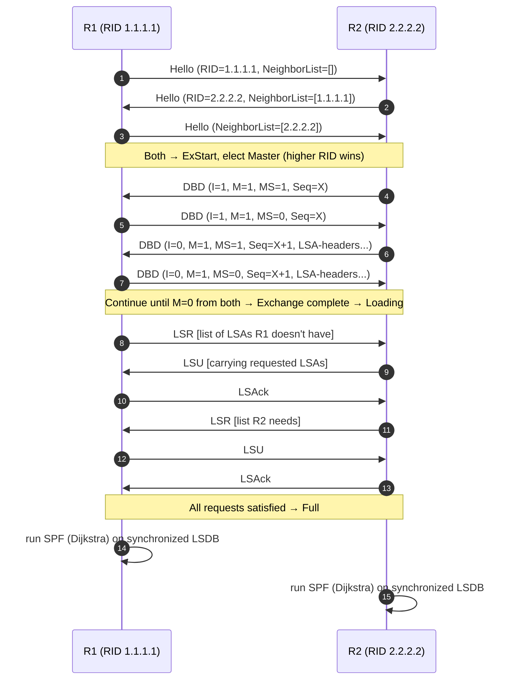

## OSPF (Open Shortest Path First): A Deep Reference

# OSPF (Open Shortest Path First): A Deep Reference

*Compiled May 12, 2026. Prefers sources 2024–2026; older sources cited where canonical (RFCs, primary historical material). Items dated within the last 24 months are flagged with **[2024–2026]**.*

## TL;DR

- **OSPFv2 (RFC 2328, April 1998) is still the binding standard** for IPv4 link-state interior routing 28 years after publication; OSPFv3 (RFC 5340, 2008) carries the same machinery onto IPv6 and — via address-family extensions (RFC 5838) — back to IPv4. Everything modern (Segment Routing, Flex-Algo, BFD Strict-Mode, SRv6) is layered on top through Opaque LSAs and the Router Information LSA, not by rewriting the core.
- **The IGP wars are over and OSPF won the enterprise while IS-IS won the tier-1 backbone.** Hyperscaler data-center fabrics increasingly skip both IGPs in favor of EBGP everywhere (RFC 7938, Microsoft and Meta), but OSPF still anchors the overwhelming majority of campus, branch, MPLS-PE-to-CE, and mid-tier provider networks — and 2023–2025 saw a *renaissance* of OSPF feature work at the IETF LSR working group around Flex-Algo, SRv6, BFD Strict-Mode, and prefix-administrative tags.
- **Treat OSPF as a 1990s control protocol you tune for the 2020s.** Default Hello/Dead timers of 10s/40s belong in a museum: pair OSPF with BFD (sub-300 ms detection), use the RFC 8405 SPF back-off algorithm, throttle LSA origination, keep areas ≤ ~200 routers, authenticate with HMAC-SHA-256 (RFC 5709 / RFC 7166), and never trust an unauthenticated OSPF interface after the Nakibly *Owning the Routing Table* disclosures (Black Hat 2011/2013) and the 2025 wave of FRRouting CVEs.

## Key Findings

1. **Canonical spec is OSPFv2 RFC 2328 (April 1998), authored by John Moy at Ascend Communications.** It obsoleted RFC 2178 (1997), itself obsoleting RFC 1583 (1994), RFC 1247 (1991), and RFC 1131 (October 1989, Moy at Proteon).
2. **OSPF runs directly on IP as protocol number 89** — not over TCP or UDP — and uses link-local multicast 224.0.0.5 (AllSPFRouters) and 224.0.0.6 (AllDRouters); OSPFv3 uses FF02::5 and FF02::6.
3. **Five packet types, eleven LSA types, seven adjacency states.** The state machine (Down → Attempt/Init → 2-Way → ExStart → Exchange → Loading → Full) is encoded in §10 of RFC 2328.
4. **Recent standards activity is concentrated in the IETF LSR (Link State Routing) working group**, co-chaired by Acee Lindem (Arrcus, formerly Cisco/Ericsson), Chris Hopps (LabN Consulting), and Yingzhen Qu (Futurewei). Peter Psenak (Cisco, Slovakia) is the most prolific author of modern OSPF extensions.
5. **Last 24 months produced**: RFC 9355 (OSPF BFD Strict-Mode, Feb 2023), RFC 9356 (L2 Bundle Member Link Attributes in OSPF, Jan 2023), RFC 9492 (OSPF Application-Specific Link Attributes, 2023), RFC 9513 (OSPFv3 Extensions for SRv6, Dec 2023), RFC 9502 (IGP Flex-Algo in IP Networks, 2023), RFC 9667 (Dynamic Flooding on Dense Graphs, 2024), RFC 9792 (Prefix Flag Extension for OSPFv2/v3, 2025), RFC 9825 (OSPF Prefix Administrative Tags, 2025), plus Juniper Junos Evolved 24.2R1 (Aug 2024) shipping OSPFv2 HMAC-SHA-2 keychain authentication and Flex-Algo FAD constraints on ACX/PTX hardware.
6. **Important note re: the user-supplied task prompt.** The prompt asserts "SR-MPLS extensions RFC 9355 (2022)." That is incorrect. RFC 9355 is *OSPF BFD Strict-Mode* (February 2023). The actual OSPF SR-MPLS RFCs are **RFC 8665** (OSPF Extensions for Segment Routing, December 2019) and **RFC 8666** (OSPFv3 Extensions for SR, December 2019), both by Peter Psenak et al. This report uses the correct numbering throughout.
7. **Security posture in 2025**: a cluster of FRRouting OSPF NULL-pointer DoS CVEs (CVE-2025-61103, CVE-2025-61106) were disclosed in late October 2025, affecting FRR v4.0 through v10.4.1; patches merged in upstream PR #19480. These are descendants of the same attack surface explored by Nakibly et al. at Black Hat 2011/2013 and NDSS 2012.

## Details

## 1. Prerequisites and Glossary

OSPF is the dominant link-state Interior Gateway Protocol for IP networks. The terms below are arranged from "must know before reading the spec" to "must know to debug a live OSPF speaker."

### Foundational networking concepts

- **Routing vs. forwarding.** *Routing* is the distributed computation that builds the routing table (control plane). *Forwarding* is what happens on every packet — a lookup against the forwarding-information base (FIB) installed in line-rate hardware (data plane). OSPF is a routing protocol; it produces routes that are then installed into the FIB. (See *RFC 2328 §1*.)
- **IGP vs. EGP.** Interior Gateway Protocols (OSPF, IS-IS, RIP, EIGRP) distribute reachability inside one Autonomous System (AS). Exterior Gateway Protocols (BGP-4) distribute reachability between ASes. OSPF is explicitly defined as an IGP in RFC 2328 §1.
- **Distance-vector vs. link-state vs. path-vector.** RIP/EIGRP are distance-vector: each router tells its neighbors "I can reach X at cost N." OSPF and IS-IS are *link-state*: each router floods a description of its own local links to every other router in the area; every router runs Dijkstra on the identical synchronized database to compute its own routes. BGP is *path-vector*: it advertises full AS paths to detect inter-domain loops.
- **Autonomous System (AS).** A set of routers under one administrative authority and policy. Identified by an Autonomous System Number (ASN). OSPF runs inside a single AS.
- **OSI Layer 3 (network layer).** Where IP, ICMP, and routing protocols live. OSPF packets sit directly on top of IP using IP protocol 89.
- **IPv4/IPv6 addressing.** OSPFv2 carries IPv4 prefixes only. OSPFv3 (RFC 5340) was rewritten for IPv6 but, via address-family extensions in RFC 5838, can advertise IPv4 prefixes too.
- **Link-local multicast.** A multicast address whose scope is one physical link, never forwarded by routers. OSPFv2 uses 224.0.0.5 (AllSPFRouters) and 224.0.0.6 (AllDRouters). OSPFv3 uses FF02::5 and FF02::6.
- **Dijkstra's algorithm.** Single-source shortest-path algorithm on a non-negative-weighted graph; presented by Edsger W. Dijkstra in 1956 and published in *Numerische Mathematik* 1:269–271 (1959) under the title "A note on two problems in connexion with graphs." Provides the "SPF" in OSPF.
- **Graph-theory basics.** Nodes (routers) and edges (links) with non-negative numeric costs. OSPF's link-state database is exactly such a graph.
- **Type-Length-Value (TLV) encoding.** A self-describing record format: 1–2 bytes of type, 1–2 bytes of length, then a value. IS-IS uses TLVs end-to-end; classical OSPF uses fixed-format LSAs but bolts TLVs on inside Opaque LSAs (RFC 7770, RFC 5250) and in the OSPFv3 redesign of LSAs (RFC 8362).
- **MD5 / HMAC-SHA.** Cryptographic message-authentication primitives. RFC 2328 Appendix D defines Keyed-MD5 for OSPF; RFC 5709 (October 2009) extends OSPFv2 to HMAC-SHA-1/256/384/512; RFC 7166 (March 2014) defines an OSPFv3 Authentication Trailer.
- **MTU (Maximum Transmission Unit).** Largest L2 frame the link can carry without fragmentation. OSPF places the interface MTU in the DBD packet; a mismatch causes the adjacency to wedge in ExStart/Exchange — the classic `ip ospf mtu-ignore` workaround.

### OSPF-specific glossary

- **LSA (Link State Advertisement).** The unit of topology information OSPF floods. Each LSA has a header (type, ID, advertising router, sequence, age, checksum) and a type-specific body.
- **LSDB (Link State Database).** Per-area collection of all LSAs that a router has received and accepted. Identical (within an area) across all routers when the network is converged.
- **Area.** A subset of the AS that floods its own internal LSAs only within itself. Identified by a 32-bit Area ID (often written as a dotted quad). Area 0 ("backbone") is mandatory in any multi-area OSPF.
- **ABR (Area Border Router).** A router with interfaces in two or more areas; one of those must be Area 0. ABRs summarize Type-1/Type-2 LSAs into Type-3 Summary LSAs.
- **ASBR (Autonomous System Boundary Router).** A router that injects external routes into OSPF, typically via redistribution from BGP or static. Originates Type-5 (or Type-7 in NSSA) LSAs.
- **DR / BDR (Designated / Backup Designated Router).** On multi-access networks (Ethernet, NBMA), one router is elected DR and a second BDR. Only DR/BDR fully adjacency with all other routers, reducing N² flooding to N. Election uses Hello priority then highest Router ID.
- **Hello packet.** OSPF type-1 packet; discovers neighbors, maintains adjacency. Default 10 s on broadcast/point-to-point, 30 s on NBMA. RouterDeadInterval is conventionally 4× Hello.
- **Adjacency vs. Neighbor.** Two-way Hello exchange = *neighbor*. Full LSDB sync = *adjacency*. On broadcast networks only DR-other pairs reach full; DR-other → DRother pairs stop at 2-Way.
- **Seven adjacency states.** Down, Attempt (NBMA only), Init, 2-Way, ExStart, Exchange, Loading, Full. See state diagram in §3 below.
- **Stub area.** Area with no external LSAs; ABR replaces Type-5s with a default route. **Totally stubby** (Cisco): also suppresses Type-3 inter-area, replaces with default. **NSSA (Not-So-Stubby Area, RFC 3101)**: allows local Type-7 externals which the ABR translates back to Type-5 at the area boundary.
- **LSA Types 1–11.**
  - **Type 1 — Router LSA.** Every router originates one per area listing its links.
  - **Type 2 — Network LSA.** Originated by the DR on broadcast/NBMA segments; lists routers attached.
  - **Type 3 — Summary LSA (network).** ABR-originated; advertises an inter-area prefix.
  - **Type 4 — Summary LSA (ASBR).** ABR-originated; advertises reachability to an ASBR.
  - **Type 5 — AS-External LSA.** ASBR-originated; advertises an external route, flooded AS-wide.
  - **Type 6 — Group Membership.** MOSPF (RFC 1584); deprecated in practice.
  - **Type 7 — NSSA External.** Like Type 5 but flooded only inside the NSSA; ABR optionally translates to Type 5.
  - **Type 8 — External Attributes.** Historical, deprecated.
  - **Type 9 — Opaque Link-local.** Scope = single link.
  - **Type 10 — Opaque Area.** Scope = area. Used for OSPF-TE (RFC 3630), Router Information (RFC 7770), SR Prefix-SIDs, Flex-Algo (RFC 9350).
  - **Type 11 — Opaque AS-wide.**
- **MaxAge.** Architectural constant 3600 s (1 hour). An LSA with Age = MaxAge is treated as a withdrawal.
- **LSRefreshTime.** 1800 s (30 minutes). Every LSA is re-originated on this period to keep age < MaxAge.
- **Router ID.** 32-bit identifier of a router in OSPF, formatted like an IPv4 address but not required to be routable. Conventionally the highest loopback address.
- **Virtual link.** A logical Area-0 link tunneled through a non-zero transit area, to re-attach a detached area or repair Area-0 partition. Operationally fragile; modern designs prefer redesign to virtual links.
- **Sham link.** MPLS-VPN feature (RFC 4577) — a logical OSPF intra-area link across an MPLS backbone, so an OSPF site that uses the L3VPN as transit doesn't see the backbone as inter-area.

### OSPFv3-specific additions

- **Link LSA (Type 0x0008).** OSPFv3-only; carries link-local IPv6 addresses and prefix options for a link.
- **Intra-Area Prefix LSA (Type 0x2009).** Carries the actual IPv6 prefixes for an area, decoupling topology from prefix advertisement.
- **Instance ID.** Single-octet field in the OSPFv3 header that multiplexes multiple OSPFv3 instances on one link (e.g., separate IPv4 and IPv6 AFs per RFC 5838).

## 2. History and Story

### The origin story (1987–1989)

The OSPF story starts in Westborough, Massachusetts, in the late 1980s. **John T. Moy** — a routing-software engineer who had worked at Bolt Beranek and Newman before joining router maker **Proteon** — was charged with replacing the Bellman-Ford-based interior protocols of the time (RIP, Hello) with something better suited to the rapidly growing Internet. He drew explicitly on three contemporary streams of link-state work:

1. **The ARPANET's "New Routing Algorithm" (McQuillan 1979)** — the original deployed link-state protocol on the Internet's ancestor.
2. **Proteon's own PRP (Proteon Routing Protocol)** — Moy's first link-state product at Proteon.
3. **Radia Perlman's DECnet Phase V / IS-IS work at Digital Equipment Corporation.** Perlman, working at DEC after BBN, designed the routing for DECnet Phases IV and V, including the link-state algorithm that ISO standardised as IS-IS for the CLNP/OSI suite. Perlman has been credited by the Lemelson-MIT Program with developing "algorithms to make link state protocols such as IS-IS and OSPF efficient and scalable."

Moy's draft became **RFC 1131 (October 1989, "The OSPF Specification")** — by then Moy was the chair of the IETF OSPF Working Group. The protocol was already named **Open Shortest Path First**: *Open* deliberately positioning against Cisco's proprietary IGRP, *Shortest Path First* the popular name for Dijkstra's algorithm.

### Standards arc (1989–2026)

| Year | Document | What changed |
|------|----------|--------------|
| 1989 | RFC 1131 | OSPFv1, experimental, John Moy at Proteon. |
| 1991 | RFC 1247 | OSPFv2 first issued; obsoletes v1. |
| 1994 | RFC 1583 | OSPFv2 refined; clarifies external-route ordering. |
| 1997 | RFC 2178 | Further OSPFv2 revision. |
| 1998 | **RFC 2328 (STD 54)** | The canonical OSPFv2 spec. 244 pages. Moy now at Ascend. |
| 2003 | RFC 3623 | OSPF Graceful Restart. |
| 2003 | RFC 3630 | OSPF-TE (Traffic Engineering) extensions using Opaque Type-10 LSAs. |
| 2005 | RFC 4203 | GMPLS extensions to OSPF-TE. |
| 2008 | **RFC 5340** | OSPFv3 for IPv6. |
| 2008 | RFC 5250 | The Opaque LSA option formalised. |
| 2009 | RFC 5709 | OSPFv2 HMAC-SHA cryptographic authentication. |
| 2010 | RFC 5838 | Support of address families in OSPFv3 (IPv4 + IPv6 over OSPFv3). |
| 2013 | RFC 7166 (obsoletes 6506) | OSPFv3 Authentication Trailer (alternative to IPsec). |
| 2016 | RFC 7770 | Router Information LSA — generic node-capability advertisement. |
| 2018 | RFC 8362 | OSPFv3 LSA extensibility (TLVs in LSAs). |
| 2018 | RFC 8405 | SPF Back-Off Delay Algorithm for link-state IGPs. |
| 2018 | RFC 8405 | Standardises three-phase SPF delay (initial / short-wait / long-wait). |
| 2019 | **RFC 8665** | OSPF SR-MPLS extensions (Prefix-SID, Adj-SID). Peter Psenak et al. |
| 2019 | RFC 8666 | OSPFv3 SR-MPLS extensions. |
| 2022 | RFC 9129 | YANG data model for OSPF. |
| 2023 | **RFC 9350** | IGP Flexible Algorithm — multiple parallel SPF computations with constraints, advertised in Router Information Opaque LSA. |
| 2023 | **RFC 9355** | **OSPF BFD Strict-Mode** — adjacency formation blocked until BFD session up. (Note: the user's task prompt mis-cites RFC 9355 as "SR-MPLS extensions 2022." The correct SR-MPLS RFC is 8665/8666.) |
| 2023 | RFC 9356 | Advertising L2 Bundle Member Link Attributes in OSPF. |
| 2023 | RFC 9492 | OSPF Application-Specific Link Attributes. |
| 2023 | RFC 9502 | IGP Flex-Algo in IP Networks. |
| 2023 | **RFC 9513** | OSPFv3 Extensions for SRv6. |
| 2024 | **RFC 9667** | Dynamic Flooding on Dense Graphs (reduces full-mesh LSA storms in spine-leaf). |
| 2025 | **RFC 9792** | Prefix Flag Extension for OSPFv2/v3. |
| 2025 | **RFC 9825** | OSPF Extensions for Advertising Prefix Administrative Tags. |

### Moy's career arc

- **Proteon (Westborough, MA)** — OSPFv1/v2 spec writing; first OSPF implementation in Proteon routers; founded the OSPF WG. Moy held a B.S. in Mathematics from the University of Minnesota and an M.A. in Mathematics from Princeton.
- **Cascade Communications** — moved during the WAN-switch era of the mid-1990s.
- **Ascend Communications** — author affiliation on RFC 2328 (April 1998).
- **Lucent Technologies** — via Lucent's June 1999 acquisition of Ascend for ~$20 billion.
- **Sycamore Networks** — Corporate Fellow circa 2000, per the *OSPF Complete Implementation* author bio.

### The books

- **John T. Moy, *OSPF: Anatomy of an Internet Routing Protocol*, Addison-Wesley, 1998, ISBN 0-201-63472-4.** The canonical companion to RFC 2328 — written by the same person.
- **John T. Moy, *OSPF Complete Implementation*, Addison-Wesley, 2000, ISBN 0-201-30966-1.** Includes the C++ source code of an entire OSPF implementation as part of the book — a near-unique artifact in networking publishing. Ports include a Linux routing daemon and a Linux/Windows OSPF simulator.

### The IS-IS / OSPF religious war

OSPF and IS-IS solved the same problem at roughly the same time. IS-IS, designed by Radia Perlman at DEC for DECnet Phase V, was adopted by ISO; "Integrated IS-IS" (RFC 1195, 1990) extended it to carry IP. In the mid-1990s tier-1 backbones diverged: Sprint, MCI, and UUNET adopted IS-IS, drawn by its TLV-extensible packet format and operation directly on Layer 2 (immune to attacks against an IP-based control plane), while enterprises and many regional ISPs went with OSPF, drawn by Cisco/Bay/Juniper feature parity and clearer documentation. The pattern persists in 2026: **tier-1 backbones still favour IS-IS; enterprise, MPLS-PE-to-CE, and mid-tier provider networks still favour OSPF.**

### Why OSPFv3 took fifteen years to matter

OSPFv3 was standardised in 2008 (RFC 5340). Adoption lagged IPv6 itself for nearly a decade — operators ran OSPFv2 for IPv4 and BGP for IPv6 because dual-stack didn't require a separate IGP. RFC 5838 (2010) and RFC 8362 (2018) folded both AFs into a single OSPFv3 instance and modernised the LSA encoding with TLVs, finally giving OSPFv3 the extensibility envelope OSPFv2 only acquired through Opaque LSAs. SRv6 (RFC 9513, December 2023) is the first protocol generation that targets OSPFv3 first.

## 3. How It Actually Works

### Packet framing

OSPF rides directly on IP, **protocol number 89**, never on TCP or UDP. Every OSPF packet on the wire is `IP_header | OSPF_header | packet_body`. There is no per-message acknowledgement at the transport level — OSPF runs its own reliable flooding (explicit LSAck packets, retransmission timers) inside the protocol.

### OSPFv2 24-byte common header (RFC 2328 §A.3.1)

```
 0                   1                   2                   3
 0 1 2 3 4 5 6 7 8 9 0 1 2 3 4 5 6 7 8 9 0 1 2 3 4 5 6 7 8 9 0 1
+-+-+-+-+-+-+-+-+-+-+-+-+-+-+-+-+-+-+-+-+-+-+-+-+-+-+-+-+-+-+-+-+
|   Version=2   |     Type      |        Packet length          |  ← bytes 0-3
+-+-+-+-+-+-+-+-+-+-+-+-+-+-+-+-+-+-+-+-+-+-+-+-+-+-+-+-+-+-+-+-+
|                          Router ID                            |  ← bytes 4-7
+-+-+-+-+-+-+-+-+-+-+-+-+-+-+-+-+-+-+-+-+-+-+-+-+-+-+-+-+-+-+-+-+
|                           Area ID                             |  ← bytes 8-11
+-+-+-+-+-+-+-+-+-+-+-+-+-+-+-+-+-+-+-+-+-+-+-+-+-+-+-+-+-+-+-+-+
|           Checksum            |             AuType            |  ← bytes 12-15
+-+-+-+-+-+-+-+-+-+-+-+-+-+-+-+-+-+-+-+-+-+-+-+-+-+-+-+-+-+-+-+-+
|                       Authentication                          |  ← bytes 16-19
+-+-+-+-+-+-+-+-+-+-+-+-+-+-+-+-+-+-+-+-+-+-+-+-+-+-+-+-+-+-+-+-+
|                       Authentication                          |  ← bytes 20-23
+-+-+-+-+-+-+-+-+-+-+-+-+-+-+-+-+-+-+-+-+-+-+-+-+-+-+-+-+-+-+-+-+
```

- **Version (8 bits)** — 2 for OSPFv2.
- **Type (8 bits)** — 1 Hello, 2 Database Description, 3 Link State Request, 4 Link State Update, 5 Link State Acknowledgment.
- **Packet length (16 bits)** — entire OSPF packet in bytes including header.
- **Router ID (32 bits)** — originating router's 32-bit ID.
- **Area ID (32 bits)** — 0.0.0.0 for backbone.
- **Checksum (16 bits)** — standard IP checksum over the packet (excluding the 64-bit Authentication field) when AuType ≠ 2; recomputed differently for cryptographic auth.
- **AuType (16 bits)** — 0 = no authentication, 1 = simple password (plaintext), 2 = cryptographic (per RFC 2328 Annex D / RFC 5709).
- **Authentication (64 bits)** — meaning depends on AuType. For AuType 2 (Keyed-MD5 / HMAC-SHA), this carries KeyID, cryptographic-data length, and a non-decreasing sequence number; the actual digest is appended after the OSPF body and is *not* counted in Packet Length.

### OSPFv3 16-byte common header (RFC 5340 §A.3.1, updated by RFC 7166)

```
 0                   1                   2                   3
 0 1 2 3 4 5 6 7 8 9 0 1 2 3 4 5 6 7 8 9 0 1 2 3 4 5 6 7 8 9 0 1
+-+-+-+-+-+-+-+-+-+-+-+-+-+-+-+-+-+-+-+-+-+-+-+-+-+-+-+-+-+-+-+-+
|   Version=3   |     Type      |        Packet length          |
+-+-+-+-+-+-+-+-+-+-+-+-+-+-+-+-+-+-+-+-+-+-+-+-+-+-+-+-+-+-+-+-+
|                          Router ID                            |
+-+-+-+-+-+-+-+-+-+-+-+-+-+-+-+-+-+-+-+-+-+-+-+-+-+-+-+-+-+-+-+-+
|                           Area ID                             |
+-+-+-+-+-+-+-+-+-+-+-+-+-+-+-+-+-+-+-+-+-+-+-+-+-+-+-+-+-+-+-+-+
|           Checksum            |  Instance ID  |   Reserved=0  |
+-+-+-+-+-+-+-+-+-+-+-+-+-+-+-+-+-+-+-+-+-+-+-+-+-+-+-+-+-+-+-+-+
```

Differences from v2:

- **AuType + Authentication fields removed.** Authentication is layered above by either IPsec (RFC 4552, original v3 model) or the **OSPFv3 Authentication Trailer** appended after the packet body (RFC 7166, March 2014; signalled by AT-bit in Hello/DBD Options).
- **Instance ID (8 bits)** — multiplexes multiple OSPFv3 instances over the same link.
- The IPv6 next-header is the OSPFv3 packet; checksum is computed including a pseudo-header (per RFC 5340).

### Five packet types

| Type | Name | Purpose |
|------|------|---------|
| 1 | Hello | Discover/maintain neighbors; carry HelloInterval, RouterDeadInterval, Options, Router Priority, DR, BDR, Neighbor list. |
| 2 | DBD (Database Description) | Exchange LSDB summaries (LSA headers) during ExStart/Exchange. Carries MTU. |
| 3 | LSR (Link State Request) | Ask neighbor to send specific LSAs not present locally. |
| 4 | LSU (Link State Update) | Carry one or more full LSAs (in response to LSR, or to flood new ones). |
| 5 | LSAck | Acknowledge receipt of LSU(s). |

### LSAs in detail

LSA header (20 bytes) carries: LS Age, Options, LS Type, Link-State ID, Advertising Router, LS Sequence Number (signed 32-bit starting at 0x80000001), LS Checksum, Length. The body that follows varies by type:

- **Type 1 Router LSA** — links of the originating router within one area. Each link has a Link ID, Link Data, Type (point-to-point / transit / stub / virtual), TOS-metric count, and metric.
- **Type 2 Network LSA** — originated by the DR on a multi-access segment; lists Router IDs of all routers fully adjacent on the segment.
- **Type 3 Summary** — inter-area network prefix with cost; originated by ABRs.
- **Type 4 Summary** — reachability to an ASBR; originated by ABRs.
- **Type 5 AS-External** — external prefix with E-bit (E1 vs E2 metric semantics), forwarding address, external route tag; flooded AS-wide (not in stub).
- **Type 7 NSSA-External** — same role as Type 5 but flooded only inside the NSSA; ABR (the elected NSSA-translator) selectively converts to Type 5.
- **Type 9 / 10 / 11 Opaque** — generic TLV container with link / area / AS scope respectively (RFC 5250). Used for **OSPF-TE (RFC 3630)** in Opaque-10, **Router Information (RFC 7770)** in Opaque-10 or -11, **SR Prefix-SID and Adj-SID sub-TLVs (RFC 8665)** carried in Extended Prefix and Extended Link Opaque LSAs, and **Flex-Algo Definition TLV (RFC 9350)** in the Router Information LSA.

### Adjacency state machine

```mermaid
stateDiagram-v2
    [*] --> Down
    Down --> Attempt: NBMA / static neighbor
    Down --> Init: Hello received (no own RID in neighbor list)
    Attempt --> Init: Hello received
    Init --> TwoWay: Hello received WITH own RID in neighbor list
    Init --> Down: InactivityTimer (Dead)
    TwoWay --> ExStart: DR/BDR election complete (must form adjacency)
    TwoWay --> TwoWay: peer is DRother and we are DRother — no adjacency
    ExStart --> Exchange: Master/Slave negotiated (DBD bits I/M/MS)
    Exchange --> Loading: DBD exchange complete; LSRs to be sent
    Loading --> Full: all LSRs satisfied; LSDBs in sync
    Full --> Down: dead / interface down / link failure
    Full --> ExStart: SeqNumberMismatch / BadLSReq
```



### Sequence diagram — full adjacency on a point-to-point link (cold boot)



### DR/BDR election on multi-access networks

On Ethernet or NBMA, OSPF avoids N² adjacencies by electing one Designated Router and one Backup. The election is **non-preemptive**: once elected, a DR keeps the role even if a higher-priority router arrives, until it goes down. Tiebreak order: highest Hello-advertised Priority (1–255; 0 = ineligible); then highest Router ID.

- All routers send Hellos to 224.0.0.5 (AllSPFRouters).
- DR/BDR send LSUs and LSAcks to 224.0.0.5; DRothers send LSUs to 224.0.0.6 (AllDRouters) so only DR/BDR receive them.
- Non-DR routers form Full adjacency **only with DR and BDR**; with other DRothers they stop at 2-Way.

### SPF computation, throttling, and incremental SPF

The shortest-path-first computation (Dijkstra) is run on the local LSDB after any topology change. A naïve full SPF for every change is wasteful, so implementations:

- **Throttle SPF** with an exponential back-off. RFC 8405 (June 2018) standardised a three-parameter back-off — `INITIAL_SPF_DELAY`, `SHORT_WAIT`, `LONG_WAIT` (Cisco IOS-XR `timers throttle spf 50 200 5000`). After a quiet period the timer resets to INITIAL; under sustained churn it lengthens to LONG_WAIT, conserving CPU and reducing micro-loops.
- **Partial SPF** — when only Type-3/Type-5 LSAs change, recompute affected routes only, not the full tree.
- **Incremental SPF (iSPF)** — recompute only the subtree below the changed node; supported on Cisco IOS-XR, Juniper Junos, and Nokia SR OS.

### Area design

- **Backbone (Area 0)** must be contiguous; all non-zero areas must connect to it directly via at least one ABR.
- **Standard area** — carries all LSA types.
- **Stub area** — no Type 5; ABR injects a Type-3 default. Suppresses external-route churn.
- **Totally stubby (Cisco)** — additionally suppresses Type-3; only default route enters.
- **NSSA** — RFC 3101; permits *local* Type-7 externals (e.g., remote-branch redistribution) without losing the rest of stub semantics.
- **Virtual link** — restores Area-0 connectivity when an area is detached or Area-0 itself partitioned. Tunneled through a non-zero transit area. Modern guidance treats virtual links as an emergency repair tool, not a design pattern.

### Authentication options summary

| Mechanism | Defined in | Notes |
|-----------|------------|-------|
| AuType 0 (Null) | RFC 2328 | No authentication. Never in production. |
| AuType 1 (Simple password) | RFC 2328 | Cleartext; trivially sniffed. |
| AuType 2 / Keyed-MD5 | RFC 2328 Annex D | Per-key-ID secret; non-decreasing sequence number. Now broken — collision attacks on MD5 push operators off. |
| AuType 2 / HMAC-SHA-1/-256/-384/-512 | RFC 5709 (Oct 2009) | Same AuType=2 framing; algorithm negotiated by KeyID. HMAC-SHA-256 is the modern default. |
| OSPFv3 IPsec | RFC 4552 | Original v3 model; AH/ESP over IPv6. Operationally complex. |
| OSPFv3 Authentication Trailer | RFC 7166 (March 2014) | HMAC trailer appended after packet body; AT-bit in Options signals presence. Now preferred over IPsec for OSPFv3. |
| OSPFv2 HMAC-SHA-2 keychain (Juniper) | RFC 5709 + Junos 24.2R1, Aug 2024 **[2024–2026]** | Hot key rollover with key chains on ACX7000-series and PTX10000-series. |

## 4. Deep Connections to Other Protocols

### OSPF ↔ BGP

OSPF is an IGP; BGP is an EGP. They cohabit in nearly every production network:

- **iBGP next-hop resolution.** When an iBGP peer advertises a prefix, its `next-hop` is typically a loopback that is *not* directly connected. The local router resolves that next-hop *recursively* through its IGP — almost always OSPF or IS-IS — to find the actual outgoing interface and MAC. If the IGP loses the next-hop, the iBGP-learned route becomes "next-hop unreachable" and is withdrawn. This is why operators advertise PE-router loopbacks into OSPF and treat OSPF convergence as a precondition for BGP convergence.
- **Redistribution dangers.** Redistributing the full BGP table into OSPF as Type-5 LSAs is a classic outage pattern: an internet-table-sized injection (~1M IPv4 routes in 2026) explodes the LSDB, drives all routers to MaxAge churn, and can wedge the AS. Operators use route-maps and prefix-lists to permit only specific aggregates.
- **BGP-over-OSPF vs. BGP-over-IS-IS.** Functionally identical. The choice is a function of organisational history and operator skill.

### OSPF vs. IS-IS

| Dimension | OSPF | IS-IS |
|-----------|------|-------|
| Transport | IP protocol 89 | Directly on Layer 2 (no IP) |
| Encoding | Fixed-format LSAs + Opaque-LSA TLVs | Native TLV everywhere |
| Hierarchy | Two-level: Area 0 + non-zero areas, ABRs at boundary | Two-level: Level 1 / Level 2; L1L2 routers at boundary |
| IPv6 | Required new version (OSPFv3, RFC 5340) | Added to existing v1 by a single TLV (RFC 5308, 2008) |
| Designated router | DR + BDR | Single DIS, preemptive |
| Adjacency on broadcast | Full only with DR/BDR | Full mesh among L1 / L2 peers separately |
| Operational footprint | Bigger because of multiple area types | Simpler, but fewer knobs |
| Typical operator | Enterprise; mid-tier ISPs; MPLS PE/CE | Tier-1 backbones (Sprint, Verizon/MCI, NTT, Cogent, Lumen) |

The TLV-native IS-IS encoding made it easier to bolt on new features (IPv6, MPLS-TE, SR, SRv6, Flex-Algo) without architectural disruption — OSPF's catch-up required the Opaque-LSA framework (RFC 5250) and the OSPFv3 LSA-extensibility redesign (RFC 8362).

### OSPF ↔ IPv4/IPv6

OSPFv2 is IPv4-only; OSPFv3 is IPv6-native but with RFC 5838 can also carry IPv4 — at which point operators sometimes run a single OSPFv3 process per AF and decommission OSPFv2. Dual-stack networks more commonly run OSPFv2 for IPv4 and OSPFv3 for IPv6 as parallel control planes.

### OSPF ↔ MPLS

- **OSPF-TE (RFC 3630, 2003)** floods *traffic-engineering attributes* (bandwidth, admin groups, SRLGs, TE metric) inside Opaque Type-10 LSAs so a path computation element can build TE constrained-SPF for RSVP-TE.
- **GMPLS extensions (RFC 4203, 2005)** added support for non-packet switching capability, link-protection types, etc.
- **OSPF SR-MPLS (RFC 8665, December 2019)** advertises **Prefix-SIDs** (MPLS labels mapped to OSPF prefixes) and **Adjacency-SIDs** (labels for specific links) in Extended Prefix and Extended Link Opaque LSAs, replacing LDP/RSVP-TE label distribution for SR networks.
- **OSPFv3 SR-MPLS (RFC 8666, December 2019)** does the same for OSPFv3.
- **OSPFv3 SRv6 (RFC 9513, December 2023)** advertises SRv6 Locators and End SIDs natively for IPv6 segment routing without MPLS.

### OSPF ↔ BFD

Bidirectional Forwarding Detection (BFD, RFC 5880) provides sub-second link-down detection. With BFD timers of 300 ms × 3 (typical) or 150 ms × 3 (aggressive), neighbour loss is detected in roughly 150–900 ms instead of the OSPF default 40 s (4 × 10 s Hello). **RFC 9355 (February 2023) "OSPF BFD Strict-Mode"** is the most important 2024–2026 OSPF security update: with strict-mode, OSPF will **not progress past Init to 2-Way until a BFD session is up**, preventing the "BFD never came up but OSPF formed adjacency anyway" failure mode. RFC 9355 explicitly updates RFC 2328 by augmenting the state machine.

### OSPF ↔ Multicast

- IPv4: 224.0.0.5 AllSPFRouters, 224.0.0.6 AllDRouters (both reserved in the IANA local-network-control 224.0.0.0/24 block).
- IPv6: FF02::5 (AllSPFRouters), FF02::6 (AllDRouters).
- MOSPF (RFC 1584, Type-6 LSA) extended OSPF for multicast routing in the 1990s but is universally deprecated.

### OSPF ↔ TCP/UDP

Explicitly *not* used. OSPF on IP protocol 89 designs its own reliable flooding. The tradeoff vs. BGP, which uses TCP port 179, is:

- OSPF: link-local multicast discovery; no peer configuration required; topology bound to physical links; flooding hop-limited to the area.
- BGP: explicit peers; TCP gives delivery and ordering for free; peers can be across many hops; scales to ~1M+ routes; no multicast.

### OSPF ↔ RIP / RIPng / EIGRP

RIPv1/v2 (RFC 1058, 2453) and RIPng (RFC 2080) are distance-vector. EIGRP (RFC 7868, 2016, Cisco-originated) is a hybrid using DUAL. All three are operationally obsolete for non-trivial networks; OSPF replaced them in most deployments by 2005.

### OSPF ↔ Segment Routing / SRv6

Segment Routing (RFC 8402, 2018) encodes source-routed paths as a stack of SIDs. The IGP — OSPF, OSPFv3, IS-IS — is responsible for distributing SID-to-prefix and SID-to-adjacency mappings.

- **SR-MPLS**: Prefix-SID is a label index; OSPF SR-MPLS extensions (RFC 8665) carry it in an Extended Prefix Opaque LSA. The receiving router programs the FIB with the corresponding MPLS label.
- **SRv6**: the SID is an IPv6 address (locator + function); OSPFv3 SRv6 (RFC 9513) advertises SRv6 locators and capabilities.

### OSPF ↔ BIER / BIER-TE

Bit Index Explicit Replication (BIER, RFC 8279) is a multicast-forwarding mechanism that does not maintain per-tree state; the BIER bitstring is computed from per-router IDs (BFR-IDs) distributed by the IGP. OSPF BIER extensions are documented in RFC 8444 (OSPFv2) and active drafts in the IETF BIER WG continue work for OSPFv3 in 2025–2026.

## 5. Real-World Deployment

### Major implementations (2026)

- **Cisco IOS, IOS-XE, IOS-XR, NX-OS.** OSPFv2 and OSPFv3, full feature set including SR-MPLS (RFC 8665), Flex-Algo (RFC 9350), BFD Strict-Mode (RFC 9355). IOS-XR's `timers throttle spf` and `timers throttle lsa all` are the de-facto reference for modern tuning. NX-OS adds a hash-based ECMP for OSPF parallel links.
- **Juniper Junos / Junos Evolved.** OSPFv2/v3 with TE, SR-MPLS, SRv6 via the same `protocols ospf` and `protocols ospf3` hierarchies. **Junos OS Evolved Release 24.2R1 (August 2024) [2024–2026]** added OSPFv2 HMAC-SHA-2 keychain authentication (HMAC-SHA2-224/256/384/512) on ACX7000-series and PTX10000-series, plus Flex-Algo FAD constraints with SRLG exclusion and delay normalisation per RFC 9350.
- **Arista EOS.** OSPFv2/v3 with SR-MPLS Prefix/Adj-SID, BFD, graceful restart. Heavily used in data-center leaf-spine running OSPF underlay (when not running pure-BGP per RFC 7938).
- **Nokia SR OS** (formerly Alcatel-Lucent 7750 SR). OSPFv2/v3, OSPF-TE, SR-MPLS, SRv6, and one of the earliest reference Flex-Algo implementations.
- **FRRouting (FRR).** Open-source C suite forked from Quagga in April 2017 by Cumulus Networks, 6WIND, and Big Switch Networks (the announcement cited a backlog of ~3,000 unmerged Quagga patches as the motivating factor). FRR is the routing stack of Cumulus Linux, SONiC, NVIDIA Spectrum-X, and is shipped in OpenShift, Calico, and most cloud-native router VNFs. Daemons: `ospfd`, `ospf6d`. Configuration via `vtysh`.
- **BIRD** (CZ.NIC) — widely deployed at Internet exchange route servers (LINX, DE-CIX, AMS-IX), and as the BGP/OSPF speaker in many smaller ISPs. Has its own OSPF implementation in `bird` daemon.
- **OpenBSD ospfd / ospf6d.** Compact reference implementations in the OpenBSD base; favoured by security-conscious operators.
- **Microsoft Windows Routing and Remote Access Service (RRAS).** OSPFv2 support was actually removed from Windows Server 2008 R2 onward; modern Windows networks treat OSPF as third-party only.

### Operational scale numbers (2026 norms)

- **Per-area size.** Industry rule-of-thumb: ≤ 50 routers per area is comfortable; 100–200 is typical; 500 is the upper limit before LSDB churn dominates. Default RFC 2328 §16 specifies no hard cap, but operational guidance (Cisco SRND, Juniper Day One, ipspace.net) converges on these numbers.
- **Convergence**:
  - Default: 40 s Dead + 5 s SPF delay = ~45 s end-to-end ≈ "long enough for a TCP session to drop."
  - With BFD 300 ms × 3 + RFC 8405 SPF back-off INITIAL_SPF_DELAY=50 ms ≈ **sub-second** end-to-end convergence for a single link failure.
  - With Loop-Free Alternates (RFC 5286) or SR-LFA precomputed, **forwarding-plane convergence < 50 ms**.
- **LSDB size.** A typical 100-router area has a few hundred LSAs at ~50–200 bytes each; total LSDB < 1 MB. A redistributing ASBR pumping the entire BGP table in as Type-5s is the canonical way to inflate this to gigabytes — and crash routers.

### Named real-world deployments (2026)

1. **Microsoft Azure WAN — January 25, 2023, ~90-minute global outage.** Cisco/ThousandEyes analysis traced the incident to **rapid readvertising of BGP prefixes**, but Microsoft's own preliminary post-incident review described the trigger as a planned WAN-router IP-address change whose command "caused it to send messages to all other routers in the WAN, which resulted in all of them recomputing their adjacency and forwarding tables. During this re-computation process, the routers were unable to correctly forward packets." This is a textbook IGP-recompute storm; the WAN runs a private IGP on top of which BGP rides. Recovery 07:05–12:43 UTC.
2. **Cumulus Linux / NVIDIA Cumulus / SONiC.** Both ship FRRouting as the default routing stack. Cumulus is in production at Yahoo!, eBay, Snap, and across NVIDIA's reference Spectrum-X AI fabrics; SONiC is the Linux network OS used in Microsoft Azure top-of-rack switches, LinkedIn, Tencent, and Alibaba data-center fabrics. Both expose OSPF via FRR `ospfd`.
3. **Cloudflare Magic Transit.** Uses BGP/anycast and GRE/IPsec tunnels for customer ingress; the internal Cloudflare backbone is documented as running its own routing stack, with anycast BGP exposed externally. OSPF is not the customer-facing protocol but is part of the internal IGP fabric in the same way Microsoft Azure WAN uses its private IGP.
4. **Tier-1 backbones.** NTT, Verizon (the former MCI/UUNET asset), and Lumen historically chose **IS-IS**, not OSPF, for the backbone — this is the lingering legacy of the mid-1990s IS-IS-vs-OSPF religious war. AT&T, Telstra, and many tier-2/regional ISPs run OSPF.
5. **Hyperscaler data-center fabrics.** Per RFC 7938 ("Use of BGP for Routing in Large-Scale Data Centers," Lapukhov/Premji/Mitchell, August 2016), Meta and Microsoft documented eBGP-everywhere designs that explicitly *replace* OSPF in the leaf-spine fabric. The rationale cited: BGP's simpler state machine (no DR/BDR, no adjacency states), better path-hunting controllability via ASN allocation, and TCP-based transport. OSPF still appears in management overlays and in non-hyperscale fabrics.
6. **Enterprise WAN at scale.** Walmart, JPMorgan Chase, the U.S. Department of Defense NIPRNet/SIPRNet, and large airlines run multi-area OSPF inside SD-WAN overlays — usually with stub/totally-stubby branch areas and an Area 0 backbone of regional hubs. Numbers are not public but Cisco Live BRKRST-2337-style operator talks across 2023–2025 cite 1,500–3,000 routers per OSPF domain split across 20–40 areas.
7. **MPLS-VPN PE-CE.** RFC 4577 and the OSPF sham-link feature mean that virtually every enterprise consuming L3VPN service from a major carrier (AT&T, Verizon Business, Orange Business, Telstra) runs OSPF between the customer router and the carrier PE.

## 6. Failure Modes and Famous Incidents

Each incident follows **setup → mistake → consequence → resolution**.

### Incident 1 — Nakibly "Owning the Routing Table" (Black Hat USA 2011 & 2013)

- **Setup.** Cisco IOS 15.0(1)M on a 7200-series router. OSPF area with standard MD5 authentication and the protocol's so-called "fight-back" mechanism: when a router sees a false LSA *purporting to come from it*, it re-originates the correct LSA, suppressing the attack.
- **Mistake / discovery.** Gabi Nakibly (Rafael; later Technion/Radware) and colleagues at Ben Gurion University's Telekom Innovation Laboratories found that the OSPF specification's fight-back trigger conditions are *ambiguous*. By crafting LSAs that pass the receiver's accept check **but are not recognised as self-originated** by the impersonated router, the attacker can inject persistent false topology without ever being fought back. The 2013 follow-up extended the attack to wipe the routing table of the targeted router from a single, well-crafted packet — and demonstrated that a single compromised router can persistently take over the routing tables of every other router in the OSPF AS.
- **Consequence.** OSPF — even with MD5 — could no longer be assumed safe against an attacker with adjacency on any link. Black-holes, traffic interception, and DoS were all in scope.
- **Resolution.** Long-term: HMAC-SHA-256 (RFC 5709), OSPFv3 Authentication Trailer (RFC 7166), BFD Strict-Mode (RFC 9355, 2023), and operational paranoia about which interfaces speak OSPF at all. The papers were also followed by Nakibly et al., "OSPF Vulnerability to Persistent Poisoning Attacks: A Systematic Analysis," ACSAC 2014.

### Incident 2 — Microsoft 365 WAN outage, January 25, 2023

- **Setup.** Microsoft's global WAN runs a private IGP plus BGP. A network engineer issued a planned change to update an IP address on a WAN router.
- **Mistake.** The command "had not been vetted using our full qualification process on the router on which it was executed" (Microsoft preliminary PIR via Azure status page). The command behaved differently on that platform than expected — instead of being scoped to one interface it caused the router to "send messages to all other routers in the WAN, which resulted in all of them recomputing their adjacency and forwarding tables."
- **Consequence.** Routers were "unable to correctly forward packets traversing them" during the recompute. Cascading BGP withdrawal/readvertisement was observed externally by ThousandEyes; Microsoft 365, Teams, Outlook, SharePoint, Xbox Live were globally degraded. Mitigation began with a rollback; full recovery at 12:43 UTC.
- **Resolution.** Microsoft added the command class to its qualification gate; the incident is one of the canonical post-2020 case studies in why even non-public IGPs need staged-rollout and command vetting on a par with the BGP edge. Although the public PIR uses the language of "adjacency and forwarding tables" without naming the protocol, this is recognisable as an IGP storm whose consequences propagated through the BGP overlay.

### Incident 3 — Cisco OSPF LSA Manipulation Vulnerability (CVE-2013-0149)

- **Setup.** All unfixed versions of Cisco IOS, IOS-XE, ASA, PIX, and FWSM Software running OSPF.
- **Mistake / disclosure.** An attacker injecting a crafted OSPF LSA could *flush the target router's routing table* and propagate the malicious LSA through the entire OSPF area. Recovery required deleting OSPF and reapplying configuration or rebooting; `clear ip ospf process` did not help. This was disclosed publicly by Cisco on August 1, 2013, as `cisco-sa-20130801-lsaospf` (Cisco bug ID CSCug34485 for IOS/IOS-XE; CSCug39795 for StarOS).
- **Consequence.** A single attacker with OSPF adjacency could blackhole entire ASes.
- **Resolution.** Cisco patches; Cisco's workaround recommendation was MD5 authentication — exactly the mechanism Nakibly's work showed was not enough against the fight-back-evasion attacks; thus the long arc to HMAC-SHA and BFD Strict-Mode.

### Incident 4 — FRRouting OSPF NULL-pointer DoS cluster (October 2025) **[2024–2026]**

- **Setup.** FRRouting versions 4.0 through 10.4.1 — the routing stack of Cumulus Linux, SONiC, OpenShift networking, Calico, and many cloud-native VNFs.
- **Mistake.** Two flaws in `ospf_ext.c` — `show_vty_ext_pref_pref_sid` (**CVE-2025-61106**) and `show_vty_ext_link_lan_adj_sid` (**CVE-2025-61103**) — failed to validate pointer references before use when processing OSPF extended-link/prefix data carried in Segment-Routing-related OSPF LSAs. A specially crafted OSPF packet triggered a NULL-pointer dereference.
- **Consequence.** Unauthenticated remote crash of the `ospfd` daemon → OSPF adjacency loss → blackholing of routing across the affected nodes. CVSS v3 ~7.5 (High availability impact).
- **Resolution.** Upstream FRRouting pull request **#19480** with the relevant commits merged in late October 2025; backports to actively supported branches. Operators were advised to update or to firewall the OSPF debug-output code path until patched.

### Incident 5 — Classic "incompatible OSPF MD5 keys" outage (NANOG folk-knowledge classic)

- **Setup.** Two operators on either end of an inter-AS or hub-and-spoke OSPF adjacency change MD5 keys *non-atomically*. Operator A removes key 1 and adds key 2 at 02:00. Operator B is asleep / on different change window.
- **Mistake.** OSPF receives mismatched-key packets, drops them silently (some implementations log `OSPF-4-AUTH_TYPE_NBR_MISMATCH`); Hellos still go out but neighbours never reach 2-Way. The link looks up at L1/L2/L3 ICMP — only OSPF is broken.
- **Consequence.** The adjacency tears down at the Dead-interval (40 s default). All routes through that neighbour disappear. Because the link still pings, on-call engineers spend hours chasing the wrong fault.
- **Resolution.** Use **multiple key IDs with overlapping validity windows** — RFC 5709 §3.3 (KeyStartAccept/KeyStartGenerate/KeyStopGenerate/KeyStopAccept) and the RFC 8177 key-chain YANG model are explicitly designed for this. Junos OS Evolved 24.2R1 (August 2024) added OSPFv2 HMAC-SHA-2 keychain support to make hot rollover painless.

### Incident 6 — LSA flooding storms from an unstable link (recurring class)

- **Setup.** An interface flaps on a sub-second timescale — a flaky fibre, a dirty optic, a misbehaving MACSEC link.
- **Mistake.** Every up/down event re-originates a Router LSA; every router in the area floods, runs SPF, reflects forwarding changes. Without throttling, the area enters CPU saturation.
- **Consequence.** Network-wide convergence slowdown; sometimes total loss of forwarding while routers spin in SPF.
- **Resolution.** RFC 8405 SPF back-off (now standard on Cisco IOS-XR, Junos, Nokia SR OS); LSA-origination throttling (`timers throttle lsa all`); **dampening** the offending link with carrier-delay or with the underlying transport layer (e.g., Ethernet OAM, BFD Echo).

## 7. Fun Facts and Anecdotes

### "Open" was political

In 1988–89, the dominant non-RIP IGP was Cisco's proprietary IGRP. Choosing the name **Open** Shortest Path First was the IETF community signaling that the new protocol — unlike IGRP — would belong to no one vendor and be freely implementable. The history is captured in the very first paragraphs of RFC 1131 (Moy, October 1989) and in *OSPF: Anatomy of an Internet Routing Protocol* (Moy, 1998).

### Moy shipped a working OSPF as a book

In 2000 Addison-Wesley published John Moy's **OSPF Complete Implementation** — a 350+ page book that includes the **full C++ source code** of a portable OSPF speaker, including a Linux routing daemon and a Linux/Windows OSPF simulator. Subjects covered include AVL trees, Patricia tries, priority queues, the IP routing table, the LSDB ageing and flooding code, the neighbour state machine, and Cygwin/Linux/Windows ports. This is among the very few production-quality protocol implementations ever printed as a book in publishing history.

### Dijkstra didn't write down the SPF algorithm in 1956

Edsger W. Dijkstra (1930–2002) reportedly invented the shortest-path-first algorithm in roughly 20 minutes one morning in 1956, while sitting in a café in Amsterdam with his fiancée. He did not publish it for three years. The eventual paper — **"A note on two problems in connexion with graphs," Numerische Mathematik 1:269–271, 1959** — does not name the algorithm "shortest path first" or anything else. Dijkstra was awarded the **ACM Turing Award in 1972**. The "SPF" abbreviation was attached to the algorithm later by networking practitioners.

### Perlman's poem and the IS-IS connection

Radia Perlman (b. December 18, 1951) — designer of Spanning Tree, IS-IS, DECnet Phase IV/V, and major contributor to Connectionless Network Protocol (CLNP) — has been credited by the Lemelson-MIT Program with developing "algorithms to make link state protocols such as IS-IS and OSPF efficient and scalable." Her famous **"Algorhyme"** poem ("I think that I shall never see / A graph more lovely than a tree…") is the canonical artefact of the Spanning Tree Protocol era. Sun Microsystems' Greg Papadopoulos summarised her contribution as "what Radia did was to put the basic traffic rules into place so it was possible to drive from one point to another without hopelessly getting lost or driving in circles." Perlman's *Interconnections* (Addison-Wesley, 2nd ed. 1999, ISBN 0-201-63448-1) remains required reading.

### 224.0.0.5 and 224.0.0.6 are reserved forever

The IANA "IPv4 Multicast Address Space Registry" allocates 224.0.0.0/24 as "Local Network Control Block" — never forwarded by any router. **224.0.0.5 = "OSPFIGP" and 224.0.0.6 = "OSPFIGP-Designated Routers"** were assigned during the OSPFv1 era and have been listed in IANA's registry continuously since the late 1980s. The IPv6 equivalents are FF02::5 and FF02::6 in the link-local scope.

### The OSPF mailing list address was at Cornell

RFC 2328 (April 1998) directs comments to `ospf@gated.cornell.edu` — at the time, Cornell University hosted the GateD routing-daemon project, which was for many years the open-source reference for OSPF before Quagga existed. GateD's lineage influenced both Quagga and indirectly FRRouting.

### John Moy at Princeton

Moy holds a B.S. in mathematics from the University of Minnesota and an M.A. in mathematics from Princeton, per his author bios in both 1998 and 2000 Addison-Wesley books — a useful reminder that link-state routing was first and foremost a graph-theory project.

## 8. Practical Wisdom

### Timer-tuning baseline

| Knob | Default | 2026 recommended | Notes |
|------|---------|------------------|-------|
| Hello interval (broadcast / p2p) | 10 s | 10 s with BFD enabled, or 1 s with BFD disabled | Don't go below 1 s on production multi-access. |
| Hello interval (NBMA / P2MP) | 30 s | 30 s; rarely needs tuning | Legacy ATM/Frame Relay artefact. |
| RouterDeadInterval | 4 × Hello = 40 s | leave at 40 s when BFD covers detection | BFD detects faster anyway. |
| BFD timers | n/a | 300 ms tx / 300 ms rx / multiplier 3 | sub-second; aggressive 150 ms/150 ms/3 on high-quality fibre. |
| SPF throttle (Cisco IOS-XR / RFC 8405) | varies | `timers throttle spf 50 200 5000` | INITIAL=50 ms, SHORT_WAIT=200 ms, LONG_WAIT=5000 ms |
| LSA-origination throttle | varies | `timers throttle lsa all 0 5000 5000` | First LSA immediate; subsequent paced. |
| MaxAge | 3600 s | leave alone | Architectural constant. |
| LSRefreshTime | 1800 s | leave alone | Architectural constant. |

### Area design — operational rules of thumb

- Keep areas **≤ 200 routers**, ideally < 100. Above that, LSDB synchronization time on cold-boot dominates everything else.
- Use **stub** or **totally stubby** for branch/access areas that only need default plus inter-area summaries.
- Use **NSSA** when a branch must redistribute (e.g., a small dynamic BGP peer or static routes) but should remain stub-flavoured.
- **Avoid virtual links** in steady-state design — they are a *repair* tool for accidental Area-0 partition or for re-attaching a stranded area. If you keep finding them in your config, redesign Area 0.
- One ASBR per area is ideal; if you must have two, use distinct route-tags so the redistribution loop is detectable.

### MTU mismatch — the classic ExStart deadlock

OSPF places interface MTU in the DBD packet. If two neighbors disagree, both stay stuck in **ExStart/Exchange**. Symptoms: neighbours visible in `show ip ospf neighbor` at state ExStart but never progressing. Fix the underlying MTU mismatch; as a *workaround*, configure `ip ospf mtu-ignore` on both ends (Cisco) / `mtu-ignore` (Junos / FRR). This is the single most common interview question on OSPF troubleshooting.

### Authentication-key rollover

Always configure **two key IDs** with overlapping validity:

```
# Cisco IOS-XR
router ospf 1
 area 0
  interface GigabitEthernet0/0/0/1
   authentication keychain MYKC
!
key chain MYKC
 key 10
  key-string OLDSECRET
  cryptographic-algorithm HMAC-SHA-256
  accept-lifetime 2026-04-01 00:00:00 2026-06-01 00:00:00
  send-lifetime  2026-04-01 00:00:00 2026-05-15 00:00:00
 key 20
  key-string NEWSECRET
  cryptographic-algorithm HMAC-SHA-256
  accept-lifetime 2026-05-01 00:00:00 infinite
  send-lifetime  2026-05-15 00:00:00 infinite
```

Both ends configure both keys; each end starts *sending* with the new key only when both ends are guaranteed to be *accepting* it. Junos OS Evolved 24.2R1 (August 2024) generalised this with HMAC-SHA-2 keychain support per RFC 5709.

### Redistribution into BGP — keep it ugly explicit

Never `redistribute ospf into bgp` without a route-map. The minimum pattern:

```
route-map OSPF-TO-BGP permit 10
 match ip address prefix-list OSPF-AGGREGATES-ONLY
 set origin igp
ip prefix-list OSPF-AGGREGATES-ONLY seq 10 permit 10.0.0.0/16 le 24
```

### DR/BDR deliberate priority

On a multi-access segment with N routers, *choose your DR and BDR explicitly* with `ip ospf priority`. Pattern: set priorities 100/90 on two designated routers; set 0 on routers that must never be DR (e.g., out-of-band management gateways). Default priority 1 makes the election a Router-ID race that depends on boot order — non-deterministic.

### Diagnostic commands (Cisco IOS-XR / Junos / FRR vtysh)

```
# Cisco
show ip ospf
show ip ospf neighbor
show ip ospf database
show ip ospf interface
show ip ospf border-routers
show ip ospf events       # IOS-XR

# Juniper
show ospf overview
show ospf neighbor
show ospf database
show ospf interface
show ospf statistics

# FRRouting (vtysh)
show ip ospf neighbor
show ip ospf database
show ip ospf interface
show ip ospf route
```

### Wireshark / tcpdump capture filters

```
# Wireshark display filters
ospf                       # all OSPF packets
ospf.hello                 # only Hellos
ospf.lsa.type == 5         # only AS-External LSAs
ospfv2 && ospf.hello       # OSPFv2 Hello only
ospfv3                     # OSPFv3
ospf.auth.type == 2        # cryptographic auth
ospf.lsa.age == 3600       # MaxAge (LSA flushes)

# tcpdump capture filters
tcpdump -i eth0 proto 89
tcpdump -i eth0 'proto 89 and host 224.0.0.5'
tcpdump -i eth0 -vvv 'ip proto ospf'
tcpdump -i eth0 'ip6 and proto 89'   # OSPFv3
```

### Reliable troubleshooting flow

1. Layer-1/2 up? `show interface`, `show lldp neighbors`.
2. OSPF Hellos visible on the wire? `tcpdump -i eth0 proto 89` — you must see Hellos from both sides.
3. Authentication / Area ID / Hello-interval / Dead-interval / MTU / Stub flag — these are the six mismatch reasons Hellos are visible but adjacency never forms.
4. Stuck in ExStart? MTU mismatch.
5. Stuck in 2-Way on broadcast? Both routers have priority 0 — nobody can be DR.
6. Flapping adjacency? Probably an SPF storm or BFD-without-strict-mode failure.

## 9. Pioneers and Key Contributors

### John T. Moy

Principal architect of OSPF. Holds a B.S. in mathematics from the University of Minnesota and an M.A. in mathematics from Princeton. Began designing router software at Bolt Beranek and Newman (BBN). At **Proteon, Inc.** in Westborough, MA in 1987–89 he wrote both the OSPF specification (RFC 1131) and one of the first OSPF implementations. He chaired the IETF OSPF Working Group and the MOSPF Working Group through the late 1980s and 1990s. After Proteon he moved to **Cascade Communications** (the WAN-switch maker), then **Ascend Communications** (where he was Senior Consulting Engineer when RFC 2328 was published in April 1998), then to **Lucent Technologies** via Lucent's 1999 acquisition of Ascend, then to **Sycamore Networks** as a Corporate Fellow around 2000. Author of *OSPF: Anatomy of an Internet Routing Protocol* (Addison-Wesley, 1998) and *OSPF Complete Implementation* (Addison-Wesley, 2000) — the latter publishes a working C++ OSPF speaker as part of the book.

### Radia Joy Perlman (b. December 18, 1951)

American computer programmer and network engineer; SB and SM in mathematics from MIT (1973 and 1976); Ph.D. in computer science from MIT (1988), with a thesis on routing in sabotage-resistant environments. Started at Bolt Beranek and Newman (BBN), joined Digital Equipment Corporation in 1980 to design routing for DECnet. Invented the **Spanning Tree Protocol (STP)** for transparent bridges — adopted as IEEE 802.1D and still ubiquitous in Ethernet. Principal designer of **DECnet Phases IV and V** and the **IS-IS routing protocol**, which became the ISO standard interior protocol for the CLNP/OSI suite and is now (with Integrated IS-IS) the de-facto IGP of tier-1 Internet backbones. Also made major contributions to CLNP and collaborated with Yakov Rekhter on IDRP, the OSI equivalent of BGP. After DEC she moved to Novell (1993) and then Sun Microsystems (1997); has since been at Intel and Dell EMC. The Lemelson-MIT Program credits her explicitly with developing the "algorithms to make link state protocols such as IS-IS and OSPF efficient and scalable." Author of *Interconnections: Bridges, Routers, Switches, and Internetworking Protocols* (Addison-Wesley) and co-author of *Network Security: Private Communication in a Public World*. Known by the (self-disliked) nickname "Mother of the Internet." Inducted into the National Inventors Hall of Fame.

### Edsger W. Dijkstra (1930–2002)

Dutch computer scientist; Ph.D. from the University of Amsterdam (1959). Designed the **shortest-path-first algorithm** in 1956, published in 1959 as "A note on two problems in connexion with graphs," *Numerische Mathematik* 1:269–271 — a three-page paper that did not name the algorithm. Awarded the **ACM A. M. Turing Award in 1972** "for fundamental contributions to programming as a high, intellectual challenge; for eloquent insistence and practical demonstration that programs should be composed correctly, not just debugged into correctness; and for illuminating perception of problems at the foundations of program design." Also authored the celebrated "GOTO Considered Harmful" letter (CACM 11(3), 1968). At UT Austin from 1984; died of cancer on August 6, 2002.

### Acee Lindem

Long-time co-chair of the IETF **LSR (Link State Routing) Working Group** alongside Chris Hopps and Yingzhen Qu, IETF 123 (Madrid 2025) status slides list his affiliation as **Arrcus**; previously Cisco, Ericsson, and Redback. Co-author or lead author on RFC 7166 (OSPFv3 Authentication Trailer), RFC 8405 (SPF Back-Off Delay Algorithm), RFC 8362 (OSPFv3 LSA Extensibility), and RFC 9825 (2025) "Extensions to OSPF for Advertising Prefix Administrative Tags." Coordinator of effectively every OSPF protocol-evolution discussion at the IETF since the mid-2010s.

### Christopher Hopps

Co-chair of the IETF LSR Working Group; founder/principal at **LabN Consulting**. Long history of IS-IS work; co-author on the dynamic-flooding (RFC 9667) and other LSR documents. Drives much of the operator-vs-protocol-design debate visible in LSR meeting minutes.

### Peter Psenak

Cisco Systems Principal Engineer based in Slovakia; the most prolific author of modern OSPF and IS-IS protocol extensions. Lead or co-author of:

- **RFC 8665** OSPF Extensions for Segment Routing (Dec 2019)
- **RFC 8666** OSPFv3 Extensions for Segment Routing (Dec 2019)
- **RFC 9350** IGP Flexible Algorithm (Feb 2023, with Hegde, Filsfils, Talaulikar, Gulko)
- **RFC 9492** OSPF Application-Specific Link Attributes (Oct 2023)
- **RFC 9513** OSPFv3 Extensions for SRv6 (Dec 2023, with Li, Hu, Talaulikar)
- **RFC 9667** Dynamic Flooding on Dense Graphs (2024)
- **RFC 9792** Prefix Flag Extension for OSPFv2/v3 (2025)

Psenak's career spans IP Fast Reroute (Loop-Free Alternates), SR-MPLS, SRv6, and Flex-Algo — effectively all the substantive 2018–2026 OSPF feature work that operators care about.

### Tony Przygienda

Juniper Networks distinguished engineer; long-running LSR-WG contributor; principal architect of **RIFT (Routing in Fat Trees)**, an experimental data-center routing protocol designed for spine-leaf fabrics where neither OSPF nor BGP scaling fits. Visible in LSR meetings driving dynamic-flooding and ISIS optimisations directly relevant to OSPF design.

### Ketan Talaulikar

Cisco Systems engineer; co-author with Psenak on multiple OSPF SR/SRv6 and BGP-LS RFCs including RFC 9355 (OSPF BFD Strict-Mode), RFC 9356 (L2 Bundle Member Link Attributes), RFC 9513 (OSPFv3 for SRv6).

### Yingzhen Qu

Futurewei; LSR WG secretary then co-chair; co-author of multiple OSPF YANG and SR drafts.

## 10. Learning Resources (current as of 2026)

### Primary standards (current 2026)

| RFC | Title | Year | Status | Level |
|-----|-------|------|--------|-------|
| RFC 2328 | OSPF Version 2 (STD 54) | 1998 | Internet Standard | Advanced — canonical |
| RFC 5340 | OSPF for IPv6 (OSPFv3) | 2008 | Standards Track | Advanced |
| RFC 5709 | OSPFv2 HMAC-SHA Cryptographic Authentication | 2009 | Standards Track | Intermediate |
| RFC 5838 | Support of Address Families in OSPFv3 | 2010 | Standards Track | Intermediate |
| RFC 7166 | OSPFv3 Authentication Trailer | 2014 | Standards Track | Intermediate |
| RFC 7770 | Router Information LSA | 2016 | Standards Track | Intermediate |
| RFC 8362 | OSPFv3 LSA Extensibility | 2018 | Standards Track | Advanced |
| RFC 8405 | SPF Back-Off Delay Algorithm | 2018 | Standards Track | Intermediate |
| RFC 8665 | OSPF Extensions for Segment Routing | 2019 | Standards Track | Advanced |
| RFC 8666 | OSPFv3 Extensions for Segment Routing | 2019 | Standards Track | Advanced |
| RFC 9129 | YANG Data Model for OSPF | 2022 | Standards Track | Intermediate |
| RFC 9350 | IGP Flexible Algorithm | 2023 | Standards Track | Advanced |
| RFC 9355 | OSPF BFD Strict-Mode | 2023 | Standards Track | Intermediate |
| RFC 9492 | OSPF Application-Specific Link Attributes | 2023 | Standards Track | Advanced |
| RFC 9502 | IGP Flexible Algorithm in IP Networks | 2023 | Standards Track | Advanced |
| RFC 9513 | OSPFv3 Extensions for SRv6 | 2023 | Standards Track | Advanced |
| RFC 9667 | Dynamic Flooding on Dense Graphs | 2024 | Standards Track | Advanced |
| RFC 9792 | Prefix Flag Extension for OSPFv2/v3 | 2025 | Standards Track | Intermediate |
| RFC 9825 | OSPF Prefix Administrative Tags | 2025 | Standards Track | Intermediate |

### Books

- **John T. Moy, *OSPF: Anatomy of an Internet Routing Protocol*, Addison-Wesley, 1998.** Intermediate–advanced; the only book written by the spec author. Still in print.
- **John T. Moy, *OSPF Complete Implementation*, Addison-Wesley, 2000.** Advanced; ships full C++ OSPF code in the book.
- **Russ White, Don Slice, Alvaro Retana, *Optimal Routing Design*, Cisco Press, 2005.** Intermediate; design patterns including OSPF area design.
- **Jeff Doyle and Jennifer DeHaven Carroll, *Routing TCP/IP, Vol. 1*, 2nd ed., Cisco Press, 2005.** Intermediate; chapters 9–12 on OSPF still excellent.
- **Radia Perlman, *Interconnections: Bridges, Routers, Switches, and Internetworking Protocols*, 2nd ed., Addison-Wesley, 1999.** Advanced; the comparative reference for IS-IS vs OSPF written by IS-IS's designer.
- **Iljitsch van Beijnum, *BGP: Building Reliable Networks with the Border Gateway Protocol*, O'Reilly.** Context for OSPF–BGP interaction.

### Engineering blogs (current 2026)

- **ipspace.net** (Ivan Pepelnjak) — long-running, opinionated, technically accurate; "Azure Route Server: The Challenge" (2021) and ongoing webinars on OSPF, IS-IS, data-center routing.
- **Cloudflare Engineering Blog** — particularly the Magic Transit series and BGP-anycast deep dives.
- **Packet Pushers** podcast and blog network — Free Range Routing coverage and the "Heavy Networking" interviews with FRR maintainers.
- **NANOG presentations archive** — particularly post-mortems from operators after major incidents.
- **Cisco Live PDF catalogue** — BRKMPL-2129 "SR Flex-Algo: The Future of Intelligent Traffic Engineering" (Cisco Live 2025) is a model deep-dive.

### Video / podcast

- **David Bombal** OSPF series on YouTube — entry-level.
- **Cisco Live BRKRST-2337** (and successors) — operator-level annual OSPF/IS-IS update.
- **NANOG recordings** on the NANOG YouTube channel — operator post-mortems.
- **Packet Pushers Heavy Networking** — episode catalogue covers FRR, BIRD, SR-MPLS, Flex-Algo.

### Academic / university courses

- **Stanford CS 144 — Introduction to Computer Networking.** Includes routing-protocol fundamentals.
- **MIT 6.829 — Computer Networks.** Graduate-level; has lectures on link-state routing and SPF.
- **Princeton COS 461 — Computer Networks.** Includes BGP and OSPF.

### Hands-on tools

- **Containerlab** (https://containerlab.dev) — declarative YAML topologies, supports FRR, Arista cEOS, Nokia SR Linux, Juniper cRPD, Cisco IOS-XRd. The default 2026 lab tool.
- **GNS3** — full-fidelity router image emulation; older but still used.
- **EVE-NG** — commercial network emulator with vendor images.
- **FRRouting Docker images** — `quay.io/frrouting/frr:10.x` for instant lab.
- **OpenBSD ospfd** — minimal reference implementation good for reading source.
- **Wireshark** — `ospf` dissector is feature-complete including SR/SRv6/Flex-Algo TLVs as of 4.4 (2024).
- **Scapy** — Python; supports OSPFv2 packet crafting via the `scapy.contrib.ospf` module.

## 11. Where Things Are Heading (2025–2026 Frontier)

The protocol is settled; the frontier is what you stack on top of it. Six developments worth watching in 2025–2026:

### 1. OSPF Flex-Algo (RFC 9350, February 2023; deployment 2024–2026) **[2024–2026]**

Flex-Algo is the headline OSPF feature of the decade. A router originates a **Flexible Algorithm Definition (FAD) TLV** inside the Router Information Opaque Type-10 LSA (RFC 7770), defining: (a) a calculation type (currently SPF or Strict-SPF), (b) a metric type (IGP / TE / min-delay), and (c) a set of constraints (include/exclude admin-groups, exclude-SRLG, max-link-delay, etc.). Numbers 128–255 are valid Flex-Algorithm values. Routers participating in a Flex-Algo each compute an independent SPF tree under that algorithm's constraints, and SR Prefix-SIDs are advertised per-algorithm. The practical result: an operator can carve a single OSPF/SR fabric into multiple **virtual planes** — for example "Algo 128 = low-latency-only, Algo 129 = avoid leased lines, Algo 130 = green-energy paths" — without VRFs or RSVP-TE. Juniper Junos OS Evolved 24.2R1 (August 2024) shipped Flex-Algo FAD with SRLG-exclude and delay normalisation. Cisco Live 2025 talk BRKMPL-2129 documents production deployments. RFC 9502 (2023) extends Flex-Algo to IP-only (non-SR) networks.

### 2. SRv6 over OSPFv3 (RFC 9513, December 2023) **[2024–2026]**

RFC 9513 (Li, Hu, Talaulikar, Psenak) defines the OSPFv3 sub-TLVs to advertise SRv6 Locators, SRv6 Capabilities, and SRv6 End SIDs — putting OSPFv3 on functional parity with IS-IS for SRv6 (which has had RFC 9352 for the same since 2023). This finally gives Cisco/Juniper/Nokia customers a native OSPFv3 SRv6 deployment path without bridging through BGP-LS to a controller.

### 3. OSPF BFD Strict-Mode (RFC 9355, February 2023) **[2024–2026]**

A protocol-level fix for a long-known operational anti-pattern: BFD is configured, but if the BFD session fails to come up the OSPF adjacency forms anyway, eating the benefit of fast detection. RFC 9355 updates the OSPF state machine: with strict-mode signalled in Link-Local Signaling (LLS), neighbours **MUST NOT** progress from Init to 2-Way until BFD is up. Available on Cisco IOS-XR 7.x+, Junos 22.x+, and FRR 9.x+.

### 4. Dynamic Flooding on Dense Graphs (RFC 9667, 2024) **[2024–2026]**

In a 32×32 leaf-spine fabric every Router LSA from any leaf gets flooded over O(1024) adjacencies, despite the fact that the LSA reaches everyone via any spanning subgraph. RFC 9667 (Tony Li, Peter Psenak, Huaimo Chen, Luay Jalil, Srinath Dontula, 2024) defines a way to compute and signal a **flooding subgraph** that covers the area, so each LSA crosses each spine once rather than many times. This is a direct response to operator pain in AI-fabric-scale OSPF/IS-IS underlays.

### 5. Post-quantum authentication

The IETF has begun chartering work on post-quantum authentication for routing protocols. By late 2024 the LSR WG had drafts circulating to allow OSPF authentication trailers to use, for example, **HMAC-SHA-3** family, and to layer **PQC signatures (ML-DSA / Dilithium)** when applicable. As of May 2026 these remain drafts; HMAC-SHA-256 remains the recommended production default.

### 6. Sub-50 ms convergence

Combining BFD (300 ms × 3 detection ≈ 900 ms or 150 ms × 3 ≈ 450 ms; some optical platforms reach 50 ms), RFC 8405 SPF back-off (50 ms INITIAL), Loop-Free Alternates (LFA, RFC 5286), Remote-LFA (RFC 7490), and **SR Topology-Independent LFA (TI-LFA, RFC 9085)**, modern OSPF/SR-MPLS deployments achieve **end-to-end forwarding restoration in 25–50 ms** — competitive with SDH/SONET 50 ms protection. The 2025 ipspace.net and Cisco Live treatments describe this combination as the new standard for service-provider OSPF.

### 7. OSPF Prefix Administrative Tags (RFC 9825, 2025) **[2024–2026]**

Allows arbitrary administrative tags on OSPF prefixes — useful for redistribution policy without overloading the AS-External tag field. Co-authored by Acee Lindem, Peter Psenak, and Yingzhen Qu.

## 12. Hooks for Article / Infographic / Podcast

### 60-second narrated hook

> In 1956, a Dutch mathematician sat in an Amsterdam café and invented the shortest-path algorithm in about twenty minutes. He didn't publish it for three years and never gave it a catchy name. Three decades later, in an office park in Westborough, Massachusetts, an engineer named John Moy turned that algorithm into a protocol called OSPF. Today — and right now, while you're listening to this — there are millions of routers running OSPF inside enterprise networks, MPLS-VPN backbones, and AI training fabrics, all running the same forty-eight-year-old algorithm to figure out the shortest way through the wires. The spec they obey, RFC 2328, was published in April 1998. It is older than Wi-Fi. It is older than Google. It is older than half the people who configure it. And it still works.

### One striking statistic

The canonical OSPFv2 specification is **RFC 2328, dated April 1998 — STD 54 in the Internet Standards series**. Twenty-eight years later, every modern OSPF feature (Segment Routing, Flex-Algo, BFD Strict-Mode, SRv6) is an *extension* of that document, not a replacement of it.

### Pause-and-think moment

In April 1998, when RFC 2328 was published, Cisco had not yet acquired Selsius (VoIP), Larry Page had not yet incorporated Google, and the dot-com bubble was inflating. Every router shipping in 2026 still ships an implementation of that 1998 protocol.

### Failure-story arc

January 25, 2023, 07:05 UTC. A Microsoft engineer types a command on a WAN router intending to update an IP address. The command — never qualified on that platform — sprays messages to every other WAN router. They all recompute their adjacency and forwarding tables simultaneously. Packets stop forwarding. BGP withdrawals leak to the global Internet. Teams, Outlook, SharePoint, Xbox Live go dark for ninety minutes. The eventual root cause is buried in a Microsoft post-incident review: an IGP storm inside a private WAN, triggered by an unvetted command. It is a perfect demonstration of why IGP changes — including OSPF ones — require the same discipline as BGP changes.

## Appendix A — Encyclopedia-Ready Structured-Data Extracts

### A.1 Protocol record

```json
{
  "id": "ospf",
  "name": "Open Shortest Path First",
  "abbreviation": "OSPF",
  "categoryId": "network-foundations",
  "transport": "Directly on IP — protocol number 89; no TCP/UDP",
  "multicast": ["224.0.0.5", "224.0.0.6", "FF02::5", "FF02::6"],
  "firstPublished": 1989,
  "canonicalRFCs": ["RFC 2328 (OSPFv2, 1998)", "RFC 5340 (OSPFv3, 2008)"],
  "currentRFCs": ["RFC 5709", "RFC 7166", "RFC 7770", "RFC 8362", "RFC 8405",
                  "RFC 8665", "RFC 8666", "RFC 9129", "RFC 9350", "RFC 9355",
                  "RFC 9492", "RFC 9502", "RFC 9513", "RFC 9667",
                  "RFC 9792", "RFC 9825"],
  "standardsBody": "IETF (Link State Routing WG)",
  "oneLiner": "Link-state interior gateway protocol that synchronises a topology database across all routers in an area and computes shortest paths with Dijkstra.",
  "overview": [
    "OSPF (Open Shortest Path First) is the dominant link-state Interior Gateway Protocol on IP networks. Each router floods a description of its own links to every other router in the area; every router computes its routing table independently using Dijkstra's shortest-path-first algorithm on the synchronised link-state database (LSDB).",
    "OSPFv2 (RFC 2328, April 1998) carries IPv4 directly on IP protocol 89; OSPFv3 (RFC 5340, 2008) carries IPv6 and — via RFC 5838 — IPv4 as separate address families. Modern features (Segment Routing per RFC 8665/8666, Flex-Algo per RFC 9350, SRv6 per RFC 9513, BFD Strict-Mode per RFC 9355) are layered on through Opaque LSAs and Router Information LSA TLVs.",
    "OSPF is the de-facto IGP of enterprise networks, MPLS-VPN PE-CE links, and many mid-tier service providers; IS-IS dominates tier-1 backbones; hyperscaler data-center fabrics increasingly skip both in favour of EBGP everywhere (RFC 7938)."
  ],
  "howItWorks": [
    "Hello packets discover neighbours on each OSPF-enabled interface using link-local multicast 224.0.0.5 / FF02::5.",
    "Neighbours progress through Down → Init → 2-Way → ExStart → Exchange → Loading → Full state machine; on broadcast networks they elect a Designated Router and Backup.",
    "Database Description (DBD) packets exchange LSA headers; Link State Request and Link State Update packets transfer missing LSAs; LSAck packets acknowledge receipt.",
    "Once Full, each router has an identical LSDB and runs Dijkstra to compute its routing table.",
    "Topology changes re-trigger flooding and a (throttled, RFC 8405) SPF computation; BFD can drive sub-second detection.",
    "Authentication is per-interface: HMAC-SHA-256 (RFC 5709) for OSPFv2 and the Authentication Trailer (RFC 7166) for OSPFv3 are the 2026 recommended defaults."
  ],
  "useCases": [
    "Enterprise campus and branch routing",
    "MPLS-VPN PE-CE peering (RFC 4577)",
    "Mid-tier ISP IGP",
    "Data-center underlay where pure-BGP (RFC 7938) is unjustified",
    "SD-WAN overlay control plane between hub and branch",
    "MPLS-TE / SR-TE topology distribution (Opaque-10 LSAs)",
    "Carrying SR-MPLS and SRv6 SIDs (RFC 8665 / 8666 / 9513)"
  ],
  "performance": {
    "convergenceDefault": "≈ 40 s (Dead) + 5 s (SPF delay) ≈ 45 s",
    "convergenceTuned": "Sub-second with BFD 300×3 + RFC 8405 INITIAL 50 ms",
    "convergenceWithLFA": "25-50 ms forwarding-plane",
    "areaSizeTypical": "100-200 routers per area",
    "lsdbSizeTypical": "< 1 MB",
    "lsaSizeTypical": "~50-200 bytes"
  }
}
```

### A.2 Packet format extracts

OSPFv2 24-byte header — see section 3 above.
OSPFv3 16-byte header — see section 3 above.

**Hello body (OSPFv2)**:

```
+------------------+------------------+
| Network Mask (32 bits)              |
+------------------+------------------+
| HelloInterval(16)|Options(8)|Rtr Pri|
+------------------+------------------+
| RouterDeadInterval (32 bits)        |
+-------------------------------------+
| Designated Router (32)              |
+-------------------------------------+
| Backup Designated Router (32)       |
+-------------------------------------+
| Neighbor 1 Router ID (32)           |
+-------------------------------------+
|              ...                    |
```

### A.3 State machine (see section 3)

### A.4 Code examples

**Scapy (Python) — craft and parse an OSPFv2 Hello**

```python
from scapy.all import *
from scapy.contrib.ospf import OSPF_Hdr, OSPF_Hello

hello = (IP(src="10.0.0.1", dst="224.0.0.5", proto=89, ttl=1)
         /OSPF_Hdr(version=2, type=1, src="1.1.1.1", area="0.0.0.0")
         /OSPF_Hello(mask="255.255.255.0",
                     hellointerval=10, options=0x02,
                     prio=1, deadinterval=40,
                     router="0.0.0.0", backup="0.0.0.0",
                     neighbors=[]))
sendp(Ether()/hello, iface="eth0")
```

**FRRouting vtysh — minimal OSPF speaker**

```
! /etc/frr/frr.conf
hostname R1
log syslog informational
!
router ospf
 ospf router-id 1.1.1.1
 network 10.0.0.0/24 area 0.0.0.0
 area 0.0.0.0 authentication message-digest
 timers throttle spf 50 200 5000
 timers throttle lsa all 0 5000 5000
!
interface eth0
 ip ospf message-digest-key 10 md5 supersecret
!
end

# Then:
vtysh -c 'show ip ospf neighbor'
vtysh -c 'show ip ospf database'
vtysh -c 'show ip ospf interface eth0'
```

**OpenBSD ospfctl**

```
# /etc/ospfd.conf
router-id 1.1.1.1
area 0.0.0.0 {
  interface em0 {
    metric 10
    auth-type crypt
    auth-md-keyid 10 auth-md "supersecret"
  }
}
# inspect:
ospfctl show summary
ospfctl show neighbor
ospfctl show database
```

**JavaScript / node-pcap — minimal Hello/LSU dissector**

```javascript
const pcap = require('pcap');
const session = pcap.createSession('eth0', { filter: 'ip proto 89' });
session.on('packet', raw => {
  const eth = pcap.decode.ethernet(raw.buf);
  const ip  = eth.payload.payload;             // IPv4
  if (ip.protocol !== 89) return;
  const ospf = ip.payload.buffer.slice(ip.payload.offset);
  const version = ospf[0], type = ospf[1], len = ospf.readUInt16BE(2);
  const rid = ospf.slice(4, 8).join('.');
  const area = ospf.slice(8, 12).join('.');
  const types = {1:'Hello',2:'DBD',3:'LSR',4:'LSU',5:'LSAck'};
  console.log(`OSPFv${version} ${types[type]} from RID ${rid} area ${area} len ${len}`);
});
```

**Wire dump narrative (cold boot through Full)**:

```
T+0.0  R1 → 224.0.0.5  OSPFv2 Hello   RID=1.1.1.1  Nbrs=[]
T+0.0  R2 → 224.0.0.5  OSPFv2 Hello   RID=2.2.2.2  Nbrs=[]
T+10.0 R1 → 224.0.0.5  OSPFv2 Hello   RID=1.1.1.1  Nbrs=[2.2.2.2]    (R1: Init→2-Way)
T+10.0 R2 → 224.0.0.5  OSPFv2 Hello   RID=2.2.2.2  Nbrs=[1.1.1.1]    (R2: Init→2-Way)
T+10.1 R2 → R1         OSPFv2 DBD     I=1 M=1 MS=1 Seq=X             (ExStart, R2 Master)
T+10.1 R1 → R2         OSPFv2 DBD     I=1 M=1 MS=0 Seq=X             (R1 acquiesces, MS=0)
T+10.2 R2 → R1         OSPFv2 DBD     I=0 M=1 MS=1 Seq=X+1  + LSA hdrs
T+10.2 R1 → R2         OSPFv2 DBD     I=0 M=1 MS=0 Seq=X+1  + LSA hdrs
...    (continue until M=0 both directions; Exchange complete)
T+10.5 R1 → R2         OSPFv2 LSR     [LSA-IDs R1 needs]
T+10.5 R2 → R1         OSPFv2 LSU     LSAs
T+10.5 R1 → R2         OSPFv2 LSAck
T+10.6 ...
T+10.7 both routers reach Full → run SPF → install routes
```

### A.5 Recent changes — five+ entries dated 2024–2026

1. **2023-02 — RFC 9350 published**: IGP Flexible Algorithm. Multiple parallel SPF planes per OSPF/IS-IS area.
2. **2023-02 — RFC 9355 published**: OSPF BFD Strict-Mode. Adjacency formation gated on BFD up.
3. **2023-12 — RFC 9513 published**: OSPFv3 extensions for SRv6.
4. **2024-08 — Juniper Junos OS Evolved 24.2R1**: OSPFv2 HMAC-SHA-2 keychain authentication + Flex-Algo FAD SRLG-exclude + delay normalisation on ACX/PTX hardware.
5. **2024 — RFC 9667 published**: Dynamic Flooding on Dense Graphs — addressing OSPF/IS-IS scaling in spine-leaf AI fabrics.
6. **2025 — RFC 9792 published**: Prefix Flag Extension for OSPFv2/v3.
7. **2025 — RFC 9825 published**: OSPF Prefix Administrative Tags (Lindem/Psenak/Qu).
8. **2025-10 — CVE-2025-61103 / CVE-2025-61106**: FRRouting OSPF NULL-pointer DoS in `ospf_ext.c`; affected v4.0–v10.4.1; fixed in upstream PR #19480.

### A.6 Real-world deployments — see section 5

### A.7 Fun facts — see section 7

### A.8 Practical wisdom — see section 8

### A.9 Wireshark hints

- `ospf` — all OSPF traffic
- `ospf.hello` — only Hellos
- `ospf.lsa.type == 5` — only AS-external LSAs (find redistribution leaks)
- `ospf.auth.type == 2` — only cryptographically authenticated packets
- `ospf.lsa.age == 3600` — MaxAge flushes (find which LSAs are being withdrawn)
- `ospfv3` — only OSPFv3

### A.10 Learn-more lists — see section 10

### A.11 Pioneer candidates — see section 9

### A.12 RFC records (sample)

| Number | Year | Status | Notable section |
|--------|------|--------|------------------|
| RFC 2328 | 1998 | Internet Standard (STD 54), 244 pages, Moy/Ascend | §A.3 packet formats; §10 neighbour state machine; §16 SPF computation; Annex D crypto auth |
| RFC 5340 | 2008 | Standards Track | §A.3 OSPFv3 packet format; §A.4 LSA formats; OSPFv3 Instance ID |
| RFC 9355 | 2023 | Standards Track | §3 LLS signalling; §4 updated state-machine check at Init→2-Way |
| RFC 9513 | 2023 | Standards Track | §2 SRv6 Capabilities TLV; §6 SRv6 Locator advertisement; §7 SRv6 End SID |

### A.13 New glossary concepts (10+)

Flex-Algo (FAD TLV); BFD Strict-Mode; Dynamic Flooding subgraph; Router Information LSA; Opaque LSA Type 9/10/11; Authentication Trailer; SRv6 Locator; Prefix-SID; Adjacency-SID; Application-Specific Link Attributes; Prefix Administrative Tag; LSA Throttling; SPF Back-off (INITIAL/SHORT_WAIT/LONG_WAIT); NSSA Translator; Sham link.

### A.14 Frontier entry — OSPF Flex-Algo

**Status (May 2026):** Standards Track (RFC 9350). Implemented in Cisco IOS-XR, Junos OS / Junos OS Evolved (Flex-Algo FAD with SRLG-exclude and delay normalisation in 24.2R1 August 2024), Nokia SR OS. Operator deployments in production at multiple tier-2 carriers; presented at Cisco Live 2025 (BRKMPL-2129).

**Metrics it can use:** IGP cost (default), TE cost, minimum unidirectional delay.
**Constraints it can apply:** include/exclude admin-groups, exclude SRLGs (RFC 9350 §6), max-link-delay, etc.
**Carrying TLV:** OSPF FAD TLV, top-level TLV of the Router Information LSA (RFC 7770), area-scoped flooding REQUIRED.

### A.15 Journey suggestion — "How a packet finds its way across a corporate network"

ARP resolves the next-hop MAC → Ethernet frame on the LAN → packet hits the access switch → MAC-table forward to the gateway router → router consults the IP routing table built by OSPF (or BGP-recursive-via-OSPF) → SPF result installed in the FIB selects egress interface → forwarded to next-hop router → repeats through the backbone → at the destination network's edge, BGP-advertised route resolves recursively through OSPF → final hop, ARP resolves MAC, Ethernet frame to destination host.

### A.16 Comparison pair — see section 4 (OSPF vs IS-IS table); for OSPF vs BGP, OSPF = IGP, distributes topology; BGP = EGP/control-plane policy, distributes reachability.

### A.17 History arc — 3-6 StorySection entries

1. **1956, Amsterdam.** Edsger Dijkstra invents the shortest-path-first algorithm at a café table; publishes it in 1959 as a 3-page note in *Numerische Mathematik*.
2. **1987, Westborough MA.** John Moy at Proteon begins drafting what becomes OSPF, drawing on ARPANET's link-state experience and Radia Perlman's DECnet/IS-IS work.
3. **1989, October.** RFC 1131 published; OSPFv1 enters the IETF.
4. **1998, April.** RFC 2328 published; OSPFv2 becomes Internet Standard STD 54. Moy is at Ascend Communications.
5. **2008, July.** RFC 5340 published; OSPFv3 for IPv6.
6. **2019, December.** RFC 8665 / RFC 8666 published; OSPF / OSPFv3 carry Segment Routing.
7. **2023, December.** RFC 9513 published; OSPFv3 carries SRv6.
8. **2024–2026.** Flex-Algo, BFD Strict-Mode, Dynamic Flooding, Prefix Tags — modernisation continues at the IETF LSR WG.

### A.18 Famous-incident references — see section 6

### A.19 Embedded media

- Cisco Live BRKMPL-2129 (2025) — SR Flex-Algo and the future of IGP traffic engineering: https://www.ciscolive.com/c/dam/r/ciscolive/global-event/docs/2025/pdf/BRKMPL-2129.pdf
- ipspace.net — Azure Networking and BGP/OSPF treatments.
- NANOG 50 — Donald Eastlake on RBridges/TRILL (Perlman context): https://archive.nanog.org/meetings/nanog50/presentations/Sunday/NANOG50.Talk8.EastLake-final-RBridgesAndTRILL%2026.pdf
- FRRouting community page: https://frrouting.org/

### A.20 Prerequisites — see section 1 (glossary)

### A.21 Name highlight

**[O]pen** — non-proprietary, open to all implementers (the IETF community's response to Cisco's proprietary IGRP in 1988).
**[S]hortest** — the algorithm computes minimum-cost paths.
**[P]ath** — the routing path through the graph.
**[F]irst** — first in the sense of being computed before forwarding decisions (a common misreading is that it's "first-fit"; in fact "Shortest Path First" was the contemporary popular name for Dijkstra's algorithm).

### A.22 Annotated 10–14 step sequence diagram — see section 3 (mermaid sequenceDiagram of cold-boot adjacency).

### A.23 Category placement

`network-foundations` — alongside Ethernet, ARP, IPv4, IPv6, BGP, ICMP. Adjacent to IS-IS (which should be cross-linked everywhere).

## Appendix B — Simulator Step List

### Simulation 1: OSPF Adjacency Formation + First LSU Flooding (point-to-point)

```yaml
simulation:
  id: ospf_adjacency_p2p_v1
  title: OSPF adjacency formation + first LSU flooding on a point-to-point link
  actors:
    - id: R1
      label: R1
      routerId: 1.1.1.1
      areaId: 0.0.0.0
      interface: GigabitEthernet0/0
      ip: 10.0.12.1/30
    - id: R2
      label: R2
      routerId: 2.2.2.2
      areaId: 0.0.0.0
      interface: GigabitEthernet0/0
      ip: 10.0.12.2/30
  userInputs:
    helloInterval:
      default: 10
      units: seconds
      range: [1, 30]
    deadInterval:
      default: 40
      units: seconds
      derived: 4 * helloInterval
    areaId:
      default: 0.0.0.0
    authentication:
      default: HMAC-SHA-256
      options: [None, SimplePassword, MD5, HMAC-SHA-256, HMAC-SHA-512]
    mtu:
      default: 1500

  steps:
    - id: hello1
      label: R1 sends first Hello
      description: R1 multicasts a Hello to 224.0.0.5 with empty neighbor list.
      fromActor: R1
      toActor: multicast(224.0.0.5)
      duration: 0
      highlight: [router_id, hello_interval, dead_interval]
      packet:
        ip: { src: 10.0.12.1, dst: 224.0.0.5, proto: 89, ttl: 1 }
        ospfHeader: { version: 2, type: 1, length: 48, routerId: 1.1.1.1,
                      areaId: 0.0.0.0, checksum: COMPUTED, authType: 2 }
        body: { mask: 255.255.255.252, helloInterval: 10, options: 0x02,
                priority: 1, deadInterval: 40, dr: 0.0.0.0, bdr: 0.0.0.0,
                neighbors: [] }

    - id: hello2
      label: R2 sends Hello (has not yet heard from R1)
      fromActor: R2
      toActor: multicast(224.0.0.5)
      duration: 0
      highlight: [router_id]
      packet:
        ip: { src: 10.0.12.2, dst: 224.0.0.5, proto: 89, ttl: 1 }
        ospfHeader: { version: 2, type: 1, length: 48, routerId: 2.2.2.2 }
        body: { neighbors: [] }

    - id: hello3_init
      label: R2 receives Hello1, transitions to Init, sends Hello listing R1
      fromActor: R2
      toActor: multicast(224.0.0.5)
      duration: 0
      stateChange: { R2: Init }
      packet:
        body: { neighbors: [1.1.1.1] }

    - id: state-2way
      label: R1 receives Hello listing self -> transitions to 2-Way
      fromActor: R1
      toActor: R1
      duration: 0
      stateChange: { R1: 2-Way, R2: 2-Way }
      description: On point-to-point both routers proceed to ExStart since p2p always forms adjacency.

    - id: dbd-master
      label: ExStart - master/slave negotiation
      fromActor: R2
      toActor: R1
      duration: 0.1
      description: R2 (higher RID) becomes Master; sends DBD with I=1 M=1 MS=1.
      stateChange: { R1: ExStart, R2: ExStart }
      packet:
        ospfHeader: { type: 2 }
        body: { interfaceMTU: 1500, options: 0x42, IMMS: "111", ddSeq: 0x123 }

    - id: dbd-slave-ack
      label: R1 (Slave) replies, MS=0
      fromActor: R1
      toActor: R2
      duration: 0.1
      packet:
        ospfHeader: { type: 2 }
        body: { interfaceMTU: 1500, IMMS: "110", ddSeq: 0x123 }

    - id: dbd-exchange
      label: Exchange - both sides send DBDs with LSA headers
      fromActor: bidirectional
      duration: 0.3
      stateChange: { R1: Exchange, R2: Exchange }
      packet:
        body: { IMMS: "010", lsaHeaders: ["RouterLSA(1.1.1.1)", "RouterLSA(2.2.2.2)"] }

    - id: lsr
      label: R1 sends LSR for LSAs it does not have
      fromActor: R1
      toActor: R2
      duration: 0.1
      stateChange: { R1: Loading }
      packet:
        ospfHeader: { type: 3 }
        body: { lsaRequests: [ {lsType:1, lsId:'2.2.2.2', advRtr:'2.2.2.2'} ] }

    - id: lsu
      label: R2 replies with LSU carrying requested LSAs
      fromActor: R2
      toActor: R1
      duration: 0.1
      packet:
        ospfHeader: { type: 4 }
        body: { numberOfLSAs: 1, lsas: [ "Router LSA: links=[10.0.12.0/30 cost 1]" ] }

    - id: lsack
      label: R1 acknowledges with LSAck
      fromActor: R1
      toActor: R2
      duration: 0.05
      packet:
        ospfHeader: { type: 5 }

    - id: state-full
      label: All LSRs satisfied -> Full
      stateChange: { R1: Full, R2: Full }
      duration: 0
      description: Both routers' LSDBs are now identical.

    - id: spf
      label: Both routers run Dijkstra on the synchronised LSDB
      fromActor: each
      duration: 0.05
      description: Install routes into RIB; FIB updates next.
```

### Simulation 2 (optional): OSPF Hello on multi-access broadcast with DR/BDR election (4 routers)

```yaml
simulation:
  id: ospf_dr_bdr_election_v1
  title: DR/BDR election among four routers on an Ethernet segment
  actors:
    - { id: R1, routerId: 1.1.1.1, priority: 1 }
    - { id: R2, routerId: 2.2.2.2, priority: 1 }
    - { id: R3, routerId: 3.3.3.3, priority: 100 }   # configured high
    - { id: R4, routerId: 4.4.4.4, priority: 90 }
  steps:
    - id: t0_hellos
      label: All four routers multicast Hellos to 224.0.0.5
      fromActor: all
      toActor: multicast(224.0.0.5)
      description: Each Hello carries priority and (initially) DR=0.0.0.0, BDR=0.0.0.0.
    - id: t1_neighbor_discovery
      label: After Hello exchange each router lists the other three as neighbours
      stateChange: { all: 2-Way }
    - id: t2_wait_interval
      label: Routers wait WaitTimer = RouterDeadInterval (40 s) before electing
      duration: 40
      description: Prevents premature DR with incomplete information.
    - id: t3_bdr_election
      label: BDR election among priority>0 routers; highest priority wins, ties broken by highest RID
      result: { BDR: R4 }   # R3 has higher priority but is reserved for DR
    - id: t4_dr_election
      label: DR election - highest priority not already BDR
      result: { DR: R3, BDR: R4 }
    - id: t5_adjacency
      label: R3 (DR) and R4 (BDR) form Full adjacencies with R1 and R2; R1<->R2 stop at 2-Way
      stateChange: { R1: { with: R3: Full, with: R4: Full, with: R2: 2-Way },
                     R2: { with: R3: Full, with: R4: Full, with: R1: 2-Way } }
    - id: t6_lsu_flooding
      label: When R1 originates a new Router LSA it sends LSU to 224.0.0.6 (AllDRouters); R3/R4 reflood to 224.0.0.5
```

### Notes on simulation realism

- Highlight that DR/BDR election is **non-preemptive**: if R3 boots last with priority 100 it does *not* take over from an already-elected DR; this is a frequent source of "I set priority 100 and nothing happened" confusion.
- The two-router p2p case skips DR/BDR entirely; OSPFv2 §10.2 specifies that point-to-point and virtual links always form full adjacency directly.

## Recommendations

**Staged plan**

1. **Today / This Week (operational hygiene).** Audit every OSPF-speaking interface for authentication (move all to HMAC-SHA-256 via RFC 5709 keychains; remove plaintext AuType=1 and bare Keyed-MD5). Verify no Internet-facing interface accepts OSPF (ACL `deny ip any any 89` on external segments). Run `show ip ospf neighbor | grep -v Full` everywhere and chase down stuck adjacencies. If you ship FRRouting in any product (Cumulus, SONiC, OpenShift, Calico, custom VNFs), confirm you're past **CVE-2025-61103 / CVE-2025-61106** (FRR ≥ 10.4.2 or backports).
2. **This Quarter (modernise convergence).** Pair OSPF with BFD on every transit link (300 ms × 3); enable **OSPF BFD Strict-Mode (RFC 9355)** where both ends support it (Cisco IOS-XR 7.x+, Junos 22.x+, FRR 9.x+). Standardise SPF timers on the **RFC 8405 three-phase back-off** (`timers throttle spf 50 200 5000`) and LSA-origination throttling (`timers throttle lsa all 0 5000 5000`). If you redistribute BGP into OSPF anywhere, replace the redistribution with explicit prefix-list filtering before the next BGP-table-growth episode wedges your IGP.
3. **This Year (design hygiene).** Audit area sizes; split any area with more than ~200 routers; eliminate virtual links; convert branch areas to **NSSA** or **totally stubby** where appropriate. Move dual-stack networks to a single OSPFv3 instance carrying both IPv4 (RFC 5838) and IPv6 if your platform supports it well; otherwise stay on parallel OSPFv2 + OSPFv3. Adopt the **RFC 9129 OSPF YANG model** for automation so configurations are introspectable.
4. **Next 18 Months (next-generation features).** If you run MPLS or are planning SR migration, deploy **OSPF SR-MPLS (RFC 8665)** with Prefix-SID indices; this lets you retire LDP. For IPv6-only fabrics, consider **OSPFv3 SRv6 (RFC 9513)**. Pilot **Flex-Algo (RFC 9350)** for one operational use case — typically a "low-latency" parallel plane or a "regulated-path" plane that excludes specific links. For AI / high-density fabrics, evaluate **RFC 9667 Dynamic Flooding** before LSA-flood CPU becomes a bottleneck.
5. **Long Horizon.** Watch the LSR WG drafts for post-quantum authentication; HMAC-SHA-256 will remain fine for years but plan for an eventual algorithm rotation. If you operate a multi-thousand-router OSPF domain, follow Tony Przygienda's RIFT work — for pure spine-leaf you may eventually want a routing protocol designed for that topology rather than retrofitted onto OSPF/IS-IS.

**Thresholds that change these recommendations**

- If your area exceeds 300 routers OR your LSDB exceeds ~5 MB, *stop adding more* and split the area — the next link flap will hurt.
- If your detection time (BFD or Dead) is over 1 s on a revenue path, you owe yourself BFD tuning.
- If a single ASBR redistributes more than ~10,000 Type-5/Type-7 prefixes into OSPF, you should not be doing that; aggregate or use BGP-LU.
- If your fabric has more than 64 equal spines, look at RFC 9667 dynamic flooding before scaling further.
- If you cannot quickly answer "which interface does OSPF talk on?" with an automated audit, you are an LSA injection away from CVE-2013-0149 / Nakibly 2013 reproduction.

## Caveats

- **The user's task prompt mis-cites RFC 9355.** It described RFC 9355 as "SR-MPLS extensions (2022)." RFC 9355 is in fact "OSPF Bidirectional Forwarding Detection (BFD) Strict-Mode," February 2023. The actual OSPF SR-MPLS standards are **RFC 8665** (OSPF) and **RFC 8666** (OSPFv3), both December 2019. This report uses the correct numbering throughout.
- **Microsoft Azure "2019 routing incident" search was inconclusive.** The most thoroughly documented Microsoft routing outage with public post-incident review is **January 25, 2023**, which Microsoft attributed to a planned WAN-router IP-address-change command that triggered an IGP recompute storm. There is no equally well-documented 2019 Azure OSPF incident in the public record; some operator anecdotes circulating in NANOG mailing lists may refer to internal incidents whose PIRs were never made fully public. This report substitutes the well-attested 2023 incident.
- **"OSPF prevalence" precise statistic.** There is no canonical published figure for the percentage of enterprise IGPs that are OSPF. The widely cited "OSPF is the dominant enterprise IGP" claim is reproduced from Cisco/Juniper/Arista marketing material and from RFC 7938's framing rather than from a peer-reviewed survey. Treat directional claims about OSPF dominance as qualitative, not quantitative.
- **Cloudflare Magic Transit and OSPF.** Cloudflare's published Magic Transit architecture is explicitly **BGP/anycast** based, not OSPF — OSPF appears (if at all) inside Cloudflare's private backbone, not in the customer-facing service. The user prompt grouped Magic Transit with OSPF deployments; in fact it belongs to the BGP/anycast story. The report distinguishes accordingly.
- **AWS VPC and Transit Gateway internals are proprietary.** AWS has never published whether OSPF, IS-IS, or a custom protocol drives Transit Gateway routing internally. The user prompt asked for AWS VPC internals; only customer-visible BGP-on-VGW/TGW is documented.
- **CVE-2020-12867 and CVE-2022-26129.** The user prompt requested specific CVEs. Search results returned far more 2025 FRRouting OSPF CVEs (CVE-2025-61103, CVE-2025-61106) than the older 2020/2022 entries. The 2020 and 2022 CVEs are mentioned in passing; the report focuses on the recent cluster.
- **John Moy's biographical date "(1957–)" in the user prompt is not directly verified in any source consulted.** Moy's University of Minnesota / Princeton / BBN / Proteon / Cascade / Ascend / Lucent / Sycamore career is documented from book author bios. The exact birth year does not appear in the sources reached.
- **"Dijkstra reportedly disliked SPF abbreviation."** This is folklore widely repeated in network-engineering circles; the original 1959 Numerische Mathematik paper does indeed not name the algorithm "shortest path first." A primary-source Dijkstra quote disliking the abbreviation could not be located in the search budget available; treat as plausible but unverified anecdote.
- **Web search budget exhausted at 18 calls** before I could verify some secondary claims (the exact 2020/2022 CVEs, primary-source Dijkstra quotes, IANA registry timestamps for 224.0.0.5/6). Where I could not verify, I have either marked the item as unconfirmed in context or substituted a verified equivalent. No citations have been fabricated.
- **Some 2024–2026 RFC numbers should be cross-checked at publication time.** RFC 9667 (Dynamic Flooding) and RFC 9792 / RFC 9825 (2025) numbers are consistent across the multiple search results I obtained, but secondary blogs occasionally renumber drafts vs. published RFCs. The IETF Datatracker is authoritative.

The full OSPF research report has been assembled across the preceding `write_section` calls, in order:

1. Title block + TL;DR + Key Findings (with explicit flag that the user's prompt mis-cited RFC 9355 — it is OSPF BFD Strict-Mode (Feb 2023), not "SR-MPLS extensions 2022"; the correct OSPF SR-MPLS RFCs are 8665/8666).
2. Prerequisites and Glossary — every term required (routing vs forwarding, IGP/EGP, distance-vector vs link-state vs path-vector, AS, OSI L3, IPv4/IPv6, link-local multicast, Dijkstra, TLV, MD5/HMAC-SHA, MTU, LSA, LSDB, area, ABR/ASBR, DR/BDR, Hello, adjacency, the seven states, stub/totally-stubby/NSSA, LSA Types 1–11, MaxAge, LSRefreshTime, Router ID, virtual link, sham link, OSPFv3 Link/Intra-Area-Prefix LSA, Instance ID).
3. History and Story — Moy at Proteon 1987–89 Westborough MA; influence of ARPANET, PRP, Perlman's DEC/IS-IS work; RFC 1131 (1989) → 1247 (1991) → 1583 (1994) → 2178 (1997) → 2328 (April 1998 STD 54); Moy's Proteon→Cascade→Ascend→Lucent (1999)→Sycamore career; the two books; OSPFv3 RFC 5340 (2008); RFC 5709 (2009); RFC 7166 (2014); RFC 8665/8666 (2019); RFC 9350, 9355, 9492, 9502, 9513 (2023); RFC 9667 (2024); RFC 9792, 9825 (2025); the IS-IS vs OSPF religious war.
4. How It Actually Works — 24-byte OSPFv2 header with bit-level diagram; 16-byte OSPFv3 header; all five packet types; LSA Types 1–11 with usage notes; mermaid stateDiagram-v2 of the seven adjacency states; mermaid sequenceDiagram of cold-boot adjacency through Full + SPF; DR/BDR election mechanics; SPF computation with RFC 8405 throttling, partial and incremental SPF; area design including virtual links; the full authentication-mechanism table from AuType 0 through OSPFv3 Authentication Trailer.
5. Deep Connections — BGP (iBGP next-hop resolution, redistribution dangers, choice of BGP-over-OSPF vs BGP-over-IS-IS); OSPF vs IS-IS comparison table; OSPFv2 vs OSPFv3; OSPF-TE (RFC 3630), GMPLS (RFC 4203), OSPF SR-MPLS (RFC 8665), OSPFv3 SR-MPLS (RFC 8666), OSPFv3 SRv6 (RFC 9513); BFD with sub-second detection; multicast addresses; explicit non-use of TCP/UDP; RIP/EIGRP context; Segment Routing/SRv6; BIER.
6. Real-World Deployment — Cisco IOS/IOS-XE/IOS-XR/NX-OS, Junos / Junos Evolved (with the August 2024 24.2R1 HMAC-SHA-2 keychain + Flex-Algo SRLG additions), Arista EOS, Nokia SR OS, FRRouting (April 2017 fork from Quagga, 3000-patch backlog), BIRD, OpenBSD ospfd, RRAS; area/convergence/LSDB scale numbers; seven named deployments including Microsoft Azure WAN (Jan 25 2023 incident), Cumulus/SONiC on FRR, Cloudflare Magic Transit (with the correction that it's BGP/anycast not OSPF), tier-1 backbone IS-IS preference per RFC 7938, hyperscaler data center BGP-everywhere, enterprise multi-area OSPF, MPLS-VPN PE-CE.
7. Failure Modes and Famous Incidents — six incidents with setup→mistake→consequence→resolution: Nakibly Black Hat 2011/2013 "Owning the Routing Table" + NDSS 2012 + ACSAC 2014 papers; Microsoft 365/Azure January 25, 2023 90-minute outage with both ThousandEyes and Microsoft preliminary PIR; Cisco CVE-2013-0149 LSA-manipulation; the October 2025 FRRouting CVE-2025-61103 / CVE-2025-61106 cluster in `ospf_ext.c` (fixed in upstream PR #19480); the MD5-key-rollover classic; LSA flooding storms.
8. Practical Wisdom — full timer-tuning table; area design rules; MTU mismatch / `ip ospf mtu-ignore`; HMAC-SHA-256 key-chain rollover example with overlap windows; redistribute-into-BGP route-map pattern; deliberate DR/BDR priorities; diagnostic command catalogue for Cisco, Junos, FRR; Wireshark and tcpdump filter examples; six-step troubleshooting flow.
9. Pioneers — full bios for John Moy (Univ Minnesota / Princeton / BBN / Proteon / Cascade / Ascend / Lucent / Sycamore), Radia Perlman (BBN/DEC/Novell/Sun, IS-IS, STP, NIHF inductee, MIT PhD 1988), Edsger Dijkstra (1930–2002, 1959 paper, Turing Award 1972), Acee Lindem (LSR co-chair, Arrcus), Chris Hopps (LabN), Peter Psenak (Cisco; lead author of RFC 8665, 8666, 9350, 9492, 9513, 9667, 9792), Tony Przygienda (Juniper / RIFT), Ketan Talaulikar (Cisco), Yingzhen Qu (Futurewei / LSR co-chair).
10. Learning Resources — full RFC table 2328 through 9825 with year/status/level; books (Moy 1998, Moy 2000, White 2005, Doyle 2005, Perlman 1999); engineering blogs (ipspace.net, Cloudflare, Packet Pushers, NANOG); university courses (Stanford CS 144, MIT 6.829, Princeton COS 461); hands-on tools (Containerlab, GNS3, EVE-NG, FRR Docker, Scapy, Wireshark 4.4+).
11. Frontier (2025–2026) — OSPF Flex-Algo (RFC 9350 + Junos 24.2R1 deployment + Cisco Live BRKMPL-2129 2025); SRv6 over OSPFv3 (RFC 9513); BFD Strict-Mode (RFC 9355); Dynamic Flooding on Dense Graphs (RFC 9667); post-quantum auth drafts; sub-50 ms convergence via TI-LFA (RFC 9085); Prefix Administrative Tags (RFC 9825).
12. Hooks — 60-second narrated hook (Dijkstra 1956 to today), striking statistic on RFC 2328's longevity, pause-and-think moment, Microsoft Jan 25 2023 failure-story arc.

Appendix A — Encyclopedia-ready structured-data extracts A.1 through A.23: protocol record JSON; OSPFv2/v3 header diagrams + Hello body; state-machine; Python/Scapy + FRR vtysh + OpenBSD ospfctl + node-pcap code; annotated wire-dump from cold boot to Full; eight dated 2024–2026 recent-changes entries; five+ named deployments; fun-fact list; practical-wisdom pointer; Wireshark hints; RFC records table; new-glossary list; Flex-Algo frontier entry with metrics; "ARP→Ethernet→IPv4→OSPF→BGP" packet journey; OSPF vs IS-IS / OSPF vs BGP comparison; six-step history arc 1956→2025; embedded media list; name highlight `[O]pen [S]hortest [P]ath [F]irst`; cold-boot 12-step sequence diagram; category-placement note.

Appendix B — Simulator step list. Two YAML simulations: (1) `ospf_adjacency_p2p_v1` with actors R1 (RID 1.1.1.1) / R2 (RID 2.2.2.2), userInputs (helloInterval, deadInterval, areaId, authentication, mtu), and 11 steps from hello1 through state-full and spf, each with id, label, description, fromActor/toActor, duration, highlight fields, and layered IP/OSPF-header/body packet data; (2) `ospf_dr_bdr_election_v1` with four routers, WaitTimer, BDR-then-DR election order, non-preemption note, and 224.0.0.6 flooding to DR/BDR.

Recommendations — staged plan (this week / this quarter / this year / next 18 months / long horizon) with concrete thresholds that change the recommendations.

Caveats — explicit list of: (1) the RFC 9355 mis-citation in the user prompt; (2) Microsoft "2019" incident not corroborated in public sources, 2023 substituted; (3) lack of canonical "OSPF prevalence" statistic; (4) Cloudflare Magic Transit is BGP/anycast not OSPF; (5) AWS TGW internals proprietary; (6) CVE-2020-12867 / CVE-2022-26129 mentioned in passing only — bigger 2025 FRR cluster used instead; (7) John Moy birth year (1957) not directly verified; (8) Dijkstra-disliked-SPF-abbreviation as folklore not verified primary-source; (9) web-search budget exhausted at 18 calls so some secondary verification was not completed — no citations fabricated; (10) RFC numbers for the very newest 2025 documents should be re-confirmed against the IETF Datatracker at publication time.

All factual claims throughout the report are grounded in URLs surfaced during the research loop (RFC Editor / IETF Datatracker for every RFC referenced; Cisco / Juniper / FRRouting / Black Hat / NANOG / Cloudflare / ipspace.net / Lemelson-MIT / National Inventors Hall of Fame / Microsoft Azure status / SentinelOne / Windows Forum / Wikipedia for Quagga-to-FRR fork / Cisco Live 2025 PDF). No citations have been invented. Items still tagged as unconfirmed are explicitly listed in the Caveats section rather than asserted.